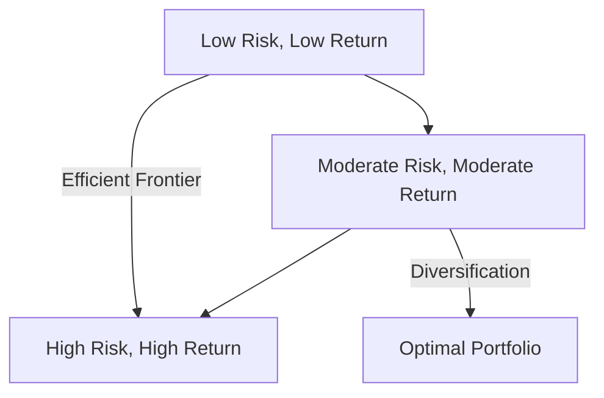

## 6.5.4 Portfolio Diversification and Asset Allocation

In the realm of investment management, the concepts of portfolio diversification and asset allocation are fundamental to constructing a robust investment strategy. These principles not only help in mitigating risk but also in optimizing returns, making them crucial topics for the Securities Industry Essentials (SIE) Exam. This section will delve into these concepts, providing you with a comprehensive understanding necessary for both the exam and practical application in the securities industry.

### Portfolio Diversification

#### Definition

Portfolio diversification is the practice of spreading investments across various financial instruments, industries, and other categories. The primary aim is to reduce exposure to any single asset or risk, thereby minimizing potential losses. By diversifying, investors can protect their portfolios from significant downturns in any one sector or asset class.

#### Benefits of Diversification

1. **Reduces Portfolio Volatility:**
   - Diversification smooths out the volatility of a portfolio by ensuring that not all investments react the same way to market events. For example, when stock prices fall, bonds might rise, balancing the overall portfolio performance.

2. **Mitigates Unsystematic Risk:**
   - Also known as specific risk, unsystematic risk is associated with a particular company or industry. Diversification helps in mitigating this risk by spreading investments across different sectors and asset classes.

3. **Enhances Potential Returns:**
   - While diversification primarily aims to reduce risk, it can also enhance returns by including a mix of high-growth and stable assets, allowing for potential gains in various market conditions.

#### Practical Example

Consider an investor with a portfolio solely composed of technology stocks. If the technology sector experiences a downturn, the investor's entire portfolio could suffer significant losses. By diversifying into other sectors such as healthcare, consumer goods, and bonds, the investor can cushion the impact of the downturn in technology stocks.

### Asset Allocation

#### Definition

Asset allocation involves dividing an investment portfolio among different asset categories, such as stocks, bonds, and cash. This strategy is based on the investor's goals, risk tolerance, and investment horizon, and it is a key determinant of a portfolio's risk and return profile.

#### Asset Allocation Strategies

1. **Strategic Asset Allocation:**
   - This is a long-term approach where an investor sets target allocations for various asset classes based on their investment objectives and risk tolerance. These targets are periodically rebalanced to maintain the desired allocation.

2. **Tactical Asset Allocation:**
   - In contrast to the strategic approach, tactical asset allocation involves short-term adjustments to the asset mix based on current market conditions. This strategy allows investors to take advantage of market opportunities and trends.

#### Modern Portfolio Theory (MPT)

Modern Portfolio Theory, developed by Harry Markowitz, is a framework for constructing an investment portfolio that maximizes expected return for a given level of risk. MPT emphasizes the importance of diversification and the risk-return trade-off, suggesting that a diversified portfolio can achieve better risk-adjusted returns.

**Key Concepts of MPT:**

- **Efficient Frontier:**
  - Represents the set of optimal portfolios that offer the highest expected return for a defined level of risk. Portfolios on the efficient frontier are considered well-diversified.

- **Risk and Return Trade-Off:**
  - MPT posits that higher potential returns are associated with higher risk. Investors must balance their desire for returns with their tolerance for risk.

#### Risk and Return Trade-Off

Understanding the risk and return trade-off is crucial for effective portfolio management. Different asset classes have varying risk profiles and expected returns. For instance, stocks generally offer higher potential returns but come with greater volatility compared to bonds, which are considered more stable but offer lower returns.

**Example:**

- **Stocks:** High risk, high potential return.
- **Bonds:** Lower risk, moderate return.
- **Cash:** Lowest risk, minimal return.

### Significance for the SIE Exam

For the SIE Exam, it is essential to grasp the concepts of diversification and asset allocation. You should be familiar with the strategies used to construct investment portfolios and recognize the relationship between risk and return. Understanding these principles will not only help you in the exam but also in your future career as a securities professional.

### Glossary

- **Diversification:** The strategy of reducing risk by investing in a variety of assets.
- **Asset Allocation:** The process of distributing investment funds among different asset categories.
- **Modern Portfolio Theory:** A theory on how risk-averse investors can construct portfolios to optimize or maximize expected return based on a given level of market risk.

### References

- **Investopedia:** [Portfolio Diversification Definition](https://www.investopedia.com/terms/d/diversification.asp)
- **Investopedia:** [Asset Allocation Definition](https://www.investopedia.com/terms/a/assetallocation.asp)

### Real-World Applications

In practice, portfolio diversification and asset allocation are used by financial advisors and portfolio managers to tailor investment strategies to individual client needs. For example, a young investor with a high risk tolerance might have a portfolio heavily weighted in stocks, while a retiree might prefer a more conservative mix with a higher allocation to bonds and cash.

### Step-by-Step Guidance for Portfolio Construction

1. **Assess Risk Tolerance:**
   - Determine the level of risk you are comfortable with, considering factors such as age, income, and financial goals.

2. **Define Investment Goals:**
   - Clearly outline what you aim to achieve with your investments, whether it's saving for retirement, buying a home, or funding education.

3. **Select Asset Classes:**
   - Choose a mix of asset classes that align with your risk tolerance and goals. Consider stocks, bonds, real estate, and alternative investments.

4. **Implement Strategic Asset Allocation:**
   - Set target allocations for each asset class and periodically rebalance your portfolio to maintain these targets.

5. **Consider Tactical Adjustments:**
   - Stay informed about market trends and make short-term adjustments to capitalize on opportunities.

### Diagrams and Visuals

To enhance understanding, let's look at a visual representation of the efficient frontier in Modern Portfolio Theory:

### Best Practices and Common Pitfalls

**Best Practices:**

- Regularly review and rebalance your portfolio to align with changing financial goals and market conditions.
- Stay informed about economic trends and adjust your asset allocation strategy accordingly.
- Use a diversified mix of assets to reduce risk and enhance potential returns.

**Common Pitfalls:**

- Over-diversification can lead to diluted returns. Ensure that each asset in your portfolio serves a purpose.
- Ignoring risk tolerance and investment horizon can lead to inappropriate asset allocation.
- Failing to rebalance the portfolio can result in unintended risk exposure.

### Exam Strategies and Practical Tips

- Focus on understanding the core principles of diversification and asset allocation.
- Practice calculating the risk and return of different asset mixes.
- Familiarize yourself with the concepts of the efficient frontier and Modern Portfolio Theory.

### Encouraging Application and Practice

To apply these principles, consider creating a mock portfolio and practicing asset allocation based on different risk profiles and investment goals. This hands-on approach will reinforce your understanding and prepare you for the exam.

## FINRA SIE Exam Practice Questions



### What is the primary purpose of portfolio diversification?

- [x] To reduce exposure to any single asset or risk
- [ ] To maximize returns without regard to risk
- [ ] To focus investments in a single sector
- [ ] To eliminate all types of risk

> **Explanation:** Portfolio diversification aims to reduce exposure to any single asset or risk, thereby minimizing potential losses.

### Which asset allocation strategy involves long-term target allocations?

- [x] Strategic Asset Allocation
- [ ] Tactical Asset Allocation
- [ ] Dynamic Asset Allocation
- [ ] Constant-Weight Asset Allocation

> **Explanation:** Strategic Asset Allocation involves setting long-term target allocations based on investment objectives and risk tolerance.

### What does Modern Portfolio Theory emphasize?

- [x] The importance of diversification and balancing risk versus return
- [ ] The elimination of all investment risk
- [ ] The focus on short-term gains
- [ ] Investing solely in high-risk assets

> **Explanation:** Modern Portfolio Theory emphasizes diversification and balancing risk versus return to optimize portfolios.

### Which of the following is a benefit of diversification?

- [x] Reduces portfolio volatility
- [ ] Guarantees higher returns
- [ ] Eliminates market risk
- [ ] Focuses on a single asset class

> **Explanation:** Diversification reduces portfolio volatility by spreading investments across various assets.

### What is a key concept of the efficient frontier in MPT?

- [x] Optimal portfolios that offer the highest expected return for a defined level of risk
- [ ] Portfolios with the lowest possible risk
- [ ] Portfolios with the highest possible return
- [ ] Portfolios that exclude all risky assets

> **Explanation:** The efficient frontier represents optimal portfolios offering the highest expected return for a given level of risk.

### What is a common pitfall in portfolio management?

- [x] Over-diversification leading to diluted returns
- [ ] Focusing solely on risk without considering returns
- [ ] Investing only in bonds
- [ ] Ignoring cash as an asset class

> **Explanation:** Over-diversification can lead to diluted returns, as each asset must serve a purpose in the portfolio.

### Tactical Asset Allocation involves:

- [x] Short-term adjustments based on market conditions
- [ ] Long-term target allocations
- [ ] Eliminating all risk
- [ ] Ignoring market trends

> **Explanation:** Tactical Asset Allocation involves making short-term adjustments to the asset mix based on current market conditions.

### What is the risk-return trade-off?

- [x] Higher potential returns are associated with higher risk
- [ ] Lower risk always leads to higher returns
- [ ] Risk and return are unrelated
- [ ] High returns come with low risk

> **Explanation:** The risk-return trade-off indicates that higher potential returns are associated with higher risk.

### Which asset class generally offers the highest potential return?

- [x] Stocks
- [ ] Bonds
- [ ] Cash
- [ ] Real Estate

> **Explanation:** Stocks generally offer the highest potential return, though they come with greater volatility.

### True or False: Asset allocation is the process of selecting individual stocks for a portfolio.

- [ ] True
- [x] False

> **Explanation:** Asset allocation involves distributing investment funds among different asset categories, not selecting individual stocks.



By mastering the principles of portfolio diversification and asset allocation, you will be well-equipped to tackle related questions on the SIE Exam and apply these strategies effectively in the securities industry.
