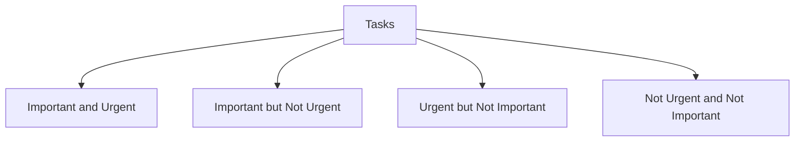

## 7.1.3 Time Management Strategies

Preparing for the Securities Industry Essentials (SIE) Exam requires a strategic approach to time management. Effective time management not only enhances your study efficiency but also reduces stress and increases the likelihood of success. This section provides comprehensive insights into creating a study schedule, prioritizing tasks, avoiding procrastination, utilizing productivity tools, and balancing study with other commitments.

### Creating a Study Schedule

A well-structured study schedule is the foundation of effective time management. It helps you allocate your time wisely and ensures that you cover all the necessary topics before the exam.

#### Assess Availability

Before you can create a study schedule, it's crucial to assess how much time you can realistically dedicate to studying each week. Consider your current commitments, such as work, family, and social activities. Be honest about your availability to avoid overcommitting and burning out.

- **Weekly Time Audit:** Spend a week tracking how you spend your time. Identify periods where you can fit in study sessions without compromising other responsibilities.
- **Realistic Goals:** Set achievable goals based on your available time. Remember, quality of study is more important than quantity.

#### Daily and Weekly Plans

Once you've assessed your availability, it's time to create a detailed study plan.

- **Daily Study Sessions:** Break down your study material into manageable chunks. Allocate specific times each day to focus on different topics. For instance, dedicate Mondays to regulatory frameworks and Tuesdays to investment products.
- **Weekly Overview:** At the start of each week, review your progress and adjust your plan as needed. Ensure you cover all key areas of the SIE Exam syllabus.
- **Incorporate Breaks:** Include short breaks between study sessions to maintain focus and prevent fatigue. The Pomodoro Technique, which involves 25 minutes of focused study followed by a 5-minute break, can be effective.

### Prioritization Techniques

Prioritizing tasks ensures that you focus on what matters most, preventing you from getting overwhelmed by the sheer volume of material.

#### Eisenhower Matrix

The Eisenhower Matrix is a powerful tool for prioritizing tasks based on urgency and importance. It helps you decide which tasks to tackle first and which to delegate or eliminate.

- **Important and Urgent:** Focus on these tasks first. For example, if you have an upcoming practice exam, prioritize studying for it.
- **Important but Not Urgent:** Schedule time for these tasks. They are crucial for long-term success, such as understanding complex concepts that are frequently tested.
- **Urgent but Not Important:** Delegate or minimize these tasks. They might include administrative tasks like organizing study materials.
- **Not Urgent and Not Important:** Eliminate these tasks to free up time for more critical activities.

### Avoiding Procrastination

Procrastination is a common challenge that can derail your study efforts. Implementing strategies to overcome it is essential for maintaining consistent progress.

#### Set Deadlines

Setting clear deadlines for each study task creates a sense of urgency and accountability.

- **Task Breakdown:** Divide larger tasks into smaller, manageable parts with individual deadlines. For example, break down "study for the SIE Exam" into "review chapter 1 by Monday" and "complete practice questions by Wednesday."
- **Accountability Partner:** Share your deadlines with a friend or study group to hold yourself accountable.

#### Use Time-Blocking

Time-blocking involves scheduling specific blocks of time for focused study sessions. It helps you stay on track and minimizes distractions.

- **Dedicated Study Blocks:** Allocate uninterrupted time for studying. For instance, block 9 AM to 11 AM every Saturday for exam preparation.
- **Buffer Time:** Include buffer periods between study blocks to accommodate unexpected interruptions.

### Utilizing Productivity Tools

Leveraging productivity tools can enhance your study efficiency and help you stay organized.

#### Calendars and Planners

Using digital or physical planners allows you to visualize your study schedule and track your progress.

- **Digital Calendars:** Tools like Google Calendar can send reminders for study sessions and deadlines.
- **Physical Planners:** A traditional planner can be a tactile way to plan your week and check off completed tasks.

#### Apps and Software

Various apps and software can assist in managing your study schedule and resources.

- **Trello:** Organize study tasks into boards and lists, making it easy to track progress.
- **Evernote:** Store notes, articles, and study materials in one place for easy access.
- **Study Apps:** Use apps like Quizlet for flashcards and practice questions to reinforce learning.

### Balancing Study with Other Commitments

Balancing study with work, family, and social life is crucial for maintaining a healthy lifestyle and avoiding burnout.

#### Flexible Scheduling

Life is unpredictable, and your study schedule should be flexible enough to accommodate changes.

- **Adaptability:** Be prepared to adjust your study plan if unexpected events arise. Flexibility prevents frustration and helps maintain momentum.
- **Prioritize Well-Being:** Ensure you allocate time for relaxation and self-care to recharge and maintain focus.

#### Set Boundaries

Communicating your study schedule to family and friends helps set expectations and minimize interruptions.

- **Designated Study Space:** Create a dedicated study area where you can focus without distractions.
- **Communicate Needs:** Let others know your study times and request minimal interruptions during these periods.

### Significance for the SIE Exam

Effective time management is crucial for SIE Exam success. It leads to consistent study habits, increases productivity, and reduces the need for last-minute cramming. By managing your time wisely, you can approach the exam with confidence and a thorough understanding of the material.

### Glossary

- **Eisenhower Matrix:** A tool for prioritizing tasks by urgency and importance.
- **Time-Blocking:** Allocating fixed time periods to specific tasks.

### References

- **Time Management Techniques:** [How to Manage Time Effectively](https://www.entrepreneur.com/article/240230)

## FINRA SIE Exam Practice Questions



### What is the first step in creating an effective study schedule?

- [x] Assessing your availability
- [ ] Setting study goals
- [ ] Choosing study materials
- [ ] Joining a study group

> **Explanation:** Assessing your availability helps determine how much time you can realistically dedicate to studying each week.

### Which technique involves categorizing tasks based on urgency and importance?

- [x] Eisenhower Matrix
- [ ] Time-Blocking
- [ ] Pomodoro Technique
- [ ] SWOT Analysis

> **Explanation:** The Eisenhower Matrix helps prioritize tasks by urgency and importance, guiding you on which tasks to focus on first.

### What is a benefit of using time-blocking for study sessions?

- [x] Minimizes distractions
- [ ] Increases procrastination
- [ ] Reduces study time
- [ ] Eliminates the need for breaks

> **Explanation:** Time-blocking involves scheduling specific blocks of time for focused study sessions, helping to minimize distractions.

### Which tool is useful for organizing study tasks into boards and lists?

- [x] Trello
- [ ] Evernote
- [ ] Google Calendar
- [ ] Quizlet

> **Explanation:** Trello is a tool that allows you to organize study tasks into boards and lists, making it easy to track progress.

### How can you communicate your study schedule to minimize interruptions?

- [x] Set boundaries with family and friends
- [ ] Study in a public place
- [ ] Avoid using a planner
- [ ] Study without breaks

> **Explanation:** Communicating your study schedule to family and friends helps set expectations and minimizes interruptions.

### What is the Pomodoro Technique?

- [x] A method involving 25 minutes of focused study followed by a 5-minute break
- [ ] A tool for prioritizing tasks by urgency and importance
- [ ] A strategy for eliminating non-essential tasks
- [ ] A method for creating a weekly study plan

> **Explanation:** The Pomodoro Technique involves 25 minutes of focused study followed by a 5-minute break, helping to maintain focus and prevent fatigue.

### What should you do if unexpected events disrupt your study schedule?

- [x] Adjust your plan and remain flexible
- [ ] Cancel all study sessions
- [ ] Ignore the disruption and continue as planned
- [ ] Reschedule the exam

> **Explanation:** Being flexible and adjusting your study plan helps accommodate unexpected events without losing momentum.

### Which app is useful for storing notes and study materials in one place?

- [x] Evernote
- [ ] Trello
- [ ] Google Calendar
- [ ] Quizlet

> **Explanation:** Evernote is an app that allows you to store notes, articles, and study materials in one place for easy access.

### What is a key benefit of setting deadlines for study tasks?

- [x] Creates a sense of urgency and accountability
- [ ] Reduces the amount of study material
- [ ] Eliminates the need for a study plan
- [ ] Increases procrastination

> **Explanation:** Setting deadlines for study tasks creates a sense of urgency and accountability, helping you stay on track.

### True or False: Effective time management reduces the need for last-minute cramming.

- [x] True
- [ ] False

> **Explanation:** Effective time management leads to consistent study habits and reduces the need for last-minute cramming.



By implementing these time management strategies, you can effectively prepare for the SIE Exam, ensuring a comprehensive understanding of the material and increasing your chances of success. Remember, the key to mastering the SIE Exam lies in consistent, focused study sessions and a well-structured study plan.
