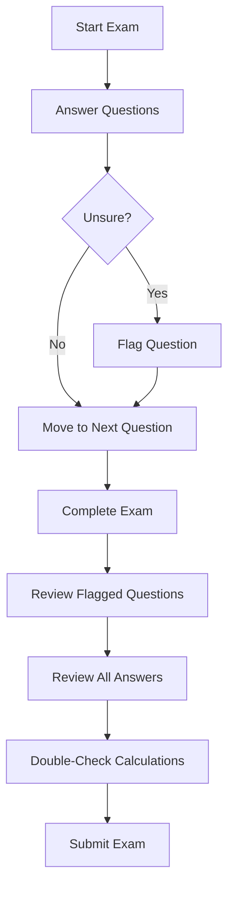

## 7.3.4 Reviewing Answers and Avoiding Errors

The Securities Industry Essentials (SIE) Exam is a pivotal step in your journey to becoming a securities professional. As you prepare for this exam, mastering the art of reviewing your answers and avoiding common errors can significantly impact your performance. This section will guide you through effective strategies for reviewing your answers, recognizing and correcting mistakes, and maintaining focus during the exam.

### Importance of Review

Reviewing your answers is a crucial part of the exam process. It allows you to catch and correct mistakes, ensure that no questions are left unanswered, and increase your confidence in your final answers. Here’s why reviewing is essential:

- **Error Detection:** Reviewing helps identify errors that may have been overlooked during the initial attempt. Simple mistakes, such as misreading a question or selecting the wrong option, can be corrected during review.
- **Completeness:** Ensures that all questions have been answered. Unanswered questions are automatically incorrect, so a thorough review helps maximize your score.
- **Confidence Boost:** By reviewing your answers, you can leave the exam room feeling confident that you have given your best effort.

### Review Strategies

Effective review strategies can enhance your ability to identify and correct errors. Here are some techniques to consider:

#### Marking Questions

- **Flagging Uncertain Questions:** Use the exam’s flag feature to mark questions you are unsure about. This allows you to quickly return to these questions during your review phase.
- **Prioritizing Review:** Focus first on the flagged questions, as these are the ones where you had initial doubts or needed more time to consider.

#### Re-reading Questions

- **Understanding the Question:** Carefully re-read each question to ensure you understand what is being asked. Pay attention to details such as keywords and phrasing.
- **Identifying Key Terms:** Look for key terms that may change the meaning of the question, such as "not," "except," or "only."

#### Common Errors to Avoid

Being aware of common errors can help you avoid them. Here are some pitfalls to watch out for:

##### Misreading Questions

- **Negative Wording:** Be cautious of questions with negative wording or double negatives, as they can be misleading.
- **Complex Phrasing:** Break down complex questions into simpler parts to better understand them.

##### Changing Correct Answers

- **Trusting Your Instincts:** Research shows that first instincts are often correct. Change your answer only if you have a strong reason to believe your initial choice was wrong.
- **Avoiding Overthinking:** Overthinking can lead to unnecessary changes. Trust your preparation and knowledge.

##### Careless Mistakes

- **Double-Checking Calculations:** Verify all calculations and ensure that you have used the correct units of measurement.
- **Attention to Detail:** Pay attention to details such as dates, figures, and technical terms.

### Maintaining Focus

Staying focused during the exam is crucial for effective review. Here are some tips to help you maintain concentration:

#### Stay Calm

- **Deep Breathing:** If you feel anxious, take deep breaths to calm your nerves and refocus your mind.
- **Positive Visualization:** Visualize success and remind yourself of your preparation and abilities.

#### Avoid Rushing

- **Time Management:** Use your remaining time wisely. Allocate sufficient time for review without rushing through questions.
- **Pacing Yourself:** Maintain a steady pace throughout the exam to avoid fatigue and ensure clarity of thought.

### Significance for the SIE Exam

The strategies outlined above are particularly significant for the SIE Exam. By reducing avoidable errors, you can improve your overall score and increase your confidence in your final answers. This approach not only enhances your exam performance but also prepares you for a successful career in the securities industry.

### Glossary

- **Flag Feature:** An exam tool used to mark questions for later review.
- **First Instinct:** The initial answer choice selected based on immediate understanding.

### References

- **Error Prevention Techniques:** [Common Test-Taking Mistakes](https://www.testtakingtips.com/students/10-common-test-taking-mistakes-and-how-to-avoid-them/)

### Practical Examples and Scenarios

To further illustrate these strategies, let's consider some practical examples and scenarios relevant to the SIE Exam:

#### Example 1: Misreading a Question

Imagine a question asks, "Which of the following is NOT a responsibility of the Securities and Exchange Commission (SEC)?" It’s easy to overlook the word "NOT" and select an incorrect answer. By carefully re-reading the question, you can catch such nuances and choose the correct option.

#### Example 2: Changing a Correct Answer

Suppose you initially select an answer based on your understanding of a concept, but later doubt your choice. Unless you have a clear reason to change it, stick with your first instinct. Overthinking can lead to unnecessary changes and errors.

#### Example 3: Careless Calculation

Consider a question that involves calculating the yield of a bond. A simple mistake in arithmetic or using the wrong formula can lead to an incorrect answer. Double-check your calculations to avoid such errors.

### Real-World Applications

In the securities industry, accuracy and attention to detail are critical. The skills you develop in reviewing and correcting your answers on the SIE Exam will serve you well in your professional career. Whether you are analyzing financial statements, executing trades, or advising clients, the ability to identify and correct errors is invaluable.

### Step-by-Step Guidance

Here’s a step-by-step guide to reviewing your answers effectively:

1. **Flag Uncertain Questions:** As you progress through the exam, use the flag feature to mark questions you are unsure about.
2. **Complete the Exam:** Ensure all questions are answered before beginning your review.
3. **Revisit Flagged Questions:** Focus on the questions you flagged first. Re-read them carefully and consider any additional insights gained during the exam.
4. **Review All Answers:** Once you have addressed the flagged questions, review all your answers. Look for any obvious mistakes or misinterpretations.
5. **Double-Check Calculations:** Pay special attention to questions involving calculations. Verify your arithmetic and ensure you have used the correct formulas and units.
6. **Trust Your Instincts:** Avoid changing answers unless you have a compelling reason to do so. Trust your preparation and first instincts.

### Diagrams and Visuals

To enhance understanding, here is a diagram illustrating the review process:

### Best Practices and Common Pitfalls

- **Best Practices:**
  - Use the flag feature strategically to manage your time and focus on challenging questions.
  - Develop a systematic approach to reviewing your answers, ensuring thoroughness and accuracy.

- **Common Pitfalls:**
  - Rushing through the review process due to time pressure.
  - Changing answers based on doubt rather than evidence.

### Encouragement and Motivation

Remember, the SIE Exam is a stepping stone to a rewarding career in the securities industry. By mastering the art of reviewing your answers and avoiding errors, you are setting yourself up for success. Stay focused, trust your preparation, and approach the exam with confidence.

## Quiz Time!



### Which feature should you use to mark questions for later review during the SIE Exam?

- [x] Flag Feature
- [ ] Highlight Tool
- [ ] Note Pad
- [ ] Timer

> **Explanation:** The flag feature is specifically designed to mark questions that you want to revisit later during the exam review process.

### What is a common mistake when changing answers during the review phase?

- [x] Changing answers without a strong reason
- [ ] Double-checking calculations
- [ ] Re-reading questions
- [ ] Using the flag feature

> **Explanation:** Changing answers without a compelling reason can lead to errors, as first instincts are often correct.

### What should you do if you encounter a question with negative wording?

- [x] Carefully re-read the question to understand its true meaning
- [ ] Skip the question and come back later
- [ ] Guess the answer based on intuition
- [ ] Change your initial answer immediately

> **Explanation:** Negative wording can be misleading, so it's important to re-read such questions carefully to ensure correct interpretation.

### Why is it important to double-check calculations during the review?

- [x] To ensure accuracy and correct any arithmetic errors
- [ ] To save time for other questions
- [ ] To change your initial answer
- [ ] To mark the question for later review

> **Explanation:** Double-checking calculations helps ensure that you have used the correct formulas and arithmetic, reducing the risk of errors.

### What is the benefit of staying calm during the exam review process?

- [x] It helps maintain focus and clarity of thought
- [ ] It speeds up the review process
- [ ] It allows for more answer changes
- [ ] It reduces the need for re-reading questions

> **Explanation:** Staying calm helps you maintain focus and clarity, which is essential for effective review and error correction.

### Which of the following is a best practice for reviewing answers?

- [x] Use the flag feature to manage time and focus on challenging questions
- [ ] Change all answers that you are unsure about
- [ ] Skip the review process if time is running out
- [ ] Only review questions with calculations

> **Explanation:** Using the flag feature strategically helps manage time and ensures that you focus on questions that need further attention.

### What is a common pitfall during the review process?

- [x] Rushing due to time pressure
- [ ] Carefully re-reading questions
- [ ] Using the flag feature
- [ ] Trusting your first instincts

> **Explanation:** Rushing through the review process can lead to missed errors and incomplete corrections, impacting your overall score.

### How can you maintain focus during the exam?

- [x] Take deep breaths and visualize success
- [ ] Skip difficult questions
- [ ] Change answers frequently
- [ ] Avoid using the flag feature

> **Explanation:** Taking deep breaths and visualizing success can help calm nerves and maintain focus, essential for effective review.

### What is the significance of reviewing answers for the SIE Exam?

- [x] It reduces avoidable errors and improves overall score
- [ ] It allows you to change all initial answers
- [ ] It speeds up the exam process
- [ ] It eliminates the need for preparation

> **Explanation:** Reviewing answers helps reduce avoidable errors, improving your overall score and boosting confidence in your final answers.

### True or False: You should change your initial answer if you are unsure about it.

- [ ] True
- [x] False

> **Explanation:** Unless you have a compelling reason or additional information, it's generally best to trust your first instinct and avoid changing your initial answer.



By implementing these strategies and techniques, you will enhance your ability to review answers effectively and avoid common errors on the SIE Exam, setting the stage for a successful outcome.
