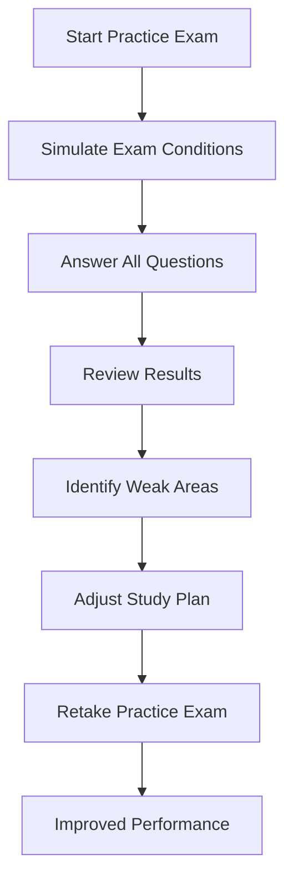

## 1.4.3 Utilizing Practice Exams

Preparing for the Series 6 Exam is a crucial step in advancing your career in the securities industry. Among various study methods, utilizing practice exams stands out as one of the most effective strategies. This section will guide you through the importance of practice exams, how to effectively incorporate them into your study plan, and tips for maximizing their benefits.

### Importance of Practice Exams

Practice exams are indispensable tools in your Series 6 Exam preparation. They provide a simulated environment that mirrors the actual test, helping you become familiar with the format, question styles, and time constraints. Here are key reasons why practice exams are essential:

- **Acclimation to Exam Format:** By taking practice exams, you become accustomed to the layout and structure of the Series 6 Exam. This familiarity reduces anxiety and boosts confidence on test day.

- **Understanding Question Styles:** Practice exams expose you to the variety of question types you will encounter, including multiple-choice questions that test your knowledge and application skills.

- **Time Management Skills:** Regular practice helps you develop the ability to pace yourself, ensuring you can complete the exam within the allotted time.

- **Identifying Weak Areas:** Practice exams highlight areas where you need further study, allowing you to focus your efforts on improving those specific topics.

### Scheduling Regular Practice Tests

To fully benefit from practice exams, it is crucial to integrate them into your study schedule strategically. Here are some recommendations:

- **Start Early:** Begin taking practice exams early in your study process. This initial assessment will help you gauge your baseline knowledge and identify topics that require more attention.

- **Set a Regular Schedule:** Incorporate practice exams into your weekly study routine. Consistency is key to tracking your progress and reinforcing learning.

- **Simulate Test Conditions:** Take practice exams under conditions similar to the actual test. Find a quiet space, set a timer, and avoid interruptions to mimic the exam environment.

- **Progressive Difficulty:** As you advance in your studies, gradually increase the difficulty level of the practice exams to challenge yourself and build confidence.

### Reviewing Incorrect Answers

One of the most valuable aspects of practice exams is the opportunity to learn from your mistakes. Here's how to effectively review and analyze incorrect answers:

- **Thorough Analysis:** For each incorrect answer, determine why you chose the wrong option and what the correct answer is. This process helps reinforce the correct information and prevents similar mistakes in the future.

- **Identify Patterns:** Look for patterns in the types of questions you frequently get wrong. This analysis will highlight specific areas that need more focus in your study plan.

- **Understand the Concepts:** Ensure you understand the underlying concepts behind each question. If necessary, revisit study materials or seek additional resources to clarify complex topics.

- **Take Notes:** Keep a record of common mistakes and challenging topics. These notes will serve as a valuable resource for review as the exam date approaches.

### Glossary

- **Practice Exam:** A simulated exam used for preparation, mirroring the format and content of the actual test. Practice exams help candidates familiarize themselves with the exam structure and assess their readiness.

### Reputable Exam Prep Providers

Numerous reputable providers offer Series 6 practice exams and study materials. Consider exploring resources from the following organizations:

- **Kaplan Financial Education:** Known for comprehensive study materials and practice exams tailored to the Series 6 Exam.

- **STC (Securities Training Corporation):** Offers a range of practice exams and study guides designed to help candidates succeed.

- **ExamFX:** Provides interactive practice exams and study tools, focusing on key concepts and exam strategies.

- **Pass Perfect:** Offers detailed practice exams and an extensive question bank, allowing for thorough preparation.

### Practical Examples and Scenarios

To illustrate the effectiveness of practice exams, consider the following scenarios:

1. **Time Management Practice:** During a practice exam, you realize that you are spending too much time on certain questions. By adjusting your pace and practicing time management strategies, you improve your ability to complete the exam within the time limit.

2. **Concept Reinforcement:** After consistently missing questions about mutual fund pricing, you focus on reviewing this topic. By understanding the nuances of Net Asset Value (NAV) and Public Offering Price (POP), you increase your accuracy in related questions.

3. **Confidence Building:** As you take more practice exams, your familiarity with the exam format grows, reducing anxiety and boosting your confidence. This mental preparation is crucial for performing well on the actual test day.

### Real-World Applications and Regulatory Scenarios

Understanding the practical applications of the Series 6 Exam content is vital for both the exam and your future career. Practice exams often include scenarios that reflect real-world situations, such as:

- **Client Suitability Assessments:** Questions may involve determining the suitability of investment products for different client profiles, emphasizing the Know Your Customer (KYC) rule and suitability obligations.

- **Regulatory Compliance:** Practice exams test your knowledge of key regulations, such as the Securities Act of 1933 and FINRA rules, ensuring you understand compliance requirements.

### Step-by-Step Guidance

To maximize the benefits of practice exams, follow these step-by-step guidelines:

1. **Select a Practice Exam:** Choose a practice exam from a reputable provider that aligns with the Series 6 Exam content outline.

2. **Set Up Your Environment:** Find a quiet, distraction-free space and gather necessary materials, such as a calculator and scratch paper.

3. **Simulate Exam Conditions:** Set a timer for the duration of the exam and adhere to the time limits for each section.

4. **Answer All Questions:** Attempt every question, even if unsure. Practice exams are learning tools, and guessing helps you practice decision-making under pressure.

5. **Review Your Results:** After completing the exam, review your answers, focusing on incorrect responses and understanding the rationale behind the correct answers.

6. **Refine Your Study Plan:** Use insights from the practice exam to adjust your study plan, dedicating more time to weak areas and reinforcing strengths.

### Diagrams and Visual Aids

To enhance your understanding of the Series 6 Exam content, consider using diagrams and visual aids. For example, a flowchart illustrating the process of mutual fund pricing or a table comparing different types of investment products can clarify complex concepts.

### Best Practices and Common Pitfalls

When utilizing practice exams, keep the following best practices and common pitfalls in mind:

- **Best Practices:**
  - Regularly schedule practice exams to track progress.
  - Use practice exams to reinforce learning, not just assess knowledge.
  - Focus on understanding concepts, not just memorizing answers.

- **Common Pitfalls:**
  - Avoid relying solely on practice exams without comprehensive study.
  - Don't ignore incorrect answers; use them as learning opportunities.
  - Be cautious of burnout; balance practice exams with other study methods.

### References and Additional Resources

For further exploration of the Series 6 Exam content, consider the following resources:

- **FINRA's Official Website:** Provides detailed information on exam content and regulatory updates.
- **Securities Act of 1933 and Securities Exchange Act of 1934:** Essential reading for understanding key regulations.
- **FINRA Rules Overview:** Familiarize yourself with important rules and compliance requirements.

### Summary

Utilizing practice exams is a critical component of your Series 6 Exam preparation. By familiarizing yourself with the exam format, identifying weak areas, and reinforcing learning through practice, you can approach the test with confidence and competence. Remember to integrate practice exams into a balanced study plan, leveraging them as tools for both assessment and learning.

---

## Series 6 Exam Practice Questions: Utilizing Practice Exams



### Why are practice exams important for Series 6 Exam preparation?

- [x] They familiarize you with the exam format and question styles.
- [ ] They provide the exact questions that will appear on the exam.
- [ ] They replace the need for studying other materials.
- [ ] They guarantee a passing score.

> **Explanation:** Practice exams help you become familiar with the format and types of questions you will encounter, which is crucial for effective preparation.

### How often should you schedule practice exams during your study plan?

- [ ] Only once before the actual exam.
- [ ] Every day until the exam date.
- [x] Regularly, as part of your weekly study routine.
- [ ] Only if you feel unprepared.

> **Explanation:** Regularly scheduling practice exams as part of your study routine helps track progress and reinforce learning.

### What is a key benefit of reviewing incorrect answers on practice exams?

- [ ] It allows you to memorize the correct answers.
- [x] It helps you understand your mistakes and learn from them.
- [ ] It confirms that practice exams are unnecessary.
- [ ] It reduces the need for further study.

> **Explanation:** Reviewing incorrect answers helps you understand why you made mistakes and prevents them in the future.

### Which resource is NOT recommended for obtaining Series 6 practice exams?

- [ ] Kaplan Financial Education
- [ ] STC (Securities Training Corporation)
- [ ] ExamFX
- [x] Social media forums

> **Explanation:** Reputable providers like Kaplan, STC, and ExamFX offer structured practice exams, unlike unverified sources on social media.

### What should you do if you consistently miss questions on a specific topic?

- [ ] Ignore the topic and focus on others.
- [x] Review the topic in your study materials and seek additional resources.
- [ ] Assume the topic won't appear on the actual exam.
- [ ] Memorize the correct answers without understanding.

> **Explanation:** Focusing on understanding the topic and reviewing study materials will help improve your performance.

### How can practice exams help with time management?

- [ ] By providing unlimited time to answer questions.
- [ ] By allowing you to skip difficult questions.
- [x] By helping you practice pacing yourself to complete the exam on time.
- [ ] By reducing the number of questions you need to answer.

> **Explanation:** Practice exams help you develop the ability to pace yourself, ensuring you can complete the exam within the allotted time.

### What is a common pitfall when using practice exams?

- [ ] Using them as a tool for learning.
- [x] Relying solely on them without comprehensive study.
- [ ] Reviewing incorrect answers.
- [ ] Scheduling them regularly.

> **Explanation:** Relying solely on practice exams without comprehensive study can lead to gaps in knowledge.

### Why is simulating test conditions important when taking practice exams?

- [ ] It makes the exam feel less important.
- [ ] It allows for distractions during the exam.
- [x] It mimics the actual test environment, reducing anxiety.
- [ ] It ensures you pass the practice exam.

> **Explanation:** Simulating test conditions helps you become accustomed to the actual exam environment, reducing anxiety.

### What should you do after completing a practice exam?

- [ ] Forget about it and move on.
- [ ] Only review the questions you got right.
- [x] Review your answers, focusing on incorrect responses.
- [ ] Share your results on social media.

> **Explanation:** Reviewing your answers, especially incorrect ones, helps you learn from mistakes and improve.

### Which of the following is a visual aid that can enhance understanding of exam content?

- [ ] A lengthy paragraph of text.
- [ ] An unorganized list of topics.
- [x] A flowchart illustrating a process.
- [ ] A blank piece of paper.

> **Explanation:** Visual aids like flowcharts can clarify complex concepts and enhance understanding.



---

By incorporating practice exams into your study plan, you can effectively prepare for the Series 6 Exam, ensuring you understand the material and are ready to succeed.
