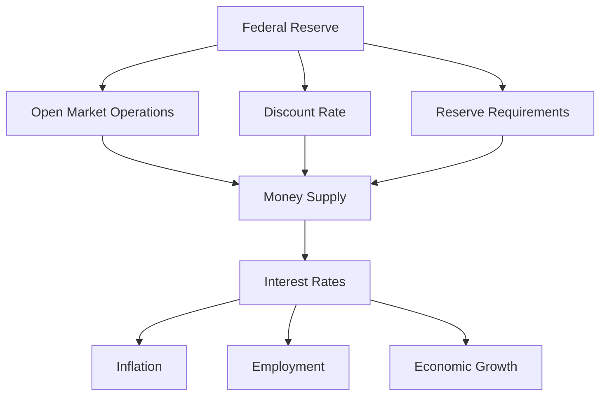

## 11.2.1 Role of the Federal Reserve

The Federal Reserve, often referred to as "the Fed," plays a pivotal role in the U.S. economy. As the central bank of the United States, it is tasked with several critical responsibilities that influence both the national and global financial landscapes. This section delves into the Federal Reserve's key functions, its monetary policy tools, the dual mandate, and the impact of its policies on the economy and financial markets.

### Responsibilities of the Federal Reserve

The Federal Reserve's primary responsibilities can be categorized into three main areas: conducting monetary policy, supervising and regulating banks, and maintaining financial stability.

#### Conducting Monetary Policy

Monetary policy involves managing the supply of money and interest rates to achieve macroeconomic objectives such as controlling inflation, consumption, growth, and liquidity. The Federal Reserve employs various tools to influence monetary policy, which will be discussed in detail later in this section.

#### Supervising and Regulating Banks

The Federal Reserve supervises and regulates a wide range of financial institutions to ensure the safety and soundness of the nation's banking and financial system. This oversight helps to protect consumers' credit rights and ensure that financial institutions operate safely and soundly.

#### Maintaining Financial Stability

The Fed works to maintain the stability of the financial system and contain systemic risks that may arise in financial markets. This involves monitoring and addressing risks to the financial system and providing liquidity when necessary to ensure the smooth functioning of financial markets.

### Monetary Policy Tools

The Federal Reserve uses several tools to implement monetary policy, each with different mechanisms and impacts on the economy. The main tools include open market operations, the discount rate, and reserve requirements.

#### Open Market Operations

Open market operations (OMOs) are the most frequently used tool of monetary policy. They involve the buying and selling of government securities in the open market to influence the level of reserves in the banking system. When the Fed buys securities, it increases the reserves of the banking system, encouraging banks to lend more, which lowers interest rates and stimulates economic activity. Conversely, selling securities reduces reserves, increases interest rates, and slows economic activity.

The Federal Open Market Committee (FOMC) is the body responsible for overseeing open market operations. The FOMC meets regularly to set targets for the federal funds rate, which is the interest rate at which banks lend reserves to each other overnight. By influencing this rate, the Fed can affect overall economic activity, employment, and inflation.

#### Discount Rate

The discount rate is the interest rate charged by the Federal Reserve to commercial banks and other depository institutions on loans they receive from their regional Federal Reserve Bank's lending facility. Changes in the discount rate can influence the cost of borrowing and the supply of money in the economy. A lower discount rate encourages borrowing and spending, while a higher rate can help cool down an overheating economy.

#### Reserve Requirements

Reserve requirements refer to the amount of funds that a depository institution must hold in reserve against specified deposit liabilities. By altering reserve requirements, the Fed can directly influence the amount of money that banks can lend. Lowering reserve requirements increases the money supply, while raising them decreases it.

### The Fed's Dual Mandate

The Federal Reserve operates under a dual mandate from Congress to achieve two main objectives: maximum employment and stable prices.

#### Maximum Employment

The Fed aims to foster economic conditions that achieve both a stable labor market and a high level of employment. This involves monitoring employment trends, wage growth, and other labor market indicators to ensure that the economy is operating close to its full potential.

#### Stable Prices

Price stability is crucial for economic growth and stability. The Fed targets an inflation rate of 2% over the long term, as measured by the personal consumption expenditures price index. By keeping inflation low and stable, the Fed helps to maintain the purchasing power of the dollar and reduce uncertainty about future inflation.

### Impact of Fed Policies on the Economy and Financial Markets

The policies enacted by the Federal Reserve have far-reaching impacts on both the economy and financial markets. These impacts can be seen in various areas, including interest rates, inflation, employment, and overall economic growth.

#### Interest Rates

The Fed's actions directly influence short-term interest rates, which in turn affect long-term interest rates, such as those on mortgages, loans, and bonds. Lower interest rates make borrowing cheaper, encouraging spending and investment, while higher rates can help control inflation by discouraging borrowing and spending.

#### Inflation

By managing the money supply and interest rates, the Fed can influence inflation levels. Effective monetary policy can prevent both excessive inflation and deflation, maintaining price stability and fostering economic growth.

#### Employment

Through its dual mandate, the Fed seeks to promote maximum employment. By adjusting monetary policy tools, the Fed can influence economic activity and labor market conditions, helping to reduce unemployment and support job creation.

#### Economic Growth

The Fed's policies are designed to support sustainable economic growth. By maintaining stable prices and fostering a healthy labor market, the Fed creates an environment conducive to economic expansion.

### Real-World Applications and Case Studies

To illustrate the Federal Reserve's role in monetary policy, consider the following scenarios:

#### Case Study: The 2008 Financial Crisis

During the 2008 financial crisis, the Federal Reserve took unprecedented actions to stabilize the financial system. It lowered the federal funds rate to near zero, engaged in large-scale asset purchases (quantitative easing), and provided emergency lending to financial institutions. These measures helped to restore confidence in the financial system and support economic recovery.

#### Scenario: Inflationary Pressures

In a scenario where inflationary pressures are rising, the Fed might increase interest rates to cool down the economy. By making borrowing more expensive, the Fed can help to reduce spending and investment, thereby controlling inflation.

### Diagrams and Visuals

To better understand the Federal Reserve's role and the impact of its policies, consider the following diagram illustrating the relationship between the Fed's tools and economic outcomes:

### Best Practices and Common Pitfalls

When preparing for the Series 6 Exam, it is important to understand the Federal Reserve's role in the economy and the implications of its policies. Here are some tips to help you grasp these concepts:

- **Focus on the Fed's dual mandate** and how it guides policy decisions.
- **Understand the tools of monetary policy** and their effects on the economy.
- **Keep up with current events** and how the Fed responds to economic challenges.
- **Practice interpreting Fed statements and reports** to better understand their impact on financial markets.

### References and Further Reading

For more information on the Federal Reserve and its policies, consider exploring the following resources:

- [Federal Reserve's Monetary Policy](https://www.federalreserve.gov/monetarypolicy.htm)
- Federal Reserve meeting minutes and statements
- Economic reports and analyses from reputable financial institutions

By understanding the Federal Reserve's role in monetary policy, you will be better equipped to analyze economic conditions and make informed decisions in the securities industry.

---

## Series 6 Exam Practice Questions: Role of the Federal Reserve



### What is the primary objective of the Federal Reserve's monetary policy?

- [ ] To increase government spending
- [x] To achieve maximum employment and stable prices
- [ ] To regulate international trade
- [ ] To control fiscal policy

> **Explanation:** The Federal Reserve's monetary policy is guided by its dual mandate to achieve maximum employment and stable prices.

### Which tool is most frequently used by the Federal Reserve to conduct monetary policy?

- [ ] Discount Rate
- [x] Open Market Operations
- [ ] Reserve Requirements
- [ ] Federal Funds Rate

> **Explanation:** Open market operations are the most frequently used tool for conducting monetary policy, involving the buying and selling of government securities.

### What is the role of the Federal Open Market Committee (FOMC)?

- [ ] To set fiscal policy
- [ ] To regulate banks
- [x] To oversee open market operations
- [ ] To manage foreign exchange rates

> **Explanation:** The FOMC is responsible for overseeing open market operations, which are a key component of the Federal Reserve's monetary policy.

### How does the Federal Reserve influence interest rates through open market operations?

- [x] By buying or selling government securities
- [ ] By changing tax rates
- [ ] By setting reserve requirements
- [ ] By adjusting the federal budget

> **Explanation:** The Fed influences interest rates by buying or selling government securities, which affects the money supply and the federal funds rate.

### What happens when the Federal Reserve lowers the discount rate?

- [ ] It increases the money supply
- [x] It makes borrowing cheaper for banks
- [ ] It reduces government debt
- [ ] It raises interest rates

> **Explanation:** Lowering the discount rate makes borrowing cheaper for banks, encouraging them to lend more, which can increase the money supply.

### What is the impact of raising reserve requirements?

- [x] It decreases the money supply
- [ ] It increases inflation
- [ ] It lowers interest rates
- [ ] It boosts employment

> **Explanation:** Raising reserve requirements decreases the money supply because banks have less money available to lend.

### Which of the following is NOT a responsibility of the Federal Reserve?

- [ ] Conducting monetary policy
- [ ] Supervising banks
- [ ] Maintaining financial stability
- [x] Setting tax policy

> **Explanation:** Setting tax policy is not a responsibility of the Federal Reserve; it is a fiscal policy matter handled by the government.

### What is the Fed's target inflation rate?

- [ ] 0%
- [ ] 1%
- [x] 2%
- [ ] 3%

> **Explanation:** The Federal Reserve targets a 2% inflation rate over the long term to maintain price stability.

### How do changes in the federal funds rate affect the economy?

- [ ] They directly change tax rates
- [x] They influence borrowing costs and spending
- [ ] They alter government spending
- [ ] They regulate international trade

> **Explanation:** Changes in the federal funds rate influence borrowing costs, which in turn affect consumer spending and business investment.

### What was a key action taken by the Federal Reserve during the 2008 financial crisis?

- [ ] Increasing the discount rate
- [ ] Raising reserve requirements
- [x] Engaging in quantitative easing
- [ ] Reducing government spending

> **Explanation:** During the 2008 financial crisis, the Federal Reserve engaged in quantitative easing to provide liquidity and stabilize the financial system.



---

This comprehensive guide to the Federal Reserve's role in monetary policy equips you with the knowledge needed to understand its impact on the economy and financial markets, preparing you for success on the Series 6 Exam.
