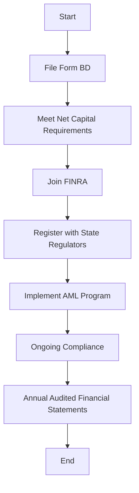

## 13.1.1 Broker-Dealer Registration

Understanding broker-dealer registration is crucial for anyone preparing for the Series 6 Exam. This section will guide you through the regulatory landscape, focusing on the essential requirements and procedures that broker-dealers must follow to operate legally within the U.S. securities market. We will cover the registration process with the Securities and Exchange Commission (SEC), membership with the Financial Industry Regulatory Authority (FINRA), state registration requirements, ongoing compliance obligations, and the importance of Anti-Money Laundering (AML) programs.

### Understanding Broker-Dealers

Before diving into the registration process, it's important to define what a broker-dealer is. A broker-dealer is a person or firm engaged in the business of buying and selling securities—such as stocks, bonds, and mutual funds—either for their own account or on behalf of customers. Broker-dealers play a critical role in the securities market by facilitating transactions and providing liquidity.

### SEC Registration Requirements

#### The Role of the SEC

The Securities and Exchange Commission (SEC) is the primary regulatory body overseeing the securities industry in the United States. It ensures that broker-dealers operate in a fair, transparent, and efficient manner. The SEC's regulatory framework is designed to protect investors, maintain fair, orderly, and efficient markets, and facilitate capital formation.

#### The Registration Process

To legally operate as a broker-dealer, registration with the SEC is mandatory. This process involves several steps:

1. **Filing Form BD**: The Uniform Application for Broker-Dealer Registration, known as Form BD, is the foundational document that broker-dealers must submit to the SEC. This form collects information about the firm's business practices, the backgrounds of its principals, and any disciplinary actions taken against the firm or its personnel.

2. **Net Capital Requirements**: Broker-dealers must meet specific financial standards to ensure they have sufficient capital to operate and protect their clients' interests. The SEC's net capital rule (Rule 15c3-1) requires broker-dealers to maintain a minimum amount of net capital, which varies based on the firm's business activities.

3. **Membership in an SRO**: Broker-dealers must become members of a self-regulatory organization (SRO), such as FINRA. This membership is crucial as SROs enforce compliance with federal securities laws and their own rules.

4. **State Registration**: In addition to SEC registration, broker-dealers must register in each state where they conduct business. State registration requirements can vary, so it's important to consult the relevant state securities regulators.

5. **AML Compliance**: Broker-dealers are required to implement Anti-Money Laundering (AML) programs to detect and prevent money laundering activities. This includes establishing policies, procedures, and internal controls, designating an AML compliance officer, and providing ongoing training for personnel.

### Ongoing Compliance Obligations

Once registered, broker-dealers must adhere to a range of ongoing compliance obligations to maintain their registration and operate legally. These include:

- **Adhering to SEC and FINRA Rules**: Broker-dealers must comply with all applicable SEC and FINRA rules, including those related to trading practices, recordkeeping, and reporting.

- **Supervising Associated Persons**: Broker-dealers are responsible for supervising the activities of their associated persons to ensure compliance with securities laws and regulations. This includes implementing written supervisory procedures and conducting regular reviews.

- **Submitting Annual Audited Financial Statements**: Broker-dealers must file annual audited financial statements with the SEC. These statements provide a comprehensive overview of the firm's financial condition and are reviewed to ensure compliance with financial regulations.

- **Maintaining Accurate Records**: Broker-dealers must maintain accurate and complete records of all transactions, communications, and other business activities. These records must be readily accessible for inspection by regulators.

### The Importance of AML Compliance

Anti-Money Laundering (AML) compliance is a critical component of a broker-dealer's regulatory obligations. The Bank Secrecy Act (BSA) and the USA PATRIOT Act impose requirements on broker-dealers to implement robust AML programs. Key elements of an effective AML program include:

- **Risk Assessment**: Conducting a thorough risk assessment to identify potential money laundering risks associated with the firm's business activities and customer base.

- **Customer Identification Program (CIP)**: Establishing procedures to verify the identity of customers and maintain records of the information used for verification.

- **Suspicious Activity Reporting (SAR)**: Monitoring transactions for suspicious activity and filing SARs with the Financial Crimes Enforcement Network (FinCEN) when necessary.

- **Ongoing Training**: Providing regular training to employees on AML policies, procedures, and emerging threats to ensure they are equipped to identify and respond to potential money laundering activities.

### Practical Examples and Scenarios

Let's consider a practical scenario to illustrate the broker-dealer registration process:

**Scenario**: ABC Securities, a new brokerage firm, is preparing to register as a broker-dealer. The firm plans to offer a range of investment products, including mutual funds and variable annuities.

1. **Filing Form BD**: ABC Securities gathers information about its business operations, the backgrounds of its principals, and any prior disciplinary actions. The firm submits Form BD to the SEC, providing detailed disclosures about its business model and compliance history.

2. **Meeting Net Capital Requirements**: ABC Securities calculates its net capital based on projected business activities and ensures it meets the SEC's minimum requirements. The firm establishes a financial cushion to cover potential liabilities and protect client assets.

3. **Joining FINRA**: ABC Securities applies for membership with FINRA, agreeing to adhere to its rules and regulations. The firm undergoes a thorough review process, including an evaluation of its compliance infrastructure and supervisory procedures.

4. **State Registration**: ABC Securities registers with the state securities regulators in each state where it intends to conduct business. This involves submitting additional documentation and paying state-specific fees.

5. **Implementing an AML Program**: ABC Securities develops a comprehensive AML program, appoints an AML compliance officer, and conducts training sessions for its employees. The firm establishes procedures for identifying and reporting suspicious transactions.

### Common Pitfalls and Challenges

While registering as a broker-dealer is a critical step, there are common pitfalls and challenges that firms may encounter:

- **Incomplete or Inaccurate Form BD**: Failing to provide complete and accurate information on Form BD can lead to delays in the registration process or potential disciplinary action.

- **Insufficient Net Capital**: Not maintaining the required net capital levels can result in regulatory penalties and jeopardize the firm's ability to operate.

- **Inadequate Supervision**: Failing to implement effective supervisory procedures can lead to compliance violations and damage the firm's reputation.

- **Weak AML Controls**: Lacking robust AML controls can expose the firm to money laundering risks and regulatory sanctions.

### Best Practices and Strategies

To navigate the broker-dealer registration process successfully, consider the following best practices:

- **Conduct Thorough Due Diligence**: Before submitting Form BD, conduct thorough due diligence to ensure all information is complete, accurate, and up-to-date.

- **Establish Strong Internal Controls**: Implement strong internal controls and supervisory procedures to ensure compliance with regulatory requirements and protect the firm's reputation.

- **Engage Experienced Compliance Professionals**: Consider engaging experienced compliance professionals to guide the firm through the registration process and help establish effective compliance programs.

- **Stay Informed of Regulatory Changes**: Regularly monitor regulatory developments and adjust compliance programs as needed to stay in line with evolving requirements.

### Diagrams and Visuals

Below is a diagram illustrating the broker-dealer registration process:

### References and Further Reading

For more detailed information on broker-dealer registration, consider the following resources:

- [SEC's Guide to Broker-Dealer Registration](https://www.sec.gov/reportspubs/investor-publications/divisionsmarketregbdguidehtm.html)
- FINRA's Broker-Dealer Registration Resources

### Conclusion

Broker-dealer registration is a complex but essential process for firms looking to operate in the U.S. securities market. By understanding the regulatory requirements, adhering to compliance obligations, and implementing effective AML programs, broker-dealers can ensure they operate legally and protect their clients' interests. As you prepare for the Series 6 Exam, focus on mastering these concepts to enhance your understanding of the regulatory landscape and succeed in your future career.

## Series 6 Exam Practice Questions: Broker-Dealer Registration



### What is the primary purpose of filing Form BD?

- [x] To register as a broker-dealer with the SEC
- [ ] To apply for a loan from a financial institution
- [ ] To file a complaint with FINRA
- [ ] To report annual earnings to the IRS

> **Explanation:** Form BD is the Uniform Application for Broker-Dealer Registration, which is filed with the SEC to register as a broker-dealer.

### Which organization must broker-dealers join as part of the registration process?

- [ ] The Federal Reserve
- [x] FINRA
- [ ] The Department of Treasury
- [ ] The Internal Revenue Service

> **Explanation:** Broker-dealers must become members of FINRA, a self-regulatory organization, as part of the registration process.

### What is the SEC's net capital rule designed to ensure?

- [ ] Broker-dealers pay their taxes on time
- [x] Broker-dealers maintain sufficient financial resources
- [ ] Broker-dealers hire enough employees
- [ ] Broker-dealers submit annual reports

> **Explanation:** The SEC's net capital rule requires broker-dealers to maintain a minimum amount of net capital to ensure they have sufficient financial resources to operate and protect clients.

### What is a key component of an Anti-Money Laundering (AML) program?

- [ ] Increasing sales quotas
- [ ] Reducing employee benefits
- [x] Conducting a risk assessment
- [ ] Filing tax returns

> **Explanation:** Conducting a risk assessment is a key component of an AML program to identify potential money laundering risks.

### Which of the following is NOT a compliance obligation for broker-dealers?

- [ ] Supervising associated persons
- [ ] Submitting annual audited financial statements
- [x] Setting interest rates for loans
- [ ] Maintaining accurate records

> **Explanation:** Setting interest rates for loans is not a compliance obligation for broker-dealers.

### What is the purpose of the Customer Identification Program (CIP)?

- [ ] To increase sales
- [ ] To reduce costs
- [x] To verify the identity of customers
- [ ] To file tax returns

> **Explanation:** The Customer Identification Program (CIP) is designed to verify the identity of customers as part of an AML program.

### Why is state registration necessary for broker-dealers?

- [ ] To avoid federal taxes
- [x] To comply with state securities laws
- [ ] To increase market share
- [ ] To reduce operating costs

> **Explanation:** State registration is necessary to comply with state securities laws where the broker-dealer conducts business.

### What document must broker-dealers submit annually to the SEC?

- [ ] Form 1040
- [ ] Form W-2
- [x] Annual audited financial statements
- [ ] Form 8-K

> **Explanation:** Broker-dealers must submit annual audited financial statements to the SEC to provide an overview of their financial condition.

### What is a potential consequence of failing to maintain net capital requirements?

- [ ] Increased sales
- [ ] Reduced taxes
- [x] Regulatory penalties
- [ ] Higher interest rates

> **Explanation:** Failing to maintain net capital requirements can result in regulatory penalties and jeopardize the firm's ability to operate.

### Which of the following is a best practice for broker-dealer registration?

- [ ] Ignoring regulatory changes
- [ ] Reducing employee training
- [x] Engaging experienced compliance professionals
- [ ] Delaying filing Form BD

> **Explanation:** Engaging experienced compliance professionals is a best practice to guide the firm through the registration process and establish effective compliance programs.



By mastering the concepts and requirements discussed in this section, you will be well-prepared to tackle questions related to broker-dealer registration on the Series 6 Exam. Remember to review the key points and practice with the provided questions to reinforce your understanding.
