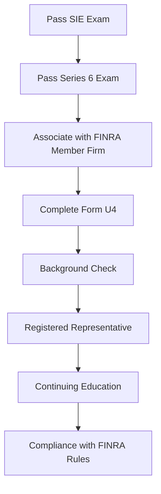

## 13.1.2 Registered Representative Requirements

A **Registered Representative (RR)** is a crucial role within the securities industry, acting as the intermediary between broker-dealers and clients. These individuals are licensed to sell securities and provide investment advice, primarily focusing on investment company products and variable contracts, such as mutual funds and variable annuities. This section delves into the comprehensive requirements necessary to become an RR, ensuring compliance with FINRA regulations and maintaining ethical standards in the industry.

### Understanding the Role of a Registered Representative

An RR is an individual who solicits or conducts securities business with customers on behalf of a broker-dealer. They are responsible for understanding and meeting client needs, providing investment recommendations, and ensuring compliance with regulatory standards. The role requires a deep understanding of financial products, market dynamics, and regulatory frameworks.

### Pathway to Becoming a Registered Representative

Becoming a Registered Representative involves several key steps, each designed to ensure that individuals are well-prepared to handle the responsibilities of the role.

#### 1. Passing the Securities Industry Essentials (SIE) Exam

The SIE Exam is the foundational step for anyone entering the securities industry. It tests basic knowledge of the securities industry, including concepts fundamental to working in the field, such as types of products and their risks, the structure of the securities industry markets, and regulatory agencies and their functions.

- **Exam Structure:** The SIE Exam consists of 75 multiple-choice questions, with a time allotment of 1 hour and 45 minutes. A passing score is 70%.
- **Eligibility:** The SIE Exam can be taken by anyone aged 18 or older, without the need for sponsorship by a FINRA member firm.

#### 2. Passing the Series 6 Exam

For those focusing on investment company products and variable contracts, passing the Series 6 Exam is essential. This qualification exam assesses a candidate's ability to perform the critical functions of an RR.

- **Exam Details:** The Series 6 Exam includes 50 multiple-choice questions, with a time limit of 1 hour and 30 minutes. A passing score is 70%.
- **Content Areas:** The exam covers topics such as regulatory fundamentals, investment company products, variable contracts, and ethical practices.

#### 3. Association with a FINRA Member Firm

To become a registered representative, you must be associated with a FINRA member firm. This association ensures that you are working under a firm that adheres to FINRA's regulatory standards and can provide the necessary oversight and support.

- **Role of the Firm:** The member firm is responsible for supervising the activities of its registered representatives, ensuring compliance with industry regulations, and providing ongoing training and support.

#### 4. Completing Form U4

The **Form U4 (Uniform Application for Securities Industry Registration)** is a critical document in the registration process. It is used to register individuals with FINRA and other jurisdictions.

- **Information Required:** The form requires detailed personal information, employment history, and disclosures of any disciplinary actions or legal proceedings.
- **Background Checks:** The completion of Form U4 includes a background check to verify the information provided and assess the individual's suitability for the role.

### Background Checks and Disclosure Requirements

A thorough background check is a mandatory part of the registration process. This check ensures that all information provided in Form U4 is accurate and that the candidate has no history of disciplinary actions that would disqualify them from serving as an RR.

- **Disciplinary History:** Candidates must disclose any past legal or regulatory issues, including bankruptcies, liens, or criminal charges. Failure to disclose such information can lead to severe penalties, including disqualification.
- **Ongoing Disclosure Obligations:** Registered representatives are required to update their Form U4 to reflect any changes in their personal or professional circumstances, ensuring ongoing compliance with regulatory requirements.

### Continuing Education and Compliance Obligations

Once registered, representatives must adhere to continuing education requirements and maintain compliance with FINRA rules and ethical standards.

#### Continuing Education (CE) Requirements

Continuing education is vital for maintaining the skills and knowledge necessary to serve clients effectively and comply with industry regulations.

- **Regulatory Element:** This component involves periodic training on regulatory requirements and industry standards. It must be completed within 120 days of the second anniversary of registration and every three years thereafter.
- **Firm Element:** This is a firm-specific training program designed to address the unique needs of the firm and its representatives. It involves annual training on topics such as new products, services, and regulations.

#### Adherence to FINRA Rules and Ethical Standards

Registered representatives must comply with FINRA's rules and ethical standards, which are designed to protect investors and ensure fair and honest market practices.

- **Code of Conduct:** Representatives must adhere to standards of commercial honor and principles of trade, ensuring that their actions are just and equitable.
- **Suitability Obligations:** Representatives must ensure that investment recommendations are suitable for their clients, taking into account their financial situation, investment objectives, and risk tolerance.
- **Anti-Fraud Provisions:** Representatives must avoid any fraudulent activities or misrepresentations in their dealings with clients.

### Practical Examples and Case Studies

To illustrate the role and responsibilities of a registered representative, consider the following scenarios:

- **Scenario 1: Suitability Assessment:** A client approaches an RR with a desire to invest in a high-risk mutual fund. The RR conducts a thorough assessment of the client's financial situation and risk tolerance, ultimately recommending a more balanced portfolio that aligns with the client's long-term goals.
  
- **Scenario 2: Ethical Dilemma:** An RR discovers that a colleague is providing misleading information to clients about a particular investment product. The RR reports the behavior to the firm's compliance department, ensuring that clients receive accurate and truthful information.

### Common Pitfalls and Best Practices

Registered representatives must navigate a complex regulatory environment, and there are several common pitfalls to avoid:

- **Failure to Update Form U4:** Representatives must promptly update their Form U4 with any changes in personal or professional circumstances to avoid penalties.
- **Inadequate Suitability Analysis:** Thoroughly understanding a client's needs and risk tolerance is essential to providing suitable investment recommendations.
- **Non-Compliance with Continuing Education:** Failing to complete required training can result in suspension or termination of registration.

To succeed as a registered representative, consider these best practices:

- **Regularly Review FINRA Rules:** Stay informed about changes to FINRA regulations and industry standards to ensure compliance.
- **Engage in Ongoing Education:** Take advantage of training opportunities to enhance your knowledge and skills.
- **Maintain Open Communication with Clients:** Build trust with clients by providing clear, honest, and transparent information about investment products and strategies.

### Diagrams and Visual Aids

To better understand the registration process and the role of a registered representative, consider the following diagram illustrating the steps to becoming an RR:

### References and Further Reading

For more information on becoming a registered representative and complying with FINRA regulations, consider the following resources:

- [FINRA's Registration Requirements](https://www.finra.org/registration-exams-ce/qualification-exams)
- FINRA's [Continuing Education Program](https://www.finra.org/registration-exams-ce/continuing-education)
- Securities Industry Essentials (SIE) Exam [Content Outline](https://www.finra.org/registration-exams-ce/qualification-exams/sie)

### Summary

Becoming a registered representative is a rigorous process that ensures individuals are equipped to meet the demands of the securities industry. By understanding the requirements and maintaining compliance with FINRA rules, representatives can provide valuable services to their clients and contribute to the integrity of the financial markets.

---

## Series 6 Exam Practice Questions: Registered Representative Requirements



### What is the primary role of a Registered Representative (RR)?

- [x] To solicit and conduct securities business with customers on behalf of a broker-dealer
- [ ] To manage the financial portfolios of institutional investors
- [ ] To oversee compliance within a brokerage firm
- [ ] To provide legal advice on securities regulations

> **Explanation:** A Registered Representative's primary role is to solicit and conduct securities business with customers on behalf of a broker-dealer, focusing on investment company products and variable contracts.

### Which exam must be passed first before taking the Series 6 Exam?

- [x] Securities Industry Essentials (SIE) Exam
- [ ] Series 7 Exam
- [ ] Series 63 Exam
- [ ] Series 65 Exam

> **Explanation:** The Securities Industry Essentials (SIE) Exam is a prerequisite for the Series 6 Exam, testing basic industry knowledge required for all securities professionals.

### What is required for an individual to become a Registered Representative?

- [ ] Only passing the Series 6 Exam
- [x] Passing the SIE and Series 6 Exams, association with a FINRA member firm, and completing Form U4
- [ ] Passing the Series 7 Exam and obtaining a law degree
- [ ] Completing a financial planning certification

> **Explanation:** To become a Registered Representative, an individual must pass both the SIE and Series 6 Exams, be associated with a FINRA member firm, and complete Form U4.

### What is the purpose of Form U4 in the registration process?

- [ ] To register a broker-dealer with FINRA
- [x] To register an individual with FINRA and other jurisdictions
- [ ] To apply for a securities license
- [ ] To certify compliance with continuing education requirements

> **Explanation:** Form U4 is used to register individuals with FINRA and other jurisdictions, providing detailed personal and professional information.

### What must be disclosed on Form U4?

- [ ] Only employment history
- [ ] Only educational background
- [x] Personal information, employment history, and any disciplinary actions
- [ ] Only financial certifications

> **Explanation:** Form U4 requires disclosure of personal information, employment history, and any disciplinary actions or legal proceedings.

### How often must the Regulatory Element of Continuing Education be completed?

- [ ] Annually
- [ ] Every two years
- [x] Every three years after the second anniversary of registration
- [ ] Only once at the beginning of a career

> **Explanation:** The Regulatory Element of Continuing Education must be completed within 120 days of the second anniversary of registration and every three years thereafter.

### What is a key responsibility of a FINRA member firm regarding its registered representatives?

- [x] Supervising the activities and ensuring compliance with industry regulations
- [ ] Providing legal representation in case of disputes
- [ ] Managing personal investments of the representatives
- [ ] Offering free financial planning services to clients

> **Explanation:** A FINRA member firm is responsible for supervising the activities of its registered representatives and ensuring they comply with industry regulations.

### What is a common pitfall for registered representatives regarding Form U4?

- [ ] Over-disclosure of personal information
- [x] Failure to promptly update the form with changes in circumstances
- [ ] Submitting the form electronically
- [ ] Including too much employment history

> **Explanation:** A common pitfall is failing to promptly update Form U4 with any changes in personal or professional circumstances, which can lead to penalties.

### What is the consequence of not completing the required continuing education?

- [ ] A fine imposed by FINRA
- [ ] A warning letter from the member firm
- [x] Suspension or termination of registration
- [ ] No consequences

> **Explanation:** Failing to complete the required continuing education can result in suspension or termination of registration by FINRA.

### Which of the following is a best practice for registered representatives?

- [ ] Avoiding communication with clients
- [ ] Ignoring changes in FINRA rules
- [ ] Focusing solely on high-risk investments
- [x] Regularly reviewing FINRA rules and engaging in ongoing education

> **Explanation:** Regularly reviewing FINRA rules and engaging in ongoing education are best practices for maintaining compliance and enhancing knowledge and skills.



---
