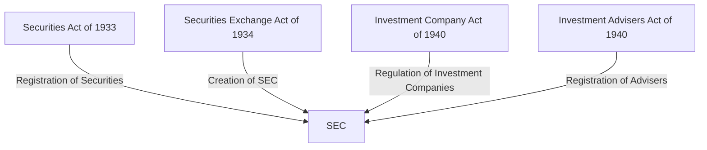

## 16.3.1 Major Securities Acts

Understanding the major securities acts is crucial for anyone preparing for the Series 6 Exam. These acts form the backbone of the U.S. securities regulatory framework and directly impact the activities of securities professionals. This section provides a comprehensive overview of the key provisions of the Securities Act of 1933, the Securities Exchange Act of 1934, the Investment Company Act of 1940, and the Investment Advisers Act of 1940. We will explore how these laws regulate the securities industry, focusing on aspects relevant to the Series 6 Exam.

### Securities Act of 1933

The Securities Act of 1933, often referred to as the "Truth in Securities Act," was enacted to ensure transparency in the financial statements of securities offered for public sale and to prevent fraud in the securities market. This act is primarily concerned with the initial offering of securities, requiring that investors receive significant information regarding securities being offered for public sale.

#### Key Provisions

- **Registration of Securities**: The act mandates that securities offered or sold to the public must be registered with the Securities and Exchange Commission (SEC). Registration statements must provide detailed information about the issuer and the securities being offered.

- **Prospectus Requirements**: A prospectus, which is part of the registration statement, must be provided to potential investors. It includes financial statements, details about the management, and other essential information.

- **Exempt Securities and Transactions**: Certain securities and transactions are exempt from registration. These include private offerings to a limited number of persons or institutions, offerings of limited size, intrastate offerings, and securities of municipal, state, and federal governments.

- **Anti-Fraud Provisions**: Section 17 of the act prohibits fraudulent activities in the offer and sale of securities.

#### Practical Example

Consider a company planning to go public. Under the Securities Act of 1933, the company must file a registration statement with the SEC, including a prospectus that provides potential investors with all material information. This ensures that investors can make informed decisions.

### Securities Exchange Act of 1934

The Securities Exchange Act of 1934 was established to govern securities transactions on the secondary market, ensuring greater financial transparency and accuracy and reducing fraud and manipulation. This act led to the creation of the SEC, which oversees securities transactions, activities of financial professionals, and the securities markets.

#### Key Provisions

- **Creation of the SEC**: The act established the SEC to enforce federal securities laws and regulate the securities industry.

- **Regulation of Secondary Markets**: It regulates trading of securities in the secondary market, including stock exchanges and over-the-counter markets.

- **Registration of Broker-Dealers**: Broker-dealers must register with the SEC and comply with regulations designed to protect investors.

- **Reporting Requirements**: Public companies must file periodic reports with the SEC, providing ongoing disclosure of financial and other significant information.

- **Anti-Fraud Provisions**: Section 10(b) and Rule 10b-5 prohibit fraudulent activities in connection with the purchase or sale of securities.

#### Practical Example

A brokerage firm must register with the SEC and adhere to its regulations. This ensures that the firm operates in a manner that protects investors and maintains market integrity.

### Investment Company Act of 1940

The Investment Company Act of 1940 regulates the organization and activities of companies engaged primarily in investing, reinvesting, and trading in securities, and whose own securities are offered to the investing public. This act is particularly relevant to mutual funds and other types of investment companies.

#### Key Provisions

- **Definition and Types of Investment Companies**: The act defines investment companies and categorizes them into three types: face-amount certificate companies, unit investment trusts, and management companies (open-end and closed-end).

- **Registration and Regulation Requirements**: Investment companies must register with the SEC and comply with regulations regarding their structure, operations, and financial disclosures.

- **Governance and Oversight**: The act requires a board of directors, with at least 40% being independent, to oversee the management of the investment company.

- **Prohibition of Certain Activities**: The act restricts certain activities, such as issuing senior securities, unless specific conditions are met.

#### Practical Example

A mutual fund must register under the Investment Company Act of 1940, adhere to governance standards, and provide regular financial disclosures to investors. This ensures transparency and protects investors' interests.

### Investment Advisers Act of 1940

The Investment Advisers Act of 1940 regulates investment advisers, requiring them to register with the SEC and adhere to fiduciary standards. This act aims to protect investors by ensuring that advisers act in their clients' best interests.

#### Key Provisions

- **Definition of Investment Adviser**: An investment adviser is any person or firm that, for compensation, engages in the business of advising others about securities.

- **Registration and Exemptions**: Advisers must register with the SEC unless they qualify for an exemption, such as advisers with fewer than 15 clients or those who do not hold themselves out to the public as investment advisers.

- **Fiduciary Duty**: Advisers must act in the best interests of their clients, providing advice that is suitable and disclosing any conflicts of interest.

- **Recordkeeping and Reporting**: Advisers are required to maintain accurate records and file reports with the SEC.

#### Practical Example

An investment advisory firm managing client portfolios must register with the SEC and adhere to fiduciary standards, ensuring that all investment advice is in the best interest of clients.

### Conclusion

The major securities acts form the foundation of securities regulation in the United States, providing a framework for the issuance, trading, and management of securities. Understanding these acts is essential for securities professionals, as they impact daily activities and ensure the integrity and transparency of the securities markets.

### Diagrams and Visuals

To enhance understanding, the following diagram illustrates the relationship between the major securities acts and the regulatory bodies they established:

### Key Takeaways

- The **Securities Act of 1933** focuses on the initial offering of securities, requiring registration and disclosure to prevent fraud.
- The **Securities Exchange Act of 1934** governs secondary market transactions and established the SEC to enforce securities laws.
- The **Investment Company Act of 1940** regulates investment companies, ensuring transparency and protecting investors.
- The **Investment Advisers Act of 1940** requires investment advisers to register and adhere to fiduciary standards, protecting clients' interests.

### References and Further Reading

- Securities Act of 1933: [SEC.gov - Securities Act of 1933](https://www.sec.gov/fast-answers/answerssec1933htm.html)
- Securities Exchange Act of 1934: [SEC.gov - Securities Exchange Act of 1934](https://www.sec.gov/fast-answers/answerssec1934htm.html)
- Investment Company Act of 1940: [SEC.gov - Investment Company Act of 1940](https://www.sec.gov/fast-answers/answersinvcoact1940htm.html)
- Investment Advisers Act of 1940: [SEC.gov - Investment Advisers Act of 1940](https://www.sec.gov/fast-answers/answersinvadvact1940htm.html)

## Series 6 Exam Practice Questions: Major Securities Acts



### What is the primary purpose of the Securities Act of 1933?

- [x] To ensure transparency in the financial statements of securities offered for public sale
- [ ] To regulate the trading of securities in the secondary market
- [ ] To establish the SEC
- [ ] To regulate investment advisers

> **Explanation:** The Securities Act of 1933 focuses on the initial offering of securities, requiring registration and disclosure to prevent fraud.

### Which act led to the creation of the SEC?

- [ ] Securities Act of 1933
- [x] Securities Exchange Act of 1934
- [ ] Investment Company Act of 1940
- [ ] Investment Advisers Act of 1940

> **Explanation:** The Securities Exchange Act of 1934 established the SEC to enforce federal securities laws and regulate the securities industry.

### What is a key requirement of the Investment Company Act of 1940?

- [ ] Registration of securities
- [ ] Establishment of the SEC
- [x] Regulation of investment companies
- [ ] Registration of investment advisers

> **Explanation:** The Investment Company Act of 1940 regulates the organization and activities of investment companies, including mutual funds.

### What is the primary focus of the Investment Advisers Act of 1940?

- [ ] Regulation of securities exchanges
- [ ] Registration of securities
- [ ] Regulation of investment companies
- [x] Registration and regulation of investment advisers

> **Explanation:** The Investment Advisers Act of 1940 requires investment advisers to register with the SEC and adhere to fiduciary standards.

### Which section of the Securities Act of 1933 prohibits fraudulent activities in the offer and sale of securities?

- [ ] Section 10(b)
- [x] Section 17
- [ ] Rule 10b-5
- [ ] Section 12

> **Explanation:** Section 17 of the Securities Act of 1933 prohibits fraudulent activities in the offer and sale of securities.

### What is the purpose of the prospectus required by the Securities Act of 1933?

- [ ] To regulate secondary market transactions
- [x] To provide potential investors with material information about the securities
- [ ] To register broker-dealers
- [ ] To establish the SEC

> **Explanation:** A prospectus provides potential investors with essential information about the securities being offered, ensuring informed decision-making.

### Which act requires broker-dealers to register with the SEC?

- [ ] Securities Act of 1933
- [x] Securities Exchange Act of 1934
- [ ] Investment Company Act of 1940
- [ ] Investment Advisers Act of 1940

> **Explanation:** The Securities Exchange Act of 1934 requires broker-dealers to register with the SEC and comply with regulations to protect investors.

### What type of investment companies are regulated under the Investment Company Act of 1940?

- [ ] Broker-dealers
- [ ] Investment advisers
- [x] Mutual funds
- [ ] Securities exchanges

> **Explanation:** The Investment Company Act of 1940 regulates investment companies, including mutual funds, ensuring transparency and investor protection.

### What is the fiduciary duty of investment advisers under the Investment Advisers Act of 1940?

- [ ] To maximize profits for the firm
- [x] To act in the best interests of their clients
- [ ] To comply with SEC reporting requirements
- [ ] To register with FINRA

> **Explanation:** Investment advisers must act in the best interests of their clients, providing suitable advice and disclosing any conflicts of interest.

### Which act includes anti-fraud provisions such as Rule 10b-5?

- [ ] Securities Act of 1933
- [x] Securities Exchange Act of 1934
- [ ] Investment Company Act of 1940
- [ ] Investment Advisers Act of 1940

> **Explanation:** The Securities Exchange Act of 1934 includes anti-fraud provisions such as Rule 10b-5, which prohibits fraudulent activities in connection with the purchase or sale of securities.



By mastering the major securities acts, you will be well-prepared for the Series 6 Exam and equipped with the knowledge to navigate the complex regulatory landscape of the securities industry.
