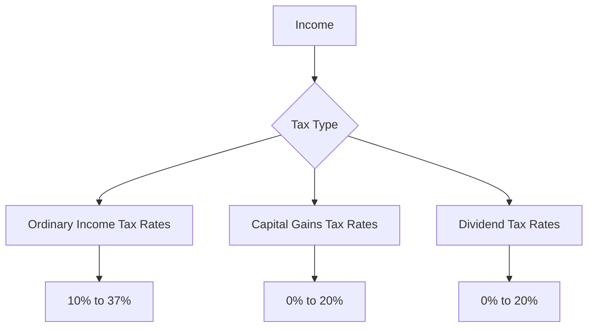

## 16.4.1 Tax Rates and Contribution Limits

Understanding tax rates and contribution limits is crucial for financial professionals, especially those preparing for the Series 6 Exam. This section provides a comprehensive overview of current federal tax brackets, capital gains and dividend tax rates, and contribution limits for various retirement and education savings accounts. This knowledge not only aids in exam preparation but also enhances your ability to advise clients effectively.

### Federal Income Tax Brackets

Federal income tax in the United States is progressive, meaning that different portions of an individual's income are taxed at different rates. The tax brackets are adjusted annually for inflation. Here is a summary of the federal income tax brackets for the tax year 2024:

| **Tax Rate** | **Single Filers** | **Married Filing Jointly** | **Head of Household** |
|--------------|-------------------|----------------------------|-----------------------|
| 10%          | Up to $11,000     | Up to $22,000              | Up to $15,700         |
| 12%          | $11,001 to $44,725| $22,001 to $89,450         | $15,701 to $59,850    |
| 22%          | $44,726 to $95,375| $89,451 to $190,750        | $59,851 to $95,350    |
| 24%          | $95,376 to $182,100| $190,751 to $364,200      | $95,351 to $182,100   |
| 32%          | $182,101 to $231,250| $364,201 to $462,500     | $182,101 to $231,250  |
| 35%          | $231,251 to $578,125| $462,501 to $693,750     | $231,251 to $578,100  |
| 37%          | Over $578,125     | Over $693,750              | Over $578,100         |

### Capital Gains Tax Rates

Capital gains taxes apply to the profit from the sale of assets or investments. The rates depend on the taxpayer's income and the duration the asset was held. Long-term capital gains, for assets held over a year, are taxed at lower rates than short-term gains, which are taxed as ordinary income.

| **Filing Status** | **0% Rate** | **15% Rate** | **20% Rate** |
|-------------------|-------------|--------------|--------------|
| Single            | Up to $44,625| $44,626 to $492,300 | Over $492,300 |
| Married Filing Jointly | Up to $89,250 | $89,251 to $553,850 | Over $553,850 |
| Head of Household | Up to $59,750 | $59,751 to $523,050 | Over $523,050 |

### Dividend Tax Rates

Qualified dividends are taxed at the same rates as long-term capital gains. Ordinary dividends, however, are taxed at the individual's ordinary income tax rate.

| **Filing Status** | **0% Rate** | **15% Rate** | **20% Rate** |
|-------------------|-------------|--------------|--------------|
| Single            | Up to $44,625| $44,626 to $492,300 | Over $492,300 |
| Married Filing Jointly | Up to $89,250 | $89,251 to $553,850 | Over $553,850 |
| Head of Household | Up to $59,750 | $59,751 to $523,050 | Over $523,050 |

### Contribution Limits for Retirement Accounts

Contribution limits for retirement accounts are set by the IRS and are subject to annual adjustments for inflation. These limits are crucial for maximizing tax-advantaged savings.

#### Individual Retirement Accounts (IRAs)

- **Traditional and Roth IRAs**: For 2024, the contribution limit is $6,500, with an additional $1,000 catch-up contribution allowed for individuals aged 50 and over.

#### Employer-Sponsored Plans

- **401(k) Plans**: The contribution limit for 2024 is $23,000, with a catch-up contribution of $7,500 for individuals aged 50 and over.
- **403(b) Plans**: Similar to 401(k) plans, the limits are $23,000 with a $7,500 catch-up.
- **SIMPLE IRAs**: The contribution limit is $16,000, with a $3,500 catch-up contribution for those aged 50 and over.
- **SEP IRAs**: Contributions can be up to 25% of compensation, with a maximum of $66,000 for 2024.

### Contribution Limits for Education Savings Accounts

Education savings accounts offer tax advantages to help families save for future education expenses.

#### 529 Plans

- **Contribution Limits**: While 529 plans do not have a federal contribution limit, contributions are considered gifts for tax purposes. In 2024, contributions up to $17,000 per beneficiary per year are exempt from the gift tax. 

#### Coverdell Education Savings Accounts (ESAs)

- **Contribution Limit**: The annual contribution limit is $2,000 per beneficiary, regardless of the number of accounts.

### Catch-Up Contributions

Catch-up contributions allow individuals aged 50 and over to contribute additional funds to their retirement accounts, providing an opportunity to boost retirement savings as they approach retirement age.

- **IRAs**: Additional $1,000
- **401(k) and 403(b) Plans**: Additional $7,500
- **SIMPLE IRAs**: Additional $3,500

### Practical Application and Exam Preparation

Understanding these tax rates and contribution limits is essential for both the Series 6 Exam and real-world financial advising. Here are some practical applications:

- **Tax Planning**: Use the tax brackets to advise clients on tax-efficient investment strategies.
- **Retirement Planning**: Help clients maximize their retirement savings by contributing up to the limit and taking advantage of catch-up contributions if eligible.
- **Education Savings**: Guide clients in selecting the right education savings accounts and maximizing their contributions.

### Diagrams and Visual Aids

To enhance understanding, consider the following diagram illustrating the relationship between different tax rates and income levels:

### Best Practices and Common Pitfalls

- **Stay Updated**: Tax rates and contribution limits change annually. Ensure you are using the most current data when advising clients or preparing for exams.
- **Maximize Contributions**: Encourage clients to contribute the maximum allowed to retirement and education accounts to take full advantage of tax benefits.
- **Avoid Over-Contribution**: Monitor contributions to avoid penalties associated with exceeding limits.

### Conclusion

Mastering tax rates and contribution limits is a foundational skill for financial professionals. By understanding these elements, you can provide valuable advice to clients and excel in the Series 6 Exam. Regularly review these figures and apply them in practice scenarios to reinforce your knowledge.

---

## Series 6 Exam Practice Questions: Tax Rates and Contribution Limits



### What is the maximum contribution limit for a Traditional IRA in 2024 for someone under the age of 50?

- [ ] $5,500
- [ ] $6,000
- [x] $6,500
- [ ] $7,000

> **Explanation:** For 2024, the contribution limit for a Traditional IRA is $6,500 for individuals under 50.

### How much can an individual aged 55 contribute to a 401(k) plan in 2024, including catch-up contributions?

- [ ] $23,000
- [x] $30,500
- [ ] $26,000
- [ ] $29,000

> **Explanation:** Individuals aged 50 and over can contribute $23,000 plus a $7,500 catch-up contribution, totaling $30,500.

### What is the tax rate for long-term capital gains for a single filer with an income of $50,000 in 2024?

- [x] 0%
- [ ] 15%
- [ ] 20%
- [ ] 25%

> **Explanation:** For a single filer with an income of $50,000, the long-term capital gains tax rate is 0%.

### What is the annual contribution limit for a Coverdell ESA?

- [ ] $1,500
- [x] $2,000
- [ ] $2,500
- [ ] $3,000

> **Explanation:** The annual contribution limit for a Coverdell ESA is $2,000 per beneficiary.

### What is the maximum contribution limit for a SIMPLE IRA in 2024 for someone aged 45?

- [ ] $13,500
- [ ] $15,500
- [x] $16,000
- [ ] $17,500

> **Explanation:** The contribution limit for a SIMPLE IRA in 2024 is $16,000 for individuals under 50.

### At what income level does the 37% federal income tax bracket begin for single filers in 2024?

- [ ] $500,000
- [ ] $550,000
- [ ] $600,000
- [x] $578,125

> **Explanation:** The 37% federal income tax bracket begins at $578,125 for single filers in 2024.

### What is the maximum annual contribution to a 529 plan that avoids gift tax implications in 2024?

- [ ] $15,000
- [ ] $16,000
- [x] $17,000
- [ ] $18,000

> **Explanation:** Contributions up to $17,000 per beneficiary per year are exempt from the gift tax in 2024.

### What is the dividend tax rate for qualified dividends for a married couple filing jointly with an income of $100,000?

- [x] 0%
- [ ] 15%
- [ ] 20%
- [ ] 25%

> **Explanation:** For a married couple filing jointly with an income of $100,000, the qualified dividend tax rate is 0%.

### What is the catch-up contribution limit for a SEP IRA for individuals over 50?

- [ ] $1,000
- [ ] $2,000
- [ ] $3,000
- [x] No catch-up contribution allowed

> **Explanation:** SEP IRAs do not have a catch-up contribution provision.

### What is the capital gains tax rate for a head of household filer with an income of $60,000?

- [ ] 0%
- [x] 15%
- [ ] 20%
- [ ] 25%

> **Explanation:** For a head of household filer with an income of $60,000, the capital gains tax rate is 15%.



---

By mastering these concepts, you will be well-prepared for the Series 6 Exam and equipped to provide valuable financial advice.
