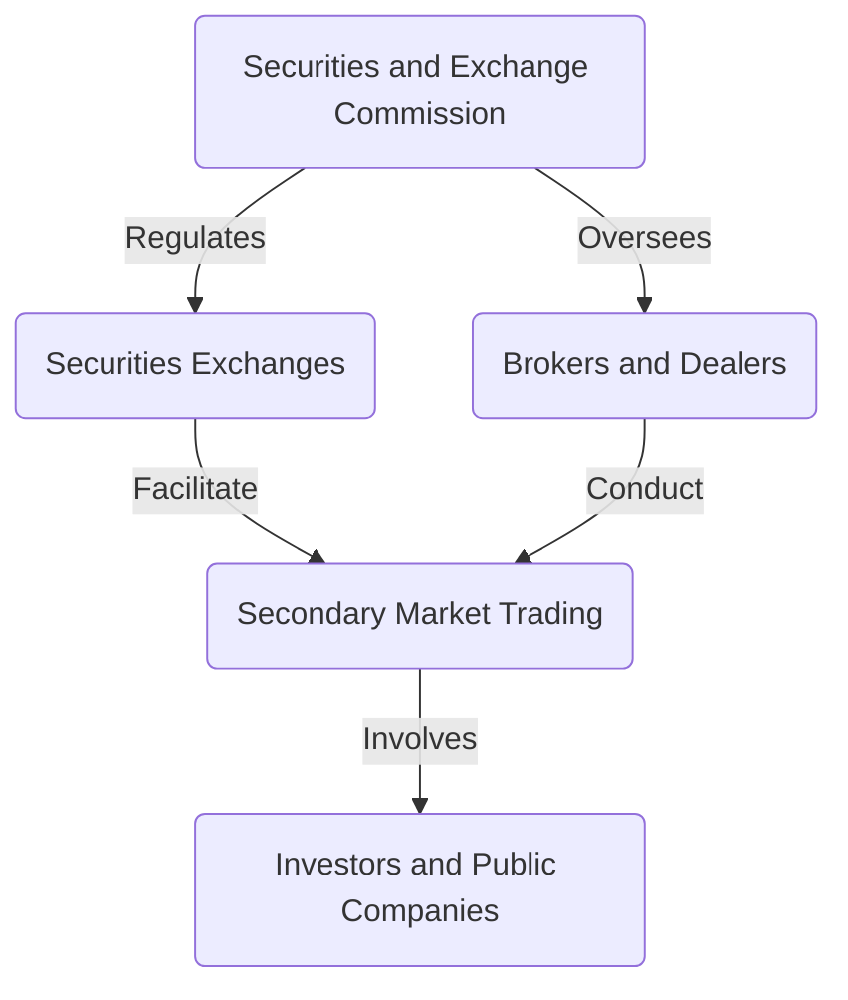

## 2.2.1 Regulation of Secondary Markets

The regulation of secondary markets is a cornerstone of the U.S. securities regulatory framework, primarily governed by the Securities Exchange Act of 1934. This act was established to regulate the trading of securities after their initial issuance, ensuring transparency, fairness, and efficiency in the marketplace. Understanding the intricacies of this regulation is crucial for anyone preparing for the Series 6 Exam, as it forms the basis of many compliance and operational standards in the securities industry.

### Overview of the Securities Exchange Act of 1934

The Securities Exchange Act of 1934 (Exchange Act) was enacted to govern securities transactions on the secondary market, after they have been issued to the public. This act aims to protect investors by regulating the exchanges and broker-dealers that facilitate these transactions, thereby maintaining fair and orderly markets. The Exchange Act is also instrumental in establishing the Securities and Exchange Commission (SEC), which is tasked with enforcing federal securities laws.

### Creation of the SEC and Its Role

The SEC was created under the Exchange Act as an independent federal agency responsible for enforcing securities laws, proposing securities rules, and regulating the securities industry, including the nation's stock and options exchanges. The SEC's primary mission is to protect investors, maintain fair, orderly, and efficient markets, and facilitate capital formation.

#### Key Functions of the SEC:

1. **Regulation of Securities Markets**: The SEC oversees securities exchanges, brokers, and dealers, ensuring compliance with securities laws.
2. **Enforcement of Securities Laws**: The SEC investigates securities law violations, such as insider trading, accounting fraud, and providing false or misleading information about securities and companies.
3. **Review of Corporate Filings**: The SEC requires public companies to disclose meaningful financial and other information to the public, which provides a common pool of knowledge for all investors to use to judge for themselves if a company’s securities are a good investment.
4. **Investor Education**: The SEC provides resources and information to help investors make informed investment decisions.

### Regulation of Trading in the Secondary Market

The secondary market is where securities are traded after their initial issuance. This market includes stock exchanges such as the New York Stock Exchange (NYSE) and NASDAQ, as well as over-the-counter (OTC) markets. The Exchange Act regulates this market by setting standards for the trading of securities, the conduct of market participants, and the operation of exchanges.

#### Key Provisions of the Exchange Act:

- **Registration of Securities Exchanges**: All securities exchanges must register with the SEC, which ensures they comply with certain standards and regulations.
- **Regulation of Brokers and Dealers**: Brokers and dealers who trade securities in the secondary market must register with the SEC and comply with its regulations.
- **Prohibition of Fraudulent Activities**: The Exchange Act prohibits manipulative and deceptive practices in the trading of securities, including insider trading and market manipulation.
- **Reporting Requirements**: Companies with securities listed on exchanges must file periodic reports with the SEC, providing transparency and information to investors.

### Requirements for Reporting Companies

A reporting company is a company that is required to file periodic reports with the SEC. These reports include annual reports (Form 10-K), quarterly reports (Form 10-Q), and current reports (Form 8-K). These filings provide investors with a comprehensive view of a company's financial health and operational performance.

#### Ongoing Disclosure Obligations:

1. **Annual Reports (Form 10-K)**: These reports include audited financial statements and a comprehensive overview of the company's business and financial condition.
2. **Quarterly Reports (Form 10-Q)**: These provide unaudited financial statements and updates on the company's financial condition and operations.
3. **Current Reports (Form 8-K)**: These are filed to disclose material events or changes that are important to shareholders and the SEC.
4. **Proxy Statements**: Companies must file proxy statements prior to shareholder meetings, which include information on voting matters, executive compensation, and other significant issues.

### Practical Examples and Scenarios

To illustrate the application of the Exchange Act, consider the following scenarios:

- **Scenario 1: Insider Trading**: A corporate executive learns of a pending merger that will significantly increase the company's stock price. Trading on this non-public information would violate the Exchange Act's prohibition against insider trading.
  
- **Scenario 2: Market Manipulation**: A broker-dealer engages in a scheme to artificially inflate the price of a stock through misleading statements and coordinated trading activity. This is a clear violation of the Exchange Act's anti-fraud provisions.

### Real-World Applications

Understanding the regulation of secondary markets is not only crucial for passing the Series 6 Exam but also for ensuring compliance in professional practice. For example, as a registered representative, you must be aware of the disclosure obligations of reporting companies to provide accurate information to your clients. Additionally, recognizing fraudulent activities and understanding the SEC's enforcement actions can help you maintain ethical standards and avoid legal pitfalls.

### Best Practices and Common Pitfalls

- **Best Practices**: Ensure thorough knowledge of the SEC's reporting requirements and the types of disclosures that must be made by reporting companies. Stay informed about changes in securities laws and regulations.

- **Common Pitfalls**: Failing to recognize the importance of timely and accurate disclosures can lead to compliance issues. Misunderstanding the scope of insider trading rules can also result in serious legal consequences.

### Diagrams and Visual Aids

To better understand the regulatory framework, consider the following diagram illustrating the relationship between the SEC, securities exchanges, and market participants:

### Conclusion

The regulation of secondary markets under the Securities Exchange Act of 1934 is a fundamental aspect of the U.S. securities regulatory environment. By understanding the role of the SEC, the requirements for reporting companies, and the provisions governing market conduct, you will be well-equipped to navigate the complexities of the securities industry and succeed in the Series 6 Exam.

For further exploration, refer to the SEC's [description of the Securities Exchange Act of 1934](https://www.sec.gov/answers/about-lawsshtml.html#sec1934) and other authoritative resources.

## Series 6 Exam Practice Questions: Regulation of Secondary Markets



### What is the primary purpose of the Securities Exchange Act of 1934?

- [ ] To regulate the initial issuance of securities
- [x] To govern trading in the secondary market
- [ ] To provide guidelines for investment advisers
- [ ] To establish the Federal Reserve

> **Explanation:** The Securities Exchange Act of 1934 primarily governs trading in the secondary market, ensuring transparency and fairness in securities transactions.

### Which federal agency was created by the Securities Exchange Act of 1934?

- [x] Securities and Exchange Commission (SEC)
- [ ] Federal Trade Commission (FTC)
- [ ] Financial Industry Regulatory Authority (FINRA)
- [ ] Commodity Futures Trading Commission (CFTC)

> **Explanation:** The SEC was established by the Securities Exchange Act of 1934 to enforce federal securities laws and regulate the securities industry.

### What is a reporting company's obligation under the Exchange Act?

- [ ] To file reports only when requested by the SEC
- [x] To file periodic reports such as Form 10-K and Form 10-Q
- [ ] To disclose only financial statements annually
- [ ] To provide monthly updates to shareholders

> **Explanation:** Reporting companies must file periodic reports like Form 10-K and Form 10-Q to provide transparency and information to investors.

### Which of the following is a key function of the SEC?

- [ ] Setting interest rates
- [x] Enforcing securities laws
- [ ] Regulating insurance companies
- [ ] Managing the federal budget

> **Explanation:** The SEC enforces securities laws, ensuring compliance and protecting investors.

### What is insider trading?

- [x] Trading based on non-public, material information
- [ ] Trading large volumes of stocks
- [ ] Trading during after-hours sessions
- [ ] Trading without a broker

> **Explanation:** Insider trading involves buying or selling securities based on non-public, material information, which is prohibited under the Exchange Act.

### What is the role of a securities exchange?

- [ ] To issue new securities
- [x] To facilitate trading of existing securities
- [ ] To regulate investment advisers
- [ ] To provide loans to investors

> **Explanation:** Securities exchanges facilitate the trading of existing securities in the secondary market.

### What type of report must be filed to disclose material events?

- [ ] Form 10-K
- [ ] Form 10-Q
- [x] Form 8-K
- [ ] Form S-1

> **Explanation:** Form 8-K is filed to disclose material events or changes that are important to shareholders and the SEC.

### What is market manipulation?

- [ ] Buying and holding securities for long-term gain
- [ ] Trading based on technical analysis
- [x] Engaging in deceptive practices to influence securities prices
- [ ] Investing in diversified portfolios

> **Explanation:** Market manipulation involves deceptive practices to artificially influence securities prices, violating the Exchange Act.

### Which document is required before shareholder meetings?

- [ ] Annual Report
- [x] Proxy Statement
- [ ] Quarterly Report
- [ ] Insider Trading Report

> **Explanation:** Proxy statements are filed before shareholder meetings, providing information on voting matters and executive compensation.

### What is the SEC's primary mission?

- [ ] To regulate interest rates
- [ ] To manage the national debt
- [x] To protect investors and maintain fair markets
- [ ] To provide financial advice to individuals

> **Explanation:** The SEC's primary mission is to protect investors, maintain fair, orderly, and efficient markets, and facilitate capital formation.


