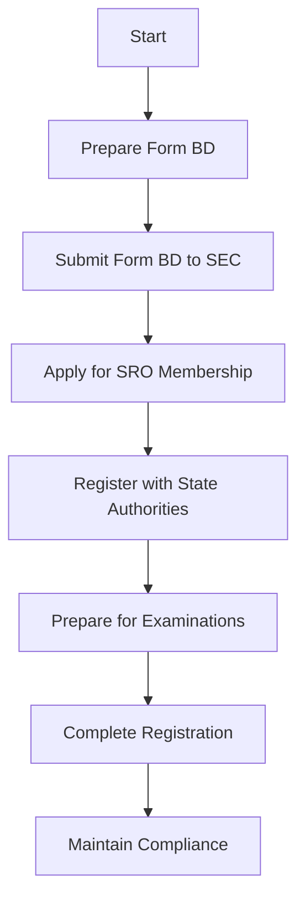

## 2.2.2 Registration of Broker-Dealers

The registration of broker-dealers is a critical component of the regulatory framework established by the Securities Exchange Act of 1934. This section provides a comprehensive overview of the registration requirements, the role of self-regulatory organizations (SROs) such as FINRA, and the importance of compliance in maintaining broker-dealer status.

### Understanding Broker-Dealer Registration

**Broker-Dealer Definition:** A broker-dealer is a person or firm in the business of buying and selling securities on behalf of clients (broker) or for their own account (dealer). Broker-dealers play a pivotal role in the securities industry, facilitating transactions and providing liquidity to the markets.

### Registration Requirements

#### Application Process

1. **Form BD Submission:** The registration process for broker-dealers begins with the submission of Form BD to the Securities and Exchange Commission (SEC). This form collects essential information about the firm, including its business structure, ownership, and disciplinary history.

2. **Membership with an SRO:** Broker-dealers must become members of an SRO, such as the Financial Industry Regulatory Authority (FINRA), which oversees their activities and ensures compliance with industry standards.

3. **State Registration:** In addition to federal registration, broker-dealers must register with the securities regulatory authority in each state where they intend to conduct business. This often involves additional paperwork and fees.

4. **Filing Fees:** The registration process includes various fees, which can vary depending on the SRO and state requirements.

#### Qualification Requirements

1. **Examinations:** Individuals associated with a broker-dealer, such as registered representatives, must pass qualifying exams, including the Securities Industry Essentials (SIE) exam and the Series 6 or Series 7 exams, depending on their role.

2. **Background Checks:** The SEC and SROs conduct thorough background checks on all applicants to ensure they meet the ethical and professional standards required to operate in the securities industry.

3. **Financial Requirements:** Broker-dealers must meet specific financial requirements, such as maintaining a minimum net capital, to ensure they can meet their obligations to clients and counterparties.

### Role of Self-Regulatory Organizations (SROs)

#### FINRA's Regulatory Oversight

1. **Rule Enforcement:** FINRA enforces rules and regulations that govern the conduct of broker-dealers. These rules are designed to protect investors and ensure the integrity of the securities markets.

2. **Examinations and Audits:** FINRA conducts regular examinations and audits of its member firms to ensure compliance with applicable laws and regulations. These examinations can be routine or triggered by specific events or concerns.

3. **Disciplinary Actions:** FINRA has the authority to impose disciplinary actions on broker-dealers that violate its rules, including fines, suspensions, or expulsion from the industry.

#### Other SROs

1. **Municipal Securities Rulemaking Board (MSRB):** For broker-dealers involved in municipal securities, the MSRB provides additional regulation and oversight.

2. **National Futures Association (NFA):** Broker-dealers dealing in futures contracts may also be subject to NFA regulations.

### Importance of Compliance

#### Maintaining Registration

1. **Ongoing Compliance:** Broker-dealers must adhere to all applicable laws and regulations to maintain their registration status. This includes keeping accurate records, filing periodic reports, and ensuring all associated persons are properly licensed.

2. **Continuing Education:** Registered representatives must complete continuing education requirements to stay informed about industry developments and regulatory changes.

3. **Ethical Standards:** Broker-dealers are expected to uphold high ethical standards in all their dealings, including fair treatment of clients and avoidance of conflicts of interest.

#### Consequences of Non-Compliance

1. **Revocation of Registration:** Failure to comply with regulatory requirements can result in the revocation of a broker-dealer's registration, effectively ending their ability to operate in the securities industry.

2. **Legal and Financial Penalties:** Non-compliance can also lead to significant legal and financial penalties, including fines and restitution to affected clients.

### Practical Examples and Scenarios

#### Case Study: XYZ Securities

XYZ Securities, a mid-sized broker-dealer, faced challenges during its registration process due to incomplete disclosure of its ownership structure. After working closely with its legal team and the SEC, XYZ Securities successfully amended its Form BD and obtained registration. This case highlights the importance of transparency and accuracy in the registration process.

#### Scenario: Compliance Audit

During a routine FINRA audit, ABC Brokerage was found to have inadequate recordkeeping practices. As a result, FINRA imposed a fine and required ABC Brokerage to implement a comprehensive compliance program. This scenario underscores the necessity of maintaining robust compliance procedures to avoid regulatory sanctions.

### Step-by-Step Guidance

#### Registering as a Broker-Dealer

1. **Prepare Form BD:** Gather all necessary information, including business details, ownership structure, and disciplinary history.

2. **Submit Form BD to the SEC:** Ensure all information is accurate and complete to avoid delays in the registration process.

3. **Apply for SRO Membership:** Choose an appropriate SRO, such as FINRA, and complete the membership application process.

4. **Register with State Authorities:** Contact the securities regulatory authority in each state where you plan to operate and complete the necessary registration requirements.

5. **Prepare for Examinations:** Ensure all associated persons are prepared to take and pass the required qualifying exams.

#### Maintaining Compliance

1. **Implement a Compliance Program:** Develop a comprehensive compliance program that includes policies and procedures for recordkeeping, reporting, and ethical conduct.

2. **Conduct Regular Training:** Provide ongoing training for all employees to ensure they understand and comply with regulatory requirements.

3. **Monitor Regulatory Changes:** Stay informed about changes in securities laws and regulations to ensure continued compliance.

### Diagrams and Visuals

Below is a flowchart illustrating the broker-dealer registration process:

### Best Practices and Common Pitfalls

#### Best Practices

- **Thorough Documentation:** Ensure all documentation is complete and accurate to avoid delays in the registration process.
- **Regular Compliance Reviews:** Conduct regular reviews of your compliance program to identify and address potential issues.

#### Common Pitfalls

- **Incomplete Disclosures:** Failing to disclose all relevant information on Form BD can lead to delays or denial of registration.
- **Inadequate Training:** Insufficient training for registered representatives can result in compliance violations and penalties.

### References and Further Reading

- [SEC Guide to Broker-Dealer Registration](https://www.sec.gov/reportspubs/investor-publications/divisionsmarketregbdguidehtm.html)
- FINRA's Rules and Regulations
- MSRB's Regulatory Framework

### Summary

The registration of broker-dealers is a complex but essential process that ensures the integrity of the securities markets. By understanding the registration requirements, the role of SROs, and the importance of compliance, broker-dealers can successfully navigate the regulatory landscape and maintain their status in the industry.

## Series 6 Exam Practice Questions: Registration of Broker-Dealers



### What is the primary form used for the registration of broker-dealers with the SEC?

- [x] Form BD
- [ ] Form U4
- [ ] Form ADV
- [ ] Form S-1

> **Explanation:** Form BD is the primary form used for registering broker-dealers with the SEC. It collects essential information about the firm.

### Which organization is primarily responsible for the oversight of broker-dealers?

- [ ] SEC
- [x] FINRA
- [ ] MSRB
- [ ] NFA

> **Explanation:** FINRA is the primary self-regulatory organization responsible for the oversight of broker-dealers.

### What is required for a broker-dealer to operate in multiple states?

- [ ] Federal registration only
- [ ] State registration only
- [x] Both federal and state registration
- [ ] No registration is required

> **Explanation:** Broker-dealers must register both federally with the SEC and with each state where they intend to conduct business.

### What is a common consequence of non-compliance with broker-dealer regulations?

- [ ] Increased market share
- [x] Revocation of registration
- [ ] Reduced operating costs
- [ ] Enhanced reputation

> **Explanation:** Non-compliance with regulations can lead to the revocation of a broker-dealer's registration, preventing them from operating.

### Which of the following is NOT a responsibility of FINRA?

- [ ] Conducting examinations
- [x] Setting state registration fees
- [ ] Enforcing rules
- [ ] Imposing disciplinary actions

> **Explanation:** FINRA does not set state registration fees; this is determined by individual state securities regulators.

### What type of examination must individuals associated with broker-dealers pass?

- [ ] Series 65
- [ ] Series 63
- [x] Series 6 or Series 7
- [ ] Series 24

> **Explanation:** Individuals associated with broker-dealers typically need to pass the Series 6 or Series 7 exams, depending on their role.

### How often must broker-dealers submit financial reports to the SEC?

- [ ] Annually
- [ ] Quarterly
- [x] Monthly
- [ ] Bi-annually

> **Explanation:** Broker-dealers are generally required to submit financial reports monthly to the SEC.

### What is the purpose of a compliance program for broker-dealers?

- [ ] To increase sales
- [x] To ensure adherence to regulations
- [ ] To reduce employee turnover
- [ ] To enhance marketing efforts

> **Explanation:** A compliance program is designed to ensure that broker-dealers adhere to all applicable laws and regulations.

### Which document is primarily used to verify the identity of a new client?

- [x] New Account Form
- [ ] Form ADV
- [ ] Form U4
- [ ] Form S-1

> **Explanation:** The New Account Form is used to collect information necessary to verify the identity of a new client.

### What is a key benefit of maintaining SRO membership for broker-dealers?

- [ ] Reduced tax obligations
- [ ] Exemption from state laws
- [x] Access to regulatory guidance and support
- [ ] Guaranteed profitability

> **Explanation:** SRO membership provides broker-dealers with access to regulatory guidance and support, helping them maintain compliance.



By understanding and adhering to the registration requirements and compliance obligations, broker-dealers can effectively operate within the regulatory framework established by the Securities Exchange Act of 1934. This knowledge not only aids in passing the Series 6 Exam but also ensures a successful career in the securities industry.
