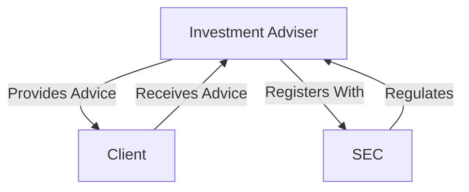

## 2.4.1 Definition of Investment Adviser

### Introduction to Investment Advisers

In the realm of securities and investments, the term "investment adviser" carries significant weight and responsibility. An investment adviser is defined as any person or firm that, for compensation, engages in the business of advising others, either directly or through publications or writings, as to the value of securities or as to the advisability of investing in, purchasing, or selling securities. This definition is crucial for understanding the regulatory environment that governs the advice provided in the securities industry.

### Legal Framework: Investment Advisers Act of 1940

The Investment Advisers Act of 1940 is the cornerstone legislation that regulates investment advisers in the United States. This Act was established to protect investors by ensuring that those who provide investment advice adhere to ethical and professional standards. The Act requires advisers to register with the Securities and Exchange Commission (SEC) and comply with various regulatory requirements designed to protect investors.

### Criteria for Being Considered an Investment Adviser

To qualify as an investment adviser under the Investment Advisers Act of 1940, an individual or firm must meet certain criteria:

1. **Provision of Advice or Analyses on Securities**: The individual or firm must provide advice or analyses concerning securities. This includes offering recommendations on buying, selling, or holding securities.

2. **Engagement in the Business**: The adviser must be engaged in the business of providing such advice. This means that offering investment advice is a regular activity, not an occasional or incidental service.

3. **Compensation**: The adviser must receive compensation for providing investment advice. Compensation can take various forms, including fees, commissions, or other economic benefits.

### Exclusions and Exemptions

Not all individuals or firms that provide advice on securities are considered investment advisers under the Act. There are specific exclusions and exemptions:

- **Exclusions**: Certain professionals, such as lawyers, accountants, engineers, or teachers, are excluded from the definition of an investment adviser if their advice is incidental to their professional services. Additionally, broker-dealers whose advisory services are solely incidental to the conduct of their business and who receive no special compensation for their advisory services are also excluded.

- **Exemptions**: The Act provides exemptions for certain advisers, such as those who advise only insurance companies or those who operate entirely within a single state and do not provide advice on securities listed on national exchanges.

### Roles and Responsibilities of Investment Advisers

Investment advisers have several critical roles and responsibilities, which are governed by the Investment Advisers Act of 1940:

1. **Fiduciary Duty**: Investment advisers owe a fiduciary duty to their clients, meaning they must act in their clients' best interests, with loyalty and care. This includes disclosing any potential conflicts of interest and ensuring that the advice provided is suitable for the client's financial situation.

2. **Registration and Compliance**: Advisers must register with the SEC or the appropriate state regulatory authority, depending on the amount of assets under management. They must also comply with regulatory requirements, including record-keeping, reporting, and adherence to ethical standards.

3. **Disclosure Obligations**: Advisers are required to provide clients with a written disclosure document, commonly known as Form ADV, which outlines their business practices, fees, conflicts of interest, and other pertinent information.

4. **Advertising and Marketing**: Investment advisers must adhere to strict rules regarding advertising and marketing their services. They must ensure that all communications are truthful, not misleading, and provide a fair and balanced representation of their services and performance.

### Practical Examples and Case Studies

#### Case Study: Fiduciary Duty in Action

Consider an investment adviser managing a client's retirement portfolio. The adviser must carefully assess the client's financial goals, risk tolerance, and time horizon before making investment recommendations. If the adviser recommends a high-risk investment without considering the client's conservative risk tolerance, they could be violating their fiduciary duty.

#### Example: Exclusion of a Broker-Dealer

A broker-dealer provides incidental advice to a client while executing a trade and does not charge a separate fee for the advice. In this scenario, the broker-dealer would likely be excluded from the definition of an investment adviser, as the advice is incidental to their primary business of executing trades.

### Real-World Applications and Regulatory Scenarios

Investment advisers play a crucial role in the securities industry by guiding clients through complex financial markets. They must navigate various regulatory scenarios, such as ensuring compliance with anti-fraud provisions and maintaining transparency in their dealings.

#### Regulatory Scenario: SEC Examination

The SEC conducts periodic examinations of registered investment advisers to ensure compliance with regulatory requirements. During an examination, the SEC may review the adviser's books and records, client communications, and marketing materials to assess compliance with the Investment Advisers Act of 1940.

### Step-by-Step Guidance for Compliance

1. **Determine Registration Requirements**: Assess whether you need to register with the SEC or a state regulatory authority based on your assets under management and client base.

2. **Prepare and File Form ADV**: Complete and file Form ADV, which includes detailed information about your business practices, fees, and potential conflicts of interest.

3. **Implement Compliance Policies**: Develop and implement compliance policies and procedures to ensure adherence to regulatory requirements and ethical standards.

4. **Conduct Regular Compliance Reviews**: Perform regular internal reviews to ensure ongoing compliance with the Investment Advisers Act and other applicable regulations.

### Diagrams and Visual Aids

Below is a diagram illustrating the relationship between investment advisers, clients, and regulatory bodies:

### Best Practices and Common Pitfalls

#### Best Practices

- **Maintain Transparency**: Always provide clear and comprehensive disclosures to clients regarding fees, conflicts of interest, and investment strategies.
- **Regularly Update Compliance Policies**: Ensure that your compliance policies are up-to-date with the latest regulatory changes and industry best practices.

#### Common Pitfalls

- **Failure to Disclose Conflicts**: One of the most common violations is failing to adequately disclose conflicts of interest to clients.
- **Inaccurate Advertising**: Misleading or inaccurate advertising can lead to regulatory actions and damage to reputation.

### References to Official U.S. Securities Laws and Additional Resources

For further exploration, you can refer to the SEC's [Information for Investment Advisers](https://www.sec.gov/divisions/investment.shtml) for comprehensive guidance on registration, compliance, and regulatory requirements.

### Summary

Understanding the definition, roles, and responsibilities of investment advisers is crucial for anyone preparing for the Series 6 Exam. By adhering to the Investment Advisers Act of 1940, advisers ensure they meet their fiduciary duties and maintain the trust of their clients.

---

## Series 6 Exam Practice Questions: Definition of Investment Adviser



### Which of the following is a key criterion for being considered an investment adviser?

- [x] Providing advice about securities for compensation
- [ ] Offering real estate advice
- [ ] Selling insurance products
- [ ] Providing accounting services

> **Explanation:** An investment adviser is defined by providing advice on securities for compensation, not real estate, insurance, or accounting.

### What is the primary legislation governing investment advisers in the U.S.?

- [ ] Securities Act of 1933
- [ ] Securities Exchange Act of 1934
- [x] Investment Advisers Act of 1940
- [ ] Dodd-Frank Act

> **Explanation:** The Investment Advisers Act of 1940 is the primary legislation regulating investment advisers in the U.S.

### Which of the following is NOT a responsibility of an investment adviser?

- [ ] Acting in the client's best interest
- [ ] Disclosing conflicts of interest
- [x] Guaranteeing investment returns
- [ ] Registering with the SEC

> **Explanation:** Investment advisers cannot guarantee investment returns as it would be misleading and against regulatory standards.

### What is a common exclusion from the definition of an investment adviser?

- [x] Broker-dealers providing incidental advice
- [ ] Firms providing investment advice for compensation
- [ ] Individuals managing client portfolios
- [ ] Firms advising on securities

> **Explanation:** Broker-dealers providing incidental advice without special compensation are excluded from being considered investment advisers.

### What document must investment advisers provide to clients to disclose business practices and conflicts?

- [ ] Form 10-K
- [x] Form ADV
- [ ] Form 8-K
- [ ] Form S-1

> **Explanation:** Form ADV is required to disclose business practices, fees, and conflicts of interest.

### Which of the following is an example of a fiduciary duty?

- [ ] Maximizing adviser profits
- [ ] Promoting high-risk investments
- [x] Acting in the client's best interest
- [ ] Minimizing client communication

> **Explanation:** Acting in the client's best interest is a core aspect of fiduciary duty.

### What is a potential consequence of failing to disclose conflicts of interest?

- [ ] Increased client trust
- [x] Regulatory action
- [ ] Higher investment returns
- [ ] Reduced compliance costs

> **Explanation:** Failing to disclose conflicts can lead to regulatory action and penalties.

### Which of the following is a requirement for investment adviser registration?

- [ ] Passing the Series 7 Exam
- [x] Filing Form ADV with the SEC
- [ ] Obtaining a law degree
- [ ] Having a minimum of 10 clients

> **Explanation:** Filing Form ADV with the SEC is a key requirement for registration.

### Which of the following is an example of misleading advertising by an investment adviser?

- [ ] Providing accurate performance data
- [ ] Disclosing all fees
- [x] Guaranteeing specific investment returns
- [ ] Offering balanced risk assessments

> **Explanation:** Guaranteeing specific returns is misleading and against regulatory guidelines.

### What is the role of the SEC in relation to investment advisers?

- [ ] Providing investment advice
- [x] Regulating and overseeing compliance
- [ ] Selling securities
- [ ] Offering tax advice

> **Explanation:** The SEC regulates investment advisers to ensure compliance with securities laws.



---
