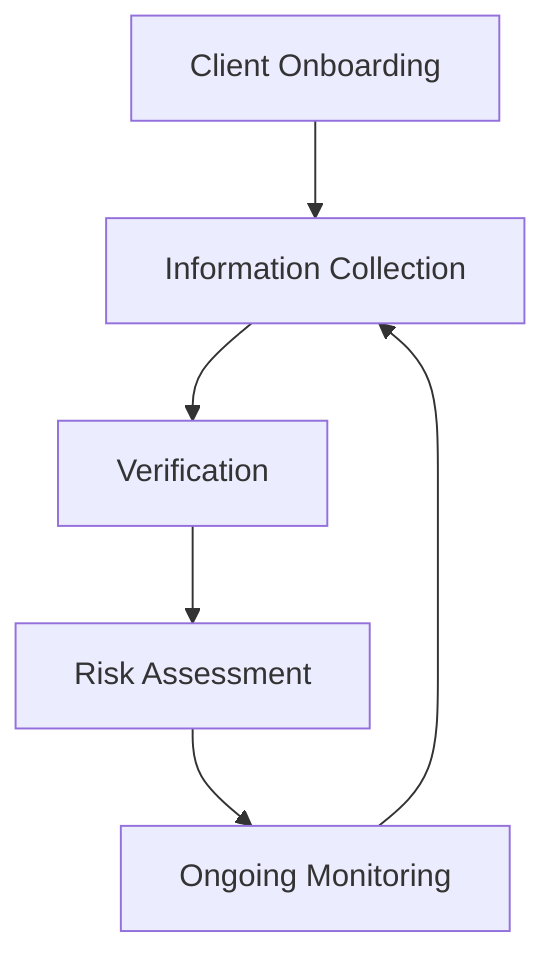

## 3.2.1 Know Your Customer (KYC) Rule

The "Know Your Customer" (KYC) rule is a fundamental principle in the securities industry, designed to protect both the investor and the financial institution. This rule is encapsulated in [FINRA Rule 2090](https://www.finra.org/rules-guidance/rulebooks/finra-rules/2090), which mandates that broker-dealers use reasonable diligence to know and retain essential facts about each customer. This section will explore the intricacies of the KYC rule, its importance in ensuring suitable investment recommendations, and its role in maintaining ethical standards in the financial industry.

### Understanding the KYC Rule

The KYC rule is a regulatory requirement that obligates financial institutions to verify the identity and suitability of their clients. This process involves collecting comprehensive information about the client's financial situation, investment objectives, risk tolerance, and other relevant factors. The primary goal is to ensure that any investment recommendations made are suitable for the client's specific circumstances.

#### Key Objectives of the KYC Rule

1. **Client Protection**: By understanding a client's financial situation and objectives, financial institutions can provide recommendations that align with the client's needs and risk tolerance, thereby protecting them from unsuitable investments.

2. **Regulatory Compliance**: Compliance with the KYC rule helps financial institutions adhere to regulatory standards, reducing the risk of legal issues and financial penalties.

3. **Fraud Prevention**: By verifying the identity of clients, financial institutions can prevent fraudulent activities and protect the integrity of the financial system.

### Essential Facts to Collect

To comply with the KYC rule, financial institutions must gather a range of information about their clients. This information typically includes:

- **Financial Status**: Understanding a client's income, assets, liabilities, and overall financial health is crucial for making suitable investment recommendations.

- **Tax Status**: Knowledge of a client's tax situation can influence investment decisions, particularly in terms of tax-efficient investment strategies.

- **Investment Objectives**: This includes understanding the client's goals, such as capital preservation, income generation, or growth.

- **Risk Tolerance**: Assessing how much risk a client is willing and able to take is vital in recommending appropriate investment products.

- **Investment Experience**: Knowing a client's level of experience with different types of investments can help tailor recommendations to their understanding and comfort level.

- **Time Horizon**: Understanding the client's investment time frame is essential for aligning investment strategies with their long-term goals.

### The KYC Process

The KYC process involves several steps, each designed to ensure that the financial institution has a comprehensive understanding of the client. The process typically includes:

1. **Client Onboarding**: During this initial phase, the financial institution collects essential information from the client through forms, interviews, and documentation.

2. **Verification**: The collected information is verified to ensure its accuracy. This may involve cross-referencing with external databases, credit checks, and identity verification processes.

3. **Risk Assessment**: Based on the collected information, the financial institution assesses the client's risk profile and investment suitability.

4. **Ongoing Monitoring**: The KYC process does not end after the initial assessment. Financial institutions must regularly update client information to reflect changes in their financial situation or investment objectives.

### Importance of Regular Updates

Regularly updating client information is a critical aspect of the KYC rule. Changes in a client's financial situation, tax status, or investment objectives can significantly impact the suitability of existing investments. Therefore, financial institutions must have processes in place to periodically review and update client information. This ensures that investment recommendations remain aligned with the client's current circumstances.

### Practical Examples and Scenarios

To illustrate the importance of the KYC rule, consider the following scenarios:

#### Scenario 1: Changing Financial Circumstances

A client initially invests in high-risk growth stocks based on their young age, high income, and long investment horizon. However, a few years later, the client experiences a significant change in their financial situation due to a job loss. In this case, the financial institution must update the client's information and reassess the suitability of their investment portfolio, potentially recommending a shift to more conservative investments.

#### Scenario 2: Tax Status Update

A client retires and moves to a different state with different tax laws. This change in tax status could affect the client's investment strategy, particularly in terms of tax-efficient income generation. The financial institution must update the client's tax information and adjust investment recommendations accordingly.

### Compliance Considerations

Compliance with the KYC rule is not just a regulatory requirement; it is a best practice that enhances the client-advisor relationship. Financial institutions must ensure that their KYC processes are robust and that all staff are adequately trained in collecting and verifying client information.

#### Best Practices for KYC Compliance

- **Comprehensive Training**: Ensure that all employees understand the importance of the KYC rule and are trained in the procedures for collecting and verifying client information.

- **Regular Audits**: Conduct regular audits of KYC processes to ensure compliance with regulatory standards and identify areas for improvement.

- **Technology Utilization**: Leverage technology to streamline the KYC process, improve accuracy, and enhance the client experience.

- **Clear Documentation**: Maintain clear and accurate records of all client information and interactions to support compliance efforts.

### Common Challenges and Solutions

While the KYC rule is essential for ensuring suitable investment recommendations, financial institutions may face challenges in its implementation. Common challenges include:

- **Data Management**: Managing and updating large volumes of client data can be complex and time-consuming. Financial institutions can address this challenge by implementing robust data management systems and processes.

- **Client Resistance**: Some clients may be reluctant to provide detailed personal information. Financial institutions can overcome this challenge by clearly explaining the importance of the KYC process and how it benefits the client.

- **Regulatory Changes**: Keeping up with changes in regulatory requirements can be challenging. Financial institutions should ensure that they have processes in place to stay informed about regulatory updates and adjust their KYC processes accordingly.

### Real-World Applications

In the real world, the KYC rule plays a critical role in maintaining the integrity of the financial system. It helps prevent money laundering, fraud, and other financial crimes by ensuring that financial institutions have a clear understanding of their clients and their financial activities.

#### Case Study: Preventing Fraud

A financial institution identifies unusual activity in a client's account, such as large, unexplained transactions. By leveraging the KYC process, the institution is able to verify the client's identity and determine that the transactions are fraudulent. This allows the institution to take swift action to prevent further fraud and protect the client's assets.

### Diagram: KYC Process Flow

Below is a diagram illustrating the typical KYC process flow, from client onboarding to ongoing monitoring.

### Conclusion

The Know Your Customer (KYC) rule is a cornerstone of ethical and professional standards in the securities industry. By ensuring that financial institutions have a comprehensive understanding of their clients, the KYC rule helps protect investors, maintain regulatory compliance, and prevent financial crimes. As you prepare for the Series 6 Exam, understanding the intricacies of the KYC rule and its practical applications will be essential for your success in the securities industry.

---

## Series 6 Exam Practice Questions: Know Your Customer (KYC) Rule



### What is the primary objective of the Know Your Customer (KYC) rule?

- [x] To ensure investment recommendations are suitable for the client
- [ ] To maximize the financial institution's profits
- [ ] To minimize the client's tax liability
- [ ] To enhance the client's investment experience

> **Explanation:** The primary objective of the KYC rule is to ensure that investment recommendations are suitable for the client's financial situation, objectives, and risk tolerance.

### Which of the following is NOT typically collected during the KYC process?

- [ ] Financial status
- [ ] Investment objectives
- [x] Political affiliation
- [ ] Risk tolerance

> **Explanation:** Political affiliation is not typically collected during the KYC process, as it is not relevant to assessing investment suitability.

### How often should a financial institution update a client's information under the KYC rule?

- [ ] Only at account opening
- [x] Regularly, to reflect any changes in the client's situation
- [ ] Every five years
- [ ] Only when the client requests a change

> **Explanation:** Financial institutions should regularly update a client's information to ensure that investment recommendations remain suitable as the client's situation changes.

### What is a key benefit of complying with the KYC rule for financial institutions?

- [ ] Increased sales of high-risk products
- [x] Enhanced regulatory compliance and reduced legal risk
- [ ] Higher client fees
- [ ] More aggressive investment strategies

> **Explanation:** Complying with the KYC rule enhances regulatory compliance and reduces legal risk by ensuring that investment recommendations are suitable for the client.

### In the context of the KYC rule, what is the significance of a client's risk tolerance?

- [x] It determines the level of risk the client is comfortable taking with their investments
- [ ] It dictates the client's tax liability
- [ ] It affects the client's credit score
- [ ] It influences the client's political views

> **Explanation:** A client's risk tolerance determines the level of risk they are comfortable taking with their investments, which is crucial for making suitable recommendations.

### Which regulatory body enforces the Know Your Customer (KYC) rule?

- [ ] SEC
- [x] FINRA
- [ ] MSRB
- [ ] NASAA

> **Explanation:** FINRA enforces the Know Your Customer (KYC) rule as part of its regulatory framework for broker-dealers.

### What is a potential consequence for a financial institution that fails to comply with the KYC rule?

- [ ] Increased customer satisfaction
- [x] Legal penalties and fines
- [ ] Higher investment returns
- [ ] More client referrals

> **Explanation:** Failing to comply with the KYC rule can result in legal penalties and fines for the financial institution.

### In the KYC process, what is the purpose of verifying a client's information?

- [ ] To increase the client's investment options
- [ ] To reduce the client's tax burden
- [x] To ensure the accuracy of the information collected
- [ ] To enhance the client's creditworthiness

> **Explanation:** Verifying a client's information ensures the accuracy of the data collected, which is essential for making suitable investment recommendations.

### What role does technology play in the KYC process?

- [x] It streamlines data collection and verification
- [ ] It replaces the need for human advisors
- [ ] It reduces the importance of client communication
- [ ] It increases the complexity of the process

> **Explanation:** Technology streamlines data collection and verification, making the KYC process more efficient and accurate.

### Which of the following best describes the ongoing monitoring phase of the KYC process?

- [ ] A one-time verification of client identity
- [ ] An annual review of the client's tax returns
- [x] A continuous process of updating client information and assessing risk
- [ ] A quarterly investment performance review

> **Explanation:** The ongoing monitoring phase of the KYC process involves continuously updating client information and assessing risk to ensure that investment recommendations remain suitable.



---
