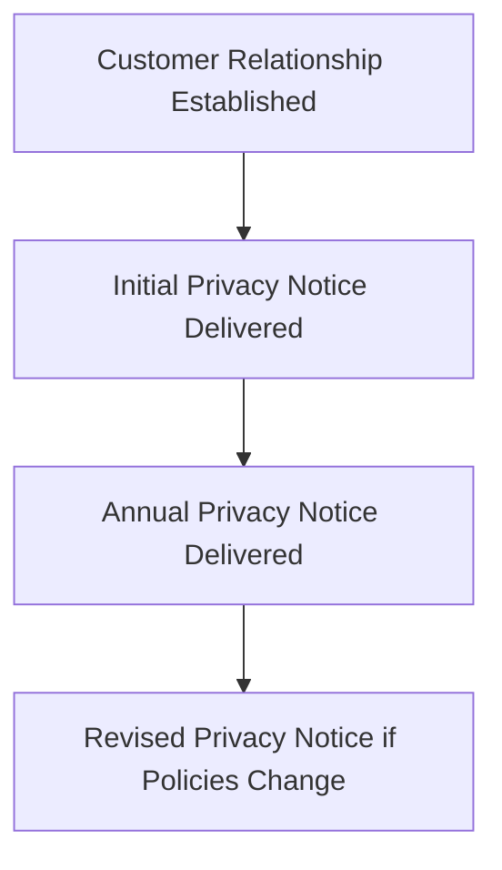

## 3.6.1 Privacy Notices

In the realm of the securities industry, maintaining the privacy of consumer financial information is not just a best practice but a regulatory requirement. Regulation S-P, enforced by the Securities and Exchange Commission (SEC), mandates that financial institutions, including broker-dealers, investment advisers, and investment companies, provide privacy notices to their customers. This section will explore the intricacies of these privacy notices, detailing when they must be delivered, what content they must include, and their significance in protecting consumer privacy.

### Understanding Privacy Notices

A **Privacy Notice** is a formal disclosure statement that informs customers about a firm's privacy practices concerning their personal information. It outlines how the firm collects, uses, shares, and protects customer information, ensuring transparency and compliance with regulatory standards.

### The Requirement for Privacy Notices

Regulation S-P requires financial institutions to provide clear and conspicuous privacy notices to their customers. These notices are essential in helping customers understand how their personal information is handled and in giving them the opportunity to opt out of certain information-sharing practices.

#### When Privacy Notices Must Be Delivered

1. **Initial Notice**: At the beginning of a customer relationship, financial institutions must provide an initial privacy notice. This notice should be delivered at the time the relationship is established, ensuring the customer is informed from the outset.

2. **Annual Notice**: Following the initial notice, firms are required to provide an annual privacy notice. This serves as a reminder of the firm's privacy practices and any updates that may have occurred since the last notice was issued.

3. **Revised Notice**: If there are significant changes to the firm's privacy policies, a revised notice must be sent to customers. This ensures that customers are always aware of how their information is being used and shared.

#### Content of Privacy Notices

The content of privacy notices is governed by Regulation S-P, which specifies the information that must be included to ensure transparency and compliance:

- **Categories of Information Collected**: The notice must describe the types of personal information the firm collects, such as transaction history, account balances, and contact information.

- **Categories of Information Disclosed**: Firms must disclose the types of information they share with non-affiliated third parties, if any, and the purposes for which this information is shared.

- **Customer's Right to Opt-Out**: Customers must be informed of their right to opt out of certain information-sharing practices. The notice should provide clear instructions on how to exercise this right.

- **Security Measures**: A description of the measures the firm takes to protect customer information, ensuring its confidentiality and integrity, must be included.

- **Affiliated and Non-Affiliated Third Parties**: The notice should distinguish between sharing information with affiliated entities (those under the same corporate umbrella) and non-affiliated third parties.

- **Changes to Privacy Policies**: If there are changes to the firm's privacy policies, the notice must explain these changes and their implications for customers.

### Practical Examples and Scenarios

To illustrate the importance of privacy notices, consider a scenario where a customer opens a brokerage account. Upon account opening, the customer receives an initial privacy notice detailing how their information will be used. This notice reassures the customer that their data will be protected and used in accordance with regulatory standards.

Another example involves annual notices. A customer who has had an account for several years receives an annual privacy notice each year, reminding them of their rights and the firm's privacy practices. This consistent communication helps build trust and transparency.

### Real-World Applications and Compliance Considerations

In practice, compliance with privacy notice requirements involves several steps:

1. **Developing the Notice**: Firms must create a comprehensive privacy notice that meets regulatory requirements. This often involves collaboration between legal, compliance, and marketing teams.

2. **Delivering the Notice**: Notices can be delivered in various formats, including paper, electronic, or through a secure online portal. Firms must ensure that delivery methods are compliant with Regulation S-P and accessible to all customers.

3. **Monitoring and Updating**: Firms must regularly review their privacy notices to ensure they remain up-to-date with any changes in privacy practices or regulatory requirements.

4. **Training and Awareness**: Employees must be trained on privacy notice requirements and the importance of protecting customer information. This includes understanding how to handle customer inquiries about privacy practices.

### Diagrams and Visual Aids

To better understand the flow of privacy notice delivery, consider the following diagram illustrating the timeline and process:

### Best Practices and Common Pitfalls

**Best Practices**:
- Ensure clarity and simplicity in privacy notices to enhance customer understanding.
- Regularly update privacy notices to reflect any changes in policies or regulations.
- Provide multiple delivery options to accommodate customer preferences.

**Common Pitfalls**:
- Failing to deliver privacy notices in a timely manner.
- Overly complex language that confuses customers.
- Neglecting to update notices after significant policy changes.

### References and Further Reading

For more detailed information on Regulation S-P and privacy notice requirements, refer to the official [SEC Regulation S-P Final Rule](https://www.sec.gov/rules/final/34-42974.htm). Additionally, reviewing sample privacy notices from reputable financial institutions can provide practical insights into effective compliance.

### Conclusion

Privacy notices are a vital component of consumer protection in the securities industry. By understanding and complying with Regulation S-P requirements, financial institutions can build trust with their customers and ensure the confidentiality of their personal information. As you prepare for the Series 6 Exam, remember the key elements of privacy notices and their role in safeguarding consumer privacy.

---

## Series 6 Exam Practice Questions: Privacy Notices



### What is the primary purpose of a privacy notice under Regulation S-P?

- [x] To inform customers about how their personal information is used and shared
- [ ] To provide investment advice to customers
- [ ] To outline the fees associated with a customer's account
- [ ] To disclose the firm's financial performance

> **Explanation:** The primary purpose of a privacy notice is to inform customers about the firm's privacy practices, including how their personal information is collected, used, and shared.

### When must a financial institution provide an initial privacy notice to a customer?

- [x] At the start of the customer relationship
- [ ] Annually
- [ ] Only if the customer requests it
- [ ] When the customer closes their account

> **Explanation:** An initial privacy notice must be provided at the start of the customer relationship to ensure the customer is aware of the firm's privacy practices from the outset.

### How often must a financial institution provide an annual privacy notice?

- [x] Once a year
- [ ] Every six months
- [ ] Every two years
- [ ] Only when there are changes to the privacy policy

> **Explanation:** Financial institutions are required to provide an annual privacy notice once a year to remind customers of their privacy practices.

### What information must be included in a privacy notice?

- [x] Categories of information collected and shared, and the customer's right to opt-out
- [ ] The firm's annual revenue
- [ ] The number of employees at the firm
- [ ] The firm's stock performance

> **Explanation:** A privacy notice must include categories of information collected and shared, and inform customers of their right to opt-out of certain information-sharing practices.

### What should a customer do if they want to opt-out of certain information-sharing practices?

- [x] Follow the instructions provided in the privacy notice
- [ ] Contact the SEC directly
- [ ] Close their account
- [ ] Ignore the privacy notice

> **Explanation:** Customers should follow the instructions provided in the privacy notice to opt-out of certain information-sharing practices.

### What action must a firm take if there are significant changes to its privacy policies?

- [x] Provide a revised privacy notice to customers
- [ ] Wait until the next annual notice
- [ ] Send a letter to the SEC
- [ ] No action is required

> **Explanation:** If there are significant changes to privacy policies, a firm must provide a revised privacy notice to ensure customers are informed of the changes.

### Which of the following is NOT a required element of a privacy notice?

- [x] The firm's stock price
- [ ] Categories of information collected
- [ ] Customer's right to opt-out
- [ ] Security measures to protect information

> **Explanation:** The firm's stock price is not a required element of a privacy notice. The notice should focus on privacy practices and customer rights.

### What is a common pitfall when drafting privacy notices?

- [x] Using overly complex language
- [ ] Providing too much information
- [ ] Including customer testimonials
- [ ] Offering investment advice

> **Explanation:** A common pitfall is using overly complex language that can confuse customers. Privacy notices should be clear and easy to understand.

### How can a firm ensure compliance with privacy notice delivery?

- [x] By providing multiple delivery options and keeping records of delivery
- [ ] By sending notices only via email
- [ ] By posting notices on the firm's website without notification
- [ ] By delivering notices only upon customer request

> **Explanation:** Firms should provide multiple delivery options and keep records of delivery to ensure compliance with privacy notice requirements.

### What role do privacy notices play in building customer trust?

- [x] They enhance transparency and demonstrate the firm's commitment to protecting customer information
- [ ] They serve as a marketing tool to attract new customers
- [ ] They provide detailed investment strategies
- [ ] They outline the firm's competitive advantages

> **Explanation:** Privacy notices enhance transparency and demonstrate the firm's commitment to protecting customer information, which helps build customer trust.



---
