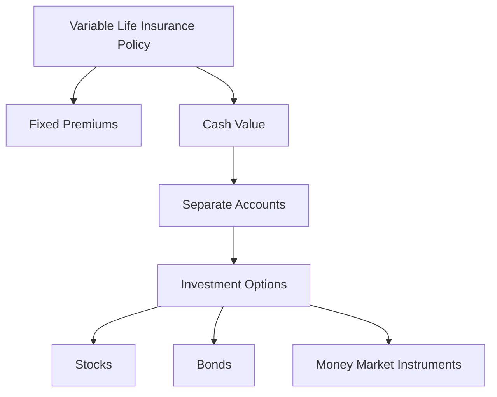

## 4.3.2.1 Policy Structure

Variable life insurance is a unique financial product that combines the benefits of life insurance with investment opportunities. Understanding its structure is crucial for the Series 6 Exam, as it encompasses key concepts in both insurance and investment domains. This comprehensive guide will walk you through the intricacies of variable life insurance, focusing on its policy structure, investment components, and associated risks.

### Understanding Variable Life Insurance

Variable life insurance is a type of permanent life insurance policy that offers both a death benefit and a cash value component. Unlike traditional whole life insurance, the cash value in a variable life insurance policy is invested in separate accounts, similar to mutual funds. This feature allows policyholders to potentially increase the cash value and death benefit based on the performance of the investments.

#### Key Features of Variable Life Insurance

- **Permanent Coverage:** Provides lifelong insurance coverage as long as premiums are paid.
- **Fixed Premiums:** Premium payments remain constant throughout the life of the policy.
- **Investment Options:** The cash value is invested in a selection of separate accounts, offering a range of investment choices.
- **Variable Death Benefit:** The death benefit can fluctuate based on the investment performance of the separate accounts.
- **Investment Risk:** The policyholder bears the investment risk, meaning the cash value and death benefit can increase or decrease.

### Policy Structure Components

#### Premiums

The premiums in a variable life insurance policy are fixed, meaning they do not change over the life of the policy. This fixed nature provides predictability for policyholders in terms of their financial obligations. However, the allocation of these premiums is where the variability comes into play.

#### Cash Value and Separate Accounts

The cash value of a variable life insurance policy is invested in separate accounts. These accounts function similarly to mutual funds, offering a variety of investment options such as stocks, bonds, and money market instruments. The performance of these investments directly impacts the cash value of the policy.

- **Separate Account:** This is where the policy's cash value is invested, separate from the insurer's general account. It offers a range of investment choices, allowing policyholders to tailor their investment strategy according to their risk tolerance and financial goals.

#### Death Benefit

The death benefit in a variable life insurance policy is not fixed. It can vary depending on the performance of the investments in the separate accounts. If the investments perform well, the death benefit can increase. Conversely, poor investment performance can decrease the death benefit, although it will not fall below a guaranteed minimum level.

### Investment Options and Risk

The investment options available in the separate accounts are crucial to the policy's potential growth. These options typically include:

- **Equity Funds:** Focused on stocks, offering higher growth potential but also higher risk.
- **Bond Funds:** Invested in fixed-income securities, providing more stable returns.
- **Balanced Funds:** A mix of stocks and bonds, aiming for moderate growth with balanced risk.
- **Money Market Funds:** Low-risk investments with stable but lower returns.

#### Investment Risk

One of the defining characteristics of variable life insurance is the investment risk borne by the policyholder. The cash value and death benefit can fluctuate based on market conditions and the performance of the chosen investments. This risk is a double-edged sword, offering the potential for significant growth but also the possibility of losses.

### Regulatory Considerations

Variable life insurance policies are subject to regulation by the Securities and Exchange Commission (SEC) due to their investment component. This regulatory oversight ensures transparency and protects policyholders by requiring clear disclosure of fees, investment options, and potential risks.

For more detailed guidance on variable life insurance, refer to the [SEC's guidance on variable life insurance](https://www.sec.gov/investor/pubs/varillin.htm).

### Practical Examples and Case Studies

#### Example 1: Investment Performance Impact

Consider a policyholder who allocates their cash value into a high-performing equity fund. Over time, the fund's value increases significantly, resulting in a higher cash value and death benefit. However, during a market downturn, the fund's value decreases, impacting both the cash value and the death benefit.

#### Example 2: Risk Management

A policyholder with a low risk tolerance might choose to invest primarily in bond funds and money market instruments. While the growth potential is lower, the stability of these investments helps maintain the cash value and death benefit, minimizing the impact of market volatility.

### Best Practices and Common Pitfalls

#### Best Practices

- **Diversification:** Spread investments across multiple funds to reduce risk.
- **Regular Reviews:** Periodically review the investment performance and adjust allocations as needed.
- **Understand Fees:** Be aware of management fees and other charges that can impact the policy's cash value.

#### Common Pitfalls

- **Overconcentration:** Investing too heavily in a single fund can increase risk.
- **Ignoring Market Trends:** Failing to adjust investments based on market conditions can lead to suboptimal performance.
- **Underestimating Risk:** Not fully understanding the investment risk can result in unexpected losses.

### Conclusion

Variable life insurance offers a unique blend of life insurance protection and investment opportunities. By understanding the policy structure, investment options, and associated risks, you can effectively prepare for the Series 6 Exam and provide valuable guidance to clients seeking flexible and potentially rewarding life insurance solutions.

### References and Further Reading

- [SEC's Guidance on Variable Life Insurance](https://www.sec.gov/investor/pubs/varillin.htm)
- FINRA Rules and Regulations
- Investment Company Act of 1940

---

## Series 6 Exam Practice Questions: Policy Structure



### What is a key feature of variable life insurance?

- [x] It offers both a death benefit and investment options.
- [ ] Premiums vary based on market performance.
- [ ] The cash value is guaranteed to increase.
- [ ] The death benefit is fixed and does not change.

> **Explanation:** Variable life insurance combines a death benefit with investment options, allowing the cash value and death benefit to fluctuate based on market performance.

### Where are the premiums of a variable life insurance policy invested?

- [ ] In the insurer's general account.
- [x] In separate accounts similar to mutual funds.
- [ ] In a fixed interest account.
- [ ] In government bonds only.

> **Explanation:** Premiums in a variable life insurance policy are invested in separate accounts, offering a variety of investment options similar to mutual funds.

### Who bears the investment risk in a variable life insurance policy?

- [ ] The insurance company.
- [x] The policyholder.
- [ ] The government.
- [ ] The investment manager.

> **Explanation:** The policyholder bears the investment risk, meaning that the cash value and death benefit can increase or decrease based on investment performance.

### What happens to the death benefit if the investments perform poorly?

- [ ] It remains unchanged.
- [x] It decreases but not below a guaranteed minimum.
- [ ] It increases regardless of performance.
- [ ] It is eliminated.

> **Explanation:** The death benefit can decrease if investments perform poorly, but it will not fall below a guaranteed minimum level.

### Which of the following is NOT a typical investment option in a variable life insurance separate account?

- [ ] Equity funds.
- [ ] Bond funds.
- [ ] Money market funds.
- [x] Real estate properties.

> **Explanation:** Real estate properties are not typically included in the investment options for separate accounts in variable life insurance policies.

### How can policyholders manage risk in a variable life insurance policy?

- [ ] By investing in a single high-risk fund.
- [ ] By ignoring market trends.
- [x] By diversifying investments across multiple funds.
- [ ] By choosing only equity funds.

> **Explanation:** Diversifying investments across multiple funds can help manage risk by reducing exposure to any single investment's poor performance.

### What is the primary regulatory body overseeing variable life insurance policies?

- [ ] The Federal Reserve.
- [x] The Securities and Exchange Commission (SEC).
- [ ] The Department of Treasury.
- [ ] The Internal Revenue Service (IRS).

> **Explanation:** The SEC oversees variable life insurance policies due to their investment component, ensuring transparency and protection for policyholders.

### Which of the following best describes the cash value in a variable life insurance policy?

- [x] It is invested in separate accounts and can fluctuate.
- [ ] It is fixed and does not change.
- [ ] It is guaranteed to increase annually.
- [ ] It is invested in the insurer's general account.

> **Explanation:** The cash value is invested in separate accounts, and its value can fluctuate based on the performance of the chosen investments.

### What is a common pitfall when managing a variable life insurance policy?

- [ ] Regularly reviewing investment performance.
- [ ] Diversifying investments.
- [x] Overconcentration in a single fund.
- [ ] Understanding management fees.

> **Explanation:** Overconcentration in a single fund increases risk and can lead to significant losses if that fund performs poorly.

### Why is it important to understand the fees associated with variable life insurance?

- [ ] Because they are negligible and rarely impact the policy.
- [x] Because they can significantly reduce the cash value over time.
- [ ] Because they are fixed and do not change.
- [ ] Because they are only charged upon policy surrender.

> **Explanation:** Understanding fees is crucial as they can significantly impact the cash value over time, affecting the overall performance of the policy.



---
