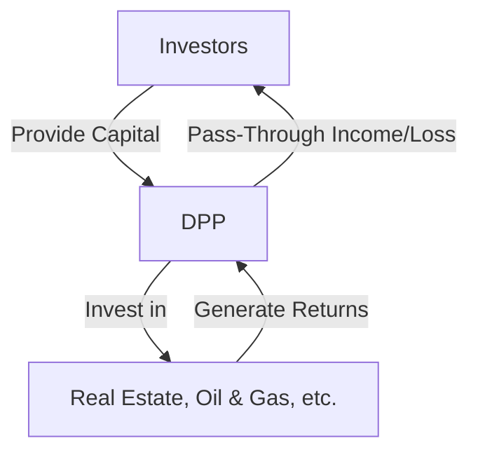

## 4.4.3 Direct Participation Programs (DPPs)

Direct Participation Programs (DPPs) represent a unique category of investment vehicles that allow investors to participate directly in the cash flows and tax benefits of a business venture. These programs are typically structured as limited partnerships or limited liability companies and are designed to pass income, gains, losses, deductions, and credits directly to investors. This section will cover the essential aspects of DPPs, including their structure, benefits, risks, and suitability considerations, providing you with the knowledge needed to master this topic for the Series 6 Exam.

### Understanding Direct Participation Programs (DPPs)

**Definition and Structure**

A Direct Participation Program (DPP) is a pooled investment program that offers investors access to various business ventures, such as real estate partnerships, oil and gas exploration, and equipment leasing. Unlike traditional securities, DPPs are not publicly traded, which means they do not have a readily available secondary market. This structure allows investors to participate directly in the profits and losses of the underlying business activities.

**Key Characteristics**

- **Pass-Through Taxation:** DPPs are structured to provide pass-through taxation, meaning the income, losses, deductions, and credits are passed directly to the investors, avoiding the double taxation typically associated with corporations.
- **Limited Liability:** Investors in DPPs are usually limited partners, meaning their liability is limited to the amount of their investment. This structure protects them from personal liability for the program's debts and obligations.
- **Illiquidity:** Due to the lack of a secondary market, DPPs are considered illiquid investments. Investors must be prepared for a long-term commitment, as it may be challenging to sell their interest before the program concludes.

### Tax Benefits of DPPs

One of the primary attractions of DPPs is their potential tax benefits. These programs can offer significant tax advantages, including:

- **Pass-Through of Losses:** Investors can deduct their share of the program's losses against other passive income, potentially reducing their overall tax liability.
- **Depreciation Deductions:** Many DPPs, especially those involving real estate or equipment leasing, allow investors to claim depreciation deductions, further reducing taxable income.
- **Tax Credits:** Certain DPPs, such as those involved in energy exploration, may offer tax credits that can directly reduce an investor's tax bill.

### Risks and Challenges of DPPs

While DPPs offer attractive tax benefits, they also come with significant risks and challenges:

- **Illiquidity:** As previously mentioned, DPPs often lack a secondary market, making them difficult to sell. Investors should be prepared to hold their investment for the program's entire duration.
- **Capital Risk:** There is a risk of losing the entire investment if the underlying business venture fails. Investors must be comfortable with the potential for loss.
- **Complex Tax Considerations:** The tax benefits of DPPs come with complex tax reporting requirements. Investors must be diligent in understanding and complying with these obligations.
- **Regulatory Risks:** DPPs are subject to regulatory scrutiny, and changes in tax laws or regulations could impact their benefits.

### Suitability Assessments for DPPs

Given their complexity and risk profile, DPPs are not suitable for all investors. It is crucial to conduct a thorough suitability assessment to ensure that these investments align with an investor's goals, risk tolerance, and financial situation. Key considerations include:

- **Investment Objectives:** DPPs are typically suitable for investors seeking tax benefits and willing to accept higher risk and illiquidity in exchange for potential returns.
- **Risk Tolerance:** Investors must be comfortable with the potential for loss and the long-term commitment required by DPPs.
- **Financial Situation:** Investors should have sufficient financial resources to withstand potential losses and the inability to access their investment for an extended period.

### Practical Examples and Case Studies

**Real Estate Limited Partnerships**

Real estate limited partnerships (RELPs) are a common type of DPP that invests in commercial or residential properties. Investors benefit from rental income, property appreciation, and tax deductions related to depreciation and interest expenses. However, they must also be prepared for potential risks, such as property market fluctuations and management challenges.

**Oil and Gas Partnerships**

Oil and gas partnerships allow investors to participate in the exploration and production of energy resources. These DPPs can offer substantial tax benefits, including intangible drilling cost deductions and depletion allowances. However, they also carry significant risks, such as volatile commodity prices and environmental regulations.

### Regulatory Considerations

DPPs are subject to regulatory oversight to protect investors. Key regulatory considerations include:

- **Securities Registration:** DPPs must comply with securities registration requirements unless they qualify for an exemption. This ensures transparency and investor protection.
- **FINRA Rules:** The Financial Industry Regulatory Authority (FINRA) provides guidelines for the sale and marketing of DPPs to ensure that investors receive adequate disclosures and that the investments are suitable for their needs.
- **Due Diligence:** Broker-dealers offering DPPs must conduct thorough due diligence to ensure the program's legitimacy and alignment with investors' interests.

### Real-World Applications and Compliance

Investors considering DPPs should be aware of the real-world applications and compliance requirements associated with these investments. For example, they should understand the implications of tax reform on DPP benefits and the importance of accurate tax reporting. Additionally, investors should work with knowledgeable financial advisors and tax professionals to navigate the complexities of DPP investments.

### Diagrams and Visual Aids

To enhance understanding, consider the following diagram illustrating the structure of a typical DPP:

### Best Practices and Common Pitfalls

**Best Practices:**

- Conduct thorough research and due diligence before investing in a DPP.
- Work with experienced financial advisors and tax professionals to understand the risks and benefits.
- Ensure that the DPP aligns with your investment goals and risk tolerance.

**Common Pitfalls:**

- Underestimating the illiquidity and long-term commitment required by DPPs.
- Failing to understand the complex tax implications and reporting requirements.
- Investing in DPPs without a comprehensive suitability assessment.

### References and Additional Resources

For further information on DPPs, consider reviewing [FINRA's investor alerts on DPPs](https://www.finra.org/investors/alerts/direct-participation-programs-real-estate-investments) and conducting due diligence on specific programs.

### Summary

Direct Participation Programs (DPPs) offer unique investment opportunities with potential tax benefits and direct involvement in business ventures. However, they also come with significant risks and challenges, making them suitable only for certain investors. By understanding the structure, benefits, risks, and regulatory considerations of DPPs, you can make informed decisions and effectively prepare for the Series 6 Exam.

## Series 6 Exam Practice Questions: Direct Participation Programs (DPPs)



### What is a key feature of Direct Participation Programs (DPPs)?

- [x] Pass-through taxation
- [ ] Guaranteed liquidity
- [ ] Fixed income returns
- [ ] Short-term investment horizon

> **Explanation:** DPPs are characterized by pass-through taxation, allowing income and losses to flow directly to investors, avoiding double taxation.

### Which of the following is a common type of DPP?

- [ ] Mutual fund
- [x] Real estate limited partnership
- [ ] Exchange-traded fund (ETF)
- [ ] Money market fund

> **Explanation:** Real estate limited partnerships are a common type of DPP, providing direct participation in real estate investments.

### What is a primary risk associated with investing in DPPs?

- [ ] High liquidity
- [ ] Guaranteed returns
- [x] Illiquidity
- [ ] Low tax benefits

> **Explanation:** DPPs are often illiquid, lacking a secondary market, and require a long-term commitment from investors.

### How do DPPs typically provide tax benefits to investors?

- [ ] By offering tax-free income
- [x] Through pass-through of losses and deductions
- [ ] By deferring taxes indefinitely
- [ ] By eliminating capital gains taxes

> **Explanation:** DPPs provide tax benefits by passing through losses and deductions, which investors can use to offset other taxable income.

### What is a suitability consideration for investing in DPPs?

- [x] Investor's risk tolerance and financial situation
- [ ] Investor's desire for short-term gains
- [ ] Investor's preference for high liquidity
- [ ] Investor's need for guaranteed income

> **Explanation:** Suitability assessments for DPPs should consider the investor's risk tolerance, financial situation, and willingness to accept illiquidity.

### Which regulatory body provides guidelines for the sale of DPPs?

- [ ] SEC
- [x] FINRA
- [ ] CFTC
- [ ] FDIC

> **Explanation:** FINRA provides guidelines for the sale and marketing of DPPs to ensure adequate disclosures and suitability for investors.

### What type of tax advantage might an oil and gas DPP offer?

- [ ] Tax-free dividends
- [x] Intangible drilling cost deductions
- [ ] Tax-free capital gains
- [ ] Exemption from estate taxes

> **Explanation:** Oil and gas DPPs may offer intangible drilling cost deductions, providing tax advantages to investors.

### Why is due diligence important when investing in DPPs?

- [ ] To guarantee high returns
- [x] To ensure the program's legitimacy and alignment with investor goals
- [ ] To avoid paying taxes
- [ ] To eliminate investment risk

> **Explanation:** Due diligence is crucial to verify the legitimacy of a DPP and ensure it aligns with the investor's goals and risk tolerance.

### What is a potential benefit of investing in a real estate DPP?

- [ ] Guaranteed property appreciation
- [x] Depreciation deductions
- [ ] High liquidity
- [ ] Fixed interest income

> **Explanation:** Real estate DPPs may offer depreciation deductions, reducing taxable income for investors.

### Which of the following best describes the liquidity of DPPs?

- [ ] Highly liquid with a robust secondary market
- [ ] Moderately liquid with some trading options
- [x] Illiquid with limited secondary market access
- [ ] Liquid with daily trading opportunities

> **Explanation:** DPPs are generally illiquid, lacking a secondary market, and require a long-term investment commitment.



By understanding the intricacies of Direct Participation Programs, you can confidently approach this topic on the Series 6 Exam and apply this knowledge in your professional practice.
