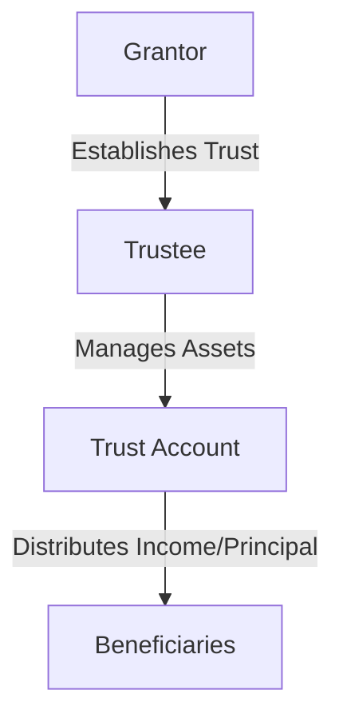

## 6.1.5 Trust Accounts

Trust accounts are a pivotal component of financial and estate planning, serving as a mechanism for managing and protecting assets on behalf of beneficiaries. As you prepare for the Series 6 Exam, understanding the intricacies of trust accounts is essential, as they are frequently encountered in the securities industry. This section will provide a comprehensive overview of trust accounts, including their types, the role and responsibilities of trustees, and the regulatory framework governing them.

### Understanding Trust Accounts

A trust account is a fiduciary arrangement where a trustee holds and manages assets for the benefit of one or more beneficiaries. Trust accounts are established through a legal document known as a trust deed or trust agreement, which outlines the terms and conditions under which the trust operates. The trustee, who can be an individual or an institution, is responsible for managing the trust's assets in accordance with the trust's terms and the best interests of the beneficiaries.

### Types of Trusts

Trusts can be categorized into several types, each serving different purposes and having distinct legal and tax implications. Here, we will explore some of the most common types of trusts:

#### Revocable Trusts

- **Definition:** A revocable trust, also known as a living trust, can be altered or terminated by the grantor during their lifetime. The grantor retains control over the trust assets and can make changes as needed.
- **Benefits:** Revocable trusts offer flexibility and can help avoid probate, ensuring a smoother transition of assets upon the grantor's death.
- **Limitations:** Since the grantor retains control, the assets in a revocable trust are considered part of the grantor's estate for tax purposes.

#### Irrevocable Trusts

- **Definition:** Once established, an irrevocable trust cannot be modified or terminated without the consent of the beneficiaries. The grantor relinquishes control over the trust assets.
- **Benefits:** Irrevocable trusts can provide significant tax advantages, as the assets are removed from the grantor's taxable estate. They also offer protection from creditors.
- **Limitations:** The lack of flexibility is a major drawback, as the grantor cannot make changes once the trust is established.

#### Testamentary Trusts

- **Definition:** These trusts are created through a will and become effective upon the grantor's death. They are often used to manage assets for minor children or other dependents.
- **Benefits:** Testamentary trusts allow for the control of asset distribution after death, ensuring that beneficiaries receive assets according to the grantor's wishes.
- **Limitations:** Since they are established through a will, testamentary trusts must go through probate, which can be time-consuming and costly.

#### Special Needs Trusts

- **Definition:** Designed to provide for individuals with disabilities without affecting their eligibility for government benefits.
- **Benefits:** These trusts ensure that beneficiaries receive financial support while maintaining access to essential government assistance programs.
- **Limitations:** Must be carefully structured to comply with legal requirements and avoid disqualifying the beneficiary from benefits.

#### Charitable Trusts

- **Definition:** Established to benefit a charitable organization or purpose, these trusts can be structured as either charitable remainder trusts or charitable lead trusts.
- **Benefits:** Charitable trusts offer tax benefits and allow the grantor to support charitable causes.
- **Limitations:** Must comply with specific legal requirements to qualify for tax benefits.

### Trust Documents and Trustee Responsibilities

The establishment and operation of a trust account require detailed documentation. The trust document, or trust agreement, is the foundational legal instrument that specifies the terms of the trust, including:

- **Trustee Powers and Limitations:** The document outlines the trustee's authority to manage and invest trust assets, make distributions to beneficiaries, and perform other fiduciary duties.
- **Beneficiary Rights:** Specifies the rights of the beneficiaries, including their entitlement to trust income or principal.
- **Trust Purpose and Duration:** Defines the trust's purpose and the conditions under which it will terminate.

### Fiduciary Duty of the Trustee

Trustees have a fiduciary duty to act in the best interests of the beneficiaries. This duty encompasses several key responsibilities:

- **Duty of Loyalty:** The trustee must prioritize the interests of the beneficiaries above their own and avoid conflicts of interest.
- **Duty of Care:** The trustee is required to manage trust assets prudently, making informed decisions and exercising due diligence.
- **Duty to Inform:** Trustees must keep beneficiaries informed about the trust's status and provide regular accountings of trust activities.
- **Duty to Diversify:** Trustees should diversify trust investments to mitigate risk unless the trust document specifies otherwise.

### Regulatory Compliance and Best Practices

Trust accounts are subject to regulatory oversight to ensure that trustees fulfill their fiduciary duties. Key regulatory considerations include:

- **FINRA Guidance:** FINRA Rule 3250 provides guidance on the handling of trust accounts, emphasizing the need for proper documentation and adherence to fiduciary responsibilities.
- **Estate Planning Resources:** Trustees should be familiar with estate planning principles and consult with legal and tax professionals to ensure compliance with applicable laws.

### Practical Examples and Scenarios

To illustrate the application of trust account principles, consider the following scenarios:

- **Scenario 1:** A grantor establishes a revocable trust to manage their assets during their lifetime and ensure a seamless transfer to their heirs upon death. The trustee is responsible for managing the trust assets, making investment decisions, and distributing income to the grantor.
- **Scenario 2:** An irrevocable trust is created to provide for a minor child. The trustee must manage the trust assets prudently, ensuring that funds are available for the child's education and other needs.
- **Scenario 3:** A charitable remainder trust is established, allowing the grantor to receive income for a specified period, after which the remaining assets are donated to a designated charity. The trustee must balance the grantor's income needs with the long-term goal of supporting the charity.

### Diagrams and Visual Aids

To better understand the structure and operation of trust accounts, consider the following diagram illustrating the relationship between the grantor, trustee, and beneficiaries in a typical trust arrangement:

### Common Pitfalls and Exam Tips

When dealing with trust accounts, be aware of common pitfalls such as:

- **Failing to Understand Trust Terms:** Ensure you thoroughly understand the trust document and adhere to its terms.
- **Neglecting Fiduciary Duties:** Always act in the best interests of the beneficiaries and avoid conflicts of interest.
- **Overlooking Regulatory Requirements:** Stay informed about relevant regulations and seek professional guidance when necessary.

For the Series 6 Exam, focus on understanding the different types of trusts, the role and responsibilities of trustees, and the regulatory framework governing trust accounts. Use mnemonic devices to remember key concepts, such as the fiduciary duties of trustees.

### Summary

Trust accounts play a crucial role in asset management and estate planning, offering a flexible and effective way to manage and protect assets for beneficiaries. As a securities professional, understanding the types of trusts, the responsibilities of trustees, and the regulatory environment is essential for providing sound advice and ensuring compliance with legal requirements.

By mastering the concepts outlined in this guide, you will be well-prepared to tackle trust account-related questions on the Series 6 Exam and apply this knowledge in your professional practice.

## Series 6 Exam Practice Questions: Trust Accounts



### What is the primary role of a trustee in a trust account?

- [x] To manage trust assets for the benefit of the beneficiaries
- [ ] To provide legal advice to the grantor
- [ ] To serve as a beneficiary of the trust
- [ ] To ensure the trust complies with tax laws

> **Explanation:** The primary role of a trustee is to manage trust assets for the benefit of the beneficiaries, adhering to the terms of the trust and fulfilling fiduciary duties.

### Which type of trust allows the grantor to retain control and make changes during their lifetime?

- [ ] Irrevocable Trust
- [x] Revocable Trust
- [ ] Testamentary Trust
- [ ] Charitable Trust

> **Explanation:** A revocable trust allows the grantor to retain control over the trust assets and make changes during their lifetime.

### What is a key benefit of an irrevocable trust?

- [ ] Flexibility to change terms
- [x] Removal of assets from the grantor's taxable estate
- [ ] Avoidance of probate
- [ ] Ability to manage assets during the grantor's lifetime

> **Explanation:** A key benefit of an irrevocable trust is that it removes assets from the grantor's taxable estate, providing potential tax advantages.

### What is the purpose of a special needs trust?

- [ ] To avoid probate
- [ ] To provide income to a charity
- [x] To provide for individuals with disabilities without affecting their eligibility for government benefits
- [ ] To manage assets for minor children

> **Explanation:** A special needs trust is designed to provide for individuals with disabilities without affecting their eligibility for government benefits.

### What is a testamentary trust?

- [x] A trust created through a will that becomes effective upon the grantor's death
- [ ] A trust that can be altered during the grantor's lifetime
- [ ] A trust established for charitable purposes
- [ ] A trust that provides for individuals with disabilities

> **Explanation:** A testamentary trust is created through a will and becomes effective upon the grantor's death, often used to manage assets for minor children or dependents.

### What is a fiduciary duty?

- [ ] A legal obligation to pay taxes
- [x] A legal obligation to act in the best interests of the beneficiaries
- [ ] A requirement to diversify investments
- [ ] A responsibility to provide financial advice

> **Explanation:** A fiduciary duty is a legal obligation for trustees to act in the best interests of the beneficiaries, prioritizing their needs and avoiding conflicts of interest.

### Which document outlines the terms and conditions of a trust?

- [ ] Will
- [ ] Power of Attorney
- [x] Trust Agreement
- [ ] Beneficiary Designation

> **Explanation:** The trust agreement is the legal document that outlines the terms and conditions of a trust, including the trustee's powers and limitations.

### What is the duty of loyalty in the context of a trust?

- [ ] The obligation to maximize trust profits
- [x] The obligation to prioritize the interests of the beneficiaries above the trustee's own interests
- [ ] The requirement to diversify trust investments
- [ ] The duty to provide regular accountings

> **Explanation:** The duty of loyalty requires trustees to prioritize the interests of the beneficiaries above their own, avoiding conflicts of interest.

### What is a charitable remainder trust?

- [ ] A trust that provides for individuals with disabilities
- [ ] A trust that can be altered during the grantor's lifetime
- [x] A trust that allows the grantor to receive income for a period before donating the remaining assets to a charity
- [ ] A trust created through a will

> **Explanation:** A charitable remainder trust allows the grantor to receive income for a specified period, after which the remaining assets are donated to a designated charity.

### What is the primary regulatory body providing guidance on trust accounts in the securities industry?

- [ ] IRS
- [ ] SEC
- [x] FINRA
- [ ] MSRB

> **Explanation:** FINRA provides guidance on trust accounts in the securities industry, including rules and regulations that trustees must adhere to.



By engaging with these practice questions, you can reinforce your understanding of trust accounts and better prepare for the Series 6 Exam.
