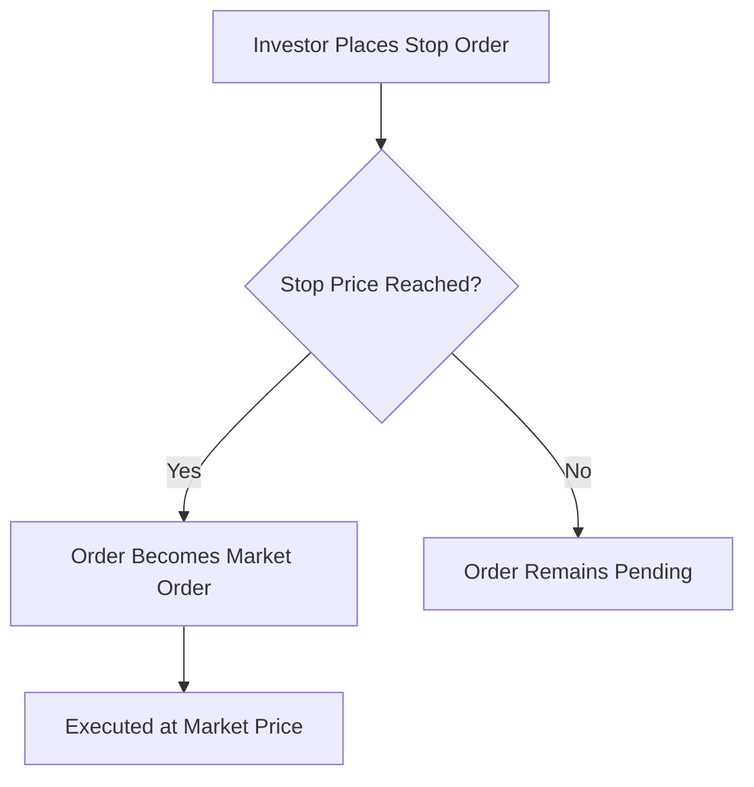

## 8.1.3 Stop Orders

In the world of securities trading, understanding the various types of orders is crucial for both investors and financial professionals. Stop orders, including stop-loss orders, play a significant role in managing risk and executing trading strategies. This section will provide a comprehensive overview of stop orders, their applications, potential risks, and regulatory considerations, equipping you with the knowledge needed for the Series 6 Exam and practical application in the securities industry.

### Definition and Functionality of Stop Orders

A **stop order** is a type of order to buy or sell a security once the price of the security reaches a specified level, known as the stop price. When the stop price is reached, the stop order becomes a market order, which is executed at the best available price in the market. This mechanism allows investors to set predetermined price points at which they are willing to buy or sell a security, providing a level of automation and discipline in trading strategies.

#### Types of Stop Orders

1. **Stop-Loss Order**: Primarily used to limit potential losses on a security position. For example, if an investor holds a stock currently trading at $50 and wants to limit losses to 10%, they might place a stop-loss order at $45. If the stock price falls to $45, the stop-loss order is triggered, converting to a market order to sell the stock.

2. **Buy Stop Order**: Used to purchase a security once its price reaches a specified level above the current market price. This is often employed in short selling to limit losses or protect profits. For instance, if a stock is trading at $30, and an investor anticipates a price increase, they might place a buy stop order at $35. If the stock reaches $35, the order is triggered, and the stock is purchased at the market price.

3. **Sell Stop Order**: Similar to a stop-loss order but used to sell a security. It is placed below the current market price and is triggered when the market price falls to the stop price.

### Practical Applications of Stop Orders

Stop orders are versatile tools used in various trading strategies:

- **Risk Management**: Stop-loss orders are a common risk management tool, helping investors limit potential losses on their investments. By setting a stop price, investors can ensure that their losses are capped at a predetermined level, preventing emotional decision-making during volatile market conditions.

- **Profit Protection**: Investors can use stop orders to lock in profits by setting a stop price at a level that preserves gains. For example, if a stock has risen from $50 to $70, an investor might set a stop order at $65 to protect profits should the stock price decline.

- **Entry and Exit Strategies**: Stop orders can be used to enter or exit positions at specific price levels, aligning with technical analysis strategies. Traders often place stop orders based on support and resistance levels identified through chart patterns.

### Potential Risks and Considerations

While stop orders offer significant benefits, they also come with inherent risks:

- **Rapid Price Movements**: In fast-moving markets, the stop price may be reached, but the actual execution price can be significantly different due to market volatility. This is known as slippage and can result in trades being executed at prices far from the intended stop price.

- **Gaps in Trading**: If a security opens at a significantly different price than the previous close (a gap), a stop order may be triggered at an unfavorable price. This is particularly common in stocks that experience significant news events or earnings announcements.

- **Market Order Conversion**: Once a stop order is triggered, it becomes a market order, which means the execution price is not guaranteed. This can be problematic in illiquid markets where the bid-ask spread is wide.

### Regulatory Guidance and Compliance

The U.S. Securities and Exchange Commission (SEC) provides guidance on the use of stop orders, emphasizing the importance of understanding their mechanics and potential risks. According to the [SEC guidance](https://www.sec.gov/fast-answers/answersstopordhtm.html), investors should be aware that stop orders do not guarantee execution at the stop price, and market conditions can affect the final execution price.

#### Key Points from SEC Guidance:

- **Execution Price Uncertainty**: The SEC highlights that stop orders, once triggered, become market orders and are subject to the prevailing market conditions, which can lead to execution prices that differ from the stop price.

- **Market Volatility**: Investors should consider the potential impact of market volatility on stop orders, as rapid price changes can lead to executions at unexpected prices.

- **Order Type Suitability**: The SEC advises investors to assess whether stop orders are appropriate for their investment strategy and risk tolerance, considering the potential for slippage and market gaps.

### Best Practices for Using Stop Orders

To effectively utilize stop orders, consider the following best practices:

- **Set Realistic Stop Prices**: Avoid placing stop prices too close to the current market price, as minor fluctuations can trigger the order prematurely. Consider historical price movements and volatility when setting stop prices.

- **Monitor Market Conditions**: Stay informed about market news and events that could impact the securities you hold. Adjust stop orders as necessary to align with changing market conditions.

- **Use Limit Orders**: Consider using stop-limit orders, which combine the features of stop orders and limit orders. A stop-limit order becomes a limit order once the stop price is reached, providing more control over the execution price.

- **Regularly Review Orders**: Periodically review and adjust stop orders to ensure they remain aligned with your investment goals and market conditions.

### Common Pitfalls and Challenges

Investors should be aware of common pitfalls associated with stop orders:

- **Over-Reliance on Automation**: Relying solely on stop orders without actively monitoring the market can lead to missed opportunities or unexpected losses. It's essential to stay engaged with your investments and adjust strategies as needed.

- **Emotional Reactions**: Stop orders can help mitigate emotional reactions to market fluctuations, but they should be part of a broader risk management strategy that includes diversification and asset allocation.

- **Inappropriate Stop Levels**: Setting stop levels without considering the security's volatility and market conditions can lead to frequent and unnecessary trades, increasing transaction costs.

### Real-World Scenarios and Examples

To illustrate the application of stop orders, consider the following scenarios:

- **Scenario 1: Protecting Against Losses**: An investor holds shares of a technology company trading at $100. Concerned about potential market downturns, they place a stop-loss order at $90. If the stock price falls to $90, the order is triggered, and the shares are sold, limiting the investor's loss to 10%.

- **Scenario 2: Locking in Profits**: A trader buys shares of a pharmaceutical company at $50, and the stock rises to $75. To protect gains, the trader sets a stop order at $70. If the stock price declines to $70, the order is triggered, securing a profit of $20 per share.

- **Scenario 3: Entering a Position**: An investor anticipates a breakout in a stock currently trading at $40. They place a buy stop order at $45. If the stock price reaches $45, the order is triggered, and the investor enters the position at the market price.

### Diagrams and Visual Aids

To enhance understanding, consider the following diagram illustrating the process of a stop order:

This diagram shows the decision flow of a stop order, highlighting the transition from a stop order to a market order upon reaching the stop price.

### Summary

Stop orders are valuable tools in securities trading, offering a mechanism for risk management and strategic entry or exit from positions. Understanding their functionality, benefits, and risks is essential for effective use. By incorporating stop orders into a broader investment strategy, investors can enhance their ability to manage risk and achieve their financial objectives.

### References and Further Reading

- [SEC Guidance on Stop Orders](https://www.sec.gov/fast-answers/answersstopordhtm.html)
- FINRA Rules and Regulations on Order Types
- Investment Strategies and Risk Management Techniques

---

## Series 6 Exam Practice Questions: Stop Orders



### What is the primary purpose of a stop-loss order?

- [x] To limit potential losses on a security position
- [ ] To maximize profits on a security position
- [ ] To guarantee execution at a specific price
- [ ] To execute a trade immediately at the current market price

> **Explanation:** A stop-loss order is designed to limit potential losses by triggering a sale once the security's price falls to a predetermined level.

### How does a stop order become a market order?

- [ ] When the market opens
- [ ] When the investor decides to execute it
- [x] When the specified stop price is reached
- [ ] When the stock price exceeds the stop price

> **Explanation:** A stop order becomes a market order once the specified stop price is reached, allowing it to be executed at the best available market price.

### What is a potential risk of using stop orders?

- [ ] Guaranteed execution at the stop price
- [ ] Increased trading fees
- [x] Execution at an unfavorable price due to market volatility
- [ ] Lack of automation in trading

> **Explanation:** Stop orders can be executed at unfavorable prices due to rapid market movements, leading to slippage.

### Which order type is used to buy a security once its price rises to a specified level?

- [ ] Sell stop order
- [x] Buy stop order
- [ ] Limit order
- [ ] Market order

> **Explanation:** A buy stop order is used to purchase a security once its price reaches a specified level above the current market price.

### What is the effect of a market gap on a stop order?

- [x] It can cause the order to be executed at a price significantly different from the stop price
- [ ] It ensures execution at the stop price
- [ ] It cancels the stop order
- [ ] It has no effect on the stop order

> **Explanation:** Market gaps can lead to stop orders being executed at prices significantly different from the stop price due to the absence of trading at the stop price.

### Why might an investor use a stop-limit order?

- [ ] To ensure execution at any price
- [x] To have more control over the execution price
- [ ] To avoid all trading fees
- [ ] To execute trades only during market hours

> **Explanation:** A stop-limit order provides more control over the execution price by converting to a limit order once the stop price is reached.

### What is a common pitfall of setting stop prices too close to the current market price?

- [ ] It guarantees execution at the stop price
- [x] It can lead to frequent and unnecessary trades
- [ ] It eliminates all trading risks
- [ ] It increases the potential for profit

> **Explanation:** Setting stop prices too close to the current market price can result in frequent triggering of the stop order due to minor price fluctuations, leading to unnecessary trades.

### How can stop orders help mitigate emotional reactions in trading?

- [ ] By guaranteeing profits
- [ ] By eliminating all risks
- [x] By automating the execution of trades at predetermined price levels
- [ ] By allowing unlimited trading flexibility

> **Explanation:** Stop orders help mitigate emotional reactions by automating the execution of trades at predetermined price levels, reducing the need for emotional decision-making.

### What is the SEC's stance on the execution price of stop orders?

- [ ] The execution price is always the stop price
- [ ] The execution price is predetermined
- [x] The execution price is subject to market conditions and may differ from the stop price
- [ ] The execution price is guaranteed by the SEC

> **Explanation:** The SEC states that the execution price of stop orders is subject to market conditions and may differ from the stop price due to volatility and liquidity factors.

### In which scenario would a stop order be most beneficial?

- [ ] When expecting a stable market
- [x] When seeking to limit losses during volatile market conditions
- [ ] When trading in a highly liquid market
- [ ] When aiming for long-term investments

> **Explanation:** Stop orders are most beneficial in limiting losses during volatile market conditions by automating the sale of securities at predetermined price levels.



---
