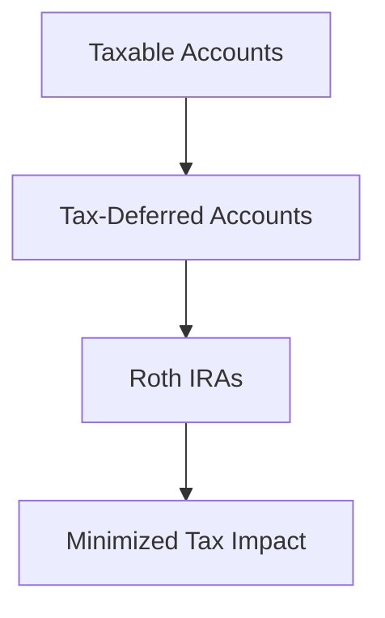

## 9.5.2 Taxation of Distributions

Understanding the taxation of distributions from various investment accounts is crucial for effective retirement planning and investment management. This section will guide you through the tax implications of distributions from Traditional IRAs, Roth IRAs, and taxable investment accounts. We will also explore strategies for tax diversification, withdrawal sequencing, and minimizing tax liabilities to optimize your financial outcomes.

### Taxation of Distributions from Different Accounts

#### Traditional IRAs

Distributions from Traditional IRAs are generally subject to ordinary income tax. Contributions to Traditional IRAs are typically made with pre-tax dollars, meaning taxes are deferred until withdrawal. Here’s how it works:

- **Ordinary Income Tax:** Withdrawals from Traditional IRAs are taxed as ordinary income. The amount withdrawn is added to your taxable income for the year, potentially affecting your tax bracket.
- **Required Minimum Distributions (RMDs):** Starting at age 73, account holders must begin taking RMDs, which are also taxed as ordinary income. Failing to take RMDs can result in significant penalties.

#### Roth IRAs

Roth IRAs offer a different tax treatment:

- **Tax-Free Qualified Distributions:** Contributions to Roth IRAs are made with after-tax dollars, so qualified distributions are tax-free. To be qualified, the account must be at least five years old, and the distribution must occur after age 59½, due to death, disability, or for a first-time home purchase (up to $10,000).
- **No RMDs:** Roth IRAs do not require RMDs during the account holder’s lifetime, allowing for potential tax-free growth over a longer period.

#### Taxable Investment Accounts

Distributions from taxable investment accounts are taxed based on the type of income:

- **Interest Income:** Taxed as ordinary income.
- **Dividends:** Qualified dividends are taxed at the capital gains rate, while non-qualified dividends are taxed as ordinary income.
- **Capital Gains:** Realized capital gains are taxed based on how long the investment was held. Short-term gains (held for one year or less) are taxed as ordinary income, while long-term gains benefit from lower capital gains tax rates.

### Tax Diversification

Tax diversification involves spreading investments across accounts with different tax treatments to manage tax liabilities effectively. This strategy provides flexibility in retirement by allowing you to choose the most tax-efficient withdrawal strategy based on your current tax situation.

- **Benefits of Tax Diversification:**
  - **Flexibility in Withdrawals:** Having a mix of taxable, tax-deferred, and tax-free accounts allows you to tailor withdrawals to minimize taxes.
  - **Risk Management:** Reduces the risk of tax rate changes affecting your entire portfolio.
  - **Optimized Asset Allocation:** Different accounts can hold different types of investments, optimizing growth potential and tax efficiency.

### Strategies for Minimizing Taxes

#### Strategic Withdrawal Sequencing

Withdrawal sequencing refers to the order in which you withdraw funds from various accounts to minimize taxes. Here’s a common approach:

1. **Taxable Accounts First:** Withdraw from taxable accounts first to take advantage of lower capital gains rates and preserve tax-advantaged growth in retirement accounts.
2. **Tax-Deferred Accounts Next:** Use Traditional IRAs and 401(k)s after taxable accounts, paying attention to RMD requirements.
3. **Roth IRAs Last:** Withdraw from Roth IRAs last to maximize tax-free growth and preserve flexibility.

#### Roth Conversions

Converting Traditional IRA funds to a Roth IRA can be a strategic move for tax planning:

- **Tax Implications:** Conversions are taxable events, but future qualified withdrawals from the Roth IRA are tax-free.
- **Timing Considerations:** Consider conversions in years with lower income to minimize tax impact.
- **Long-Term Benefits:** Roth conversions can reduce future RMDs and provide tax-free income in retirement.

### Monitoring Tax Brackets

It’s essential to monitor your tax brackets when planning distributions. Large withdrawals can push you into a higher tax bracket, increasing your overall tax liability. Consider these strategies:

- **Spread Withdrawals Over Multiple Years:** Instead of taking large lump-sum distributions, spread them over several years to stay within a lower tax bracket.
- **Use Tax-Loss Harvesting:** Offset gains with losses in taxable accounts to reduce taxable income.
- **Coordinate with Other Income Sources:** Plan distributions considering other income sources, such as Social Security, pensions, or rental income.

### Practical Examples and Scenarios

**Case Study: Managing RMDs and Tax Brackets**

Imagine a retiree, Alex, who has both a Traditional IRA and a Roth IRA. Alex is 74 and must take RMDs from their Traditional IRA. By calculating the RMD and considering their other income sources, Alex can strategically withdraw additional funds from their Roth IRA to meet living expenses without increasing their tax bracket.

**Scenario: Roth Conversion Timing**

Consider Jamie, who anticipates a year with lower income due to a sabbatical. Jamie decides to convert a portion of their Traditional IRA to a Roth IRA during this low-income year, minimizing the tax impact of the conversion and setting up for tax-free withdrawals in the future.

### Diagrams and Visual Aids

To enhance understanding, the following diagram illustrates the concept of withdrawal sequencing:

This flowchart shows the recommended order of withdrawals to optimize tax efficiency.

### References and Resources

- **IRS Tax Brackets:** [IRS Tax Brackets for 2023](https://www.irs.gov/newsroom/irs-provides-tax-inflation-adjustments-for-tax-year-2023)
- **Tax Planning Resources:** Consider consulting with a tax advisor or using tax planning software to model different withdrawal scenarios and their tax implications.

### Summary

Understanding the taxation of distributions and employing strategies like tax diversification and withdrawal sequencing can significantly impact your financial well-being in retirement. By planning carefully and staying informed about tax laws and regulations, you can optimize your retirement income and minimize tax liabilities.

---

## Series 6 Exam Practice Questions: Taxation of Distributions



### Which type of account requires Required Minimum Distributions (RMDs) starting at age 73?

- [x] Traditional IRA
- [ ] Roth IRA
- [ ] Taxable Investment Account
- [ ] Health Savings Account (HSA)

> **Explanation:** Traditional IRAs require RMDs starting at age 73. Roth IRAs do not have RMDs during the account holder's lifetime.

### What is the tax treatment of qualified distributions from a Roth IRA?

- [ ] Taxed as ordinary income
- [ ] Subject to capital gains tax
- [x] Tax-free
- [ ] Subject to a 10% penalty

> **Explanation:** Qualified distributions from a Roth IRA are tax-free, provided the account is at least five years old and the distribution meets certain conditions.

### Which type of income from a taxable investment account is taxed at the capital gains rate?

- [ ] Interest Income
- [x] Qualified Dividends
- [ ] Non-Qualified Dividends
- [ ] Ordinary Income

> **Explanation:** Qualified dividends are taxed at the capital gains rate, which is typically lower than the ordinary income tax rate.

### What is a key benefit of tax diversification?

- [ ] Simplifies investment management
- [x] Provides flexibility in withdrawals
- [ ] Guarantees lower taxes
- [ ] Eliminates the need for tax planning

> **Explanation:** Tax diversification provides flexibility in withdrawals, allowing you to choose the most tax-efficient strategy based on your current tax situation.

### In which order should you typically withdraw funds to minimize taxes?

- [ ] Roth IRAs, Tax-Deferred Accounts, Taxable Accounts
- [ ] Tax-Deferred Accounts, Taxable Accounts, Roth IRAs
- [x] Taxable Accounts, Tax-Deferred Accounts, Roth IRAs
- [ ] Taxable Accounts, Roth IRAs, Tax-Deferred Accounts

> **Explanation:** The typical order is to withdraw from taxable accounts first, followed by tax-deferred accounts, and finally Roth IRAs to maximize tax efficiency.

### What is a strategic benefit of performing a Roth conversion?

- [ ] Immediate tax savings
- [x] Future tax-free withdrawals
- [ ] Avoiding RMDs in Traditional IRAs
- [ ] Reducing current tax bracket

> **Explanation:** A Roth conversion allows for future tax-free withdrawals, which can be a strategic benefit in retirement planning.

### How can you avoid pushing income into a higher tax bracket?

- [ ] By taking large lump-sum distributions
- [x] By spreading withdrawals over multiple years
- [ ] By converting all funds to a Roth IRA
- [ ] By only withdrawing from taxable accounts

> **Explanation:** Spreading withdrawals over multiple years can help avoid pushing income into a higher tax bracket.

### What is the tax implication of a Roth conversion?

- [ ] No tax implications
- [x] The amount converted is taxed as ordinary income
- [ ] Subject to capital gains tax
- [ ] Tax-free

> **Explanation:** The amount converted in a Roth conversion is taxed as ordinary income in the year of the conversion.

### Which account type allows for tax-free growth and withdrawals?

- [ ] Traditional IRA
- [ ] Taxable Investment Account
- [x] Roth IRA
- [ ] 401(k)

> **Explanation:** Roth IRAs allow for tax-free growth and qualified withdrawals.

### What is the primary goal of withdrawal sequencing?

- [ ] To maximize investment returns
- [ ] To minimize withdrawal amounts
- [x] To optimize tax efficiency
- [ ] To simplify account management

> **Explanation:** The primary goal of withdrawal sequencing is to optimize tax efficiency by withdrawing funds in a tax-efficient order.



By mastering the taxation of distributions and implementing effective strategies, you can enhance your financial planning and retirement outcomes. Continue to explore resources and practice these concepts to build confidence for the Series 6 Exam and your future career in the securities industry.
