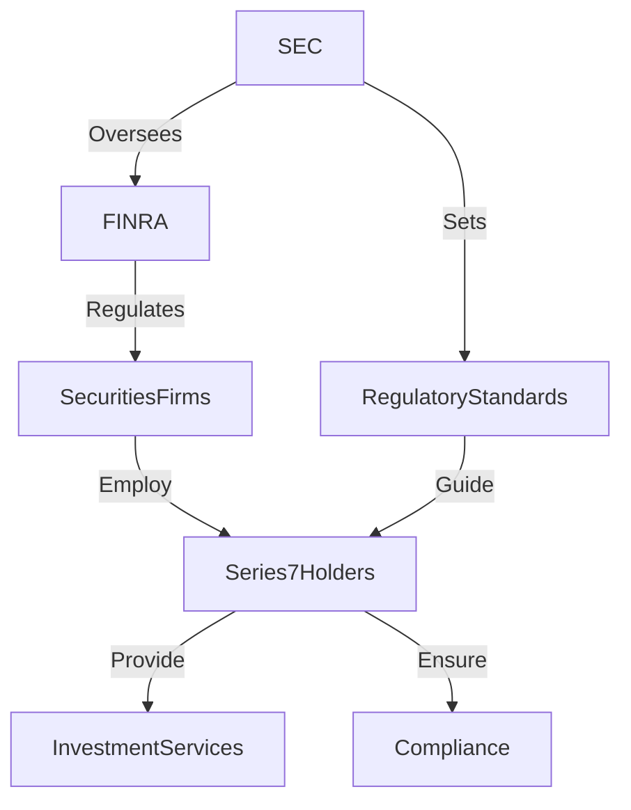

## 1.1.1 Purpose and Scope of the Series 7 License

The Series 7 license, officially known as the General Securities Representative Qualification Examination, is a pivotal credential for professionals in the securities industry. It is administered by the Financial Industry Regulatory Authority (FINRA) and is designed to assess the competency of entry-level registered representatives to perform their job as general securities representatives. This section explores the purpose, scope, and significance of the Series 7 license, highlighting its role in ensuring regulatory compliance and investor protection, as well as the comprehensive knowledge required across various investment products and regulations.

### The Role of a Series 7 License Holder

A Series 7 license holder is authorized to buy and sell a broad range of securities products. This includes stocks, bonds, options, and other investment vehicles, making it one of the most comprehensive licenses available for securities professionals. The license is essential for individuals who wish to work as general securities representatives, enabling them to engage in transactions and provide investment advice to clients.

#### Key Functions

1. **Transaction Execution**: Series 7 license holders execute buy and sell orders for clients. This includes understanding market conditions, executing trades promptly, and ensuring that transactions are in the best interest of the client.

2. **Investment Advisory**: They provide investment advice to clients, helping them make informed decisions about their portfolios. This requires a deep understanding of financial markets, investment strategies, and client-specific factors such as risk tolerance and investment objectives.

3. **Client Relationship Management**: Maintaining strong relationships with clients is crucial. Series 7 representatives are responsible for understanding client needs, providing timely updates, and ensuring client satisfaction.

4. **Regulatory Compliance**: License holders must adhere to regulatory standards set by FINRA and other governing bodies. This includes following ethical guidelines, maintaining accurate records, and ensuring all transactions comply with legal requirements.

5. **Risk Management**: They must assess and manage risks associated with various investment products, ensuring that clients are aware of potential risks and that their investment portfolios are aligned with their risk tolerance.

### Ensuring Regulatory Standards and Investor Protection

The Series 7 license plays a critical role in upholding regulatory standards and protecting investors. By requiring representatives to demonstrate a comprehensive understanding of securities regulations and ethical practices, the license ensures that professionals are equipped to act in the best interest of their clients.

#### Regulatory Compliance

- **Adherence to FINRA Rules**: Series 7 license holders must comply with FINRA regulations, which are designed to maintain fair and efficient markets. This includes rules on trading practices, reporting requirements, and ethical conduct.

- **Investor Protection**: The license emphasizes the importance of protecting investor interests. This includes ensuring transparency in transactions, providing full disclosure of investment risks, and avoiding conflicts of interest.

- **Ethical Standards**: Series 7 representatives are expected to adhere to high ethical standards, avoiding fraudulent practices and ensuring that all actions are conducted with integrity.

### Extensive Knowledge Across Investment Products and Regulations

To obtain a Series 7 license, candidates must demonstrate extensive knowledge across a wide range of investment products and regulations. This includes understanding the characteristics, risks, and benefits of various securities, as well as the regulatory framework governing their sale and distribution.

#### Investment Products

- **Equity Securities**: Understanding the features and risks of common and preferred stocks, including dividends, voting rights, and market volatility.

- **Debt Securities**: Knowledge of bonds, including government, municipal, and corporate bonds, as well as the factors affecting bond prices and yields.

- **Options and Derivatives**: Proficiency in options trading, including calls, puts, and complex strategies such as spreads and straddles.

- **Investment Companies**: Familiarity with mutual funds, exchange-traded funds (ETFs), and closed-end funds, including their structure, fees, and regulatory requirements.

- **Direct Participation Programs (DPPs)**: Understanding the structure and risks of DPPs, including real estate, oil and gas, and equipment leasing programs.

#### Regulatory Framework

- **Securities Act of 1933**: Knowledge of the registration process for new securities and the requirements for full disclosure.

- **Securities Exchange Act of 1934**: Understanding the regulation of secondary markets, reporting requirements, and insider trading rules.

- **Investment Company Act of 1940**: Familiarity with the regulation of investment companies and the protection of shareholder interests.

- **FINRA and SEC Rules**: Comprehension of the rules and regulations set forth by FINRA and the Securities and Exchange Commission (SEC), including compliance and enforcement procedures.

### Examples of Roles Requiring the Series 7 License

The Series 7 license is a prerequisite for various roles within the securities industry, each with its own set of responsibilities and challenges.

#### Stockbroker

Stockbrokers buy and sell securities on behalf of clients, providing investment advice and managing client portfolios. They must have a thorough understanding of market trends and investment strategies to make informed recommendations.

#### Financial Advisor

Financial advisors help clients develop long-term financial plans, including retirement planning, estate planning, and investment management. The Series 7 license allows them to offer a wide range of investment products to meet client needs.

#### Investment Banker

Investment bankers assist companies in raising capital through the issuance of securities. They must understand the regulatory requirements for new issues and have the ability to analyze market conditions to determine the best strategies for clients.

#### Portfolio Manager

Portfolio managers oversee investment portfolios, making decisions about asset allocation and security selection. They must have a deep understanding of financial markets and investment products to achieve client objectives.

#### Compliance Officer

Compliance officers ensure that financial institutions adhere to regulatory requirements. They must be knowledgeable about securities laws and regulations to identify and address compliance issues.

### Practical Examples and Scenarios

To illustrate the practical application of the Series 7 license, consider the following scenarios:

#### Scenario 1: Advising a Client on Portfolio Diversification

A Series 7 license holder is approached by a client looking to diversify their investment portfolio. The representative analyzes the client's current holdings, risk tolerance, and investment goals. They recommend a mix of equities, bonds, and mutual funds to achieve diversification and reduce risk. By understanding the characteristics and risks of each investment product, the representative helps the client make informed decisions.

#### Scenario 2: Ensuring Compliance with Regulatory Standards

A compliance officer at a brokerage firm identifies a potential violation of FINRA rules related to insider trading. They conduct an investigation, reviewing transaction records and communications to determine if any unethical practices occurred. By applying their knowledge of securities regulations, the compliance officer ensures that the firm adheres to legal and ethical standards, protecting both the firm and its clients.

#### Scenario 3: Managing Risk in Options Trading

An options trader with a Series 7 license is tasked with managing a client's options portfolio. They assess the potential risks and rewards of various options strategies, considering factors such as market volatility and expiration dates. By implementing a combination of covered calls and protective puts, the trader minimizes risk while maximizing potential returns for the client.

### Real-World Applications and Regulatory Scenarios

The Series 7 license is not only a theoretical qualification but also has real-world applications that are critical for professionals in the securities industry.

#### Real-World Application: Navigating Market Volatility

In times of market volatility, a Series 7 license holder must be adept at navigating uncertain conditions. This involves staying informed about economic indicators, geopolitical events, and market trends that could impact investment performance. By leveraging their knowledge and expertise, they can provide clients with strategic advice to protect their investments and capitalize on opportunities.

#### Regulatory Scenario: Responding to Regulatory Changes

The securities industry is subject to frequent regulatory changes that can impact the way business is conducted. A Series 7 license holder must stay current with new regulations and adapt their practices accordingly. This could involve updating compliance procedures, revising client communications, or modifying investment strategies to align with new rules.

### Step-by-Step Guidance for Regulatory Compliance

Regulatory compliance is a critical aspect of the Series 7 license, and professionals must be well-versed in the procedures and requirements involved. Here is a step-by-step guide to ensuring compliance:

1. **Stay Informed**: Regularly review updates from FINRA, the SEC, and other regulatory bodies to stay informed about changes in regulations and compliance requirements.

2. **Implement Policies**: Develop and implement internal policies and procedures that align with regulatory standards. This includes establishing protocols for recordkeeping, reporting, and ethical conduct.

3. **Conduct Training**: Provide ongoing training for employees to ensure they understand regulatory requirements and are equipped to comply with them in their daily activities.

4. **Monitor Activities**: Regularly monitor transactions and communications to identify potential compliance issues. This includes reviewing trade records, client communications, and employee activities.

5. **Address Violations**: If a compliance issue is identified, take immediate action to address it. This may involve conducting an investigation, implementing corrective measures, and reporting the violation to the appropriate authorities.

6. **Conduct Audits**: Perform regular audits of compliance procedures to ensure they are effective and up-to-date. This includes reviewing policies, training programs, and monitoring activities.

### Diagrams and Visuals

To enhance understanding of the regulatory framework and the role of a Series 7 license holder, consider the following diagram illustrating the relationship between regulatory agencies and market participants:

### Best Practices, Common Pitfalls, and Strategies

#### Best Practices

- **Continuous Education**: Stay informed about industry developments and regulatory changes through continuous education and professional development.

- **Ethical Conduct**: Adhere to ethical standards in all interactions with clients and colleagues, ensuring transparency and integrity.

- **Client-Centric Approach**: Focus on understanding and meeting client needs, providing personalized advice and solutions.

#### Common Pitfalls

- **Overlooking Compliance**: Failing to adhere to regulatory requirements can result in significant penalties and damage to reputation.

- **Inadequate Risk Assessment**: Not properly assessing and managing risks can lead to poor investment outcomes and client dissatisfaction.

- **Poor Communication**: Ineffective communication with clients can result in misunderstandings and a lack of trust.

#### Strategies to Overcome Challenges

- **Develop a Compliance Culture**: Foster a culture of compliance within the organization, emphasizing the importance of adhering to regulatory standards.

- **Enhance Communication Skills**: Invest in training to improve communication skills, ensuring clear and effective interactions with clients.

- **Implement Risk Management Practices**: Develop and implement robust risk management practices to identify, assess, and mitigate potential risks.

### References and Additional Resources

For further exploration of the Series 7 license and its requirements, consider the following resources:

- **FINRA Website**: Provides comprehensive information on the Series 7 exam, including study materials and exam registration details.

- **Securities Act of 1933**: Explore the full text of the act to understand the registration process and disclosure requirements for new securities.

- **Securities Exchange Act of 1934**: Review the act to gain insight into the regulation of secondary markets and reporting requirements.

- **Investment Company Act of 1940**: Understand the regulation of investment companies and the protection of shareholder interests.

- **SEC Website**: Offers resources on securities regulations, compliance guidelines, and industry updates.

### Conclusion

The Series 7 license is a vital credential for professionals in the securities industry, enabling them to perform a wide range of functions and ensuring adherence to regulatory standards. By understanding the purpose and scope of the license, as well as the extensive knowledge required, candidates can prepare effectively for the exam and advance their careers in the securities industry. With a focus on regulatory compliance, investor protection, and ethical conduct, Series 7 license holders play a crucial role in maintaining the integrity and efficiency of financial markets.

## Series 7 Exam Practice Questions: Purpose and Scope of the Series 7 License



### What is the primary function of a Series 7 license holder?

- [x] To execute buy and sell orders for clients
- [ ] To manage corporate accounts
- [ ] To conduct audits of financial statements
- [ ] To oversee mergers and acquisitions

> **Explanation:** The primary function of a Series 7 license holder is to execute buy and sell orders for clients, providing investment advice and managing client portfolios.

### Which regulatory body administers the Series 7 exam?

- [ ] Securities and Exchange Commission (SEC)
- [x] Financial Industry Regulatory Authority (FINRA)
- [ ] Municipal Securities Rulemaking Board (MSRB)
- [ ] Federal Reserve Board (FRB)

> **Explanation:** The Series 7 exam is administered by the Financial Industry Regulatory Authority (FINRA).

### What type of securities can a Series 7 license holder trade?

- [x] Stocks, bonds, and options
- [ ] Real estate and commodities
- [ ] Foreign currencies and derivatives
- [ ] Only government bonds

> **Explanation:** A Series 7 license holder can trade a broad range of securities, including stocks, bonds, and options.

### How does the Series 7 license ensure investor protection?

- [ ] By allowing unrestricted trading
- [x] By requiring adherence to regulatory standards
- [ ] By providing tax benefits
- [ ] By eliminating market risks

> **Explanation:** The Series 7 license ensures investor protection by requiring adherence to regulatory standards and ethical practices.

### What is a common pitfall for Series 7 license holders?

- [ ] Over-communicating with clients
- [x] Overlooking compliance requirements
- [ ] Underestimating market trends
- [ ] Overvaluing client portfolios

> **Explanation:** A common pitfall for Series 7 license holders is overlooking compliance requirements, which can lead to penalties and reputational damage.

### Which act regulates the secondary market and reporting requirements?

- [ ] Securities Act of 1933
- [ ] Investment Company Act of 1940
- [x] Securities Exchange Act of 1934
- [ ] Sarbanes-Oxley Act

> **Explanation:** The Securities Exchange Act of 1934 regulates the secondary market and reporting requirements.

### What is a key responsibility of a compliance officer with a Series 7 license?

- [ ] Managing client portfolios
- [ ] Providing investment advice
- [x] Ensuring adherence to regulatory requirements
- [ ] Executing trades

> **Explanation:** A key responsibility of a compliance officer with a Series 7 license is ensuring adherence to regulatory requirements.

### Which investment product requires knowledge of options trading?

- [ ] Mutual funds
- [ ] Corporate bonds
- [x] Derivatives
- [ ] Municipal bonds

> **Explanation:** Options trading requires knowledge of derivatives, which is a key area for Series 7 license holders.

### What is the purpose of the Investment Company Act of 1940?

- [x] To regulate investment companies and protect shareholder interests
- [ ] To oversee mergers and acquisitions
- [ ] To manage corporate governance
- [ ] To provide tax benefits for investors

> **Explanation:** The Investment Company Act of 1940 regulates investment companies and protects shareholder interests.

### Which strategy can help overcome communication challenges with clients?

- [ ] Reducing client interactions
- [ ] Limiting information disclosure
- [x] Enhancing communication skills
- [ ] Avoiding complex topics

> **Explanation:** Enhancing communication skills can help overcome communication challenges with clients, ensuring clear and effective interactions.


