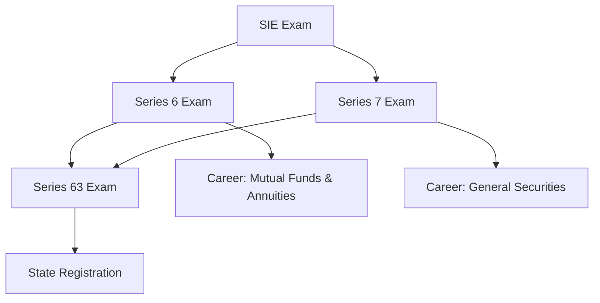

## 1.1.3 Comparison to Other FINRA Exams

The Financial Industry Regulatory Authority (FINRA) administers various exams to ensure that individuals in the securities industry possess the necessary knowledge and skills to perform their roles effectively. Among these, the Series 7 exam is one of the most comprehensive, but it is not the only one. Understanding how the Series 7 compares to other FINRA exams like the Securities Industry Essentials (SIE), Series 6, and Series 63 is crucial for anyone planning a career in the securities industry. This section will provide a detailed comparison, highlighting the prerequisites, scope, and career paths associated with each exam.

### Overview of FINRA Exams

Before diving into the comparison, it is important to understand what each of these exams entails:

- **Securities Industry Essentials (SIE) Exam**: This is an entry-level exam that tests basic knowledge of the securities industry, including concepts fundamental to working in the industry, such as types of products and their risks, the structure of the securities industry markets, regulatory agencies and their functions, and prohibited practices.

- **Series 6 License**: This exam qualifies individuals to sell mutual funds, variable annuities, and insurance premiums. It is more limited in scope compared to the Series 7.

- **Series 63 License**: Known as the Uniform Securities Agent State Law Exam, this exam covers state law and regulations for securities agents, focusing on ethical practices and fiduciary responsibilities.

- **Series 7 License**: Known as the General Securities Representative Exam, it qualifies individuals to sell a broader range of securities, including stocks, bonds, options, and mutual funds.

### Prerequisites and Qualifications

#### Securities Industry Essentials (SIE) Exam

- **Prerequisites**: None. The SIE is open to anyone aged 18 or older, including students and prospective securities industry professionals.
- **Scope**: It covers the basics of the securities industry, providing foundational knowledge that is essential for all subsequent FINRA exams.
- **Career Path**: The SIE is often the first step for those entering the securities industry and is a prerequisite for taking more advanced exams like the Series 6 and Series 7.

#### Series 6 License

- **Prerequisites**: Must pass the SIE exam.
- **Scope**: The Series 6 exam focuses on packaged securities, such as mutual funds, variable annuities, and insurance products.
- **Career Path**: This license is suitable for those who wish to work as investment company and variable contracts products representatives, typically in roles that involve selling mutual funds and annuities.

#### Series 63 License

- **Prerequisites**: Often taken in conjunction with the Series 6 or Series 7 exams, though technically it has no prerequisites.
- **Scope**: The Series 63 exam covers state securities regulations and laws, emphasizing ethical practices and fiduciary responsibilities.
- **Career Path**: This license is required for anyone who wants to sell securities in a particular state, making it essential for most securities representatives.

#### Series 7 License

- **Prerequisites**: Must pass the SIE exam.
- **Scope**: The Series 7 exam is comprehensive, covering a wide range of securities, including stocks, bonds, options, and mutual funds.
- **Career Path**: This license is necessary for anyone who wants to work as a general securities representative, allowing them to sell almost any type of securities product.

### Sequence of Certifications

The typical sequence of certifications for someone entering the securities industry would begin with the SIE exam, which provides the foundational knowledge necessary for all other exams. After passing the SIE, individuals can choose to take the Series 6 or Series 7 exams, depending on their career goals. Those who wish to sell a broad range of securities will opt for the Series 7, while those focusing on mutual funds and annuities might choose the Series 6.

The Series 63 exam is often taken in conjunction with either the Series 6 or Series 7 exams, as it is required for state registration. This sequence ensures that securities professionals are well-versed in both the products they sell and the regulations governing their activities.

### Comparison Chart of FINRA Exams

Below is a comparison chart that outlines the key differences between the SIE, Series 6, Series 63, and Series 7 exams:

| Exam | Prerequisites | Scope | Career Path |
|------|---------------|-------|-------------|
| SIE | None | Basic securities industry knowledge | Entry-level positions |
| Series 6 | SIE | Mutual funds, annuities, insurance | Investment company representatives |
| Series 63 | Often Series 6 or 7 | State laws and regulations | State-registered securities agents |
| Series 7 | SIE | Broad range of securities | General securities representatives |

### Real-World Applications and Scenarios

Understanding the differences between these exams is crucial for making informed career decisions. For example, if you are interested in a career as a financial advisor who primarily deals with mutual funds and annuities, the Series 6 exam would be appropriate. However, if your goal is to work as a stockbroker or in a role that involves trading a wide range of securities, the Series 7 exam is necessary.

Consider the following scenario: Jane is a recent college graduate interested in a career in finance. She decides to start with the SIE exam to gain a foundational understanding of the securities industry. After passing the SIE, she evaluates her career goals and decides she wants to work as a general securities representative. Therefore, she opts to take the Series 7 exam. To comply with state regulations, she also takes the Series 63 exam to ensure she can legally sell securities in her state.

### Exam Strategies and Tips

When preparing for these exams, it is important to develop a study plan that aligns with your career goals. Here are some tips to help you succeed:

1. **Understand the Exam Content**: Familiarize yourself with the exam content outlines provided by FINRA. This will help you focus your study efforts on the most important topics.

2. **Use Study Guides and Practice Exams**: Utilize study guides, practice exams, and question banks to reinforce your understanding of the material. These resources can help you identify areas where you need additional study.

3. **Develop a Study Schedule**: Create a study schedule that allows you to cover all the material in a systematic way. Be sure to allocate time for review and practice exams.

4. **Join Study Groups**: Consider joining a study group to discuss difficult concepts and share study tips with peers.

5. **Stay Informed**: Keep up-to-date with any changes to the exam content or regulations by regularly checking FINRA's website and other reliable sources.

6. **Practice Time Management**: During the exam, manage your time effectively to ensure you can answer all questions within the allotted time.

### Common Challenges and How to Overcome Them

Preparing for FINRA exams can be challenging, but understanding common pitfalls can help you avoid them:

- **Underestimating the Exam**: Some candidates underestimate the complexity of the exams, particularly the Series 7. Ensure you dedicate sufficient time to study and understand the material.

- **Lack of Focus**: With a broad range of topics, it is easy to lose focus. Stay organized and prioritize your study efforts based on the exam content outline.

- **Stress and Anxiety**: Exam stress can impact performance. Practice relaxation techniques and ensure you are well-rested on exam day.

- **Over-Reliance on Memorization**: While memorization is important, understanding the underlying concepts is crucial for applying knowledge to real-world scenarios.

### Conclusion

The Series 7 exam is a pivotal step for those pursuing a career as a general securities representative, offering the broadest range of qualifications among FINRA exams. By understanding how it compares to other exams like the SIE, Series 6, and Series 63, you can make informed decisions about your career path and prepare effectively for your exams. With the right preparation and mindset, you can achieve your certification goals and advance your career in the securities industry.

## Series 7 Exam Practice Questions: Comparison to Other FINRA Exams



### Which FINRA exam is considered the entry-level exam for the securities industry?

- [x] Securities Industry Essentials (SIE) Exam
- [ ] Series 6 Exam
- [ ] Series 63 Exam
- [ ] Series 7 Exam

> **Explanation:** The SIE exam is the entry-level exam that covers basic securities industry knowledge, serving as a prerequisite for more advanced exams.

### What additional qualification does the Series 7 exam provide compared to the Series 6 exam?

- [x] Ability to sell a broader range of securities, including stocks and bonds
- [ ] Ability to sell only mutual funds and annuities
- [ ] Focus on state securities regulations
- [ ] Limited to insurance products

> **Explanation:** The Series 7 exam qualifies individuals to sell a broader range of securities, including stocks, bonds, and options, unlike the Series 6, which is limited to mutual funds and annuities.

### Which exam must be passed before taking the Series 6 or Series 7 exams?

- [x] Securities Industry Essentials (SIE) Exam
- [ ] Series 63 Exam
- [ ] Series 65 Exam
- [ ] Series 66 Exam

> **Explanation:** The SIE exam is a prerequisite for both the Series 6 and Series 7 exams, providing foundational knowledge required for these advanced exams.

### What is the primary focus of the Series 63 exam?

- [ ] Selling mutual funds and annuities
- [ ] Selling a broad range of securities
- [x] State securities laws and regulations
- [ ] Corporate finance

> **Explanation:** The Series 63 exam focuses on state securities laws and regulations, ensuring that representatives understand the legal requirements for selling securities in a particular state.

### Which exam is often taken in conjunction with the Series 7 to meet state registration requirements?

- [ ] Series 6 Exam
- [x] Series 63 Exam
- [ ] Series 65 Exam
- [ ] Series 66 Exam

> **Explanation:** The Series 63 exam is often taken alongside the Series 7 to fulfill state registration requirements for securities representatives.

### What type of securities can a Series 6 license holder sell?

- [ ] Stocks and bonds
- [x] Mutual funds and variable annuities
- [ ] Options and futures
- [ ] Foreign exchange

> **Explanation:** A Series 6 license allows individuals to sell mutual funds, variable annuities, and insurance premiums, but not stocks, bonds, or options.

### Why is the SIE exam considered a foundational exam?

- [ ] It covers advanced securities trading strategies
- [x] It provides basic knowledge essential for all other FINRA exams
- [ ] It focuses on state regulations
- [ ] It is only for insurance products

> **Explanation:** The SIE exam provides foundational knowledge of the securities industry, covering essential concepts that underpin all other FINRA exams.

### Which exam would be most appropriate for someone interested in selling insurance products?

- [ ] Series 7 Exam
- [x] Series 6 Exam
- [ ] Series 63 Exam
- [ ] Series 65 Exam

> **Explanation:** The Series 6 exam is designed for individuals who wish to sell mutual funds, variable annuities, and insurance products.

### What is a key difference between the Series 7 and Series 63 exams?

- [ ] Series 7 focuses on state laws; Series 63 covers a broad range of securities
- [x] Series 7 covers a broad range of securities; Series 63 focuses on state laws
- [ ] Both exams cover the same content
- [ ] Series 63 allows for selling options and futures

> **Explanation:** The Series 7 exam covers a wide range of securities, while the Series 63 exam focuses on state securities laws and regulations.

### How does the Series 7 exam differ from the SIE exam?

- [ ] Series 7 is an entry-level exam; SIE is more advanced
- [x] Series 7 covers a broader range of securities products
- [ ] SIE allows for selling options and futures
- [ ] Series 7 is limited to mutual funds

> **Explanation:** The Series 7 exam covers a broader range of securities products, including stocks and options, whereas the SIE exam provides foundational knowledge without qualifying individuals to sell specific products.



---
