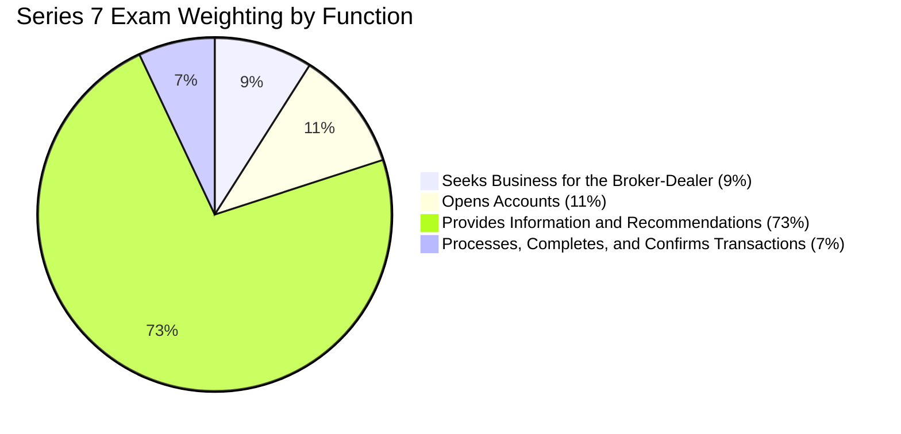

## 1.2.2 Question Types and Weighting

Preparing for the Series 7 Exam requires a thorough understanding of the types of questions you will encounter and the weight each section carries. This knowledge will help you allocate your study time effectively, ensuring you focus on the areas that will have the most impact on your final score. In this section, we will delve into the nature of the questions, the major job functions tested, and how to strategically prepare for each.

### Understanding Scenario-Based Questions

The Series 7 Exam is designed to assess your ability to apply knowledge in real-world situations. This is achieved through scenario-based questions, which present hypothetical situations that require you to use your understanding of securities regulations, market practices, and ethical considerations to arrive at the correct answer.

**Scenario-Based Questions** are crafted to simulate the challenges you might face as a General Securities Representative. These questions are not just about recalling facts; they test your ability to analyze situations, make informed decisions, and provide suitable recommendations to clients. For example, you might be given a scenario involving a client's investment portfolio and asked to determine the most appropriate course of action based on their risk tolerance and investment objectives.

### The Four Major Job Functions and Their Weightings

The Series 7 Exam covers four major job functions, each with a specific weighting that reflects its importance in the role of a General Securities Representative. Understanding these functions and their weightings is crucial for effective exam preparation.

#### Function 1: Seeks Business for the Broker-Dealer (9%)

This function involves activities related to prospecting and acquiring new clients. It tests your ability to understand the products and services offered by your firm and how to present these to potential clients. While this section carries the least weight, it is essential for building a client base and driving business growth.

**Key Topics:**
- Identifying potential clients
- Understanding client needs
- Presenting products and services

#### Function 2: Opens Accounts (11%)

Opening accounts is a critical function that involves ensuring all necessary documentation is completed accurately and in compliance with regulatory requirements. This section tests your knowledge of different account types, the documentation required for each, and the procedures for opening accounts.

**Key Topics:**
- Types of accounts (individual, joint, corporate, etc.)
- Required documentation
- Compliance with regulatory standards

#### Function 3: Provides Information and Recommendations (73%)

This is the most heavily weighted section of the exam, reflecting the importance of providing clients with accurate information and suitable investment recommendations. It covers a wide range of topics, including securities analysis, investment strategies, and ethical considerations.

**Key Topics:**
- Analyzing client profiles
- Making investment recommendations
- Understanding securities products
- Ethical and regulatory considerations

Given its significant weighting, you should dedicate a substantial portion of your study time to mastering the content in this section. Focus on understanding how to evaluate client needs and provide suitable investment solutions.

#### Function 4: Processes, Completes, and Confirms Transactions (7%)

This function involves the operational aspects of executing and confirming client transactions. It tests your knowledge of trade execution processes, settlement procedures, and the regulatory requirements associated with these activities.

**Key Topics:**
- Trade execution and confirmation
- Settlement procedures
- Regulatory compliance

### Strategic Study Tips

1. **Prioritize Heavily Weighted Sections:** Given that Function 3 accounts for 73% of the exam, focus your study efforts on this area. Ensure you have a strong understanding of securities products, investment strategies, and client advisory processes.

2. **Practice Scenario-Based Questions:** Engage with practice exams and question banks that feature scenario-based questions. This will help you develop the analytical skills needed to apply your knowledge in real-world situations.

3. **Understand Regulatory Requirements:** Familiarize yourself with the regulatory framework governing securities transactions. This knowledge is crucial for both Function 2 and Function 4.

4. **Develop a Study Plan:** Create a study schedule that allocates time based on the weightings of each function. This will ensure you cover all necessary content while focusing on the most important areas.

5. **Use a Variety of Study Materials:** Utilize textbooks, online courses, practice exams, and study groups to reinforce your understanding of the material. Different resources can provide varied perspectives and insights.

### Visualizing Exam Weighting

To help you visualize the importance of each function, here is a chart illustrating the exam weighting by function:

### Glossary

- **Scenario-Based Questions:** Questions that present a hypothetical situation requiring application of knowledge. These questions are designed to assess your ability to apply theoretical knowledge in practical, real-world scenarios.

### Conclusion

Understanding the question types and weightings of the Series 7 Exam is crucial for effective preparation. By focusing on the most heavily weighted sections and practicing scenario-based questions, you can enhance your ability to apply knowledge in practical situations and increase your chances of success on the exam.

## Series 7 Exam Practice Questions: Question Types and Weighting



### What is the primary purpose of scenario-based questions in the Series 7 Exam?

- [x] To assess the practical application of knowledge
- [ ] To test memorization of facts
- [ ] To evaluate writing skills
- [ ] To measure time management abilities

> **Explanation:** Scenario-based questions are designed to assess how well candidates can apply their theoretical knowledge to real-world situations, which is crucial for the role of a General Securities Representative.

### Which job function carries the highest weighting in the Series 7 Exam?

- [ ] Seeks Business for the Broker-Dealer
- [ ] Opens Accounts
- [x] Provides Information and Recommendations
- [ ] Processes, Completes, and Confirms Transactions

> **Explanation:** The function "Provides Information and Recommendations" carries the highest weighting at 73%, reflecting its importance in a General Securities Representative's role.

### What percentage of the Series 7 Exam is dedicated to opening accounts?

- [ ] 9%
- [x] 11%
- [ ] 73%
- [ ] 7%

> **Explanation:** The "Opens Accounts" function accounts for 11% of the Series 7 Exam, focusing on the knowledge required to properly establish client accounts.

### Why is it important to focus study efforts on heavily weighted sections of the exam?

- [x] Because they have the most significant impact on the final score
- [ ] Because they are easier to study
- [ ] Because they are less likely to change
- [ ] Because they require less time to understand

> **Explanation:** Focusing on heavily weighted sections is crucial because these areas have the most significant impact on your final score, making them key to passing the exam.

### What is a key component of the "Processes, Completes, and Confirms Transactions" function?

- [ ] Identifying potential clients
- [ ] Analyzing client profiles
- [x] Trade execution and confirmation
- [ ] Understanding securities products

> **Explanation:** The "Processes, Completes, and Confirms Transactions" function involves the operational aspects of executing and confirming client transactions.

### How can scenario-based questions help in exam preparation?

- [x] By developing analytical skills needed for real-world situations
- [ ] By improving memorization techniques
- [ ] By enhancing writing abilities
- [ ] By increasing reading speed

> **Explanation:** Scenario-based questions help develop the analytical skills needed to apply theoretical knowledge in real-world situations, which is essential for the Series 7 Exam.

### What is the weighting for the "Seeks Business for the Broker-Dealer" function?

- [x] 9%
- [ ] 11%
- [ ] 73%
- [ ] 7%

> **Explanation:** The "Seeks Business for the Broker-Dealer" function accounts for 9% of the Series 7 Exam, focusing on prospecting and acquiring new clients.

### Which of the following is NOT a focus of the "Opens Accounts" function?

- [ ] Types of accounts
- [ ] Required documentation
- [x] Securities analysis
- [ ] Compliance with regulatory standards

> **Explanation:** Securities analysis is not a focus of the "Opens Accounts" function; it is part of the "Provides Information and Recommendations" function.

### What is the primary focus of the "Provides Information and Recommendations" function?

- [ ] Trade execution
- [ ] Opening accounts
- [x] Making investment recommendations
- [ ] Prospecting for new clients

> **Explanation:** The primary focus of the "Provides Information and Recommendations" function is making suitable investment recommendations based on client profiles.

### How should you allocate your study time for the Series 7 Exam?

- [x] Based on the weightings of each function
- [ ] Equally across all topics
- [ ] Focus only on the least weighted sections
- [ ] Study only the topics you find interesting

> **Explanation:** Allocating study time based on the weightings of each function ensures you focus on the areas that will have the most impact on your final score.



By understanding the question types and weightings of the Series 7 Exam, you can strategically prepare to maximize your performance. Focus on mastering the heavily weighted sections and practice applying your knowledge through scenario-based questions to ensure success on exam day.
