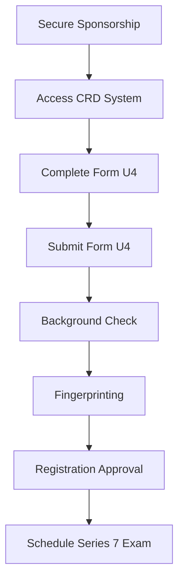

## 1.3.1 FINRA Registration Process

Embarking on a career as a General Securities Representative requires navigating the Financial Industry Regulatory Authority (FINRA) registration process, a crucial step to qualify for the Series 7 Exam. This section will guide you through the essential components of the registration process, including the Central Registration Depository (CRD) system, completing Form U4, and understanding background check and fingerprinting requirements. By mastering these elements, you will be well-prepared to take the Series 7 Exam and advance your career in the securities industry.

### Understanding the Central Registration Depository (CRD) System

The Central Registration Depository (CRD) system is FINRA's online registration and licensing system, serving as the primary database for the securities industry. It is a centralized repository that stores information about registered securities professionals and firms, facilitating the registration and licensing process across the United States.

#### Key Functions of the CRD System

- **Registration and Licensing:** The CRD system processes applications for securities professionals seeking registration with FINRA and other regulatory bodies. It ensures that all necessary qualifications and requirements are met before granting registration.
  
- **Record Maintenance:** The CRD maintains comprehensive records of registered individuals and firms, including employment history, disciplinary actions, and disclosure information. This information is accessible to regulators, firms, and the public, promoting transparency and accountability in the securities industry.

- **Regulatory Compliance:** By centralizing registration data, the CRD system helps ensure compliance with regulatory requirements, streamlining the oversight process for FINRA and other regulatory authorities.

#### Benefits of the CRD System

- **Efficiency:** The CRD system simplifies the registration process by providing a single platform for submitting and managing registration applications, reducing paperwork and administrative burdens for firms and individuals.

- **Transparency:** By maintaining a public database of registered professionals and firms, the CRD system enhances transparency and trust in the securities industry, allowing investors to verify the credentials of their financial advisors.

- **Compliance Support:** The CRD system provides firms with tools and resources to monitor and manage their compliance obligations, helping them stay up-to-date with regulatory changes and requirements.

### Completing Form U4 with a Sponsoring Firm

To register for the Series 7 Exam, you must complete Form U4, the Uniform Application for Securities Industry Registration or Transfer. This form is a critical component of the FINRA registration process, capturing detailed information about your personal and professional background.

#### Step-by-Step Guide to Completing Form U4

1. **Secure Sponsorship:** Before completing Form U4, you must secure sponsorship from a FINRA-member firm. This firm will act as your sponsor, supporting your application and overseeing your activities as a registered representative.

2. **Access the CRD System:** Once you have a sponsoring firm, you will gain access to the CRD system through the firm's compliance department. The firm will initiate the Form U4 process on your behalf, providing you with the necessary login credentials.

3. **Provide Personal Information:** The first section of Form U4 requires you to provide personal information, including your name, address, Social Security number, and date of birth. Ensure that all information is accurate and up-to-date.

4. **Disclose Employment History:** You must disclose your employment history for the past ten years, including all positions held in the securities industry. Be thorough and precise, as discrepancies can delay the registration process.

5. **Answer Disclosure Questions:** Form U4 includes a series of disclosure questions related to your financial and legal history. These questions cover topics such as bankruptcies, criminal charges, and regulatory actions. Answer truthfully and provide any necessary explanations or documentation.

6. **Review and Submit:** After completing all sections of Form U4, review your responses for accuracy and completeness. Once satisfied, submit the form through the CRD system for review by your sponsoring firm and FINRA.

#### Common Pitfalls and Best Practices

- **Accuracy is Key:** Ensure that all information provided on Form U4 is accurate and consistent with your records. Inaccuracies can lead to delays or denials in the registration process.

- **Full Disclosure:** Be honest and transparent when answering disclosure questions. Failure to disclose relevant information can result in disciplinary actions or revocation of your registration.

- **Stay Informed:** Keep abreast of any changes to the Form U4 process or requirements by regularly consulting FINRA's website and your firm's compliance department.

### Background Check and Fingerprinting Requirements

As part of the FINRA registration process, you must undergo a thorough background check and fingerprinting to verify your identity and assess your suitability for registration.

#### Background Check Process

- **Scope:** The background check examines your criminal history, financial standing, and any previous disciplinary actions. It ensures that you meet the ethical and professional standards required for registration.

- **Timing:** The background check is conducted after submitting Form U4 and is typically completed within a few weeks. It is essential to provide accurate information to avoid delays.

- **Results:** If any issues arise during the background check, FINRA will notify your sponsoring firm, which may request additional information or clarification from you.

#### Fingerprinting Requirements

- **Purpose:** Fingerprinting is a mandatory requirement for all individuals seeking registration with FINRA. It helps verify your identity and ensures compliance with regulatory standards.

- **Process:** Your sponsoring firm will arrange for you to be fingerprinted at an authorized location. The fingerprints are then submitted to FINRA and the FBI for processing.

- **Clearance:** Once your fingerprints are processed and cleared, FINRA will update your registration status in the CRD system, allowing you to proceed with scheduling the Series 7 Exam.

### Practical Examples and Real-World Applications

Consider the following scenarios to better understand the FINRA registration process:

- **Scenario 1:** Jane, a recent finance graduate, secures a position with a brokerage firm that sponsors her for the Series 7 Exam. She completes Form U4, disclosing a minor traffic violation. Her background check is cleared, and she successfully registers for the exam.

- **Scenario 2:** John, an experienced financial advisor, applies for registration with a new firm. During the background check, a previously undisclosed bankruptcy is discovered. John provides documentation and an explanation, allowing his registration to proceed after a brief delay.

### Diagrams and Visual Aids

To enhance your understanding of the FINRA registration process, refer to the following diagram illustrating the key steps involved:

### Conclusion

Navigating the FINRA registration process is a critical step in your journey to becoming a General Securities Representative. By understanding the role of the CRD system, accurately completing Form U4, and meeting background check and fingerprinting requirements, you will be well-equipped to pursue your Series 7 certification. Remember to stay informed, maintain transparency, and seek guidance from your sponsoring firm to ensure a smooth registration process.

## Series 7 Exam Practice Questions: FINRA Registration Process



### What is the primary function of the CRD system?

- [x] To centralize registration and licensing information for securities professionals.
- [ ] To provide investment advice to registered representatives.
- [ ] To manage client portfolios for brokerage firms.
- [ ] To process trade transactions for financial institutions.

> **Explanation:** The CRD system is designed to centralize registration and licensing information, ensuring compliance and transparency in the securities industry.

### Which form must be completed to register for the Series 7 Exam?

- [ ] Form U5
- [x] Form U4
- [ ] Form ADV
- [ ] Form BD

> **Explanation:** Form U4 is the Uniform Application for Securities Industry Registration or Transfer, required for registering for the Series 7 Exam.

### Who must sponsor an individual for the Series 7 Exam registration?

- [ ] A financial advisor
- [ ] A bank
- [x] A FINRA-member firm
- [ ] An individual investor

> **Explanation:** A FINRA-member firm must sponsor an individual for the Series 7 Exam registration, supporting their application and overseeing their activities.

### What is a key requirement for the background check process?

- [ ] Completing a financial planning course
- [ ] Passing the Series 63 Exam
- [x] Providing accurate personal and professional information
- [ ] Obtaining a letter of recommendation

> **Explanation:** Providing accurate personal and professional information is crucial for the background check process to ensure compliance with regulatory standards.

### What is the purpose of fingerprinting in the FINRA registration process?

- [ ] To verify educational qualifications
- [ ] To assess investment knowledge
- [x] To verify identity and ensure compliance
- [ ] To determine creditworthiness

> **Explanation:** Fingerprinting is used to verify identity and ensure compliance with regulatory standards in the FINRA registration process.

### How can discrepancies on Form U4 affect the registration process?

- [x] They can lead to delays or denials in registration.
- [ ] They can expedite the registration process.
- [ ] They have no impact on registration.
- [ ] They automatically result in registration approval.

> **Explanation:** Discrepancies on Form U4 can lead to delays or denials in registration, highlighting the importance of accuracy.

### What happens if issues arise during the background check?

- [ ] The registration is automatically approved.
- [ ] The applicant is disqualified from taking the exam.
- [x] FINRA notifies the sponsoring firm for further clarification.
- [ ] The applicant must retake the Series 7 Exam.

> **Explanation:** If issues arise during the background check, FINRA notifies the sponsoring firm, which may request additional information or clarification from the applicant.

### What type of information is stored in the CRD system?

- [ ] Investment strategies and portfolio performance
- [x] Employment history and disciplinary actions
- [ ] Market trends and economic forecasts
- [ ] Client account balances and transactions

> **Explanation:** The CRD system stores employment history, disciplinary actions, and other registration-related information for securities professionals.

### What is the role of the sponsoring firm in the FINRA registration process?

- [ ] To provide investment advice to clients
- [ ] To manage the applicant's personal finances
- [x] To support the applicant's registration and oversee activities
- [ ] To conduct market research for the applicant

> **Explanation:** The sponsoring firm supports the applicant's registration and oversees their activities as a registered representative.

### What is a common pitfall when completing Form U4?

- [ ] Providing too much information
- [x] Failing to disclose relevant information
- [ ] Submitting the form too early
- [ ] Using outdated contact information

> **Explanation:** Failing to disclose relevant information on Form U4 is a common pitfall that can result in disciplinary actions or revocation of registration.



By understanding and following the FINRA registration process, you will be well-prepared to take the Series 7 Exam and advance your career in the securities industry. Remember to review the key concepts and practice with the quiz questions to reinforce your learning.
