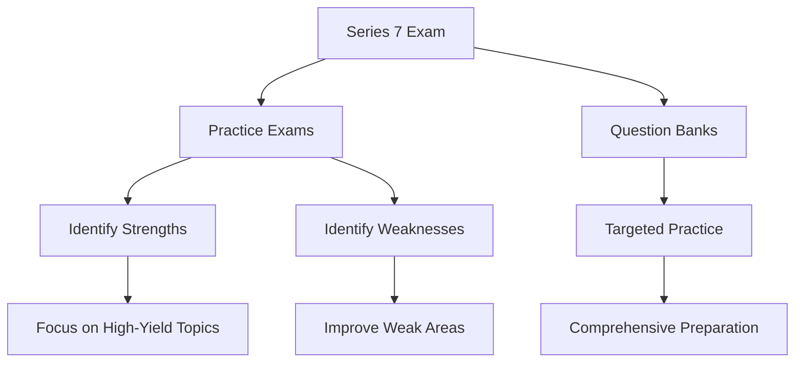

## 1.4.3 Practice Exams and Question Banks

Preparing for the Series 7 Exam requires a strategic approach that includes understanding the exam format, mastering the content, and honing your test-taking skills. One of the most effective ways to achieve this is through the use of practice exams and question banks. This section will guide you through the benefits of these tools, how to use them effectively, and strategies to maximize your study efforts.

### The Importance of Practice Exams

Practice exams are a critical component of your Series 7 Exam preparation. They serve multiple purposes:

1. **Identifying Strengths and Weaknesses**: By simulating the actual exam environment, practice exams help you pinpoint areas where you excel and topics that require more attention. This self-assessment is crucial for efficient study planning.

2. **Familiarizing with Exam Format**: The Series 7 Exam consists of multiple-choice questions that test a wide range of topics. Practice exams familiarize you with the question types, time constraints, and the overall structure of the exam.

3. **Building Confidence**: Regular practice under exam-like conditions reduces anxiety and builds confidence. As you become more comfortable with the format and content, your confidence will naturally increase.

4. **Enhancing Time Management Skills**: Timed practice exams teach you to allocate your time effectively across questions, ensuring that you can complete the exam within the allotted time.

### Recommended Approach to Practice Exams

To make the most of practice exams, follow these recommended steps:

#### 1. **Schedule Regular Practice Sessions**

- **Frequency**: Incorporate practice exams into your study schedule regularly. Aim for at least one full-length practice exam per week as you approach the exam date.
- **Environment**: Simulate exam conditions by taking practice exams in a quiet, distraction-free environment. Use a timer to replicate the pressure of the actual exam.

#### 2. **Analyze Your Performance**

- **Review Incorrect Answers**: After completing a practice exam, thoroughly review each incorrect answer. Understand why your choice was incorrect and learn the correct answer.
- **Identify Patterns**: Look for patterns in your mistakes. Are there specific topics or question types that consistently challenge you? Use this information to adjust your study focus.

#### 3. **Focus on Weak Areas**

- **Targeted Study**: Allocate more study time to areas where you scored poorly. Use additional resources such as textbooks, online courses, or study groups to reinforce these topics.
- **Use Question Banks**: Leverage question banks to practice specific areas of weakness. These banks offer a wide range of questions that cover all exam topics.

#### 4. **Track Your Progress**

- **Score Improvement**: Keep a record of your scores on practice exams to track your progress over time. This will help you see how your preparation is improving and where further work is needed.
- **Adjust Study Plan**: Based on your progress, adjust your study plan to ensure you are focusing on the most critical areas.

### Glossary

- **Question Bank**: A collection of practice questions that cover the topics included in the Series 7 Exam. These questions are designed to mimic the style and difficulty of the actual exam questions.

### Accessing Online Question Banks and Trial Exams

Several online platforms offer access to question banks and trial exams for the Series 7 Exam. These resources are invaluable for comprehensive preparation:

1. **Kaplan Financial Education**: Offers a robust question bank with thousands of practice questions, detailed explanations, and performance tracking.

2. **STCUSA**: Provides a full suite of practice exams and a question bank that covers all exam topics. Their platform also includes performance analytics to help you identify areas for improvement.

3. **Pass Perfect**: Known for their adaptive learning technology, Pass Perfect offers a question bank that adjusts to your learning pace and focuses on areas where you need the most practice.

4. **Investopedia Academy**: Offers a Series 7 Exam prep course that includes practice exams and a comprehensive question bank.

5. **FINRA's Practice Exam**: FINRA provides a free practice exam that mirrors the format and content of the actual Series 7 Exam. This is a great starting point for your preparation.

### Strategies for Analyzing Performance

Analyzing your performance on practice exams is crucial for effective preparation. Here are some strategies to help you make the most of your practice sessions:

#### 1. **Detailed Review of Each Question**

- **Understand the Rationale**: For each question, understand why the correct answer is right and why the other options are wrong. This will deepen your understanding of the concepts.
- **Note Common Traps**: Identify any common traps or tricky wording that may have led to incorrect answers. Being aware of these can help you avoid similar mistakes in the future.

#### 2. **Use Performance Analytics**

- **Identify Trends**: Use performance analytics tools provided by online platforms to identify trends in your performance. This can help you see which topics you consistently perform well in and which need more attention.
- **Benchmark Against Peers**: Some platforms allow you to benchmark your performance against other candidates. This can give you a sense of where you stand relative to others.

#### 3. **Focus on High-Yield Topics**

- **Prioritize High-Weight Topics**: Focus on topics that carry more weight on the exam. Ensure you have a strong grasp of these areas to maximize your score.
- **Review Frequently Tested Concepts**: Pay special attention to concepts that are frequently tested. These are often highlighted in study guides and practice exams.

### Real-World Applications and Regulatory Scenarios

Understanding real-world applications and regulatory scenarios is crucial for the Series 7 Exam. Practice exams and question banks often include scenarios that test your ability to apply theoretical knowledge to practical situations. Here are some examples:

#### 1. **Scenario-Based Questions**

- **Example**: You are given a scenario where a client wants to invest in municipal bonds. You need to determine the tax implications and recommend the best investment strategy based on the client's tax bracket and investment goals.

- **Approach**: Use your knowledge of municipal securities, tax treatment, and client suitability to analyze the scenario and choose the best course of action.

#### 2. **Regulatory Compliance Scenarios**

- **Example**: A question may present a situation where a broker-dealer must comply with specific FINRA regulations. You need to identify the correct compliance procedures and potential penalties for non-compliance.

- **Approach**: Apply your understanding of FINRA rules and regulations to ensure compliance and avoid legal repercussions.

### Step-by-Step Guidance for Exam Success

To ensure success on the Series 7 Exam, follow this step-by-step guidance:

#### 1. **Develop a Comprehensive Study Plan**

- **Set Clear Goals**: Define what you want to achieve in each study session. This could be mastering a specific topic or improving your practice exam score.
- **Allocate Time Wisely**: Divide your study time between learning new material, reviewing concepts, and taking practice exams.

#### 2. **Engage in Active Learning**

- **Interactive Study Methods**: Use flashcards, quizzes, and study groups to engage with the material actively. This helps reinforce learning and improve retention.
- **Teach Back Method**: Explain complex topics to a peer or study group. Teaching others is a powerful way to solidify your understanding.

#### 3. **Practice Regularly**

- **Daily Practice**: Incorporate daily practice questions into your routine. This keeps the material fresh and helps you build a habit of regular study.
- **Simulate Exam Conditions**: Regularly take full-length practice exams under timed conditions to build stamina and improve time management.

#### 4. **Review and Reflect**

- **Post-Exam Reflection**: After each practice exam, take time to reflect on your performance. Identify what went well and what needs improvement.
- **Adjust Study Techniques**: Based on your reflections, adjust your study techniques to focus on areas that need more attention.

### Diagrams and Visual Aids

To enhance your understanding of key concepts, we have included diagrams and visual aids. These visuals help illustrate complex topics and provide a clear representation of regulatory frameworks and processes.

### Best Practices and Common Pitfalls

#### Best Practices

- **Consistent Practice**: Regular practice is key to success. Make it a habit to engage with practice exams and question banks consistently.
- **Focus on Understanding**: Aim to understand the underlying concepts rather than just memorizing answers. This will help you tackle any question, no matter how it's phrased.

#### Common Pitfalls

- **Neglecting Weak Areas**: It's easy to focus on strengths, but neglecting weak areas can hurt your overall performance. Make sure to allocate time to improve these areas.
- **Overconfidence**: Avoid becoming overconfident after a few good practice scores. Continue to challenge yourself with difficult questions and scenarios.

### Official Resources and Further Reading

For further exploration and deeper understanding, consider these official resources:

- **FINRA**: Visit the FINRA website for official guidelines, practice exams, and regulatory updates.
- **Securities and Exchange Commission (SEC)**: The SEC provides valuable resources and insights into securities regulations and compliance.
- **MSRB**: The Municipal Securities Rulemaking Board offers resources specifically related to municipal securities.

### Encouragement and Motivation

Preparing for the Series 7 Exam is a challenging but rewarding journey. By using practice exams and question banks effectively, you are setting yourself up for success. Remember to stay focused, keep a positive mindset, and believe in your ability to pass the exam.

---

## Series 7 Exam Practice Questions: Practice Exams and Question Banks



### What is the primary benefit of taking practice exams for the Series 7 Exam?

- [x] Identifying strengths and weaknesses
- [ ] Memorizing questions and answers
- [ ] Reducing study time
- [ ] Avoiding the need for other study materials

> **Explanation:** Practice exams help identify areas where you excel and those that need improvement, allowing you to focus your study efforts effectively.

### How often should you take full-length practice exams as you approach the Series 7 Exam date?

- [ ] Once a month
- [ ] Every other week
- [x] At least once a week
- [ ] Only once before the exam

> **Explanation:** Taking full-length practice exams at least once a week helps build stamina, improve time management, and track progress.

### What should you do after completing a practice exam?

- [ ] Move on to the next topic immediately
- [ ] Take a break and forget about it
- [x] Review incorrect answers and understand why they were wrong
- [ ] Celebrate your success without analyzing performance

> **Explanation:** Reviewing incorrect answers helps you learn from mistakes and avoid repeating them in the future.

### What is a question bank?

- [x] A collection of practice questions covering exam topics
- [ ] A financial institution that offers loans
- [ ] A storage facility for exam materials
- [ ] A list of questions asked in previous exams

> **Explanation:** A question bank is a resource containing a wide range of practice questions designed to help you prepare for the exam.

### Which of the following is a common pitfall when using practice exams?

- [ ] Consistent practice
- [x] Neglecting weak areas
- [ ] Focusing on understanding
- [ ] Regularly reviewing performance

> **Explanation:** Neglecting weak areas can lead to gaps in knowledge that may affect your overall exam performance.

### How can performance analytics help in exam preparation?

- [ ] By providing entertainment during study breaks
- [x] By identifying trends and areas for improvement
- [ ] By predicting the exact questions on the exam
- [ ] By reducing the need for practice exams

> **Explanation:** Performance analytics help identify trends in your performance, allowing you to focus on areas that need improvement.

### Why is it important to simulate exam conditions during practice exams?

- [ ] To make the exam feel easier
- [x] To build stamina and improve time management
- [ ] To reduce the number of practice exams needed
- [ ] To increase anxiety and stress

> **Explanation:** Simulating exam conditions helps you become accustomed to the pressure and time constraints of the actual exam.

### What should be your focus when reviewing practice exam results?

- [ ] Celebrating correct answers
- [ ] Ignoring incorrect answers
- [x] Understanding the rationale behind each question
- [ ] Memorizing questions for the next exam

> **Explanation:** Understanding the rationale behind each question helps deepen your knowledge and improve future performance.

### Which resource offers a free practice exam that mirrors the Series 7 Exam?

- [ ] Kaplan Financial Education
- [ ] STCUSA
- [ ] Pass Perfect
- [x] FINRA

> **Explanation:** FINRA provides a free practice exam that closely resembles the format and content of the actual Series 7 Exam.

### What is a key strategy for improving weak areas identified in practice exams?

- [ ] Avoiding those topics altogether
- [ ] Relying solely on practice exams
- [x] Using additional resources and targeted practice
- [ ] Focusing only on strengths

> **Explanation:** Using additional resources and targeted practice helps reinforce weak areas and improve overall exam readiness.



---

By incorporating these strategies and resources into your study plan, you will be well-prepared to tackle the Series 7 Exam with confidence. Remember, consistent practice and thorough analysis of your performance are key to success. Good luck on your journey to becoming a licensed General Securities Representative!
