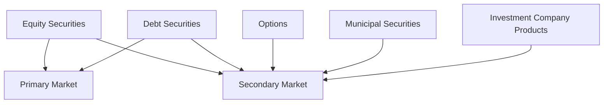

## 1.4 Study Strategies and Resources

Preparing for the Series 7 Exam requires a strategic approach that combines comprehensive study techniques with effective use of resources. This section will guide you through creating a study plan, selecting the right study materials, and utilizing practice exams to ensure you are fully prepared for the exam. By following these strategies, you can enhance your understanding of the material and boost your confidence on exam day.

### Developing a Study Plan

Creating a structured study plan is crucial for covering all content areas of the Series 7 Exam. A well-organized plan helps you manage your time effectively and ensures you focus on each topic systematically.

#### Steps to Create a Study Plan

1. **Assess Your Current Knowledge:**
   - Begin by evaluating your existing understanding of the exam topics. This will help you identify areas that require more attention.

2. **Set Clear Goals:**
   - Define what you aim to achieve in each study session. Setting specific objectives keeps you focused and motivated.

3. **Allocate Time Wisely:**
   - Divide your study time into manageable chunks, ensuring you cover all topics. Consider dedicating more time to complex subjects.

4. **Prioritize Topics:**
   - Focus on high-weight areas of the exam first. Use the Series 7 content outline to guide your priorities.

5. **Incorporate Breaks:**
   - Schedule regular breaks to avoid burnout. Short, frequent breaks can improve concentration and retention.

6. **Review and Adjust:**
   - Regularly review your progress and adjust your study plan as needed. Flexibility is key to accommodating unforeseen challenges.

#### Sample Study Plan

| Week | Topics Covered | Study Hours | Key Activities |
|------|----------------|-------------|----------------|
| 1    | Introduction to Securities Markets | 10 | Read textbook chapters, watch online lectures |
| 2    | Equity Securities | 12 | Practice questions, flashcards |
| 3    | Debt Securities | 15 | Mock exams, group discussions |
| 4    | Options | 14 | Case studies, interactive quizzes |
| 5    | Review and Reinforce | 20 | Comprehensive review, focus on weak areas |

### Recommended Study Materials

The right study materials can make a significant difference in your exam preparation. Utilize a variety of resources to reinforce your learning and gain different perspectives on the content.

#### Textbooks and Study Guides

- **Kaplan Series 7 Exam Prep:**
  - Offers comprehensive coverage of all exam topics with practice questions and detailed explanations.

- **STC Series 7 Exam Manual:**
  - Known for its clear explanations and practical examples, this guide is a favorite among test-takers.

- **Wiley Series 7 Exam Review:**
  - Provides in-depth content review and practice questions to test your knowledge.

#### Online Courses and Video Lectures

- **Kaplan Online Courses:**
  - Interactive courses with expert instructors, covering all exam topics with video lectures and quizzes.

- **STC Interactive Series 7 Course:**
  - Offers a blend of video lessons, practice exams, and personalized study plans.

- **Wiley Efficient Learning:**
  - Features adaptive learning technology to tailor study sessions to your strengths and weaknesses.

#### Flashcards and Mobile Apps

- **Quizlet Series 7 Flashcards:**
  - A convenient way to review key terms and concepts on the go.

- **STC Flashcard App:**
  - Offers digital flashcards that cover all major topics, perfect for quick reviews.

### Importance of Practice Exams and Question Banks

Practice exams are an essential component of your study strategy. They help you familiarize yourself with the exam format, identify knowledge gaps, and improve your test-taking skills.

#### Benefits of Practice Exams

1. **Simulate Exam Conditions:**
   - Practice exams mimic the actual test environment, helping you manage time and stress effectively.

2. **Identify Weak Areas:**
   - Reviewing practice exam results highlights topics that need more attention.

3. **Boost Confidence:**
   - Regular practice builds confidence and reduces exam anxiety.

4. **Improve Speed and Accuracy:**
   - Timed practice exams help you answer questions more quickly and accurately.

#### Recommended Practice Exam Providers

- **Kaplan Practice Exams:**
  - Offers a comprehensive question bank with detailed explanations for each answer.

- **STC Practice Tests:**
  - Provides a variety of practice exams with real-time feedback and performance tracking.

- **Wiley Test Bank:**
  - Features thousands of practice questions with customizable quizzes to target specific topics.

### Glossary

- **Study Plan:** A structured approach outlining study periods and objectives to ensure comprehensive coverage of exam content.

### References to Reputable Prep Providers

Consider enrolling in courses or utilizing materials from reputable providers such as Kaplan, STC, and Wiley. These organizations offer a range of study aids, including textbooks, online courses, and practice exams, tailored to the Series 7 Exam.

### Real-World Application and Case Studies

Understanding theoretical concepts is crucial, but applying them in real-world scenarios enhances learning and retention. Consider the following example:

**Case Study: Analyzing a Client's Portfolio**

Imagine you are a General Securities Representative tasked with reviewing a client's investment portfolio. The client has a mix of equity and debt securities, and they are interested in diversifying into options. Using your knowledge from the Series 7 Exam preparation, you assess the client's risk tolerance, investment goals, and market conditions to recommend suitable options strategies.

By practicing such scenarios, you can better understand how to apply exam concepts in professional settings.

### Diagrams and Visual Aids

To enhance your understanding of complex topics, use diagrams and charts. Here's a simple diagram illustrating the relationship between different types of securities and their market structures:

### Best Practices and Common Pitfalls

#### Best Practices

- **Active Learning:**
  - Engage with the material actively by taking notes, summarizing information, and teaching concepts to others.

- **Consistent Review:**
  - Regularly revisit topics to reinforce memory and understanding.

- **Utilize Multiple Resources:**
  - Combine textbooks, online courses, and practice exams for a well-rounded preparation.

#### Common Pitfalls

- **Procrastination:**
  - Avoid delaying study sessions. Stick to your study plan to stay on track.

- **Over-Reliance on One Resource:**
  - Diversify your study materials to gain different perspectives and insights.

- **Ignoring Weak Areas:**
  - Focus on improving weak areas rather than just reinforcing strengths.

### Summary

In summary, preparing for the Series 7 Exam requires a strategic approach that combines a structured study plan, diverse study materials, and regular practice exams. By following these strategies, you can enhance your understanding of the material and boost your confidence on exam day.

### Series 7 Exam Practice Questions: Study Strategies and Resources



### What is the first step in creating an effective study plan for the Series 7 Exam?

- [x] Assess your current knowledge of the exam topics
- [ ] Purchase all recommended study materials
- [ ] Schedule your exam date
- [ ] Join a study group

> **Explanation:** The first step in creating an effective study plan is to assess your current knowledge of the exam topics. This helps you identify areas that require more attention and allows you to tailor your study plan accordingly.

### Which of the following is a benefit of using practice exams in your study strategy?

- [ ] Practice exams are shorter than the actual exam
- [x] They help simulate exam conditions and improve time management
- [ ] They are only useful for reviewing content you already know
- [ ] They guarantee a passing score

> **Explanation:** Practice exams help simulate exam conditions and improve time management. They allow you to practice answering questions under timed conditions, helping you manage stress and improve accuracy.

### What is a key characteristic of a well-organized study plan?

- [ ] It focuses only on topics you find interesting
- [ ] It includes study periods without specific goals
- [x] It allocates time wisely to cover all topics
- [ ] It relies solely on one type of study material

> **Explanation:** A well-organized study plan allocates time wisely to cover all topics. It ensures that you focus on each content area systematically and prioritize high-weight areas of the exam.

### Which study material is known for its clear explanations and practical examples?

- [ ] Kaplan Series 7 Exam Prep
- [x] STC Series 7 Exam Manual
- [ ] Wiley Series 7 Exam Review
- [ ] Quizlet Series 7 Flashcards

> **Explanation:** The STC Series 7 Exam Manual is known for its clear explanations and practical examples, making it a favorite among test-takers.

### How can you avoid burnout during your study sessions?

- [ ] Study for long hours without breaks
- [ ] Focus only on your strengths
- [x] Incorporate regular breaks into your study schedule
- [ ] Use only digital resources

> **Explanation:** Incorporating regular breaks into your study schedule helps avoid burnout. Short, frequent breaks can improve concentration and retention, making study sessions more effective.

### What is the purpose of using flashcards in your study strategy?

- [ ] To replace textbooks and study guides
- [ ] To memorize entire chapters
- [x] To review key terms and concepts quickly
- [ ] To practice essay writing

> **Explanation:** Flashcards are used to review key terms and concepts quickly. They are a convenient tool for reinforcing memory and understanding of important topics.

### Which provider offers adaptive learning technology to tailor study sessions?

- [ ] Kaplan Online Courses
- [ ] STC Interactive Series 7 Course
- [x] Wiley Efficient Learning
- [ ] Quizlet Series 7 Flashcards

> **Explanation:** Wiley Efficient Learning features adaptive learning technology that tailors study sessions to your strengths and weaknesses, enhancing your preparation.

### Why is it important to regularly review your progress and adjust your study plan?

- [x] To accommodate unforeseen challenges and ensure comprehensive coverage
- [ ] To reduce study time as the exam approaches
- [ ] To focus solely on practice exams
- [ ] To avoid using multiple resources

> **Explanation:** Regularly reviewing your progress and adjusting your study plan is important to accommodate unforeseen challenges and ensure comprehensive coverage of all exam topics.

### What is a common pitfall to avoid during exam preparation?

- [ ] Using multiple study resources
- [x] Procrastination and delaying study sessions
- [ ] Focusing on weak areas
- [ ] Taking regular breaks

> **Explanation:** Procrastination and delaying study sessions is a common pitfall to avoid. Sticking to your study plan helps you stay on track and ensures you cover all content areas.

### How can real-world applications enhance your understanding of exam concepts?

- [ ] By focusing only on theoretical knowledge
- [ ] By memorizing textbook definitions
- [x] By applying concepts in professional settings and scenarios
- [ ] By avoiding practice exams

> **Explanation:** Real-world applications enhance your understanding of exam concepts by allowing you to apply them in professional settings and scenarios. This practical approach reinforces learning and retention.



By following these study strategies and utilizing the recommended resources, you can effectively prepare for the Series 7 Exam and increase your chances of success. Remember, consistent effort and strategic preparation are key to mastering the material and achieving your certification goals.
