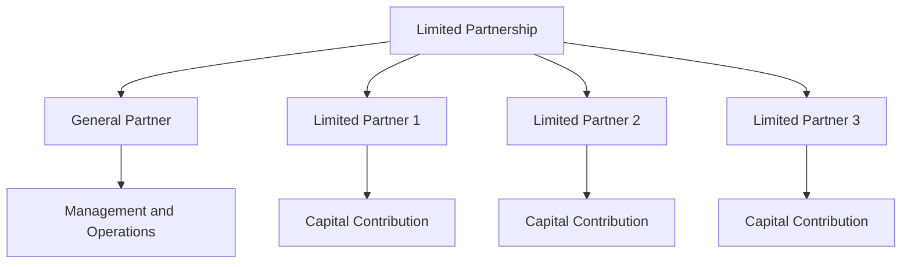

## 10.1.1 Limited Partnerships Structure

Limited Partnerships (LPs) are a cornerstone of Direct Participation Programs (DPPs), offering unique investment opportunities while presenting distinct structural and operational dynamics. Understanding the limited partnership structure is crucial for Series 7 candidates, as it encompasses key concepts related to investor roles, liability, and regulatory compliance. This section delves into the formation, roles, and operational nuances of limited partnerships, equipping you with the knowledge needed to excel in the securities industry.

### Overview of Limited Partnerships

A limited partnership is a business entity that consists of at least one general partner (GP) and one or more limited partners (LPs). This structure allows investors to participate in the profits and losses of a business without being involved in its day-to-day operations. The general partner manages the partnership and assumes unlimited liability, while limited partners contribute capital and enjoy limited liability.

**Key Characteristics:**
- **General Partner (GP):** Responsible for the management and operation of the partnership. The GP has unlimited liability, meaning they are personally liable for the partnership's debts and obligations.
- **Limited Partner (LP):** Provides capital to the partnership but does not participate in management. LPs have limited liability, which means their risk is confined to their investment in the partnership.

### Formation of Limited Partnerships

The formation of a limited partnership involves several legal and regulatory steps, ensuring compliance with state and federal laws. The process typically includes:

1. **Drafting a Partnership Agreement:** This document outlines the terms of the partnership, including the roles and responsibilities of the general and limited partners, profit-sharing arrangements, and procedures for adding or removing partners.

2. **Filing a Certificate of Limited Partnership:** This is filed with the state in which the partnership is formed. It includes the partnership's name, the names and addresses of the general partners, and the nature of the business.

3. **Compliance with State Laws:** Each state has specific laws governing the formation and operation of limited partnerships. It is crucial to adhere to these regulations to ensure the partnership's legal standing.

4. **Capital Contributions:** Limited partners contribute capital to the partnership, which is used to fund the partnership's operations and investments.

### Roles and Responsibilities

#### General Partner (GP)

The general partner plays a pivotal role in the management and operation of a limited partnership. Key responsibilities include:

- **Management and Decision-Making:** The GP is responsible for making strategic decisions and managing the day-to-day operations of the partnership.
- **Fiduciary Duty:** The GP has a fiduciary duty to act in the best interests of the partnership and its limited partners.
- **Unlimited Liability:** The GP is personally liable for the partnership's debts and obligations, which underscores the importance of prudent management.

#### Limited Partner (LP)

Limited partners are primarily investors in the partnership, with their roles and responsibilities characterized by:

- **Capital Contribution:** LPs provide the financial resources necessary for the partnership's operations and investments.
- **Limited Liability:** LPs are only liable up to the amount of their investment, protecting their personal assets from the partnership's liabilities.
- **Passive Role:** LPs do not participate in the management of the partnership, allowing them to benefit from the partnership's profits without being involved in its operations.

### Operational Dynamics

The operation of a limited partnership involves several key processes, including profit distribution, tax considerations, and regulatory compliance.

#### Profit Distribution

Profits in a limited partnership are typically distributed according to the terms outlined in the partnership agreement. This agreement specifies how profits and losses are allocated between the general and limited partners, often based on their respective contributions and roles.

#### Tax Considerations

Limited partnerships offer significant tax advantages, as they are typically treated as pass-through entities for tax purposes. This means that the partnership itself is not taxed; instead, profits and losses are passed through to the partners, who report them on their individual tax returns. This structure allows for potential tax savings and greater flexibility in managing tax liabilities.

#### Regulatory Compliance

Limited partnerships must comply with various regulatory requirements, including:

- **Securities Laws:** If the partnership interests are offered to the public, they must comply with federal and state securities laws, including registration and disclosure requirements.
- **Filing Requirements:** Partnerships must file annual reports and other documents with state authorities to maintain their legal standing.
- **Investor Protections:** Limited partnerships must adhere to regulations designed to protect investors, including providing accurate and timely information about the partnership's financial condition and operations.

### Organizational Structure

The organizational structure of a limited partnership is typically hierarchical, with the general partner at the top, overseeing the operations and management, and limited partners providing capital and receiving a share of the profits.

### Case Study: Real Estate Limited Partnership

Consider a real estate limited partnership formed to develop a commercial property. The general partner is a real estate development firm with expertise in managing construction projects. Limited partners include individual investors seeking passive income and capital appreciation.

- **General Partner's Role:** The GP oversees the project's development, negotiates contracts, and manages the property once completed.
- **Limited Partners' Role:** LPs provide the capital needed for land acquisition, construction, and marketing. They receive a share of the rental income and any profits from the eventual sale of the property.

This structure allows limited partners to benefit from the expertise of the general partner while limiting their risk to their initial investment.

### Common Pitfalls and Challenges

While limited partnerships offer numerous advantages, they also present potential challenges, including:

- **Management Conflicts:** Disputes between general and limited partners can arise, particularly if the partnership's performance does not meet expectations.
- **Regulatory Compliance:** Ensuring compliance with complex securities laws and regulations can be challenging, particularly for partnerships with numerous investors.
- **Liquidity Concerns:** Limited partnership interests can be illiquid, making it difficult for investors to sell their interests if they need to access their capital.

### Best Practices for Limited Partnerships

To maximize the benefits and minimize the risks associated with limited partnerships, consider the following best practices:

- **Clear Partnership Agreement:** A comprehensive partnership agreement can help prevent disputes and ensure that all partners understand their roles and responsibilities.
- **Regular Communication:** Open and transparent communication between the general and limited partners can foster trust and collaboration.
- **Professional Management:** Engaging experienced professionals to manage the partnership can enhance its performance and ensure compliance with regulatory requirements.

### Conclusion

Understanding the structure and operation of limited partnerships is essential for anyone preparing for the Series 7 Exam. By mastering the roles and responsibilities of general and limited partners, as well as the formation and operational dynamics of limited partnerships, you will be well-equipped to navigate the complexities of Direct Participation Programs and excel in your career as a securities professional.

---

## Series 7 Exam Practice Questions: Limited Partnerships Structure



### What is the primary role of a General Partner in a limited partnership?

- [x] Managing the partnership and assuming unlimited liability
- [ ] Providing capital and enjoying limited liability
- [ ] Acting as a passive investor
- [ ] Overseeing tax compliance only

> **Explanation:** The General Partner manages the partnership and has unlimited liability for its debts, distinguishing their role from that of Limited Partners.

### Which of the following best describes the liability of a Limited Partner?

- [ ] Unlimited liability for partnership debts
- [ ] Liability limited to the partnership's total debt
- [x] Liability limited to their investment in the partnership
- [ ] No liability for partnership debts

> **Explanation:** Limited Partners have liability limited to their investment, protecting their personal assets beyond their contribution.

### What document is essential for the formation of a limited partnership?

- [ ] Articles of Incorporation
- [x] Partnership Agreement
- [ ] Operating Agreement
- [ ] Certificate of Incorporation

> **Explanation:** A Partnership Agreement outlines the terms and conditions of the partnership, including roles and profit distribution.

### How are profits typically distributed in a limited partnership?

- [ ] Equally among all partners
- [x] According to the Partnership Agreement
- [ ] Based solely on capital contribution
- [ ] At the discretion of the Limited Partners

> **Explanation:** Profit distribution follows the guidelines set in the Partnership Agreement, which may consider roles and contributions.

### What is a significant tax advantage of a limited partnership?

- [ ] The partnership is taxed as a corporation
- [ ] Partners pay no taxes on profits
- [x] Profits are passed through to partners and taxed at the individual level
- [ ] The partnership itself pays taxes on profits

> **Explanation:** Limited partnerships are pass-through entities, meaning profits are taxed at the individual level, avoiding double taxation.

### Which scenario best illustrates a Limited Partner's role?

- [ ] Managing daily operations and making strategic decisions
- [x] Providing capital and receiving a share of profits
- [ ] Overseeing legal compliance and tax filings
- [ ] Engaging in marketing and sales activities

> **Explanation:** Limited Partners provide capital and receive profits without engaging in management, aligning with their passive investment role.

### What is a potential challenge of investing in a limited partnership?

- [ ] High liquidity of partnership interests
- [ ] Limited regulatory requirements
- [x] Illiquidity of partnership interests
- [ ] Lack of profit-sharing opportunities

> **Explanation:** Limited partnership interests are often illiquid, making it difficult for investors to sell their stakes quickly.

### What is the primary regulatory concern for limited partnerships offering interests to the public?

- [ ] Avoiding double taxation
- [ ] Ensuring limited liability for all partners
- [x] Compliance with securities laws
- [ ] Maintaining equal profit distribution

> **Explanation:** Public offerings of partnership interests must comply with securities laws, including registration and disclosure requirements.

### How does a General Partner's fiduciary duty affect their role?

- [ ] It limits their ability to make management decisions
- [ ] It requires them to act in their own best interest
- [x] It obligates them to act in the best interest of the partnership and its partners
- [ ] It allows them to delegate all responsibilities to Limited Partners

> **Explanation:** A General Partner's fiduciary duty requires them to prioritize the partnership's and partners' interests in their management decisions.

### What is a key consideration when drafting a Partnership Agreement?

- [ ] Ensuring all partners have equal management roles
- [ ] Excluding profit distribution details
- [x] Clearly defining roles, responsibilities, and profit-sharing
- [ ] Minimizing legal compliance requirements

> **Explanation:** A well-drafted Partnership Agreement should clearly define roles, responsibilities, and profit-sharing to prevent disputes and ensure smooth operations.



---
