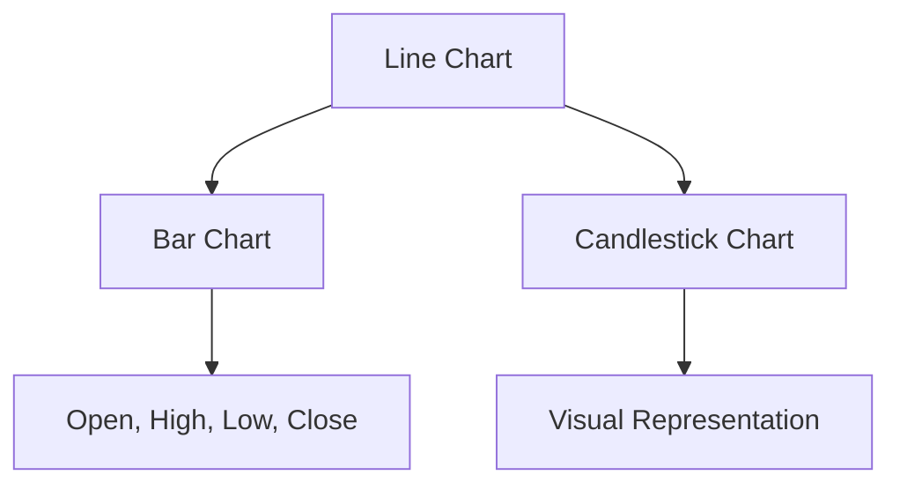
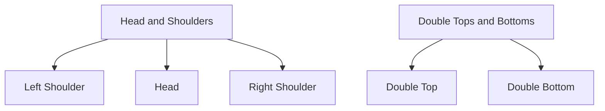

## 11.2.1 Chart Types and Patterns

In the world of securities trading, technical analysis is a crucial tool used by traders to evaluate and predict future price movements based on historical data. A fundamental aspect of technical analysis is the use of charts to visualize price trends and patterns. This section will delve into various chart types, such as line charts, bar charts, and candlestick charts, and analyze common patterns like Head and Shoulders and Double Tops and Bottoms. Understanding these concepts will help you interpret market signals and make informed trading decisions.

### Chart Types

#### Line Charts

Line charts are one of the simplest forms of charts used in technical analysis. They plot a series of data points connected by straight lines, typically representing the closing prices of a security over a specified period. This type of chart is beneficial for identifying long-term trends and providing a clear view of price movements without the noise of intraday fluctuations.

**Advantages of Line Charts:**
- Easy to read and interpret.
- Highlights the overall trend of a security.
- Ideal for beginners due to its simplicity.

**Example:**
Consider a line chart of a company's stock over a year. The chart shows a steady upward trend, indicating consistent growth in the stock's value.

#### Bar Charts

Bar charts provide more detailed information than line charts by displaying the opening, closing, high, and low prices for each period. Each bar represents a single period (e.g., a day, week, or month) and consists of a vertical line (indicating the range from low to high) and two horizontal lines (showing the opening and closing prices).

**Advantages of Bar Charts:**
- Offers a comprehensive view of price movements.
- Useful for identifying price patterns and trends.
- Allows traders to assess volatility and market sentiment.

**Example:**
A bar chart of a stock might reveal a series of higher highs and higher lows, suggesting an upward trend with increasing volatility.

#### Candlestick Charts

Candlestick charts are similar to bar charts but provide a more visually appealing representation of price data. Each candlestick displays the high, low, opening, and closing prices for a specific period. The body of the candlestick represents the range between the opening and closing prices, while the wicks (or shadows) show the high and low prices.

**Advantages of Candlestick Charts:**
- Easily identifies bullish and bearish trends.
- Highlights market sentiment through color-coded candlesticks.
- Offers insights into potential reversals and continuations.

**Example:**
A candlestick chart might show a series of green candlesticks (indicating upward movement) followed by a red candlestick with a long upper wick, suggesting a potential reversal.

### Common Patterns

#### Head and Shoulders

The Head and Shoulders pattern is a reversal pattern that signals a potential change in trend direction. It consists of three peaks: a higher peak (head) between two lower peaks (shoulders). This pattern can occur in both upward and downward trends.

**Characteristics:**
- **Left Shoulder:** A peak followed by a decline.
- **Head:** A higher peak followed by a decline.
- **Right Shoulder:** A peak lower than the head, followed by a decline.

**Significance:**
- Indicates a potential reversal from a bullish to a bearish trend.
- The pattern is confirmed when the price breaks below the neckline (a line drawn connecting the lows of the two troughs).

**Example:**
In an upward trend, a Head and Shoulders pattern may form, suggesting that the bullish momentum is weakening, and a bearish reversal is likely.

#### Double Tops and Bottoms

Double Tops and Bottoms are patterns that suggest a possible change in trend. A Double Top is a bearish reversal pattern, while a Double Bottom is a bullish reversal pattern.

**Double Top Characteristics:**
- Two peaks at approximately the same level.
- Indicates resistance at a particular price level.
- Confirmed when the price breaks below the support level between the two peaks.

**Double Bottom Characteristics:**
- Two troughs at approximately the same level.
- Indicates support at a particular price level.
- Confirmed when the price breaks above the resistance level between the two troughs.

**Example:**
A Double Top pattern might form at the end of an upward trend, suggesting that the price is struggling to break higher, leading to a potential downward reversal.

### The Role of Volume in Confirming Patterns

Volume is a critical factor in confirming chart patterns. It measures the number of shares or contracts traded in a security or market during a given period. High volume often indicates strong investor interest and can confirm the validity of a pattern.

**Key Points:**
- **High Volume:** Confirms the strength of a trend or pattern. For example, a breakout from a Head and Shoulders pattern with high volume is more likely to lead to a sustained move.
- **Low Volume:** May indicate a lack of conviction, suggesting that a pattern might not hold.

**Example:**
A Double Bottom pattern followed by a breakout with increasing volume suggests a strong bullish reversal, as more traders are participating in the upward movement.

### Glossary

- **Candlestick Chart:** A type of financial chart used to describe price movements of a security, derivative, or currency. It displays the high, low, opening, and closing prices in a visual format.
- **Support and Resistance Levels:** Price levels where securities tend to stop and reverse. Support is a level where a downtrend can be expected to pause due to a concentration of demand. Resistance is a level where an uptrend can be expected to pause due to a concentration of supply.

### Conclusion

Understanding chart types and patterns is essential for technical analysis and can significantly enhance your ability to interpret market trends and make informed trading decisions. By mastering these concepts, you will be better equipped to recognize potential reversals, continuations, and the significance of volume in confirming patterns. As you prepare for the Series 7 Exam, focus on these key areas to strengthen your technical analysis skills and improve your performance.

## Series 7 Exam Practice Questions: Chart Types and Patterns



### Which chart type provides the simplest representation of a security's price movement over time?

- [x] Line Chart
- [ ] Bar Chart
- [ ] Candlestick Chart
- [ ] Point and Figure Chart

> **Explanation:** Line charts provide a simple representation by connecting closing prices over a period, making them easy to read and interpret.

### What does a Head and Shoulders pattern typically indicate?

- [ ] Continuation of a trend
- [x] Reversal of a trend
- [ ] Consolidation
- [ ] Breakout

> **Explanation:** A Head and Shoulders pattern typically indicates a reversal of a trend, signaling a potential change from bullish to bearish or vice versa.

### In a candlestick chart, what does a long upper wick suggest?

- [ ] Strong buying pressure
- [ ] Strong selling pressure
- [x] Rejection of higher prices
- [ ] Consolidation

> **Explanation:** A long upper wick in a candlestick chart suggests that higher prices were rejected, indicating potential selling pressure or a reversal.

### What is the significance of volume in confirming chart patterns?

- [ ] Volume is irrelevant to chart patterns
- [x] High volume confirms the strength of a pattern
- [ ] Low volume confirms the strength of a pattern
- [ ] Volume only matters in line charts

> **Explanation:** High volume confirms the strength of a pattern, as it indicates strong investor interest and conviction in the trend.

### Which of the following is a bullish reversal pattern?

- [ ] Head and Shoulders
- [ ] Double Top
- [x] Double Bottom
- [ ] Descending Triangle

> **Explanation:** A Double Bottom is a bullish reversal pattern, suggesting that the price has found support and is likely to move higher.

### What does a Double Top pattern suggest?

- [x] Potential bearish reversal
- [ ] Continuation of an uptrend
- [ ] Consolidation phase
- [ ] Breakout to new highs

> **Explanation:** A Double Top pattern suggests a potential bearish reversal, indicating that the price is struggling to break higher and may reverse downward.

### How is the 'neckline' used in a Head and Shoulders pattern?

- [ ] As a resistance level
- [x] As a confirmation line for the pattern
- [ ] As a support level
- [ ] As a trendline

> **Explanation:** The neckline acts as a confirmation line in a Head and Shoulders pattern. The pattern is confirmed when the price breaks below the neckline.

### What is a key characteristic of a candlestick chart?

- [ ] It only shows closing prices
- [ ] It uses bars to represent data
- [x] It displays open, high, low, and close prices
- [ ] It uses dots to represent data points

> **Explanation:** A candlestick chart displays open, high, low, and close prices, providing a comprehensive view of price movements for a given period.

### Which chart type is best for identifying long-term trends?

- [x] Line Chart
- [ ] Bar Chart
- [ ] Candlestick Chart
- [ ] Renko Chart

> **Explanation:** Line charts are best for identifying long-term trends as they provide a clear view of the overall direction of price movements over time.

### What does a series of higher highs and higher lows in a bar chart indicate?

- [ ] A bearish trend
- [ ] A sideways trend
- [x] A bullish trend
- [ ] A trend reversal

> **Explanation:** A series of higher highs and higher lows in a bar chart indicates a bullish trend, suggesting that the price is consistently moving higher.



By mastering these chart types and patterns, you will be well-prepared to tackle questions related to technical analysis on the Series 7 Exam. Remember to practice identifying these patterns and understanding their implications in real-world scenarios to enhance your trading skills and exam readiness.
