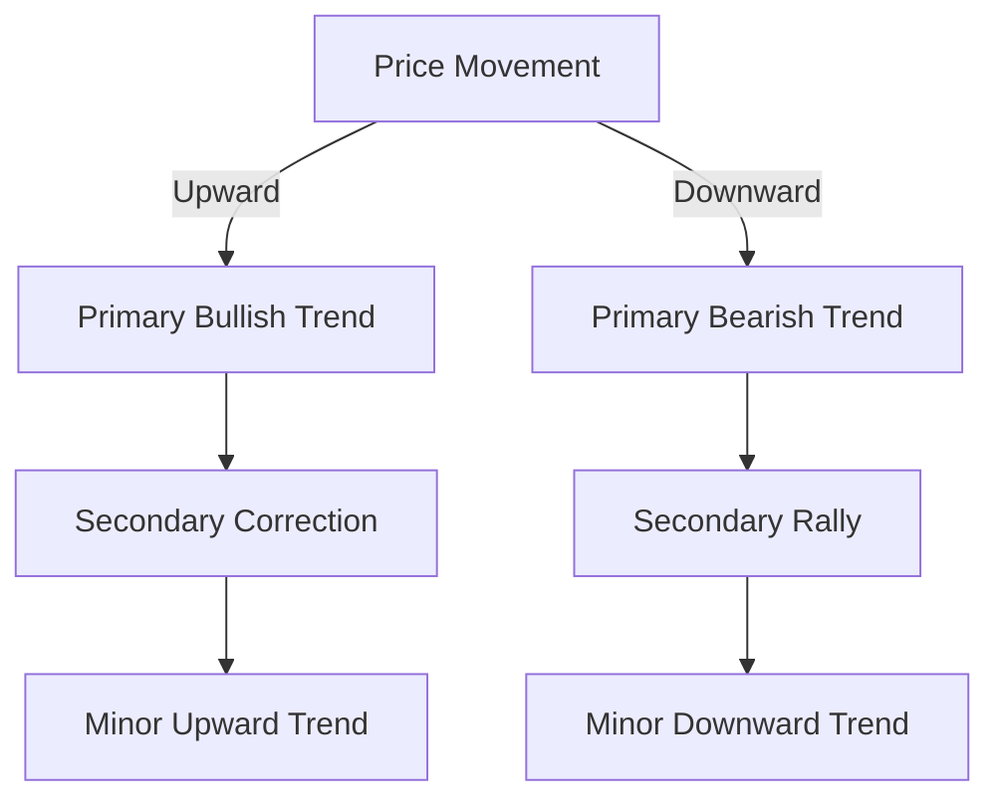

## 11.2.3 Market Trends and Signals

Understanding market trends and signals is crucial for anyone preparing for the Series 7 Exam. This section will provide you with a comprehensive overview of the types of trends, key trend reversal signals, continuation patterns, and the role of moving averages in identifying trends. By mastering these concepts, you'll be better equipped to analyze market movements and make informed decisions in your role as a General Securities Representative.

### Identifying Primary, Secondary, and Minor Trends

#### Primary Trends

Primary trends are the long-term movements in the market that can last from several months to many years. These trends are often referred to as bull or bear markets. A **bullish trend** is characterized by a sustained upward movement in prices, while a **bearish trend** indicates a prolonged downward movement. Identifying the direction of the primary trend is essential for long-term investment strategies.

- **Example:** During the 2009-2020 period, the U.S. stock market experienced a significant bullish trend, driven by economic recovery and growth.

#### Secondary Trends

Secondary trends are shorter-term fluctuations that occur within the primary trend. These trends typically last from a few weeks to a few months and can be seen as corrections in a bull market or rallies in a bear market. They provide opportunities for traders to capitalize on price movements within the broader trend.

- **Example:** In a bull market, a secondary trend might manifest as a temporary market correction, where prices dip before resuming their upward trajectory.

#### Minor Trends

Minor trends are the day-to-day price movements that occur over a short period, usually lasting less than a month. These trends are often influenced by immediate news events or short-term market sentiment. While minor trends are less significant for long-term investors, they are crucial for day traders and those employing short-term strategies.

- **Example:** A company's earnings report might cause a minor trend, leading to a brief spike or drop in its stock price.

### Trend Reversal Signals and Continuation Patterns

#### Trend Reversal Signals

Trend reversal signals indicate that the current trend is likely to change direction. Recognizing these signals can help investors and traders make timely decisions to buy or sell securities.

- **Head and Shoulders Pattern:** This classic reversal pattern consists of three peaks: a higher peak (head) between two lower peaks (shoulders). A break below the neckline suggests a bearish reversal.
  
- **Double Tops and Bottoms:** Double tops indicate a bearish reversal, while double bottoms suggest a bullish reversal. These patterns form when the price tests a support or resistance level twice before reversing.

- **Example:** If a stock forms a double top and breaks below the support level, it may signal a shift from a bullish to a bearish trend.

#### Continuation Patterns

Continuation patterns suggest that the current trend will continue after a period of consolidation. These patterns are useful for traders looking to enter positions in the direction of the prevailing trend.

- **Triangles (Ascending, Descending, Symmetrical):** Triangles form when the price moves within converging trendlines. A breakout in the direction of the trend confirms the continuation.

- **Flags and Pennants:** These short-term patterns indicate a brief pause in the trend. Flags are rectangular, while pennants are triangular. A breakout in the trend direction signals continuation.

- **Example:** In a bullish trend, a flag pattern followed by an upward breakout suggests the trend will continue.

### The Role of Moving Averages in Identifying Trends

Moving averages are a fundamental tool in technical analysis, helping to smooth out price data and identify trends over time. They are particularly useful for distinguishing between noise and the underlying trend.

#### Types of Moving Averages

- **Simple Moving Average (SMA):** The SMA is calculated by averaging a set number of closing prices. It provides a straightforward view of the trend direction.

- **Exponential Moving Average (EMA):** The EMA gives more weight to recent prices, making it more responsive to new information. It is often preferred for identifying short-term trends.

#### Using Moving Averages

- **Trend Identification:** A rising moving average indicates a bullish trend, while a falling moving average suggests a bearish trend. Crossovers between short-term and long-term moving averages can signal potential trend changes.

- **Support and Resistance:** Moving averages can act as dynamic support or resistance levels, where prices may bounce or reverse.

- **Example:** A 50-day SMA crossing above a 200-day SMA, known as a "golden cross," is a bullish signal, while the opposite, a "death cross," is bearish.

#### Practical Application

- **Case Study:** Consider a stock trading in a bullish trend. The 50-day EMA is above the 200-day EMA, confirming the trend. A trader might look for a pullback to the 50-day EMA as a buying opportunity, expecting the trend to continue.

### Glossary

- **Bullish Trend:** A sustained upward movement in price.
- **Bearish Trend:** A sustained downward movement in price.

### Visualizing Trends and Signals

To better understand these concepts, let's examine some charts that illustrate trendlines and signals.

In the diagram above, you can see how primary trends encompass secondary and minor trends. Understanding the interplay between these trends is crucial for effective market analysis.

### Best Practices and Common Pitfalls

- **Best Practices:**
  - Use multiple indicators to confirm trends and signals.
  - Stay updated with market news and events that may impact trends.
  - Practice analyzing historical charts to improve pattern recognition skills.

- **Common Pitfalls:**
  - Relying solely on one indicator or pattern without confirmation.
  - Ignoring the broader market context or fundamental factors.
  - Overtrading based on minor trends without considering the primary trend.

### Strategies for Exam Success

- **Mnemonic Devices:** Use acronyms like "H&S" for Head and Shoulders to remember reversal patterns.
- **Practice Questions:** Engage with practice exams to test your understanding of trends and signals.
- **Review and Self-Test:** Regularly review key concepts and test yourself on identifying trends and signals.

### Conclusion

Mastering market trends and signals is essential for success on the Series 7 Exam and in your career as a General Securities Representative. By understanding primary, secondary, and minor trends, recognizing trend reversal signals and continuation patterns, and effectively using moving averages, you will be well-prepared to analyze market movements and make informed decisions. Remember to practice regularly and apply these concepts to real-world scenarios to reinforce your learning.

## Series 7 Exam Practice Questions: Market Trends and Signals



### What is a primary trend?

- [x] A long-term movement in the market that can last from several months to many years
- [ ] A short-term fluctuation within a primary trend
- [ ] A day-to-day price movement
- [ ] A reversal pattern indicating a change in direction

> **Explanation:** A primary trend is a long-term movement in the market, often referred to as a bull or bear market, lasting from several months to many years.

### Which pattern indicates a potential trend reversal?

- [ ] Flag
- [ ] Pennant
- [x] Head and Shoulders
- [ ] Ascending Triangle

> **Explanation:** The Head and Shoulders pattern is a classic reversal pattern indicating a potential change in trend direction.

### What does a "golden cross" signify?

- [ ] A bearish signal
- [x] A bullish signal
- [ ] A continuation pattern
- [ ] A minor trend

> **Explanation:** A "golden cross" occurs when a short-term moving average crosses above a long-term moving average, indicating a bullish signal.

### What is the role of moving averages in technical analysis?

- [x] To smooth out price data and identify trends
- [ ] To predict economic indicators
- [ ] To calculate bond yields
- [ ] To determine company financial health

> **Explanation:** Moving averages smooth out price data to help identify trends and eliminate noise in the market.

### What characterizes a bullish trend?

- [ ] A sustained downward movement in price
- [x] A sustained upward movement in price
- [ ] A short-term price correction
- [ ] A sideways movement in price

> **Explanation:** A bullish trend is characterized by a sustained upward movement in price.

### Which moving average is more responsive to recent price changes?

- [ ] Simple Moving Average (SMA)
- [x] Exponential Moving Average (EMA)
- [ ] Weighted Moving Average (WMA)
- [ ] Linear Moving Average (LMA)

> **Explanation:** The Exponential Moving Average (EMA) gives more weight to recent prices, making it more responsive to new information.

### What is a secondary trend?

- [ ] A long-term market movement
- [x] A shorter-term fluctuation within a primary trend
- [ ] A day-to-day price movement
- [ ] A reversal pattern

> **Explanation:** A secondary trend is a shorter-term fluctuation that occurs within the primary trend, lasting from a few weeks to a few months.

### How do moving averages act in relation to prices?

- [x] As dynamic support or resistance levels
- [ ] As fixed points of reversal
- [ ] As indicators of company profitability
- [ ] As measures of market volatility

> **Explanation:** Moving averages can act as dynamic support or resistance levels, where prices may bounce or reverse.

### What is indicated by a double top pattern?

- [x] A bearish reversal
- [ ] A bullish reversal
- [ ] A continuation of the current trend
- [ ] A minor trend change

> **Explanation:** A double top pattern indicates a bearish reversal, suggesting that the price may start to decline after testing a resistance level twice.

### Which pattern suggests a continuation of the current trend?

- [ ] Head and Shoulders
- [ ] Double Bottom
- [x] Flag
- [ ] Double Top

> **Explanation:** A flag pattern suggests a continuation of the current trend after a brief pause or consolidation.



By understanding these concepts and practicing with the questions provided, you will be well-prepared to tackle market trends and signals on the Series 7 Exam. Good luck with your studies!
