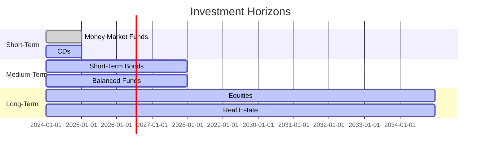

## 12.1.1 Time Horizon

Understanding the concept of time horizon is crucial for effective portfolio management and investment planning. Time horizon refers to the length of time an investor expects to hold an investment before taking the money out. It plays a significant role in determining an investor's risk tolerance and the appropriate asset allocation strategy. In this section, we will delve into the intricacies of time horizon, explore short-term versus long-term investment strategies, and illustrate how time affects risk tolerance and asset allocation.

### What is Time Horizon?

Time horizon is the period during which an investor expects to hold an investment to achieve a specific financial goal. It can range from a few months to several decades, depending on the investor's objectives. Understanding your time horizon is essential because it influences the types of investments that are suitable for you and the level of risk you can afford to take.

### Types of Time Horizons

Time horizons can generally be categorized into three types:

1. **Short-Term Horizon**: Typically less than three years. This is suitable for investors who need liquidity in the near future and are less tolerant of market volatility. Examples include saving for a vacation, a down payment on a house, or an emergency fund.

2. **Medium-Term Horizon**: Ranges from three to ten years. This horizon is for investors who have a specific goal that is not immediate but not too far off either, such as saving for a child's education or a significant life event.

3. **Long-Term Horizon**: More than ten years. This is ideal for investors with goals like retirement savings or generational wealth building. Long-term horizons allow for greater exposure to equities due to the potential for higher returns and the ability to weather market fluctuations.

### Short-Term vs. Long-Term Investment Strategies

#### Short-Term Investment Strategies

Short-term investment strategies focus on preserving capital and maintaining liquidity. These strategies often involve low-risk investments such as:

- **Money Market Funds**: These are mutual funds that invest in short-term, high-quality debt instruments. They offer liquidity and stability, making them suitable for short-term goals.

- **Certificates of Deposit (CDs)**: CDs are time deposits offered by banks with fixed interest rates and maturity dates. They provide a predictable return with minimal risk.

- **Treasury Bills**: Short-term government securities with maturities of one year or less. They are considered low-risk and provide a safe place to park cash.

- **Short-Term Bonds**: Bonds with maturities of less than three years. They offer higher yields than money market funds but with slightly more risk.

#### Long-Term Investment Strategies

Long-term investment strategies aim for growth and involve taking on more risk to achieve higher returns. These strategies often include:

- **Equities**: Stocks are a fundamental component of long-term portfolios due to their potential for high returns. They can be volatile in the short term but tend to perform well over extended periods.

- **Real Estate**: Investing in property can provide income through rent and potential appreciation over time. Real estate is less liquid but can be a valuable part of a diversified long-term strategy.

- **Index Funds and ETFs**: These funds track a market index and offer diversification at a low cost. They are suitable for long-term investors looking to capture market returns.

- **Retirement Accounts**: Contributions to 401(k)s, IRAs, and other retirement accounts are typically invested with a long-term horizon in mind, focusing on growth and tax advantages.

### How Time Affects Risk Tolerance and Asset Allocation

The time horizon significantly influences an investor's risk tolerance and asset allocation. Here's how:

#### Risk Tolerance

- **Short-Term Investors**: Typically have a lower risk tolerance because they cannot afford to lose capital in the short term. They prefer investments that offer stability and predictability.

- **Long-Term Investors**: Generally have a higher risk tolerance because they have more time to recover from market downturns. They can afford to invest in higher-risk assets like stocks, which offer higher potential returns.

#### Asset Allocation

Asset allocation is the process of dividing an investment portfolio among different asset categories, such as stocks, bonds, and cash. The time horizon plays a pivotal role in determining the appropriate asset allocation:

- **Short-Term Horizon**: A conservative asset allocation is recommended, with a higher percentage of bonds and cash equivalents to minimize risk.

- **Medium-Term Horizon**: A balanced approach is suitable, with a mix of stocks and bonds to achieve growth while managing risk.

- **Long-Term Horizon**: An aggressive asset allocation is often appropriate, with a higher percentage of equities to maximize growth potential.

### Timelines Illustrating Different Investment Horizons

To better understand how time horizon affects investment decisions, let's look at some illustrative timelines:

### Practical Examples and Scenarios

#### Example 1: Short-Term Goal

**Scenario**: You plan to buy a car in two years and have saved $20,000 for this purpose.

**Strategy**: Given the short time horizon, you would likely invest in a money market fund or a 2-year CD to preserve capital and earn a modest return.

#### Example 2: Medium-Term Goal

**Scenario**: You aim to fund your child's college education, which is seven years away.

**Strategy**: A balanced portfolio with a mix of stocks and bonds would be suitable. This allows for growth while managing risk, aligning with the medium-term horizon.

#### Example 3: Long-Term Goal

**Scenario**: You are 30 years old and planning for retirement at age 65.

**Strategy**: With a long-term horizon, you can afford to take on more risk by investing heavily in equities. Over time, this strategy is likely to yield higher returns, helping you build a substantial retirement fund.

### Real-World Applications and Regulatory Scenarios

In the real world, understanding time horizon is crucial for financial advisors and securities representatives. It helps them tailor investment strategies to meet clients' needs and comply with regulatory requirements. For instance, FINRA Rule 2111 emphasizes the importance of understanding a customer's investment profile, including their time horizon, to ensure suitable investment recommendations.

### Common Pitfalls and Best Practices

#### Pitfalls

- **Ignoring Time Horizon**: Failing to consider the time horizon can lead to inappropriate investment choices, such as investing in volatile stocks for short-term goals.

- **Overreacting to Market Volatility**: Short-term market fluctuations can tempt investors to make hasty decisions that may not align with their long-term objectives.

#### Best Practices

- **Regularly Review and Adjust**: Periodically reassess your time horizon and adjust your portfolio as needed to stay aligned with your financial goals.

- **Diversify**: Regardless of the time horizon, diversification can help manage risk and improve potential returns.

- **Stay Informed**: Keep abreast of market trends and economic conditions that may impact your investments.

### Conclusion

Understanding and effectively applying the concept of time horizon is fundamental to successful investment planning and portfolio management. By aligning your investment strategies with your time horizon, you can optimize risk and return, ensuring that you meet your financial goals. Whether you are saving for a short-term purchase or planning for retirement, a clear understanding of your time horizon will guide your investment decisions and help you navigate the complexities of the securities market.

## Series 7 Exam Practice Questions: Time Horizon



### What is the primary consideration when determining an investor's time horizon?

- [x] The length of time until the investor needs to access the funds
- [ ] The investor's current income level
- [ ] The investor's risk tolerance
- [ ] The investor's age

> **Explanation:** Time horizon is primarily concerned with the period until the funds are needed, which influences investment choices and risk tolerance.

### Which investment is most suitable for a short-term time horizon?

- [ ] Equities
- [ ] Real Estate
- [x] Money Market Funds
- [ ] Long-term Bonds

> **Explanation:** Money Market Funds are appropriate for short-term horizons due to their liquidity and low risk.

### Why might a long-term investor have a higher risk tolerance?

- [ ] They have more disposable income
- [x] They have more time to recover from market downturns
- [ ] They are less concerned about inflation
- [ ] They are focused on short-term gains

> **Explanation:** Long-term investors can afford to take on more risk because they have time to ride out market volatility.

### What is a key characteristic of a long-term investment strategy?

- [ ] Focus on capital preservation
- [ ] Emphasis on liquidity
- [ ] Avoidance of market risk
- [x] Potential for higher returns through equities

> **Explanation:** Long-term strategies often involve equities, which offer higher returns but come with greater risk.

### How does time horizon affect asset allocation?

- [ ] It determines the investor's tax bracket
- [x] It influences the proportion of stocks and bonds in a portfolio
- [ ] It sets the minimum investment amount
- [ ] It dictates the choice of financial advisor

> **Explanation:** Time horizon impacts how assets are allocated between stocks, bonds, and other investments to balance risk and return.

### What is a common pitfall for short-term investors?

- [ ] Investing too heavily in equities
- [ ] Focusing on long-term goals
- [x] Overreacting to market volatility
- [ ] Ignoring tax implications

> **Explanation:** Short-term investors may react impulsively to market changes, which can lead to poor investment decisions.

### Which scenario best represents a medium-term time horizon?

- [ ] Saving for a vacation next year
- [x] Planning for a child's college education in seven years
- [ ] Building a retirement fund for 30 years
- [ ] Buying groceries next week

> **Explanation:** A seven-year horizon fits medium-term planning, suitable for goals like education funding.

### What type of investment is typically avoided in a short-term portfolio?

- [ ] Treasury Bills
- [x] High-volatility stocks
- [ ] Certificates of Deposit
- [ ] Money Market Funds

> **Explanation:** High-volatility stocks are generally unsuitable for short-term portfolios due to their unpredictable nature.

### How can an investor manage risk with a long-term horizon?

- [ ] By keeping all assets in cash
- [ ] By avoiding all market exposure
- [x] By diversifying across asset classes
- [ ] By focusing exclusively on bonds

> **Explanation:** Diversification helps manage risk while allowing for potential growth over a long-term horizon.

### Why is regular review important for investment portfolios?

- [ ] To avoid paying taxes
- [ ] To switch financial advisors frequently
- [x] To ensure alignment with changing goals and time horizons
- [ ] To maximize short-term gains

> **Explanation:** Regular reviews help adjust the portfolio to remain aligned with an investor's evolving goals and time horizons.


