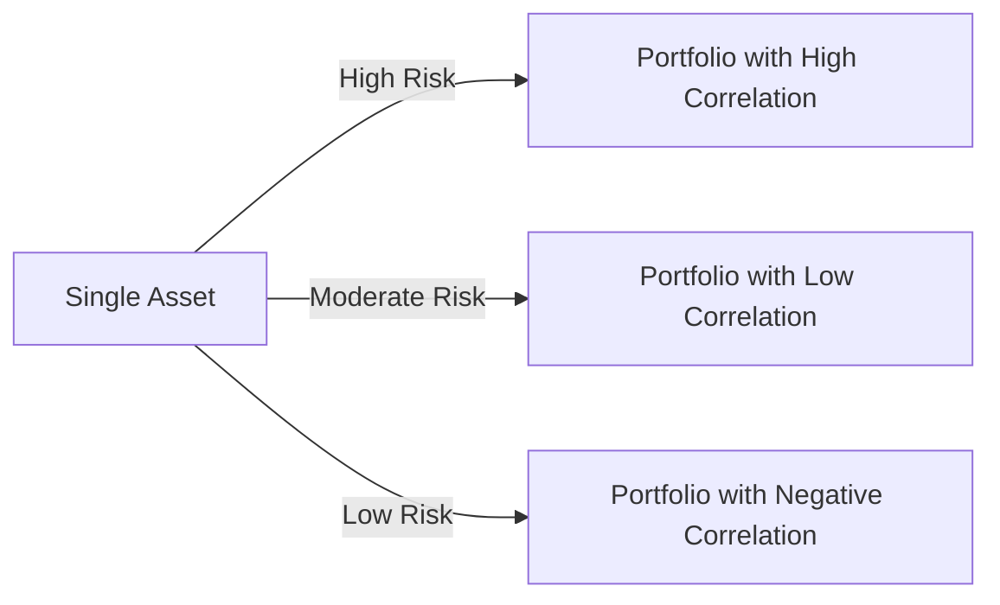

## 12.2.3 Diversification Principles

Diversification is a fundamental principle in portfolio management aimed at reducing risk and enhancing returns. By spreading investments across various asset classes, sectors, and geographic regions, investors can mitigate the impact of unsystematic risk, which is specific to individual securities or industries. This section will delve into the principles of diversification, its benefits, and how correlation between assets plays a crucial role in constructing a diversified portfolio.

### Understanding Diversification

Diversification involves allocating investments across different financial instruments, industries, and other categories to reduce exposure to any single asset or risk. The primary goal is to maximize returns by investing in areas that would react differently to the same event. A well-diversified portfolio will contain a mix of asset classes, such as stocks, bonds, and real estate, as well as investments in different sectors and regions.

### Reducing Unsystematic Risk

Unsystematic risk, also known as specific or idiosyncratic risk, is the risk associated with a particular company or industry. This type of risk can be mitigated through diversification. By investing in a variety of assets, the negative performance of one investment can be offset by the positive performance of others. This is in contrast to systematic risk, which affects the entire market and cannot be eliminated through diversification.

#### Example of Unsystematic Risk

Consider a portfolio that consists solely of airline stocks. If an unexpected event, such as a significant increase in fuel prices, negatively impacts the airline industry, the entire portfolio would suffer. However, if the portfolio is diversified across different sectors, such as technology, healthcare, and consumer goods, the impact of the event on the portfolio would be minimized.

### The Role of Correlation in Diversification

Correlation measures the degree to which two assets move in relation to each other. It is a crucial factor in diversification, as it determines how different investments interact within a portfolio. Correlation is expressed as a coefficient ranging from -1 to +1:

- **Positive Correlation (+1):** Assets move in the same direction. If one asset increases in value, the other is likely to increase as well.
- **Negative Correlation (-1):** Assets move in opposite directions. If one asset increases in value, the other is likely to decrease.
- **Zero Correlation (0):** No predictable relationship between the movements of the assets.

#### Impact of Correlation on Portfolio Diversification

To achieve effective diversification, it is essential to include assets with low or negative correlations. This ensures that the portfolio's overall risk is reduced, as the negative performance of one asset can be balanced by the positive performance of another. Including assets with high positive correlations may not provide the desired diversification benefits, as they are likely to move in the same direction during market fluctuations.

### Benefits of Diversification

1. **Risk Reduction:** Diversification reduces unsystematic risk by spreading investments across various assets, sectors, and regions.
2. **Smoother Returns:** A diversified portfolio tends to have more stable returns over time, as the volatility of individual investments is mitigated.
3. **Capital Preservation:** By minimizing the impact of negative events on the portfolio, diversification helps preserve capital.
4. **Opportunities for Growth:** Diversification allows investors to participate in various market opportunities, potentially enhancing returns.

### Practical Application of Diversification

When constructing a diversified portfolio, consider the following steps:

1. **Asset Allocation:** Determine the appropriate mix of asset classes based on investment goals, risk tolerance, and time horizon. This could include equities, fixed income, real estate, and alternative investments.

2. **Sector Diversification:** Within each asset class, diversify across different sectors to reduce exposure to sector-specific risks. For example, within equities, invest in technology, healthcare, consumer goods, and financials.

3. **Geographic Diversification:** Spread investments across different geographic regions to mitigate country-specific risks. This can include domestic and international investments.

4. **Investment Style Diversification:** Incorporate different investment styles, such as growth and value investing, to capture opportunities across various market conditions.

5. **Regular Rebalancing:** Periodically review and adjust the portfolio to maintain the desired level of diversification and alignment with investment objectives.

### Diversification in Practice: Case Study

Let's consider a case study to illustrate the practical application of diversification principles:

**Case Study: Building a Diversified Portfolio**

John, a 35-year-old investor, aims to build a diversified portfolio with a moderate risk tolerance. He decides to allocate his investments as follows:

- **Equities (60%):** John invests in a mix of large-cap, mid-cap, and small-cap stocks across various sectors, including technology, healthcare, and consumer staples. He also includes international equities to enhance geographic diversification.

- **Fixed Income (30%):** To provide stability and income, John invests in a combination of government bonds, corporate bonds, and municipal bonds. He selects bonds with varying maturities to manage interest rate risk.

- **Real Estate (5%):** John includes real estate investment trusts (REITs) to gain exposure to the real estate market without directly owning properties.

- **Alternative Investments (5%):** To further diversify his portfolio, John allocates a small portion to alternative investments, such as commodities and hedge funds.

By following these diversification principles, John reduces his portfolio's unsystematic risk and positions himself for long-term growth.

### Visualizing Diversification

To better understand the benefits of diversification, let's examine a chart that illustrates how diversification can reduce portfolio risk:

In this chart, a single asset carries high risk due to its exposure to unsystematic risk. A portfolio with high correlation among its assets still carries moderate risk, as the assets tend to move in the same direction. However, a portfolio with low or negative correlation among its assets experiences reduced risk, as the assets' movements offset each other.

### Common Pitfalls in Diversification

While diversification is a powerful tool for risk management, there are common pitfalls to avoid:

1. **Over-Diversification:** Holding too many investments can lead to diminishing returns and increased complexity in managing the portfolio. It's essential to strike a balance between diversification and concentration.

2. **Ignoring Correlation:** Focusing solely on the number of assets without considering their correlation can result in a portfolio that lacks true diversification.

3. **Neglecting Rebalancing:** Failing to regularly rebalance the portfolio can lead to unintended risk exposure and misalignment with investment objectives.

4. **Overlooking Costs:** Diversifying across multiple assets and regions can incur higher transaction costs and management fees. It's important to consider these costs when constructing a diversified portfolio.

### Strategies for Effective Diversification

To achieve effective diversification, consider the following strategies:

1. **Research and Analysis:** Conduct thorough research and analysis to identify assets with low or negative correlations. Use historical data and statistical tools to assess correlation coefficients.

2. **Diversify Across Time:** Consider diversifying investments over time through dollar-cost averaging. This strategy involves investing a fixed amount at regular intervals, reducing the impact of market volatility.

3. **Use of Index Funds and ETFs:** Index funds and exchange-traded funds (ETFs) offer a cost-effective way to achieve diversification across asset classes, sectors, and regions.

4. **Incorporate Alternative Assets:** Consider including alternative assets, such as commodities, private equity, and hedge funds, to further diversify the portfolio and enhance risk-adjusted returns.

5. **Consult with a Financial Advisor:** A financial advisor can provide valuable insights and guidance in constructing a diversified portfolio tailored to your specific goals and risk tolerance.

### Conclusion

Diversification is a cornerstone of effective portfolio management, offering a means to reduce unsystematic risk and enhance returns. By understanding the principles of diversification and the role of asset correlation, investors can construct portfolios that are resilient to market fluctuations and aligned with their investment objectives. Remember to regularly review and adjust your portfolio to maintain the desired level of diversification and capitalize on new opportunities.

---

## Series 7 Exam Practice Questions: Diversification Principles



### What is the primary goal of diversification in portfolio management?

- [x] To reduce unsystematic risk
- [ ] To maximize systematic risk
- [ ] To increase correlation between assets
- [ ] To concentrate investments in one sector

> **Explanation:** The primary goal of diversification is to reduce unsystematic risk, which is specific to individual securities or industries, by spreading investments across various assets.

### Which type of risk can be mitigated through diversification?

- [ ] Systematic risk
- [x] Unsystematic risk
- [ ] Market risk
- [ ] Interest rate risk

> **Explanation:** Unsystematic risk, also known as specific risk, can be mitigated through diversification. Systematic risk, which affects the entire market, cannot be eliminated through diversification.

### What does a correlation coefficient of +1 indicate about two assets?

- [x] They move in the same direction
- [ ] They move in opposite directions
- [ ] They have no predictable relationship
- [ ] They are negatively correlated

> **Explanation:** A correlation coefficient of +1 indicates that two assets move in the same direction, meaning if one asset increases in value, the other is likely to increase as well.

### How can a portfolio achieve effective diversification?

- [ ] By including assets with high positive correlation
- [ ] By concentrating investments in a single asset class
- [x] By including assets with low or negative correlation
- [ ] By investing only in domestic equities

> **Explanation:** Effective diversification is achieved by including assets with low or negative correlation, which helps reduce the overall risk of the portfolio.

### Which of the following is a common pitfall in diversification?

- [x] Over-diversification
- [ ] Investing in multiple asset classes
- [ ] Regular portfolio rebalancing
- [ ] Using index funds for diversification

> **Explanation:** Over-diversification can lead to diminishing returns and increased complexity in managing the portfolio, making it a common pitfall.

### What is the impact of ignoring correlation when diversifying a portfolio?

- [ ] It leads to higher returns
- [x] It results in a portfolio that lacks true diversification
- [ ] It reduces transaction costs
- [ ] It increases systematic risk

> **Explanation:** Ignoring correlation can result in a portfolio that lacks true diversification, as the assets may move in the same direction during market fluctuations.

### What is a benefit of geographic diversification?

- [x] Mitigating country-specific risks
- [ ] Increasing exposure to a single market
- [ ] Concentrating investments in one region
- [ ] Reducing transaction costs

> **Explanation:** Geographic diversification helps mitigate country-specific risks by spreading investments across different regions.

### Which strategy involves investing a fixed amount at regular intervals to reduce the impact of market volatility?

- [ ] Sector rotation
- [ ] Tactical asset allocation
- [x] Dollar-cost averaging
- [ ] Market timing

> **Explanation:** Dollar-cost averaging involves investing a fixed amount at regular intervals, reducing the impact of market volatility on the overall investment.

### What is the role of a financial advisor in diversification?

- [ ] To concentrate investments in high-risk assets
- [x] To provide guidance in constructing a diversified portfolio
- [ ] To eliminate all investment risks
- [ ] To predict market movements

> **Explanation:** A financial advisor provides valuable insights and guidance in constructing a diversified portfolio tailored to specific goals and risk tolerance.

### Why is regular rebalancing important in a diversified portfolio?

- [ ] To increase transaction costs
- [ ] To concentrate investments in one asset class
- [x] To maintain the desired level of diversification
- [ ] To ignore changes in market conditions

> **Explanation:** Regular rebalancing is important to maintain the desired level of diversification and ensure the portfolio remains aligned with investment objectives.



---
