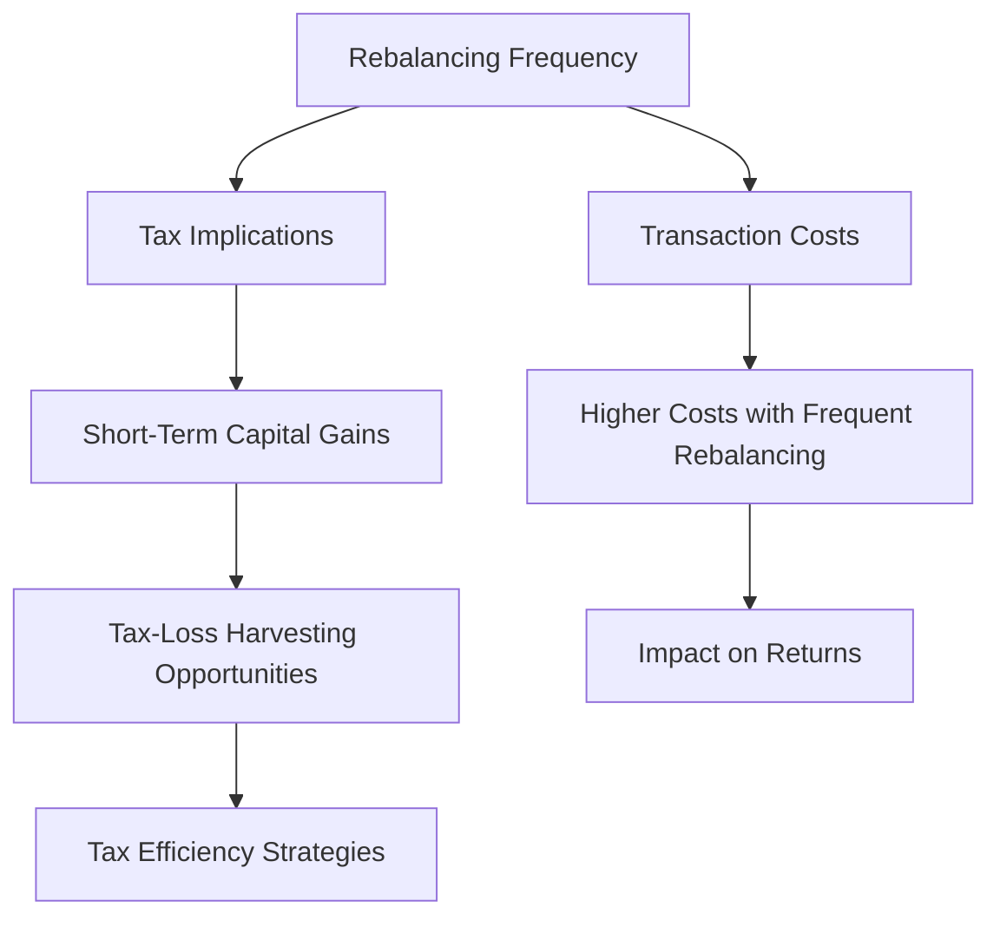

## 12.3.2 Frequency Considerations

In the realm of portfolio management, the frequency of rebalancing is a critical decision that can significantly impact the performance and tax efficiency of an investment portfolio. This section delves into the evaluation of transaction costs versus benefits, the tax implications of frequent rebalancing, and provides tailored recommendations based on various investor profiles. Understanding these considerations is essential for aspiring General Securities Representatives preparing for the Series 7 Exam, as they must be equipped to advise clients on optimal rebalancing strategies.

### Understanding Portfolio Rebalancing

Portfolio rebalancing involves adjusting the proportions of assets in a portfolio to maintain a desired level of asset allocation. This process is crucial for managing risk and ensuring that the portfolio aligns with the investor's financial goals and risk tolerance. The frequency with which a portfolio is rebalanced can influence its overall performance, cost efficiency, and tax implications.

### Evaluating Transaction Costs vs. Benefits

#### Transaction Costs

Transaction costs are the expenses incurred when buying or selling securities. These costs can include brokerage fees, bid-ask spreads, and market impact costs. Frequent rebalancing can lead to higher transaction costs, which can erode the portfolio's returns over time. It is essential to evaluate whether the benefits of rebalancing justify these costs.

- **Brokerage Fees:** These are fees charged by brokers for executing trades. They can vary depending on the brokerage firm and the type of securities traded. Frequent trading can accumulate substantial brokerage fees, reducing net returns.
  
- **Bid-Ask Spread:** This is the difference between the highest price a buyer is willing to pay for a security and the lowest price a seller is willing to accept. Frequent rebalancing can increase exposure to bid-ask spreads, especially in less liquid markets.

- **Market Impact Costs:** These costs occur when large trades affect the market price of a security. Frequent rebalancing can result in higher market impact costs, particularly for portfolios with significant assets under management.

#### Benefits of Rebalancing

The primary benefit of rebalancing is maintaining the intended asset allocation, which helps manage risk and align the portfolio with the investor's objectives. Rebalancing can also capitalize on market opportunities by selling overvalued assets and buying undervalued ones.

- **Risk Management:** Rebalancing helps maintain the desired risk profile by preventing the portfolio from becoming too heavily weighted in a particular asset class, which could increase volatility.

- **Performance Optimization:** By periodically realigning the portfolio, investors can take advantage of market inefficiencies and potentially enhance returns.

- **Behavioral Discipline:** Rebalancing enforces a disciplined investment approach, encouraging investors to buy low and sell high, countering emotional decision-making.

### Tax Implications of Frequent Rebalancing

Frequent rebalancing can have significant tax implications, particularly in taxable accounts. Understanding these implications is crucial for optimizing after-tax returns.

#### Capital Gains Taxes

- **Short-Term vs. Long-Term Gains:** Securities held for less than one year are subject to short-term capital gains tax rates, which are typically higher than long-term rates. Frequent rebalancing can trigger short-term gains, increasing the tax burden.

- **Tax-Loss Harvesting:** Rebalancing can provide opportunities for tax-loss harvesting, where investors sell securities at a loss to offset gains, reducing taxable income.

#### Tax-Efficient Strategies

- **Tax-Deferred Accounts:** Rebalancing within tax-deferred accounts, such as IRAs or 401(k)s, can mitigate tax implications, as gains are not taxed until withdrawals are made.

- **Asset Location Strategies:** Placing less tax-efficient investments in tax-advantaged accounts and more tax-efficient investments in taxable accounts can optimize tax efficiency.

### Recommendations Based on Investor Profiles

The optimal rebalancing frequency can vary based on the investor's profile, including their risk tolerance, investment horizon, and tax situation. Here are some tailored recommendations:

#### Conservative Investors

Conservative investors, who prioritize capital preservation, may benefit from less frequent rebalancing. This approach minimizes transaction costs and tax implications while maintaining a stable asset allocation.

- **Recommended Frequency:** Annually or semi-annually.

- **Considerations:** Focus on maintaining a stable asset allocation with minimal changes, reducing exposure to market volatility.

#### Aggressive Investors

Aggressive investors, who seek higher returns and are willing to accept greater risk, may opt for more frequent rebalancing to capitalize on market opportunities.

- **Recommended Frequency:** Quarterly or semi-annually.

- **Considerations:** Emphasize capturing market inefficiencies and adjusting for significant market movements, while managing transaction costs.

#### Tax-Sensitive Investors

Investors with a high sensitivity to taxes should consider the tax implications of rebalancing and may benefit from strategies that minimize taxable events.

- **Recommended Frequency:** Annually, with a focus on tax-loss harvesting and tax-efficient asset location.

- **Considerations:** Prioritize rebalancing in tax-advantaged accounts and leverage tax-loss harvesting opportunities.

#### Long-Term Investors

Long-term investors, who focus on growth over an extended period, may adopt a more relaxed rebalancing schedule to minimize costs and taxes while maintaining alignment with their goals.

- **Recommended Frequency:** Annually or as needed based on significant market changes.

- **Considerations:** Allow for some drift in asset allocation to capitalize on long-term market trends, while ensuring alignment with investment objectives.

### Practical Examples and Case Studies

#### Case Study 1: Balancing Costs and Benefits

Consider an investor with a $500,000 portfolio consisting of 60% equities and 40% bonds. Over the past year, equities have outperformed bonds, resulting in a 70% equity and 30% bond allocation. The investor must decide whether to rebalance.

- **Transaction Costs:** The investor estimates $1,000 in transaction costs to rebalance.
  
- **Risk Management:** By rebalancing, the investor reduces exposure to equity market volatility, aligning the portfolio with their risk tolerance.

- **Decision:** The investor decides to rebalance annually, accepting the transaction costs to maintain their desired risk profile.

#### Case Study 2: Tax Implications

An investor holds a portfolio in a taxable account, with significant gains in technology stocks. Frequent rebalancing could trigger short-term capital gains taxes.

- **Tax Strategy:** The investor opts for annual rebalancing, focusing on tax-loss harvesting opportunities to offset gains.

- **Outcome:** By strategically timing rebalancing, the investor minimizes tax liabilities while maintaining the desired asset allocation.

### Real-World Applications and Regulatory Scenarios

#### Compliance Considerations

Advisors must ensure that rebalancing strategies comply with regulatory requirements, including fiduciary duties and suitability standards. Understanding these obligations is crucial for advising clients effectively.

- **Fiduciary Duty:** Advisors must act in the best interest of clients, considering transaction costs, tax implications, and alignment with investment objectives.

- **Suitability Standards:** Rebalancing recommendations must align with the client's risk tolerance, investment goals, and financial situation.

### Visual Representation

To enhance understanding, the following diagram illustrates the relationship between rebalancing frequency, transaction costs, and tax implications:

### Best Practices and Common Pitfalls

#### Best Practices

- **Set Rebalancing Thresholds:** Establish thresholds for asset allocation drift to trigger rebalancing, balancing discipline with flexibility.

- **Consider Market Conditions:** Adjust rebalancing frequency based on market volatility and economic conditions.

- **Utilize Technology:** Leverage portfolio management software to automate rebalancing and monitor asset allocation.

#### Common Pitfalls

- **Over-Trading:** Avoid excessive trading that can increase costs and tax liabilities without significant benefits.

- **Ignoring Tax Implications:** Consider the tax impact of rebalancing, particularly in taxable accounts, to optimize after-tax returns.

- **Neglecting Investor Profiles:** Tailor rebalancing strategies to the investor's unique circumstances, including risk tolerance and tax situation.

### Conclusion

Understanding the frequency considerations in portfolio rebalancing is essential for optimizing investment performance, managing costs, and ensuring tax efficiency. By evaluating transaction costs versus benefits, considering tax implications, and tailoring strategies to investor profiles, aspiring General Securities Representatives can provide valuable guidance to clients. As you prepare for the Series 7 Exam, focus on mastering these concepts to excel in your role as a trusted advisor.

## Series 7 Exam Practice Questions: Frequency Considerations



### What is a primary benefit of portfolio rebalancing?

- [x] Maintaining the intended asset allocation
- [ ] Increasing transaction costs
- [ ] Triggering short-term capital gains
- [ ] Reducing tax efficiency

> **Explanation:** The primary benefit of portfolio rebalancing is maintaining the intended asset allocation, which helps manage risk and align the portfolio with the investor's objectives.

### Which of the following is a potential drawback of frequent rebalancing?

- [ ] Improved risk management
- [x] Higher transaction costs
- [ ] Enhanced tax efficiency
- [ ] Increased portfolio drift

> **Explanation:** Frequent rebalancing can lead to higher transaction costs, which can erode the portfolio's returns over time.

### How can rebalancing within tax-deferred accounts mitigate tax implications?

- [x] Gains are not taxed until withdrawals are made
- [ ] Gains are taxed immediately
- [ ] Losses are not deductible
- [ ] Gains are subject to short-term capital gains tax

> **Explanation:** Rebalancing within tax-deferred accounts can mitigate tax implications because gains are not taxed until withdrawals are made, allowing for tax-deferred growth.

### What is a recommended rebalancing frequency for conservative investors?

- [x] Annually or semi-annually
- [ ] Monthly
- [ ] Weekly
- [ ] Daily

> **Explanation:** Conservative investors may benefit from less frequent rebalancing, such as annually or semi-annually, to minimize transaction costs and tax implications.

### Which strategy can help optimize tax efficiency in rebalancing?

- [ ] Frequent trading in taxable accounts
- [x] Tax-loss harvesting
- [ ] Ignoring capital gains
- [ ] Rebalancing only in taxable accounts

> **Explanation:** Tax-loss harvesting can help optimize tax efficiency by selling securities at a loss to offset gains, reducing taxable income.

### What is a potential benefit of rebalancing for aggressive investors?

- [ ] Reduced market exposure
- [x] Capitalizing on market opportunities
- [ ] Minimizing transaction costs
- [ ] Avoiding market volatility

> **Explanation:** Aggressive investors may opt for more frequent rebalancing to capitalize on market opportunities and adjust for significant market movements.

### Why is it important to tailor rebalancing strategies to investor profiles?

- [ ] To increase transaction costs
- [ ] To ignore tax implications
- [x] To align with the investor's risk tolerance and goals
- [ ] To avoid rebalancing altogether

> **Explanation:** Tailoring rebalancing strategies to investor profiles ensures alignment with the investor's risk tolerance, investment goals, and financial situation.

### What is a common pitfall in portfolio rebalancing?

- [ ] Setting rebalancing thresholds
- [ ] Considering tax implications
- [ ] Leveraging technology
- [x] Over-trading

> **Explanation:** Over-trading is a common pitfall in portfolio rebalancing, as it can increase costs and tax liabilities without significant benefits.

### How can technology assist in portfolio rebalancing?

- [ ] By increasing transaction costs
- [x] By automating rebalancing and monitoring asset allocation
- [ ] By ignoring market conditions
- [ ] By eliminating the need for rebalancing

> **Explanation:** Technology can assist in portfolio rebalancing by automating the process and monitoring asset allocation, enhancing efficiency and accuracy.

### What is a key consideration for rebalancing in taxable accounts?

- [ ] Ignoring tax implications
- [ ] Focusing solely on transaction costs
- [x] Optimizing after-tax returns
- [ ] Avoiding all taxable events

> **Explanation:** A key consideration for rebalancing in taxable accounts is optimizing after-tax returns, which involves considering the tax impact of rebalancing.



---
