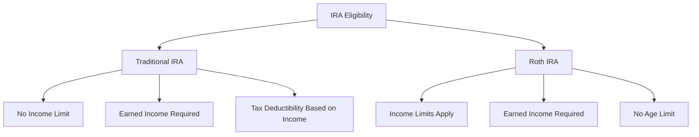

## 13.1.3 Contribution Limits and Eligibility

Understanding the contribution limits and eligibility criteria for Individual Retirement Accounts (IRAs) is crucial for effective retirement planning and maximizing tax advantages. This section provides a comprehensive overview of the current year limits, catch-up contributions for individuals over age 50, and the eligibility requirements for contributing to Traditional and Roth IRAs. We will also explore practical examples and scenarios to illustrate these concepts, helping you prepare for the Series 7 Exam and your career in the securities industry.

### Current Year Contribution Limits

For the current tax year, the contribution limits for IRAs are as follows:

- **Traditional and Roth IRAs**: The maximum contribution limit is $6,500. This limit applies to the total contributions made to both Traditional and Roth IRAs combined. If you contribute to both types of accounts, the total amount cannot exceed $6,500.

- **Catch-Up Contributions**: Individuals aged 50 and older are eligible to make additional "catch-up" contributions. For the current year, the catch-up contribution limit is $1,000, allowing these individuals to contribute a total of $7,500 to their IRAs.

### Eligibility Criteria for Traditional IRAs

Eligibility to contribute to a Traditional IRA is not restricted by income level, but there are important considerations regarding tax deductibility:

- **Age Requirement**: There is no age limit for contributing to a Traditional IRA as long as you have earned income.

- **Earned Income**: You must have earned income, such as wages, salaries, or self-employment income, to contribute to a Traditional IRA.

- **Tax Deductibility**: The ability to deduct contributions to a Traditional IRA on your tax return depends on your income level and whether you or your spouse are covered by a retirement plan at work. The deductibility phases out at higher income levels.

### Eligibility Criteria for Roth IRAs

Roth IRAs have specific income limits that determine eligibility for contributions:

- **Income Limits**: Your eligibility to contribute to a Roth IRA is based on your modified adjusted gross income (MAGI). For single filers, the contribution limit begins to phase out at $138,000 and is completely phased out at $153,000. For married couples filing jointly, the phase-out range is $218,000 to $228,000.

- **Earned Income**: Like Traditional IRAs, you must have earned income to contribute to a Roth IRA.

- **Age Requirement**: There is no age limit for contributing to a Roth IRA.

### Practical Examples

Let's explore some practical examples to illustrate how contribution limits and eligibility work in real-world scenarios:

**Example 1: Traditional IRA Contribution**

- **Scenario**: John, age 45, earns $70,000 annually and is not covered by a retirement plan at work. He contributes $6,500 to a Traditional IRA.

- **Outcome**: John can deduct the full $6,500 contribution on his tax return because he is not covered by a retirement plan at work and his income is below the phase-out range.

**Example 2: Roth IRA Contribution**

- **Scenario**: Sarah, age 55, earns $140,000 and is married, filing jointly with her spouse. They have a combined MAGI of $220,000.

- **Outcome**: Sarah can contribute to a Roth IRA, but her contribution limit is reduced due to the phase-out range. She can make a catch-up contribution, allowing her total contribution to be $4,000.

### Charts Summarizing Eligibility

To further clarify the eligibility criteria for IRA contributions, the following charts provide a summary of the key points:

### Tax Advantages and Considerations

IRAs offer significant tax advantages that can enhance your retirement savings strategy:

- **Traditional IRA**: Contributions may be tax-deductible, reducing your taxable income for the year. Earnings grow tax-deferred, meaning you won't pay taxes on them until you withdraw funds in retirement.

- **Roth IRA**: Contributions are made with after-tax dollars, so they are not deductible. However, qualified withdrawals, including earnings, are tax-free, providing significant tax savings in retirement.

### Common Pitfalls and Best Practices

When contributing to IRAs, it's important to be aware of common pitfalls and best practices:

- **Exceeding Contribution Limits**: Contributions that exceed the annual limit can result in a 6% excess contribution penalty. Be sure to track your contributions carefully to avoid this penalty.

- **Understanding Phase-Out Ranges**: If your income is near the phase-out range for Roth IRA contributions, consider strategies to reduce your MAGI, such as maximizing contributions to employer-sponsored retirement plans.

- **Utilizing Catch-Up Contributions**: If you are age 50 or older, take advantage of catch-up contributions to boost your retirement savings.

### Regulatory Considerations

The IRS sets the rules for IRA contributions, and it's important to stay informed about any changes to these regulations. The IRS website provides up-to-date information on contribution limits and eligibility criteria.

### Additional Resources

For further exploration of IRA contribution limits and eligibility, consider the following resources:

- [IRS Publication 590-A](https://www.irs.gov/publications/p590a) provides detailed information on contributions to IRAs.
- The [FINRA website](https://www.finra.org) offers educational resources and tools for understanding retirement accounts.
- Practice exams and question banks can help reinforce your understanding of IRA rules and prepare you for the Series 7 Exam.

### Key Takeaways

- **Contribution Limits**: For the current year, the contribution limit for IRAs is $6,500, with an additional $1,000 catch-up contribution for those aged 50 and older.

- **Eligibility**: Traditional IRAs have no income limits for contributions, but tax deductibility may be affected by income and retirement plan coverage. Roth IRAs have income limits that determine eligibility.

- **Tax Advantages**: Traditional IRAs offer potential tax deductions, while Roth IRAs provide tax-free withdrawals in retirement.

- **Best Practices**: Avoid exceeding contribution limits, understand phase-out ranges, and utilize catch-up contributions if eligible.

By understanding the contribution limits and eligibility criteria for IRAs, you can make informed decisions about your retirement savings strategy and maximize the tax benefits of these accounts. This knowledge is essential for passing the Series 7 Exam and succeeding in the securities industry.

## Series 7 Exam Practice Questions: Contribution Limits and Eligibility



### What is the maximum contribution limit for an IRA for individuals under age 50 in the current year?

- [x] $6,500
- [ ] $5,500
- [ ] $7,000
- [ ] $8,000

> **Explanation:** The maximum contribution limit for an IRA for individuals under age 50 is $6,500 for the current year.

### How much can individuals aged 50 and older contribute to an IRA in the current year, including catch-up contributions?

- [ ] $6,500
- [ ] $7,000
- [x] $7,500
- [ ] $8,500

> **Explanation:** Individuals aged 50 and older can contribute up to $7,500 to an IRA in the current year, including a $1,000 catch-up contribution.

### What is the income phase-out range for Roth IRA contributions for single filers in the current year?

- [ ] $118,000 to $133,000
- [x] $138,000 to $153,000
- [ ] $148,000 to $163,000
- [ ] $158,000 to $173,000

> **Explanation:** The income phase-out range for Roth IRA contributions for single filers is $138,000 to $153,000 for the current year.

### Which of the following is a requirement for contributing to a Traditional IRA?

- [ ] Must be under age 70½
- [x] Must have earned income
- [ ] Must have a retirement plan at work
- [ ] Must be married

> **Explanation:** To contribute to a Traditional IRA, you must have earned income. There is no age limit for contributions as long as you have earned income.

### What is the primary tax advantage of a Roth IRA?

- [ ] Tax-deductible contributions
- [x] Tax-free withdrawals in retirement
- [ ] Tax-deferred growth
- [ ] No required minimum distributions

> **Explanation:** The primary tax advantage of a Roth IRA is that qualified withdrawals, including earnings, are tax-free in retirement.

### If an individual contributes more than the allowable limit to an IRA, what is the penalty?

- [ ] 10% penalty
- [ ] 5% penalty
- [x] 6% penalty
- [ ] 8% penalty

> **Explanation:** Contributions exceeding the allowable limit are subject to a 6% excess contribution penalty.

### What happens if a married couple's combined MAGI exceeds the phase-out range for Roth IRA contributions?

- [ ] They can still contribute the full amount
- [ ] They cannot contribute at all
- [x] Their contribution limit is reduced
- [ ] They must file separately

> **Explanation:** If a married couple's combined MAGI exceeds the phase-out range, their contribution limit to a Roth IRA is reduced.

### Which type of income is required to contribute to an IRA?

- [ ] Passive income
- [ ] Investment income
- [x] Earned income
- [ ] Rental income

> **Explanation:** Earned income, such as wages or self-employment income, is required to contribute to an IRA.

### Can an individual contribute to both a Traditional and a Roth IRA in the same year?

- [x] Yes, but the total contributions cannot exceed the annual limit
- [ ] No, contributions must be made to only one type of IRA
- [ ] Yes, with no restrictions
- [ ] No, it's prohibited by IRS rules

> **Explanation:** An individual can contribute to both a Traditional and a Roth IRA in the same year, but the total contributions to both accounts cannot exceed the annual limit of $6,500 (or $7,500 for those 50 and older).

### What is the phase-out range for Roth IRA contributions for married couples filing jointly in the current year?

- [ ] $198,000 to $208,000
- [ ] $208,000 to $218,000
- [x] $218,000 to $228,000
- [ ] $228,000 to $238,000

> **Explanation:** The phase-out range for Roth IRA contributions for married couples filing jointly is $218,000 to $228,000 for the current year.


