## 14.2.1 Federal Reserve System

The Federal Reserve System, often referred to simply as "the Fed," plays a pivotal role in the United States' economic and financial stability. As the central bank of the United States, the Federal Reserve is responsible for implementing monetary policy, regulating banks, maintaining financial stability, and providing financial services. Understanding the structure and functions of the Federal Reserve System is crucial for anyone preparing for the Series 7 Exam, as it directly impacts the securities industry and broader economic conditions.

### Structure of the Federal Reserve System

The Federal Reserve System is a complex entity composed of several key components, each with distinct roles and responsibilities. The primary structure includes the Board of Governors, the Federal Open Market Committee (FOMC), and 12 regional Federal Reserve Banks.

#### Board of Governors

The Board of Governors is the central governing body of the Federal Reserve System. Located in Washington, D.C., it consists of seven members appointed by the President of the United States and confirmed by the Senate. Each governor serves a 14-year term, with one term expiring every two years, ensuring continuity and stability in policy-making.

**Key Responsibilities of the Board of Governors:**

- **Supervision and Regulation:** The Board oversees the operations of the 12 regional Federal Reserve Banks and regulates member banks and bank holding companies.
- **Monetary Policy:** The Board plays a crucial role in setting monetary policy, particularly through its influence on the Federal Open Market Committee.
- **Financial Stability:** It monitors and analyzes economic and financial conditions, providing guidance to promote a stable financial system.

#### 12 Regional Federal Reserve Banks

The United States is divided into 12 Federal Reserve Districts, each served by a regional Federal Reserve Bank. These banks are strategically located across the country to represent the diverse economic interests of their regions.

**Functions of the Regional Banks:**

- **Monetary Policy Implementation:** The regional banks carry out the monetary policy set by the FOMC, including open market operations.
- **Bank Supervision:** They supervise and regulate member banks within their districts.
- **Financial Services:** The banks provide essential services to financial institutions, the U.S. government, and the public, such as processing payments and distributing currency.

Here is a visualization of the Federal Reserve System's structure:

```mermaid
graph TD
    A[Board of Governors] --> B1[Federal Reserve Bank of Boston]
    A --> B2[Federal Reserve Bank of New York]
    A --> B3[Federal Reserve Bank of Philadelphia]
    A --> B4[Federal Reserve Bank of Cleveland]
    A --> B5[Federal Reserve Bank of Richmond]
    A --> B6[Federal Reserve Bank of Atlanta]
    A --> B7[Federal Reserve Bank of Chicago]
    A --> B8[Federal Reserve Bank of St. Louis]
    A --> B9[Federal Reserve Bank of Minneapolis]
    A --> B10[Federal Reserve Bank of Kansas City]
    A --> B11[Federal Reserve Bank of Dallas]
    A --> B12[Federal Reserve Bank of San Francisco]
    A --> C[FOMC]
```

### The Role of the Federal Open Market Committee (FOMC)

The Federal Open Market Committee (FOMC) is a critical component of the Federal Reserve System, responsible for setting monetary policy in the United States. The FOMC consists of 12 members: the seven members of the Board of Governors and five of the 12 regional Federal Reserve Bank presidents. The president of the Federal Reserve Bank of New York is a permanent member, while the other four positions rotate among the remaining 11 bank presidents.

**Functions of the FOMC:**

- **Monetary Policy Decisions:** The FOMC sets the target for the federal funds rate, which influences interest rates throughout the economy. This rate is crucial for controlling inflation and stabilizing the economy.
- **Open Market Operations:** The FOMC directs open market operations, which involve buying and selling government securities to influence the money supply and interest rates.
- **Economic Projections:** The committee evaluates economic conditions and forecasts to guide policy decisions.

**FOMC Meetings:**

The FOMC meets eight times a year to assess economic conditions and make policy decisions. These meetings are closely watched by financial markets, as changes in monetary policy can significantly impact economic activity and financial markets.

### Practical Examples and Scenarios

To understand the Federal Reserve System's impact on the securities industry, consider the following scenarios:

1. **Interest Rate Changes:**
   - When the FOMC decides to lower the federal funds rate, it typically leads to lower borrowing costs for businesses and consumers. This can stimulate economic activity, increase corporate earnings, and potentially boost stock prices. Conversely, raising rates can slow economic growth and impact stock valuations.

2. **Quantitative Easing:**
   - During economic downturns, the FOMC may implement quantitative easing (QE) by purchasing long-term securities to increase the money supply and lower long-term interest rates. This can lead to increased investment in equities and other risk assets as investors seek higher returns.

3. **Inflation Control:**
   - If inflation is rising too quickly, the FOMC may increase interest rates to cool down the economy. This can affect bond prices, as higher rates lead to lower bond prices, impacting fixed-income investments.

### Real-World Applications

Understanding the Federal Reserve System's role is vital for professionals in the securities industry. Here are some actionable insights:

- **Investment Strategies:** Securities professionals must consider the Fed's monetary policy stance when developing investment strategies. For example, in a low-interest-rate environment, investors might seek higher yields in equities or alternative investments.
- **Risk Management:** Changes in interest rates can affect the valuation of securities and the cost of borrowing. Professionals need to manage interest rate risk in portfolios and client accounts.
- **Regulatory Compliance:** The Federal Reserve's regulatory role requires compliance with banking and financial regulations, impacting how securities firms operate and manage risk.

### Best Practices and Exam Tips

- **Stay Informed:** Keep up with FOMC meeting outcomes and economic projections to anticipate market movements.
- **Understand Key Terms:** Familiarize yourself with terms like federal funds rate, open market operations, and quantitative easing.
- **Practice Analysis:** Analyze how changes in monetary policy affect different asset classes and sectors.
- **Review Historical Cases:** Study past FOMC decisions and their impact on financial markets to gain insights into potential future scenarios.

### Summary

The Federal Reserve System is a cornerstone of the U.S. financial system, with its structure and functions deeply influencing economic stability and monetary policy. By understanding the roles of the Board of Governors, the 12 regional banks, and the FOMC, you can better navigate the complexities of the securities industry and prepare effectively for the Series 7 Exam.

---

## Series 7 Exam Practice Questions: Federal Reserve System



### What is the primary role of the Federal Open Market Committee (FOMC)?

- [x] Setting monetary policy and interest rates
- [ ] Supervising and regulating banks
- [ ] Providing financial services to the government
- [ ] Issuing U.S. currency

> **Explanation:** The FOMC is responsible for setting monetary policy, including the target for the federal funds rate, which influences interest rates throughout the economy.

### How many members are on the Board of Governors of the Federal Reserve System?

- [ ] Five
- [x] Seven
- [ ] Nine
- [ ] Twelve

> **Explanation:** The Board of Governors consists of seven members appointed by the President and confirmed by the Senate.

### Which Federal Reserve Bank president is a permanent member of the FOMC?

- [ ] Boston
- [ ] Chicago
- [x] New York
- [ ] San Francisco

> **Explanation:** The president of the Federal Reserve Bank of New York is a permanent member of the FOMC due to the bank's significant role in implementing monetary policy.

### What is the primary tool used by the FOMC to influence the money supply?

- [ ] Discount rate
- [x] Open market operations
- [ ] Reserve requirements
- [ ] Federal Reserve notes

> **Explanation:** Open market operations involve buying and selling government securities to influence the money supply and interest rates.

### How often does the FOMC meet to set monetary policy?

- [ ] Monthly
- [x] Eight times a year
- [ ] Quarterly
- [ ] Annually

> **Explanation:** The FOMC meets eight times a year to assess economic conditions and make policy decisions.

### What is the term length for a member of the Board of Governors?

- [ ] Four years
- [ ] Six years
- [x] Fourteen years
- [ ] Ten years

> **Explanation:** Each member of the Board of Governors serves a 14-year term, with one term expiring every two years.

### Which of the following is NOT a function of the regional Federal Reserve Banks?

- [ ] Supervising member banks
- [ ] Implementing monetary policy
- [ ] Providing financial services
- [x] Setting the federal funds rate

> **Explanation:** The regional Federal Reserve Banks do not set the federal funds rate; this is the role of the FOMC.

### What is the primary purpose of the federal funds rate?

- [ ] To regulate bank reserves
- [ ] To control inflation
- [x] To influence short-term interest rates
- [ ] To increase government revenue

> **Explanation:** The federal funds rate is used to influence short-term interest rates and is a key tool in monetary policy.

### Which entity appoints the members of the Board of Governors?

- [ ] The Senate
- [x] The President of the United States
- [ ] The Treasury Department
- [ ] The Federal Reserve Banks

> **Explanation:** The President of the United States appoints the members of the Board of Governors, subject to Senate confirmation.

### What is the main goal of quantitative easing?

- [ ] To increase bank reserves
- [ ] To reduce inflation
- [x] To stimulate economic growth
- [ ] To decrease the federal budget deficit

> **Explanation:** Quantitative easing involves purchasing long-term securities to increase the money supply and stimulate economic growth.



---

By understanding the Federal Reserve System, its structure, and its role in monetary policy, you will be well-prepared for questions on the Series 7 Exam and equipped to apply this knowledge in your career in the securities industry.
