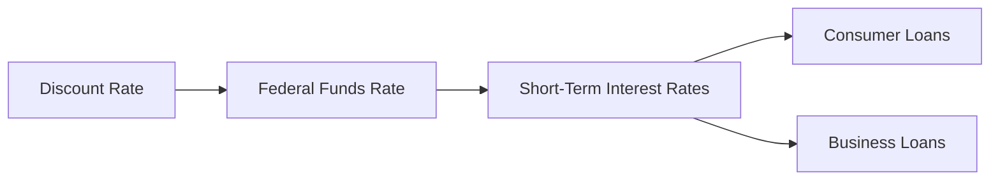

## 14.2.2.2 Discount Rate Adjustments

The discount rate is a critical tool in the Federal Reserve's monetary policy arsenal. Adjustments to this rate can have profound implications for the economy, affecting everything from consumer spending to business investment. In this section, we will delve into the intricacies of discount rate adjustments, their signaling effects, and historical trends. This knowledge is essential for anyone preparing for the Series 7 Exam and aspiring to become a General Securities Representative.

### Understanding the Discount Rate

The discount rate is the interest rate charged by the Federal Reserve Banks to depository institutions on short-term loans. This rate is a pivotal component of monetary policy, influencing the cost of borrowing and, consequently, the broader economic environment.

#### Key Concepts

- **Federal Reserve Banks**: The central banking system of the United States, comprising 12 regional banks that provide financial services to depository institutions and the federal government.
- **Monetary Policy**: The process by which the Federal Reserve manages the supply of money to achieve specific economic goals, such as controlling inflation, managing employment levels, and maintaining financial stability.

### The Role of Discount Rate Adjustments

Discount rate adjustments serve multiple purposes within the framework of monetary policy:

1. **Influencing Short-Term Interest Rates**: Changes in the discount rate can lead to adjustments in the federal funds rate, which is the rate at which banks lend to each other overnight. This, in turn, affects other interest rates throughout the economy.
   
2. **Signaling Monetary Policy Stance**: The discount rate acts as a signal to the market about the Federal Reserve's stance on monetary policy. An increase in the rate typically signals a tightening of monetary policy, while a decrease suggests an easing.

3. **Providing Liquidity**: By adjusting the discount rate, the Federal Reserve can influence the availability of credit in the economy, providing liquidity during times of financial stress or constraining it to curb inflation.

### Signaling Effects of Discount Rate Changes

The signaling effect of discount rate changes is one of the most significant aspects of this monetary policy tool. When the Federal Reserve adjusts the discount rate, it sends a powerful message to financial markets, businesses, and consumers about its economic outlook and policy intentions.

#### Expansionary vs. Contractionary Signals

- **Expansionary Signal**: A reduction in the discount rate is typically seen as a move to stimulate economic activity. It suggests that the Federal Reserve is aiming to lower borrowing costs, encourage spending, and support economic growth.

- **Contractionary Signal**: Conversely, an increase in the discount rate is often interpreted as an attempt to cool down an overheating economy. This action can signal concerns about inflation and a desire to tighten monetary conditions.

#### Market Reactions

Financial markets closely monitor discount rate changes, as these adjustments can lead to shifts in asset prices, interest rate expectations, and investor sentiment. For example, a surprise rate cut might lead to a rally in stock prices as investors anticipate lower borrowing costs and improved corporate profitability.

### Historical Trends in the Discount Rate

Analyzing historical trends in the discount rate provides valuable insights into how this tool has been used to navigate economic challenges over time.

#### Key Historical Periods

1. **The Great Depression (1930s)**: During the Great Depression, the Federal Reserve lowered the discount rate to unprecedented levels in an attempt to stimulate the economy and combat deflationary pressures.

2. **Post-War Economic Expansion (1950s-1960s)**: In the post-war era, the discount rate was adjusted to manage inflationary pressures while supporting economic growth.

3. **Stagflation (1970s)**: The 1970s presented a unique challenge with high inflation and stagnant economic growth. The Federal Reserve raised the discount rate significantly to combat inflation, leading to a period of high interest rates.

4. **Dot-Com Bubble and Financial Crisis (2000s)**: In response to the bursting of the dot-com bubble and the 2008 financial crisis, the Federal Reserve drastically reduced the discount rate to near-zero levels to support financial markets and the broader economy.

#### Recent Trends

In recent years, the discount rate has been used to navigate the complexities of a globalized economy, with considerations for international trade, geopolitical tensions, and technological advancements influencing policy decisions.

### Practical Examples and Case Studies

To illustrate the impact of discount rate adjustments, let's explore a few practical examples and case studies:

#### Case Study: The 2008 Financial Crisis

During the 2008 financial crisis, the Federal Reserve took unprecedented steps to stabilize the financial system. One of the key measures was the reduction of the discount rate to near-zero levels. This action was part of a broader strategy to provide liquidity to financial institutions, restore confidence in the banking system, and support economic recovery.

- **Outcome**: The aggressive rate cuts, combined with other monetary policy tools such as quantitative easing, played a crucial role in stabilizing financial markets and setting the stage for economic recovery.

#### Example: COVID-19 Pandemic Response

In response to the economic disruptions caused by the COVID-19 pandemic, the Federal Reserve once again lowered the discount rate to near-zero levels. This move was aimed at supporting financial markets, ensuring the flow of credit, and mitigating the economic impact of the pandemic.

- **Outcome**: The rate cuts, along with fiscal stimulus measures, helped cushion the economic blow and facilitated a faster-than-expected recovery in certain sectors.

### Real-World Applications and Regulatory Scenarios

Understanding discount rate adjustments is crucial for professionals in the securities industry. Here are some real-world applications and regulatory scenarios:

#### Impact on Securities Markets

- **Bond Markets**: Changes in the discount rate can influence bond yields and prices. A decrease in the rate generally leads to lower yields and higher bond prices, while an increase has the opposite effect.

- **Equity Markets**: The discount rate can also impact stock valuations. Lower rates tend to boost stock prices as borrowing costs decrease and corporate earnings expectations improve.

#### Compliance Considerations

Professionals in the securities industry must stay informed about discount rate changes and their potential impact on investment strategies and client portfolios. Understanding these dynamics is essential for providing sound financial advice and maintaining compliance with regulatory standards.

### Step-by-Step Guidance for Analyzing Discount Rate Adjustments

To effectively analyze discount rate adjustments, follow these steps:

1. **Monitor Federal Reserve Announcements**: Stay updated on Federal Reserve meetings and announcements, as these often provide insights into potential rate changes.

2. **Assess Economic Indicators**: Evaluate key economic indicators such as inflation, employment, and GDP growth to understand the context of rate adjustments.

3. **Analyze Market Reactions**: Observe how financial markets react to rate changes, including shifts in bond yields, stock prices, and currency valuations.

4. **Adjust Investment Strategies**: Based on your analysis, consider adjusting investment strategies to align with the new interest rate environment. This may involve reallocating assets, hedging interest rate risks, or exploring new investment opportunities.

### Diagrams and Visuals

To enhance understanding, let's include a diagram illustrating the relationship between the discount rate, federal funds rate, and other interest rates.

### Best Practices, Common Pitfalls, and Strategies

#### Best Practices

- **Stay Informed**: Regularly monitor Federal Reserve communications and economic data releases to anticipate potential rate changes.

- **Diversify Portfolios**: Diversify investment portfolios to mitigate risks associated with interest rate fluctuations.

- **Educate Clients**: Educate clients about the potential impact of discount rate changes on their investments and financial goals.

#### Common Pitfalls

- **Overreacting to Rate Changes**: Avoid making impulsive investment decisions based solely on rate adjustments. Consider the broader economic context and long-term trends.

- **Ignoring Inflation Risks**: While lower rates can stimulate growth, they may also lead to inflationary pressures. Balance growth opportunities with inflation risks.

#### Strategies to Overcome Challenges

- **Hedging Strategies**: Implement hedging strategies to protect portfolios from adverse interest rate movements.

- **Scenario Analysis**: Conduct scenario analysis to assess the potential impact of different rate environments on investment portfolios.

### References and Additional Resources

For further exploration, consider the following resources:

- **Federal Reserve Website**: Access official statements, meeting minutes, and economic data from the Federal Reserve.
- **FINRA**: Explore resources and guidelines related to compliance and regulatory standards in the securities industry.
- **Securities Act of 1933 and Securities Exchange Act of 1934**: Review key sections of these acts to understand the regulatory framework for securities markets.

### Summary

Discount rate adjustments are a powerful tool in the Federal Reserve's monetary policy toolkit. Understanding their signaling effects, historical trends, and real-world applications is crucial for professionals in the securities industry. By staying informed and adapting investment strategies to align with changing interest rate environments, you can better serve your clients and succeed in your career.

## Series 7 Exam Practice Questions: Discount Rate Adjustments



### What is the primary purpose of adjusting the discount rate?

- [x] To influence short-term interest rates and signal monetary policy stance
- [ ] To directly control inflation
- [ ] To set long-term interest rates
- [ ] To regulate foreign exchange rates

> **Explanation:** The primary purpose of adjusting the discount rate is to influence short-term interest rates and signal the Federal Reserve's monetary policy stance.

### How does a decrease in the discount rate typically affect the economy?

- [x] It lowers borrowing costs and stimulates economic activity
- [ ] It increases inflation immediately
- [ ] It leads to higher unemployment
- [ ] It strengthens the currency

> **Explanation:** A decrease in the discount rate lowers borrowing costs, encouraging spending and investment, which can stimulate economic activity.

### What historical event led to a significant reduction in the discount rate?

- [ ] The Dot-Com Bubble
- [x] The 2008 Financial Crisis
- [ ] The 1970s Stagflation
- [ ] The Great Depression

> **Explanation:** During the 2008 Financial Crisis, the Federal Reserve significantly reduced the discount rate to support the financial system and economy.

### Which of the following is a signaling effect of increasing the discount rate?

- [ ] Stimulating economic growth
- [ ] Lowering inflation expectations
- [x] Indicating a tightening of monetary policy
- [ ] Encouraging consumer spending

> **Explanation:** Increasing the discount rate signals a tightening of monetary policy, often to curb inflation.

### What is the relationship between the discount rate and the federal funds rate?

- [ ] The discount rate is always higher than the federal funds rate
- [x] The discount rate influences the federal funds rate
- [ ] The federal funds rate is set by the discount rate
- [ ] There is no relationship between the two rates

> **Explanation:** The discount rate influences the federal funds rate, as changes in the discount rate can lead to adjustments in the federal funds rate.

### How do financial markets typically react to an unexpected discount rate cut?

- [x] Stock prices may rise due to lower borrowing costs
- [ ] Bond yields increase sharply
- [ ] The currency strengthens immediately
- [ ] Interest rates on consumer loans rise

> **Explanation:** An unexpected discount rate cut can lead to a rise in stock prices as investors anticipate lower borrowing costs and improved corporate profitability.

### What is a common pitfall when reacting to discount rate changes?

- [ ] Ignoring inflation risks
- [x] Overreacting to rate changes without considering the broader context
- [ ] Failing to diversify portfolios
- [ ] Not educating clients about rate changes

> **Explanation:** A common pitfall is overreacting to discount rate changes without considering the broader economic context and long-term trends.

### Which of the following is a best practice when dealing with discount rate adjustments?

- [ ] Making impulsive investment decisions
- [x] Staying informed about Federal Reserve communications
- [ ] Ignoring diversification principles
- [ ] Focusing solely on short-term gains

> **Explanation:** Staying informed about Federal Reserve communications is a best practice to anticipate potential rate changes and make informed investment decisions.

### During which period did the Federal Reserve raise the discount rate significantly to combat inflation?

- [ ] The Great Depression
- [ ] The Dot-Com Bubble
- [x] The 1970s Stagflation
- [ ] The 2008 Financial Crisis

> **Explanation:** During the 1970s stagflation, the Federal Reserve raised the discount rate significantly to combat high inflation.

### What is a strategy to mitigate risks associated with interest rate fluctuations?

- [ ] Ignoring market reactions
- [ ] Focusing solely on equity investments
- [x] Implementing hedging strategies
- [ ] Avoiding scenario analysis

> **Explanation:** Implementing hedging strategies is a way to protect portfolios from adverse interest rate movements and mitigate risks.



---

By understanding the nuances of discount rate adjustments, you can enhance your knowledge and skills, preparing effectively for the Series 7 Exam and advancing your career in the securities industry.
