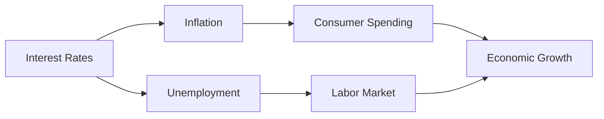

## 14.2.3 Impact on Interest Rates and Economy

Understanding the impact of interest rates on the economy is crucial for anyone preparing for the Series 7 Exam. Interest rates, a key tool of monetary policy, influence various economic factors, including inflation, unemployment, and overall economic growth. This section will provide a comprehensive analysis of how changes in interest rates affect the economy, explore the Phillips Curve relationship between unemployment and inflation, and offer practical insights relevant to the securities industry.

### The Role of Interest Rates in the Economy

Interest rates are the cost of borrowing money and the reward for saving. They are determined by the supply and demand for funds in the financial markets and are influenced by the central bank's monetary policy. In the United States, the Federal Reserve (the Fed) plays a significant role in setting interest rates through its control of the federal funds rate.

#### Key Concepts

- **Federal Funds Rate**: The interest rate at which depository institutions lend balances to each other overnight. It serves as a benchmark for other interest rates in the economy.
- **Discount Rate**: The interest rate the Federal Reserve charges banks for short-term loans. Changes in the discount rate can signal the Fed's monetary policy stance.
- **Prime Rate**: The interest rate banks charge their most creditworthy customers. It is influenced by the federal funds rate and serves as a reference for various consumer and business loans.

### How Policy Changes Ripple Through the Economy

Monetary policy changes, particularly adjustments to interest rates, have a cascading effect on the economy. Here's how these changes typically unfold:

1. **Interest Rate Adjustment**: The Federal Reserve may raise or lower the federal funds rate to control inflation or stimulate economic growth.
   
2. **Bank Lending and Borrowing Costs**: Changes in the federal funds rate influence the interest rates banks charge each other and their customers. Higher rates make borrowing more expensive, reducing consumer and business spending, while lower rates encourage borrowing and spending.

3. **Investment and Consumption**: As borrowing costs change, so do investment decisions by businesses and spending choices by consumers. Lower interest rates can lead to increased investment in capital goods and higher consumer spending on big-ticket items like homes and cars.

4. **Exchange Rates and Trade Balance**: Interest rate changes can affect the value of the U.S. dollar. Higher rates may attract foreign investment, strengthening the dollar and potentially affecting the trade balance by making exports more expensive and imports cheaper.

5. **Inflation and Economic Growth**: The ultimate goal of adjusting interest rates is to maintain stable prices and promote sustainable economic growth. Lower rates can boost economic activity but may also lead to higher inflation if the economy overheats. Conversely, higher rates can help control inflation but may slow economic growth.

### The Phillips Curve: Unemployment and Inflation

The Phillips Curve illustrates the inverse relationship between unemployment and inflation. It suggests that with economic growth comes inflation, which can lead to lower unemployment rates. However, this relationship is not always stable, and various factors can cause shifts in the curve.

#### Historical Context

- **1950s and 1960s**: The Phillips Curve was initially observed in the post-World War II era, where a clear trade-off between inflation and unemployment was evident.
- **1970s Stagflation**: The relationship broke down during the 1970s when high inflation and high unemployment occurred simultaneously, challenging the traditional Phillips Curve model.
- **Modern Interpretations**: Economists now recognize that the relationship between inflation and unemployment is influenced by expectations and other variables, such as supply shocks and global economic conditions.

#### Implications for Monetary Policy

Understanding the Phillips Curve helps policymakers balance the dual mandate of the Federal Reserve: promoting maximum employment and stable prices. By adjusting interest rates, the Fed can influence economic activity and inflation expectations, aiming to achieve a balance between low unemployment and low inflation.

### Practical Examples and Case Studies

To illustrate the impact of interest rates on the economy, consider the following scenarios:

#### Case Study 1: The Great Recession (2007-2009)

During the Great Recession, the Federal Reserve lowered interest rates to near zero to stimulate economic activity. This policy aimed to encourage borrowing and spending, support the housing market, and stabilize financial institutions. The low-interest-rate environment helped the economy recover, but it also posed challenges, such as potential asset bubbles and increased risk-taking.

#### Case Study 2: The COVID-19 Pandemic

In response to the economic impact of the COVID-19 pandemic, the Federal Reserve again lowered interest rates to near zero. This action, combined with fiscal stimulus measures, aimed to support economic recovery by making borrowing cheaper and encouraging spending. The Fed also implemented quantitative easing, purchasing government securities to inject liquidity into the economy.

### Charts and Historical Relationships

To better understand the relationship between interest rates, inflation, and unemployment, consider the following charts:

This diagram illustrates how interest rates influence various economic factors, ultimately affecting overall economic growth.

### Real-World Applications

For securities professionals, understanding the impact of interest rates on the economy is essential for making informed investment decisions. Here are some practical applications:

- **Bond Markets**: Interest rate changes directly affect bond prices and yields. When rates rise, bond prices typically fall, and vice versa. Understanding this relationship helps in managing bond portfolios and assessing interest rate risk.
- **Equity Markets**: Interest rates can influence stock prices by affecting corporate borrowing costs and consumer spending. Lower rates may boost stock prices by reducing financing costs and increasing disposable income.
- **Currency Markets**: Interest rate differentials between countries can affect exchange rates, impacting international investments and trade.

### Best Practices and Exam Tips

- **Stay Informed**: Keep up with Federal Reserve announcements and economic indicators to anticipate potential interest rate changes.
- **Understand the Relationships**: Familiarize yourself with how interest rates interact with inflation, unemployment, and economic growth. This knowledge is crucial for analyzing market trends and making investment decisions.
- **Practice Calculations**: Be comfortable with calculating the impact of interest rate changes on bond prices and yields, as these are common exam topics.

### Summary

Interest rates play a pivotal role in shaping economic conditions. By understanding how monetary policy changes influence interest rates and the broader economy, you can better prepare for the Series 7 Exam and your future career in the securities industry. Remember to review key concepts, practice calculations, and stay informed about current economic trends to excel in this area.

---

## Series 7 Exam Practice Questions: Impact on Interest Rates and Economy



### How do changes in the federal funds rate typically affect consumer borrowing?

- [x] Changes in the federal funds rate influence the interest rates that banks charge consumers for loans.
- [ ] The federal funds rate has no impact on consumer borrowing rates.
- [ ] Changes in the federal funds rate directly affect consumer credit scores.
- [ ] The federal funds rate only affects long-term interest rates, not short-term consumer loans.

> **Explanation:** The federal funds rate influences the interest rates that banks charge consumers for loans, affecting borrowing costs and consumer spending.

### What is the primary goal of the Federal Reserve when adjusting interest rates?

- [x] To maintain stable prices and promote sustainable economic growth.
- [ ] To increase government revenue through higher interest payments.
- [ ] To control the stock market and prevent bubbles.
- [ ] To regulate the housing market exclusively.

> **Explanation:** The Federal Reserve adjusts interest rates to maintain stable prices and promote sustainable economic growth, balancing inflation and unemployment.

### Which economic theory describes the inverse relationship between unemployment and inflation?

- [x] The Phillips Curve
- [ ] The Laffer Curve
- [ ] The Kuznets Curve
- [ ] The Lorenz Curve

> **Explanation:** The Phillips Curve illustrates the inverse relationship between unemployment and inflation, suggesting that lower unemployment can lead to higher inflation.

### How do higher interest rates typically affect the value of the U.S. dollar?

- [x] Higher interest rates can strengthen the U.S. dollar by attracting foreign investment.
- [ ] Higher interest rates weaken the U.S. dollar by reducing exports.
- [ ] Higher interest rates have no impact on the U.S. dollar's value.
- [ ] Higher interest rates only affect the value of other currencies.

> **Explanation:** Higher interest rates can attract foreign investment, strengthening the U.S. dollar by increasing demand for dollar-denominated assets.

### What was a significant challenge to the Phillips Curve during the 1970s?

- [x] The occurrence of stagflation, where high inflation and high unemployment happened simultaneously.
- [ ] A decline in global trade affecting inflation rates.
- [ ] The introduction of new financial regulations.
- [ ] A technological boom that reduced unemployment.

> **Explanation:** During the 1970s, stagflation challenged the Phillips Curve as high inflation and high unemployment occurred simultaneously, contradicting the expected inverse relationship.

### How does the Federal Reserve's monetary policy influence the bond market?

- [x] Changes in interest rates directly affect bond prices and yields.
- [ ] Monetary policy has no impact on bond prices.
- [ ] The Federal Reserve sets bond prices directly.
- [ ] Bond prices are only influenced by fiscal policy, not monetary policy.

> **Explanation:** The Federal Reserve's monetary policy, through interest rate changes, directly affects bond prices and yields, impacting investment decisions in the bond market.

### What is a potential risk of maintaining low interest rates for an extended period?

- [x] The formation of asset bubbles due to increased risk-taking and borrowing.
- [ ] A decrease in consumer spending due to higher borrowing costs.
- [ ] An increase in unemployment due to reduced business investment.
- [ ] A decline in international trade due to currency depreciation.

> **Explanation:** Low interest rates can lead to asset bubbles as investors and consumers take on more risk and borrow more, potentially destabilizing the economy.

### In what way can interest rate changes influence the housing market?

- [x] Lower interest rates can stimulate the housing market by making mortgages more affordable.
- [ ] Interest rate changes have no impact on the housing market.
- [ ] Higher interest rates increase housing demand by raising property values.
- [ ] Lower interest rates decrease housing supply by discouraging construction.

> **Explanation:** Lower interest rates make mortgages more affordable, stimulating the housing market by increasing demand for homes.

### How does quantitative easing relate to interest rates?

- [x] Quantitative easing involves purchasing government securities to lower interest rates and stimulate the economy.
- [ ] Quantitative easing raises interest rates by reducing the money supply.
- [ ] Quantitative easing has no effect on interest rates.
- [ ] Quantitative easing is a fiscal policy tool unrelated to interest rates.

> **Explanation:** Quantitative easing involves the central bank purchasing government securities to lower interest rates and stimulate economic activity by increasing liquidity.

### What is the effect of interest rate differentials on currency exchange rates?

- [x] Interest rate differentials can lead to changes in currency values as investors seek higher returns.
- [ ] Interest rate differentials have no impact on currency exchange rates.
- [ ] Currency values are only affected by trade balances, not interest rate differentials.
- [ ] Interest rate differentials stabilize currency values by reducing volatility.

> **Explanation:** Interest rate differentials can influence currency values as investors move capital to countries with higher rates to seek better returns, affecting exchange rates.



---

This comprehensive guide on the impact of interest rates on the economy provides you with the essential knowledge and insights needed for the Series 7 Exam. By understanding these concepts, you can better analyze market trends and make informed investment decisions.
