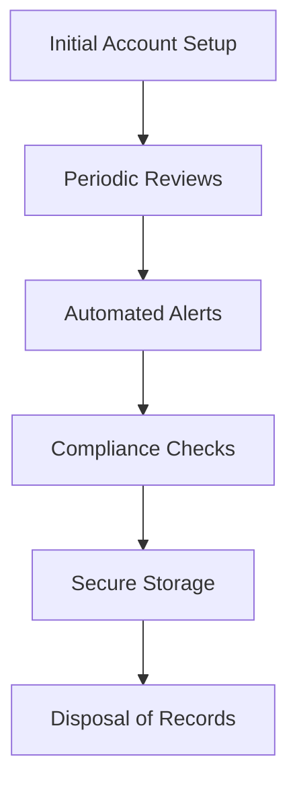

## 16.3.1 Account Updates and Recordkeeping

In the fast-paced world of securities trading, maintaining accurate and up-to-date records is crucial for compliance, operational efficiency, and customer satisfaction. This section delves into the importance of account updates and recordkeeping, outlines the regulatory requirements, and provides best practices for maintaining impeccable records.

### Importance of Accurate Records for Compliance and Service

Accurate recordkeeping is the backbone of the securities industry. It ensures compliance with regulatory requirements, facilitates smooth operations, and enhances customer service. Here are some reasons why maintaining precise records is vital:

- **Regulatory Compliance**: Regulatory bodies such as the Financial Industry Regulatory Authority (FINRA) and the Securities and Exchange Commission (SEC) mandate strict recordkeeping requirements. Failure to comply can result in penalties, fines, or even suspension of operations.
  
- **Audit and Inspection Readiness**: Accurate records ensure that a firm is always prepared for audits and inspections by regulatory authorities, reducing the risk of non-compliance findings.

- **Customer Service**: Up-to-date records allow for efficient handling of customer inquiries and transactions. They enable representatives to provide personalized service and address customer needs promptly.

- **Risk Management**: Comprehensive records help in identifying and mitigating risks by providing a clear picture of customer activities and market positions.

- **Legal Protection**: In the event of disputes or legal proceedings, well-maintained records serve as evidence to protect the firm and its representatives.

### Regulatory Requirements for Account Updates and Recordkeeping

#### Periodic Updates

Regulatory bodies require firms to periodically update customer account information to reflect any changes in their circumstances. This is essential for ensuring that investment recommendations remain suitable. Key triggers for account updates include:

- **Significant Life Events**: Changes such as marriage, divorce, birth of a child, or death in the family can impact financial goals and risk tolerance.

- **Financial Status Changes**: Variations in income, employment status, or net worth necessitate updates to ensure investment strategies align with the customer's financial situation.

- **Investment Objectives**: As customers' goals evolve, their investment objectives may change, requiring updates to their account information.

- **Contact Information**: Keeping contact details current is crucial for effective communication and delivery of account statements and regulatory notices.

#### Record Retention Guidelines

Record retention is governed by various regulations, including the SEC's Rule 17a-4 and FINRA's Rule 4511. These rules specify the types of records that must be maintained and the duration for which they should be kept. Key requirements include:

- **Customer Account Records**: Must be retained for at least six years after the account is closed. This includes account opening documents, agreements, and transaction records.

- **Trade Confirmations and Statements**: Retain for at least three years, with the first two years in an easily accessible location.

- **Communications**: All written and electronic communications related to the firm's business must be kept for at least three years.

- **Complaints**: Records of customer complaints must be retained for at least four years.

- **Financial Records**: Financial and operational records, including ledgers and balance sheets, must be kept for six years.

#### Glossary

- **Record Retention Periods**: The specific time frames mandated for keeping different types of records, ensuring compliance with regulatory requirements.

### Best Practices for Record Maintenance

Implementing best practices for record maintenance not only ensures compliance but also enhances operational efficiency. Here are some strategies to consider:

- **Regular Audits and Reviews**: Conduct periodic audits of records to ensure accuracy and completeness. Regular reviews help identify and rectify discrepancies promptly.

- **Automated Systems**: Utilize technology to automate recordkeeping processes. Automated systems reduce human error, enhance efficiency, and ensure compliance with retention schedules.

- **Employee Training**: Provide ongoing training to employees on recordkeeping policies, procedures, and regulatory requirements. Well-informed staff are crucial for maintaining accurate records.

- **Data Security**: Implement robust security measures to protect sensitive customer information. This includes encryption, access controls, and regular security audits.

- **Disaster Recovery Plans**: Develop and maintain disaster recovery plans to ensure records are protected and can be restored in the event of a data loss incident.

- **Clear Policies and Procedures**: Establish clear policies and procedures for recordkeeping, including guidelines for data entry, updates, and retention. Ensure all staff are familiar with these protocols.

### Practical Examples and Scenarios

#### Case Study: Updating Customer Information

Consider a scenario where a customer, Jane Doe, experiences a significant life event, such as a divorce. As her financial representative, you must update her account information to reflect changes in her financial status and investment objectives. This involves:

- Reviewing and updating her financial profile, including income, assets, and liabilities.
- Discussing any changes in her risk tolerance and investment goals.
- Ensuring that her contact information is current for effective communication.

By maintaining accurate records, you ensure that Jane's investment strategy remains aligned with her current circumstances, enhancing her satisfaction and trust in your services.

#### Scenario: Record Retention Compliance

A financial firm undergoes a routine audit by FINRA. During the audit, the firm must demonstrate compliance with record retention requirements. This involves:

- Providing access to customer account records, trade confirmations, and communications.
- Demonstrating that records are retained for the specified periods and are easily accessible.
- Ensuring that all records are complete, accurate, and up-to-date.

By adhering to best practices for record maintenance, the firm successfully passes the audit, avoiding penalties and maintaining its reputation.

### Real-World Applications and Compliance Considerations

In practice, maintaining accurate records is an ongoing process that requires diligence and attention to detail. Here are some real-world applications and compliance considerations:

- **Integration with CRM Systems**: Many firms integrate their recordkeeping processes with Customer Relationship Management (CRM) systems to streamline updates and ensure data consistency across platforms.

- **Regulatory Changes**: Stay informed about changes in regulatory requirements that may impact recordkeeping practices. This includes updates to retention periods and new compliance mandates.

- **Cross-Border Considerations**: For firms operating internationally, consider the impact of global regulations on recordkeeping practices. This may involve additional retention requirements or data protection considerations.

### Step-by-Step Guidance for Recordkeeping

1. **Initial Account Setup**: Collect and document all necessary information during account opening, including personal details, financial status, and investment objectives.

2. **Periodic Reviews**: Schedule regular reviews of customer accounts to ensure information is current and accurate. This includes verifying contact details, financial status, and investment goals.

3. **Automated Alerts**: Implement automated alerts for significant life events or changes in financial status that may require account updates.

4. **Compliance Checks**: Conduct regular compliance checks to ensure adherence to record retention requirements and identify any gaps in documentation.

5. **Secure Storage**: Store records securely, ensuring that they are protected from unauthorized access and data breaches.

6. **Disposal of Records**: When records reach the end of their retention period, dispose of them securely and in compliance with regulatory guidelines.

### Diagrams and Visuals

Below is a diagram illustrating the process of maintaining customer account records, from initial setup to periodic reviews and compliance checks.

### Common Pitfalls and Strategies to Overcome Challenges

- **Inconsistent Updates**: Regularly review and update customer information to prevent inconsistencies. Use automated systems to prompt updates when necessary.

- **Data Security Breaches**: Implement strong security measures to protect customer data. Regularly review and update security protocols to address emerging threats.

- **Regulatory Non-Compliance**: Stay informed about regulatory changes and ensure that recordkeeping practices are updated accordingly. Regular training and audits can help maintain compliance.

### References and Additional Resources

- **FINRA Rule 4511**: Provides guidelines on recordkeeping requirements for member firms.
- **SEC Rule 17a-4**: Outlines the retention periods for various types of records.
- **Securities Act of 1933 and Securities Exchange Act of 1934**: Key legislation governing securities regulation and recordkeeping requirements.

For further exploration, consider reviewing FINRA's Recordkeeping and Reporting Requirements and the SEC's Compliance and Disclosure Interpretations.

### Summary

Maintaining accurate account updates and records is essential for compliance, customer service, and operational efficiency in the securities industry. By adhering to regulatory requirements and implementing best practices, firms can ensure that their records are complete, accurate, and readily accessible. This not only facilitates compliance but also enhances customer satisfaction and trust.

### Series 7 Exam Practice Questions: Account Updates and Recordkeeping



### What is the minimum retention period for customer account records according to FINRA Rule 4511?

- [x] Six years
- [ ] Three years
- [ ] Four years
- [ ] Five years

> **Explanation:** FINRA Rule 4511 requires firms to retain customer account records for a minimum of six years after the account is closed.

### Which event would most likely trigger a need for updating a customer's account information?

- [ ] A change in the stock market
- [x] A significant life event, such as marriage or divorce
- [ ] A change in the firm's management
- [ ] An update to the firm's website

> **Explanation:** Significant life events such as marriage or divorce can impact a customer's financial situation and investment objectives, necessitating an update to their account information.

### What is the primary purpose of maintaining accurate records in the securities industry?

- [ ] To increase sales
- [ ] To reduce employee workload
- [x] To ensure regulatory compliance and enhance customer service
- [ ] To improve marketing strategies

> **Explanation:** Accurate records are crucial for ensuring regulatory compliance and providing high-quality customer service.

### How long must trade confirmations and statements be retained according to regulatory requirements?

- [ ] One year
- [ ] Two years
- [x] Three years
- [ ] Four years

> **Explanation:** Trade confirmations and statements must be retained for at least three years, with the first two years in an easily accessible location.

### What is a best practice for ensuring data security in recordkeeping?

- [ ] Keeping records in a physical storage room
- [x] Implementing robust encryption and access controls
- [ ] Allowing open access to all employees
- [ ] Storing records on unsecured servers

> **Explanation:** Implementing robust encryption and access controls is a best practice for ensuring data security in recordkeeping.

### Which of the following is a key component of a disaster recovery plan for recordkeeping?

- [ ] Hiring more staff
- [ ] Increasing marketing efforts
- [x] Ensuring records can be restored in the event of data loss
- [ ] Reducing customer service hours

> **Explanation:** A disaster recovery plan should ensure that records can be restored in the event of data loss to maintain business continuity.

### What is the role of automated systems in recordkeeping?

- [ ] To replace human employees
- [ ] To increase marketing reach
- [x] To reduce human error and enhance efficiency
- [ ] To eliminate the need for audits

> **Explanation:** Automated systems help reduce human error and enhance efficiency in recordkeeping processes.

### Which regulatory body provides guidelines on recordkeeping requirements for member firms?

- [ ] IRS
- [ ] Department of Labor
- [x] FINRA
- [ ] Federal Trade Commission

> **Explanation:** FINRA provides guidelines on recordkeeping requirements for member firms.

### What should be done when records reach the end of their retention period?

- [ ] Keep them indefinitely
- [ ] Transfer them to a new location
- [x] Dispose of them securely and in compliance with regulatory guidelines
- [ ] Archive them without any security measures

> **Explanation:** Records should be disposed of securely and in compliance with regulatory guidelines when they reach the end of their retention period.

### What is the impact of inconsistent updates on customer records?

- [ ] Improved customer satisfaction
- [ ] Enhanced compliance
- [x] Increased risk of discrepancies and non-compliance
- [ ] Reduced need for audits

> **Explanation:** Inconsistent updates can lead to discrepancies and increased risk of non-compliance.



By mastering the principles of account updates and recordkeeping, you will be well-prepared to ensure compliance and provide excellent service in your role as a General Securities Representative.
