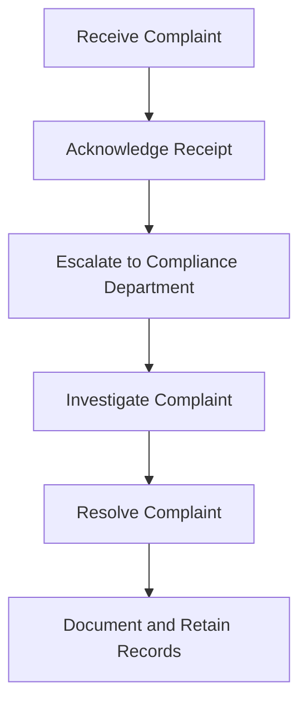

## 16.3.3 Handling Customer Complaints

Handling customer complaints effectively is a crucial aspect of maintaining trust and compliance within the securities industry. As a General Securities Representative, understanding the procedures and regulatory requirements for managing complaints is essential for both exam preparation and professional practice. This section provides a comprehensive overview of the processes involved in handling customer complaints, including definitions, procedures, examples, and best practices.

### Definition of a Complaint

In the context of the securities industry, a **complaint** is defined as any written statement from a customer or any person acting on behalf of a customer alleging a grievance involving the activities of a broker-dealer or an associated person. This definition is critical as it sets the parameters for what constitutes a formal complaint, triggering specific regulatory obligations and internal processes.

### Procedures for Handling Customer Complaints

Handling customer complaints involves several key steps to ensure compliance with regulatory requirements and to maintain customer satisfaction. These steps include acknowledging receipt, escalating the complaint to the appropriate department, and documenting and retaining records of the complaint and its resolution.

#### Acknowledge Receipt Promptly

The first step in handling a customer complaint is to acknowledge its receipt promptly. This acknowledgment serves several purposes:

- **Customer Assurance:** It reassures the customer that their concerns are being taken seriously and will be addressed.
- **Regulatory Compliance:** It fulfills regulatory requirements that mandate timely acknowledgment of complaints.

**Example:** A customer sends an email to a broker-dealer alleging unauthorized transactions on their account. The firm should respond with an acknowledgment email within a specified timeframe, typically within 24 to 48 hours, confirming receipt of the complaint and outlining the next steps.

#### Escalate to Compliance Department

Once a complaint is received, it should be escalated to the compliance department or the designated complaint handling team. This escalation is crucial for several reasons:

- **Expertise:** The compliance department is equipped with the expertise to assess the complaint's validity and determine the appropriate course of action.
- **Impartiality:** By involving a separate department, the firm ensures an impartial review of the complaint, avoiding potential conflicts of interest.

**Example:** A customer submits a written complaint about misleading information provided by a financial advisor. The complaint is forwarded to the compliance department, which reviews the advisor's communications and assesses whether any regulatory violations occurred.

#### Document and Retain Records

Documentation and record retention are vital components of the complaint handling process. Firms must maintain detailed records of each complaint and its resolution for regulatory review and internal analysis.

- **Documentation:** Record all relevant details, including the nature of the complaint, the parties involved, the investigation process, and the resolution.
- **Retention:** Retain these records for a specified period, as mandated by regulatory bodies such as FINRA and the SEC.

**Example:** A brokerage firm receives a complaint regarding excessive trading in a customer's account. The firm documents the complaint, the investigation findings, and the resolution, retaining these records for at least three years, as required by FINRA Rule 4513.

### Glossary

- **Complaint:** Any written statement alleging a grievance involving the broker-dealer or associated persons.

### Examples of Complaint Handling Processes

To illustrate the complaint handling process, consider the following scenarios:

#### Scenario 1: Unauthorized Transactions

A customer notices several unauthorized transactions on their account and submits a written complaint to the brokerage firm. The firm acknowledges receipt of the complaint within 24 hours and escalates it to the compliance department. The compliance team investigates the transactions, identifies the source of the unauthorized activity, and resolves the issue by reversing the transactions and enhancing account security measures. The firm documents the entire process and retains the records for future reference.

#### Scenario 2: Misleading Investment Advice

A customer claims they received misleading investment advice from their financial advisor, resulting in significant financial losses. The customer submits a formal complaint to the firm. The firm acknowledges the complaint, escalates it to the compliance department, and conducts a thorough review of the advisor's communications and recommendations. The investigation reveals that the advisor failed to disclose key risks associated with the recommended investments. The firm takes corrective action by compensating the customer for their losses and implementing additional training for the advisor.

### Best Practices for Handling Customer Complaints

Effective complaint handling requires adherence to best practices that prioritize customer satisfaction and regulatory compliance. Here are some key best practices:

- **Timely Response:** Ensure prompt acknowledgment and resolution of complaints to maintain customer trust and comply with regulatory requirements.
- **Clear Communication:** Communicate clearly and transparently with the customer throughout the complaint handling process, providing updates and explanations as needed.
- **Thorough Investigation:** Conduct a comprehensive investigation of each complaint, gathering all relevant information and evidence to make informed decisions.
- **Fair Resolution:** Strive for fair and equitable resolutions that address the customer's concerns and prevent future occurrences of similar issues.
- **Continuous Improvement:** Use complaint data to identify trends and areas for improvement, implementing changes to enhance customer service and compliance processes.

### Regulatory Considerations

Handling customer complaints involves compliance with various regulatory requirements. Key regulatory bodies and rules include:

- **FINRA Rules:** FINRA Rule 4513 requires firms to maintain a record of all written customer complaints and their resolutions. Rule 4530 mandates the reporting of certain complaints to FINRA.
- **SEC Regulations:** The SEC requires firms to establish and maintain effective complaint handling procedures as part of their overall compliance programs.
- **State Regulations:** State securities regulators may have additional requirements for handling customer complaints, which firms must adhere to.

### Real-World Applications and Scenarios

Understanding how to handle customer complaints effectively is not only crucial for exam preparation but also for real-world applications in the securities industry. Consider the following scenarios and how they relate to the complaint handling process:

#### Scenario 3: Data Breach and Customer Concerns

A brokerage firm experiences a data breach that compromises customer information. Several customers submit written complaints expressing concerns about the security of their accounts. The firm acknowledges each complaint, escalates them to the compliance and IT departments, and conducts a thorough investigation. The firm communicates transparently with customers, outlining the steps taken to address the breach and prevent future incidents. The firm also offers credit monitoring services to affected customers as part of the resolution.

#### Scenario 4: Disputed Fees

A customer disputes fees charged to their account, alleging that they were not informed of the charges. The customer submits a formal complaint to the firm. The firm acknowledges the complaint and escalates it to the compliance department for review. The investigation reveals that the fees were disclosed in the account agreement, but the customer may not have fully understood the terms. The firm resolves the complaint by waiving the disputed fees and enhancing its communication of fee structures to customers.

### Diagrams and Visual Aids

To enhance understanding of the complaint handling process, consider the following diagram illustrating the key steps involved:

### Common Pitfalls and Challenges

Handling customer complaints can present several challenges and potential pitfalls. Being aware of these issues and implementing strategies to address them can enhance the effectiveness of complaint handling processes:

- **Delayed Responses:** Failing to acknowledge or respond to complaints promptly can erode customer trust and lead to regulatory penalties. Implementing automated acknowledgment systems can help mitigate this risk.
- **Incomplete Investigations:** Inadequate investigations can result in unresolved complaints and repeated issues. Ensuring thorough and comprehensive investigations is crucial for effective complaint resolution.
- **Lack of Documentation:** Insufficient documentation can hinder regulatory compliance and limit the firm's ability to analyze complaint trends. Establishing robust record-keeping practices is essential for maintaining compliance and improving processes.

### Strategies for Overcoming Challenges

To overcome common challenges in handling customer complaints, consider the following strategies:

- **Implementing Technology Solutions:** Utilize technology to automate complaint acknowledgment, track complaint status, and generate reports for analysis.
- **Training and Development:** Provide ongoing training for employees on complaint handling procedures, regulatory requirements, and customer service best practices.
- **Regular Reviews and Audits:** Conduct regular reviews and audits of complaint handling processes to identify areas for improvement and ensure compliance with regulatory requirements.

### Additional Resources and Study Materials

To deepen your understanding of handling customer complaints and prepare for the Series 7 Exam, consider exploring the following resources:

- **FINRA's Regulatory Notices:** Review FINRA's regulatory notices and guidance on complaint handling to stay informed of the latest requirements and best practices.
- **SEC's Compliance and Disclosure Interpretations:** Explore the SEC's interpretations and guidance on complaint handling and related compliance issues.
- **Practice Exams and Question Banks:** Utilize practice exams and question banks to test your knowledge and understanding of complaint handling procedures and regulatory requirements.

### Summary

Handling customer complaints effectively is a critical skill for securities professionals, ensuring compliance with regulatory requirements and maintaining customer trust. By understanding the definition of a complaint, following established procedures, and adhering to best practices, you can navigate the complexities of complaint handling with confidence. Remember to document and retain records, communicate clearly with customers, and continuously improve your processes to enhance customer satisfaction and regulatory compliance.

## Series 7 Exam Practice Questions: Handling Customer Complaints



### What is the definition of a complaint in the securities industry?

- [x] A written statement alleging a grievance involving a broker-dealer or associated persons
- [ ] An oral expression of dissatisfaction with service
- [ ] Any communication from a customer
- [ ] A request for account information

> **Explanation:** A complaint is defined as a written statement alleging a grievance involving the broker-dealer or associated persons, as per regulatory guidelines.

### What is the first step in handling a customer complaint?

- [x] Acknowledge receipt of the complaint
- [ ] Escalate the complaint to management
- [ ] Investigate the complaint
- [ ] Resolve the complaint

> **Explanation:** The first step is to acknowledge receipt of the complaint, which reassures the customer and fulfills regulatory requirements.

### Why is it important to escalate a complaint to the compliance department?

- [x] To ensure an impartial review and compliance with regulations
- [ ] To expedite the resolution process
- [ ] To avoid involving senior management
- [ ] To document the complaint

> **Explanation:** Escalating to the compliance department ensures an impartial review and adherence to regulatory requirements.

### How long must firms retain records of customer complaints?

- [x] At least three years
- [ ] At least one year
- [ ] At least five years
- [ ] At least ten years

> **Explanation:** FINRA Rule 4513 requires firms to retain records of customer complaints for at least three years.

### What is a common pitfall in handling customer complaints?

- [x] Delayed responses
- [ ] Immediate resolution
- [ ] Over-documentation
- [ ] Escalating too quickly

> **Explanation:** Delayed responses can erode customer trust and lead to regulatory penalties.

### Which regulatory body requires firms to maintain a record of all written customer complaints?

- [x] FINRA
- [ ] SEC
- [ ] MSRB
- [ ] CFTC

> **Explanation:** FINRA requires firms to maintain records of all written customer complaints and their resolutions.

### What should a firm do if a complaint involves potential regulatory violations?

- [x] Conduct a thorough investigation and report as required
- [ ] Ignore the complaint
- [ ] Resolve the complaint without investigation
- [ ] Escalate directly to senior management

> **Explanation:** A thorough investigation is necessary, and reporting may be required if regulatory violations are involved.

### What is a key benefit of documenting and retaining records of complaints?

- [x] Ensuring regulatory compliance and facilitating trend analysis
- [ ] Reducing the need for customer communication
- [ ] Avoiding the need for investigations
- [ ] Limiting customer interactions

> **Explanation:** Documenting and retaining records ensures compliance and helps identify trends for process improvements.

### Which of the following is a best practice for handling customer complaints?

- [x] Communicate clearly and transparently with the customer
- [ ] Avoid discussing the complaint with the customer
- [ ] Resolve all complaints without investigation
- [ ] Limit communication to written correspondence only

> **Explanation:** Clear and transparent communication is essential for effective complaint handling and customer satisfaction.

### What is the role of technology in handling customer complaints?

- [x] Automating acknowledgment and tracking status
- [ ] Eliminating the need for human involvement
- [ ] Reducing the number of complaints received
- [ ] Avoiding the need for documentation

> **Explanation:** Technology can automate processes like acknowledgment and tracking, improving efficiency and compliance.



By mastering the procedures and best practices for handling customer complaints, you can enhance your readiness for the Series 7 Exam and your effectiveness as a securities professional. Remember to apply these principles in practice, ensuring compliance and maintaining the trust of your clients.
