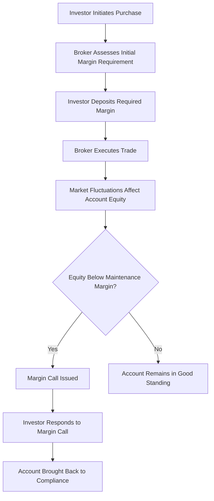

## 17.2 Regulation T and Margin Requirements

Understanding Regulation T and margin requirements is crucial for any aspiring General Securities Representative. This section delves into the intricacies of Regulation T, established by the Federal Reserve Board, which governs the initial margin requirements for securities transactions. Additionally, we will explore the maintenance margin requirements set by FINRA and exchanges, providing you with a comprehensive understanding necessary for the Series 7 Exam and your future career in the securities industry.

### Introduction to Regulation T

Regulation T is a set of rules established by the Federal Reserve Board that governs the extension of credit by brokers and dealers to customers for the purchase of securities. It is a crucial component of the margin requirements in the United States, ensuring that investors have sufficient equity in their accounts to cover potential losses. Regulation T applies to cash accounts and margin accounts, but its primary focus is on the latter.

#### Purpose of Regulation T

The primary purpose of Regulation T is to control the amount of credit that can be extended to investors for purchasing securities. By setting initial margin requirements, Regulation T aims to:

- **Reduce Systemic Risk:** By limiting the amount of borrowed funds in the market, Regulation T helps prevent excessive leverage that could lead to systemic financial instability.
- **Protect Investors:** Ensuring that investors have adequate equity in their accounts reduces the risk of significant losses that they cannot cover.
- **Promote Fairness and Transparency:** Regulation T establishes clear rules for brokers and dealers, promoting a fair and transparent market environment.

#### Key Provisions of Regulation T

Regulation T includes several key provisions that brokers and dealers must adhere to:

- **Initial Margin Requirement:** Regulation T sets the initial margin requirement at 50% for most securities. This means that an investor must deposit at least 50% of the purchase price of securities in cash or eligible securities.
- **Payment Period:** Investors must pay for securities within a specified period, typically two business days after the trade date (T+2).
- **Special Memorandum Account (SMA):** Regulation T allows for the creation of a Special Memorandum Account, which records excess equity in a margin account that can be used for future purchases.

### Initial Margin Requirements

The initial margin requirement is the percentage of the purchase price of securities that an investor must pay for with their own funds. Under Regulation T, the Federal Reserve Board has set this requirement at 50% for most securities. This means that if an investor wants to purchase $10,000 worth of securities, they must deposit at least $5,000 in cash or eligible securities.

#### Calculating Initial Margin

To calculate the initial margin requirement, use the following formula:


\text{Initial Margin Requirement} = \text{Purchase Price} \times \text{Initial Margin Percentage}


**Example:**

Suppose an investor wants to purchase $20,000 worth of stock. The initial margin requirement is 50%.


\text{Initial Margin Requirement} = \$20,000 \times 0.50 = \$10,000


The investor must deposit $10,000 in their margin account to proceed with the purchase.

#### Eligible Securities for Initial Margin

Not all securities are eligible for margin trading under Regulation T. Eligible securities typically include:

- **Listed Stocks:** Stocks listed on major exchanges such as the NYSE and NASDAQ.
- **Convertible Bonds:** Bonds that can be converted into a predetermined number of shares.
- **Certain Mutual Funds:** Some mutual funds are eligible for margin trading after holding them for a specified period.

### Maintenance Margin Requirements

While Regulation T governs the initial margin requirement, maintenance margin requirements are set by FINRA and individual exchanges. The maintenance margin is the minimum amount of equity an investor must maintain in their margin account after the purchase of securities.

#### FINRA Maintenance Margin Requirements

FINRA has established a minimum maintenance margin requirement of 25% for most securities. This means that an investor must maintain at least 25% of the current market value of the securities in their margin account.

#### Calculating Maintenance Margin

To calculate the maintenance margin requirement, use the following formula:


\text{Maintenance Margin Requirement} = \text{Current Market Value} \times \text{Maintenance Margin Percentage}


**Example:**

An investor purchases $20,000 worth of stock with an initial margin of $10,000. The current market value of the stock drops to $15,000. The maintenance margin requirement is 25%.


\text{Maintenance Margin Requirement} = \$15,000 \times 0.25 = \$3,750


The investor must maintain at least $3,750 in their margin account. If the equity falls below this level, a margin call will be issued.

### Margin Calls and Liquidation

A margin call occurs when the equity in a margin account falls below the required maintenance margin level. When this happens, the broker will require the investor to deposit additional funds or securities to bring the account back into compliance.

#### Types of Margin Calls

- **Federal Call:** Occurs when the initial margin requirement is not met.
- **Maintenance Call:** Triggered when the equity falls below the maintenance margin requirement.

#### Responding to a Margin Call

Investors have several options to respond to a margin call:

- **Deposit Additional Funds:** Add cash or marginable securities to the account.
- **Sell Securities:** Liquidate some of the securities in the account to meet the margin requirement.
- **Transfer Securities:** Move securities from another account to meet the margin call.

### Risks and Considerations in Margin Trading

Margin trading offers the potential for higher returns but also comes with increased risk. Investors should be aware of the following risks:

- **Leverage Risk:** Using borrowed funds amplifies both gains and losses.
- **Market Volatility:** Market fluctuations can quickly erode equity, leading to margin calls.
- **Interest Costs:** Borrowing on margin incurs interest charges, which can reduce overall returns.

### Compliance and Best Practices

To ensure compliance with Regulation T and margin requirements, brokers and dealers should follow best practices:

- **Regular Monitoring:** Continuously monitor margin accounts to ensure compliance with initial and maintenance margin requirements.
- **Client Education:** Educate clients about the risks and requirements of margin trading.
- **Clear Communication:** Provide clear and timely communication regarding margin calls and account status.

### Real-World Applications and Case Studies

Consider the following case study illustrating the application of Regulation T and margin requirements:

**Case Study:**

An investor, Alex, decides to purchase $50,000 worth of stock in a technology company. Under Regulation T, Alex must deposit $25,000 as the initial margin. After the purchase, the stock's value drops to $40,000. With a maintenance margin requirement of 25%, Alex must maintain at least $10,000 in equity. Since Alex's equity falls below this threshold, a margin call is issued. Alex decides to deposit an additional $5,000 to meet the margin requirement and avoid liquidation.

### Diagrams and Visual Aids

To better understand the process of margin trading and Regulation T, consider the following diagram illustrating the flow of a margin transaction:

### Summary and Key Takeaways

- **Regulation T** sets the initial margin requirement at 50% for most securities, ensuring investors have sufficient equity to cover potential losses.
- **Maintenance Margin Requirements** are set by FINRA and exchanges, typically at 25%, to ensure ongoing account equity.
- **Margin Calls** occur when equity falls below the required level, requiring investors to deposit additional funds or liquidate securities.
- **Risks of Margin Trading** include leverage risk, market volatility, and interest costs.
- **Compliance and Best Practices** involve regular monitoring, client education, and clear communication.

### Additional Resources

For further exploration of Regulation T and margin requirements, consider reviewing the following resources:

- **Federal Reserve Board's Regulation T:** [Federal Reserve Board - Regulation T](https://www.federalreserve.gov/supervisionreg/regt.htm)
- **FINRA Margin Requirements:** [FINRA - Margin Requirements](https://www.finra.org/rules-guidance/rulebooks/finra-rules/4210)
- **Securities Exchange Act of 1934:** [SEC - Securities Exchange Act of 1934](https://www.sec.gov/about/laws/sea34.pdf)

## Series 7 Exam Practice Questions: Regulation T and Margin Requirements



### What is the initial margin requirement set by Regulation T for most securities?

- [x] 50%
- [ ] 25%
- [ ] 75%
- [ ] 100%

> **Explanation:** Regulation T sets the initial margin requirement at 50% for most securities, meaning investors must deposit at least half of the purchase price with their own funds.

### Which organization sets the maintenance margin requirements for securities?

- [ ] Federal Reserve Board
- [x] FINRA
- [ ] SEC
- [ ] NYSE

> **Explanation:** FINRA sets the maintenance margin requirements, which are typically 25% for most securities.

### What is a margin call?

- [ ] A request to open a new margin account
- [x] A demand for additional funds when equity falls below the maintenance margin
- [ ] A notification of a successful trade
- [ ] An offer to reduce interest rates

> **Explanation:** A margin call is issued when the equity in a margin account falls below the maintenance margin requirement, requiring the investor to deposit additional funds or securities.

### How can an investor respond to a margin call?

- [x] Deposit additional funds
- [ ] Ignore it
- [ ] Close the account
- [ ] Increase leverage

> **Explanation:** An investor can respond to a margin call by depositing additional funds or securities to meet the margin requirement.

### What does the Special Memorandum Account (SMA) record?

- [ ] Loan interest payments
- [x] Excess equity in a margin account
- [ ] Daily stock prices
- [ ] Broker fees

> **Explanation:** The SMA records excess equity in a margin account, which can be used for future purchases.

### What is the purpose of Regulation T?

- [ ] To set stock prices
- [x] To control the amount of credit extended for securities purchases
- [ ] To eliminate all margin trading
- [ ] To increase market volatility

> **Explanation:** Regulation T controls the amount of credit extended to investors for purchasing securities, reducing systemic risk and protecting investors.

### What happens if an investor fails to meet a margin call?

- [ ] They receive a reward
- [ ] The account is closed
- [x] The broker may liquidate securities to cover the shortfall
- [ ] The margin requirement is waived

> **Explanation:** If an investor fails to meet a margin call, the broker may liquidate securities in the account to cover the shortfall.

### What is the typical payment period for securities under Regulation T?

- [ ] T+1
- [x] T+2
- [ ] T+3
- [ ] T+5

> **Explanation:** Regulation T typically requires payment for securities within two business days after the trade date, known as T+2.

### Which of the following is a risk associated with margin trading?

- [ ] Guaranteed profits
- [ ] Reduced interest rates
- [x] Increased leverage risk
- [ ] Elimination of market volatility

> **Explanation:** Margin trading increases leverage risk, amplifying both potential gains and losses.

### What is the minimum maintenance margin requirement set by FINRA?

- [ ] 10%
- [ ] 50%
- [ ] 40%
- [x] 25%

> **Explanation:** FINRA sets the minimum maintenance margin requirement at 25% for most securities.



By mastering Regulation T and margin requirements, you will be well-prepared for the Series 7 Exam and equipped to manage margin accounts effectively in your securities career.
