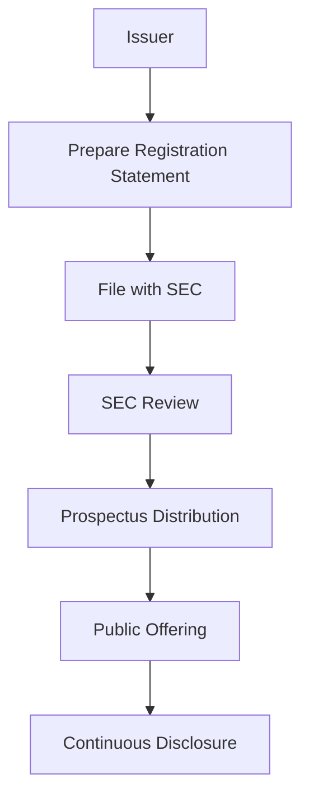

## 18.1.1 Purpose and Requirements

The Securities Act of 1933, often referred to as the "truth in securities" law, was enacted to ensure transparency in the financial statements of securities offered to the public and to prevent fraud in the securities market. This landmark legislation was a direct response to the stock market crash of 1929 and the subsequent Great Depression, aiming to restore investor confidence by mandating full disclosure of material information about securities being offered for public sale.

### Purpose of the Securities Act of 1933

The primary purpose of the Securities Act of 1933 is to provide investors with significant information concerning securities being offered for public sale, thereby facilitating informed investment decisions. It aims to achieve this by:

- **Ensuring Transparency:** The Act mandates that investors receive financial and other significant information concerning securities being offered for public sale. This transparency is crucial for investors to make informed decisions and assess the risks and potential returns associated with their investments.

- **Preventing Fraud:** By requiring full disclosure of material information, the Act seeks to prevent deceit, misrepresentations, and other fraud in the sale of securities. This is intended to protect investors from fraudulent schemes and to maintain the integrity of the securities markets.

- **Establishing a Registration Process:** The Act requires that securities offered for public sale be registered with the Securities and Exchange Commission (SEC), providing a legal framework for the issuance of new securities and ensuring that all necessary information is disclosed.

### Key Requirements of the Securities Act of 1933

The Securities Act of 1933 imposes several critical requirements on issuers of securities, underwriters, and other participants in the securities market. These requirements are designed to ensure compliance with the Act's objectives of transparency and fraud prevention.

#### Registration of New Securities

One of the cornerstone requirements of the Securities Act of 1933 is the registration of new securities with the SEC before they can be offered for public sale. The registration process involves the filing of a registration statement, which includes:

- **The Prospectus:** This is a legal document that provides detailed information about the investment offering to potential investors. It includes information about the company's business operations, financial condition, management, and the specific terms of the securities being offered. The prospectus is intended to provide investors with all the necessary information to make informed investment decisions.

- **Material Information:** The registration statement must include all material information that an investor would need to make an informed decision. This includes financial statements, details about the management team, any legal proceedings involving the company, and any other significant information that could impact the value of the securities.

- **SEC Review:** Once the registration statement is filed, the SEC reviews it to ensure compliance with the Act's requirements. The SEC does not evaluate the merits of the securities being offered or the quality of the company, but rather ensures that all necessary information is disclosed.

#### Full Disclosure of Material Information

The Securities Act of 1933 requires full disclosure of all material information related to the securities being offered. This requirement is intended to prevent fraud and ensure that investors have access to all the information they need to make informed decisions. Key aspects of this requirement include:

- **Accuracy and Completeness:** The information disclosed in the registration statement and prospectus must be accurate and complete. Any misstatements or omissions of material information can result in severe legal consequences for the issuer and other parties involved.

- **Continuous Disclosure:** In addition to the initial disclosure required at the time of the offering, issuers are also required to provide ongoing disclosure of material information that could impact the value of the securities. This ensures that investors have access to up-to-date information about their investments.

### The Role of the Underwriter

Underwriters play a crucial role in the securities offering process, acting as intermediaries between the issuing company and the investing public. Their responsibilities include:

- **Assisting with the Registration Process:** Underwriters help issuers prepare the registration statement and prospectus, ensuring that all necessary information is included and that the documents comply with SEC requirements.

- **Pricing and Selling the Securities:** Underwriters are responsible for setting the initial offering price of the securities and managing the sale to investors. They may purchase the securities from the issuer and then sell them to the public, or they may act as agents for the issuer, selling the securities on their behalf.

- **Managing Risk:** By purchasing the securities from the issuer and reselling them to the public, underwriters assume the risk that the securities may not sell at the anticipated price. This risk management function is a critical component of the underwriting process.

### Practical Examples and Case Studies

To better understand the implications of the Securities Act of 1933, let's explore some practical examples and case studies that illustrate its impact on the securities market.

#### Example 1: The IPO of a Technology Company

Consider a technology company that is planning to go public through an initial public offering (IPO). The company must prepare a registration statement and prospectus, providing detailed information about its business operations, financial condition, and the terms of the securities being offered. The SEC reviews these documents to ensure compliance with the Act's requirements, and the underwriter assists with pricing and selling the securities to the public.

#### Example 2: A Fraudulent Securities Offering

In a case of fraudulent securities offering, a company may attempt to mislead investors by omitting material information or providing false statements in its prospectus. If discovered, this could result in legal action by the SEC, penalties for the company and its executives, and potential restitution for affected investors. This example highlights the importance of full disclosure and the role of the SEC in enforcing the Act's requirements.

### Real-World Applications and Regulatory Scenarios

Understanding the Securities Act of 1933 is essential for professionals in the securities industry, as it provides the legal framework for the issuance of new securities and the protection of investors. Key applications include:

- **Compliance with SEC Regulations:** Professionals must ensure that all securities offerings comply with the Act's requirements, including the registration of new securities and the full disclosure of material information.

- **Due Diligence in Securities Offerings:** Underwriters and other participants in the securities market must conduct thorough due diligence to ensure that all necessary information is disclosed and that the offering complies with SEC regulations.

- **Investor Protection:** By understanding the requirements of the Securities Act of 1933, professionals can better protect investors from fraudulent schemes and ensure the integrity of the securities markets.

### Diagrams and Visuals

To enhance understanding, let's include a diagram illustrating the registration process under the Securities Act of 1933.

### Best Practices, Common Pitfalls, and Strategies

To successfully navigate the requirements of the Securities Act of 1933, consider the following best practices and strategies:

- **Thorough Preparation:** Ensure that all necessary information is included in the registration statement and prospectus, and that the documents comply with SEC requirements.

- **Accurate and Complete Disclosure:** Avoid common pitfalls by providing accurate and complete disclosure of all material information, and by updating investors with any significant changes.

- **Effective Risk Management:** Underwriters should manage the risk associated with securities offerings by conducting thorough due diligence and setting appropriate offering prices.

### References and Additional Resources

For further exploration of the Securities Act of 1933, consider the following resources:

- **Securities and Exchange Commission (SEC):** The SEC's website provides detailed information about the Securities Act of 1933, including guidance on registration requirements and disclosure obligations.

- **FINRA:** The Financial Industry Regulatory Authority offers resources and training for securities professionals, including information on compliance with the Securities Act of 1933.

- **Investment Law Textbooks:** Consider consulting textbooks on investment law for a more in-depth analysis of the Securities Act of 1933 and its impact on the securities market.

### Summary

The Securities Act of 1933 plays a critical role in ensuring transparency and preventing fraud in the securities market. By requiring the registration of new securities and the full disclosure of material information, the Act provides a legal framework for the issuance of new securities and the protection of investors. Understanding the requirements of the Act is essential for professionals in the securities industry, as it enables them to comply with SEC regulations, conduct thorough due diligence, and protect investors from fraudulent schemes.

## Series 7 Exam Practice Questions: Purpose and Requirements



### What is the primary purpose of the Securities Act of 1933?

- [x] To ensure transparency and prevent fraud in the securities market.
- [ ] To regulate insider trading and market manipulation.
- [ ] To establish the Federal Reserve System.
- [ ] To provide guidelines for corporate governance.

> **Explanation:** The Securities Act of 1933 aims to ensure transparency in the securities market by requiring full disclosure of material information, thereby preventing fraud.

### Which document provides detailed information about an investment offering to potential investors?

- [ ] Annual Report
- [x] Prospectus
- [ ] Balance Sheet
- [ ] Income Statement

> **Explanation:** The prospectus is a legal document detailing the investment offering, including financial and operational information, to potential investors.

### What is the role of the SEC in the registration process under the Securities Act of 1933?

- [x] To review the registration statement for compliance with disclosure requirements.
- [ ] To evaluate the merits of the securities being offered.
- [ ] To set the initial offering price of the securities.
- [ ] To manage the sale of securities to the public.

> **Explanation:** The SEC reviews the registration statement to ensure compliance with disclosure requirements but does not evaluate the merits of the securities.

### Which of the following is NOT a requirement of the Securities Act of 1933?

- [ ] Registration of new securities with the SEC.
- [ ] Full disclosure of material information.
- [x] Approval of the securities' investment quality by the SEC.
- [ ] Distribution of a prospectus to potential investors.

> **Explanation:** The SEC does not approve the investment quality of securities; it ensures that all necessary information is disclosed.

### What is the responsibility of an underwriter in a securities offering?

- [ ] To review the issuer's financial statements.
- [x] To assist with the registration process and manage the sale of securities.
- [ ] To provide legal advice to the issuer.
- [ ] To conduct audits of the issuer's operations.

> **Explanation:** Underwriters assist with the registration process, help prepare the prospectus, and manage the sale of securities to the public.

### What is the consequence of failing to provide full disclosure of material information?

- [ ] The SEC will automatically approve the offering.
- [ ] The issuer will receive a tax penalty.
- [x] The issuer may face legal action and penalties.
- [ ] The offering will proceed without consequence.

> **Explanation:** Failure to provide full disclosure can result in legal action by the SEC, penalties for the issuer, and potential restitution for affected investors.

### How does the Securities Act of 1933 protect investors?

- [x] By requiring full disclosure of material information and preventing fraud.
- [ ] By setting minimum investment amounts for securities.
- [ ] By guaranteeing a return on investment.
- [ ] By regulating the interest rates on securities.

> **Explanation:** The Act protects investors by ensuring they have access to all material information needed to make informed decisions and by preventing fraudulent activities.

### What is a key component of the registration statement filed with the SEC?

- [ ] The company's marketing plan.
- [ ] The CEO's personal financial information.
- [x] The prospectus.
- [ ] The company's employee handbook.

> **Explanation:** The prospectus is a key component of the registration statement, providing detailed information about the securities offering.

### What risk management function do underwriters perform?

- [ ] They provide insurance for the securities.
- [x] They assume the risk of not selling the securities at the anticipated price.
- [ ] They eliminate all market risks for the issuer.
- [ ] They guarantee the success of the securities offering.

> **Explanation:** Underwriters assume the risk of not selling the securities at the anticipated price, which is a critical component of the underwriting process.

### What is the SEC's role in the continuous disclosure requirement?

- [ ] To set the interest rates for securities.
- [ ] To provide financial advice to investors.
- [x] To ensure issuers provide ongoing disclosure of material information.
- [ ] To approve the financial statements of issuers.

> **Explanation:** The SEC ensures that issuers provide ongoing disclosure of material information that could impact the value of the securities, maintaining transparency for investors.


