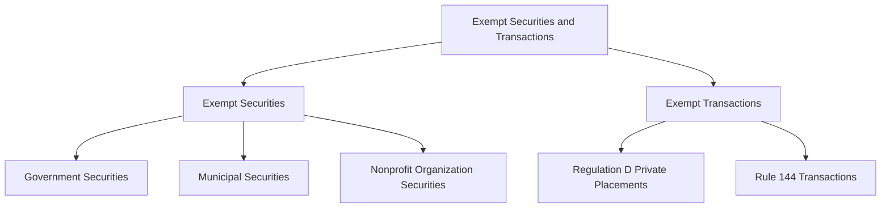

## 18.1.3 Exempt Securities and Transactions

The Securities Act of 1933 is a cornerstone of U.S. securities regulation, primarily aimed at ensuring transparency in the securities market and protecting investors by requiring the registration of securities offerings. However, not all securities and transactions fall under this registration requirement. Certain securities and transactions are deemed "exempt," meaning they do not need to go through the rigorous registration process typically required. Understanding these exemptions is crucial for professionals preparing for the Series 7 exam, as it directly impacts how securities are marketed and sold.

### Understanding Exempt Securities

Exempt securities are those that are not required to be registered with the Securities and Exchange Commission (SEC) under the Securities Act of 1933. These exemptions are based on the nature of the issuer, the type of security, or the purpose of the issuance. Here are the primary categories of exempt securities:

#### Government Securities

Government securities are debt instruments issued by the U.S. government, such as Treasury bills, notes, and bonds. These securities are considered low-risk because they are backed by the full faith and credit of the U.S. government. The rationale for their exemption is the inherent transparency and reliability of government issuers, which negates the need for additional regulatory oversight.

- **Example:** U.S. Treasury Bonds are a common type of government security that is exempt from registration. They are used to finance government spending and are considered one of the safest investments due to the government's ability to tax and print currency.

#### Municipal Securities

Municipal securities are issued by state and local governments or their agencies to finance public projects like schools, highways, and water systems. These securities are exempt because they are issued by government entities that are presumed to be transparent and accountable to the public.

- **Example:** A city issuing bonds to build a new public school would fall under this exemption. Investors often favor municipal bonds for their tax advantages, as the interest earned is typically exempt from federal income tax.

#### Nonprofit Organization Securities

Securities issued by nonprofit organizations, such as religious, educational, or charitable institutions, are also exempt from registration. These organizations often issue securities to raise funds for their operations or specific projects and are considered low-risk due to their nonprofit status.

- **Example:** A university issuing bonds to fund the construction of a new library would be an exempt security. These bonds are often attractive to investors seeking to support educational initiatives.

### Exploring Exempt Transactions

In addition to exempt securities, certain transactions are exempt from registration requirements under the Securities Act of 1933. These exemptions are designed to facilitate capital formation while maintaining investor protection. Key exempt transactions include:

#### Regulation D Private Placements

Regulation D provides exemptions for private placements, allowing companies to raise capital without registering the securities with the SEC. This regulation is particularly important for smaller companies and startups that may not have the resources to undergo a full public offering.

- **Rule 504:** Allows offerings up to $10 million within a 12-month period. It is often used by smaller companies and does not impose specific disclosure requirements, making it easier to access capital markets.
  
- **Rule 506(b):** Permits companies to raise an unlimited amount of capital from up to 35 non-accredited investors and an unlimited number of accredited investors, provided there is no general solicitation or advertising.

- **Rule 506(c):** Allows general solicitation and advertising, but all investors must be accredited, and the issuer must take reasonable steps to verify their accredited status.

**Example:** A tech startup seeking to raise $5 million from a group of angel investors would likely use a Regulation D private placement. This allows the startup to avoid the costs and delays associated with registering the offering with the SEC.

#### Rule 144 Transactions for Restricted Securities

Rule 144 provides a safe harbor for the resale of restricted and control securities, allowing holders to sell these securities in the public market without registration, provided certain conditions are met. This rule is crucial for investors and insiders who hold restricted stock in public companies.

- **Holding Period:** Generally, a six-month holding period is required for restricted securities of reporting companies, and one year for non-reporting companies.
  
- **Current Public Information:** The issuing company must have provided adequate current public information to the market.

- **Trading Volume Limitation:** The number of shares sold during any three-month period cannot exceed 1% of the outstanding shares of the same class or the average weekly trading volume during the four weeks preceding the sale.

- **Ordinary Brokerage Transactions:** Sales must be handled in all respects as routine trading transactions, and brokers may not receive more than a normal commission.

- **Filing Notice of Proposed Sale:** If the amount of securities to be sold exceeds 5,000 shares or has an aggregate sales price of more than $50,000 in any three-month period, a Form 144 must be filed with the SEC.

**Example:** An executive of a publicly traded company looking to sell a portion of their stock holdings would use Rule 144 to ensure compliance with securities laws while facilitating the sale.

### Conditions and Considerations for Exemptions

While exemptions from registration simplify the process of issuing and trading securities, they also come with specific conditions and considerations:

- **Investor Protection:** Even though exempt securities and transactions are not subject to the same registration requirements, issuers must still comply with anti-fraud provisions of the securities laws. This means they must provide accurate and complete information to investors.

- **Disclosure Requirements:** Depending on the exemption, there may still be disclosure requirements. For example, under Regulation D, issuers must provide non-accredited investors with the same kind of information that would be included in a registration statement.

- **State Blue Sky Laws:** Exemptions under federal law do not necessarily exempt issuers from state securities laws, known as Blue Sky Laws. Issuers must ensure compliance with both federal and state regulations.

- **Accredited Investor Definition:** For many exempt transactions, particularly under Regulation D, the definition of an accredited investor is crucial. Accredited investors are individuals or entities that meet certain financial criteria, such as a net worth exceeding $1 million or an annual income of over $200,000.

- **Limitations on Resale:** Exempt securities often come with restrictions on resale to prevent the creation of a public market for unregistered securities. Rule 144 is a key mechanism for facilitating the resale of restricted securities.

### Practical Examples and Case Studies

To better understand how exempt securities and transactions operate in practice, consider the following scenarios:

#### Case Study 1: Municipal Bond Issuance

A state government plans to build a new highway and decides to issue municipal bonds to finance the project. These bonds are exempt from SEC registration due to their status as municipal securities. Investors are attracted to these bonds because of their tax-exempt interest income, which is not subject to federal income tax.

#### Case Study 2: Regulation D Offering

A biotech company, seeking to fund its research and development efforts, opts for a Regulation D private placement. By targeting accredited investors and limiting the number of non-accredited investors, the company raises $15 million without the need for a costly public offering. This allows the company to focus resources on its core business activities.

#### Case Study 3: Rule 144 Resale

An executive of a technology firm holds a significant number of restricted shares. To sell these shares on the open market, the executive uses Rule 144, ensuring compliance with holding period requirements and filing the necessary Form 144 with the SEC. This process allows the executive to liquidate their holdings while adhering to securities regulations.

### Diagrams and Visual Aids

To enhance understanding, let's use a diagram to illustrate the relationship between different types of exempt securities and transactions:

This diagram provides a visual representation of the categories of exempt securities and transactions, helping you to remember the key distinctions.

### Conclusion

Understanding exempt securities and transactions is a critical component of securities regulation knowledge, especially for those preparing for the Series 7 exam. These exemptions play a vital role in facilitating capital formation while ensuring investor protection. By grasping the conditions and implications of these exemptions, you can better navigate the complexities of the securities market and contribute to compliant and effective financial practices.

### Additional Resources

For further study, consider reviewing the following resources:

- **Securities Act of 1933:** Full text available on the SEC's website.
- **SEC's Regulation D Overview:** Detailed information on private placement exemptions.
- **Rule 144 Compliance Guide:** Available from the SEC, providing guidance on the resale of restricted securities.

## Series 7 Exam Practice Questions: Exempt Securities and Transactions



### Which of the following is an example of an exempt security under the Securities Act of 1933?

- [x] U.S. Treasury Bonds
- [ ] Corporate Bonds
- [ ] Common Stock
- [ ] Convertible Debentures

> **Explanation:** U.S. Treasury Bonds are considered exempt securities because they are issued by the federal government, which is inherently transparent and reliable.

### What is a key characteristic of Regulation D private placements?

- [ ] They require full SEC registration.
- [x] They allow capital raising without SEC registration.
- [ ] They are only available to non-accredited investors.
- [ ] They limit offerings to $1 million.

> **Explanation:** Regulation D allows companies to raise capital without registering with the SEC, which is beneficial for smaller companies and startups.

### Which rule under Regulation D allows general solicitation and advertising?

- [ ] Rule 504
- [ ] Rule 505
- [ ] Rule 506(b)
- [x] Rule 506(c)

> **Explanation:** Rule 506(c) permits general solicitation and advertising, provided that all investors are accredited and their status is verified.

### What is the minimum holding period for restricted securities under Rule 144 for reporting companies?

- [ ] Three months
- [ ] One year
- [x] Six months
- [ ] Nine months

> **Explanation:** The minimum holding period for restricted securities of reporting companies under Rule 144 is six months.

### Which of the following is NOT a condition for Rule 144 transactions?

- [ ] Holding period
- [ ] Current public information
- [ ] Trading volume limitation
- [x] General solicitation

> **Explanation:** General solicitation is not allowed under Rule 144, which is designed for the resale of restricted and control securities.

### Municipal bonds are exempt from registration because they are issued by:

- [ ] Private corporations
- [x] State and local governments
- [ ] Foreign governments
- [ ] Nonprofit organizations

> **Explanation:** Municipal bonds are exempt because they are issued by state and local governments, which are accountable to the public.

### What is the purpose of exempt transactions under the Securities Act of 1933?

- [ ] To increase regulatory oversight
- [ ] To limit investor access
- [x] To facilitate capital formation
- [ ] To restrict market liquidity

> **Explanation:** Exempt transactions are designed to facilitate capital formation while maintaining investor protection.

### Which type of investor is crucial for many exempt transactions, particularly under Regulation D?

- [ ] Institutional investors
- [ ] Retail investors
- [x] Accredited investors
- [ ] Foreign investors

> **Explanation:** Accredited investors are crucial for many exempt transactions under Regulation D, as they meet specific financial criteria.

### How are securities issued by nonprofit organizations typically classified under the Securities Act of 1933?

- [ ] Registered securities
- [x] Exempt securities
- [ ] Restricted securities
- [ ] Control securities

> **Explanation:** Securities issued by nonprofit organizations are generally classified as exempt securities due to their nonprofit status.

### What is a common reason for the exemption of government securities from registration?

- [ ] High risk
- [x] Inherent transparency and reliability
- [ ] Lack of investor interest
- [ ] Limited market availability

> **Explanation:** Government securities are exempt due to their inherent transparency and reliability, backed by the full faith and credit of the government.



By mastering the concepts of exempt securities and transactions, you are better prepared to navigate the regulatory landscape and succeed in your Series 7 exam. Remember to review these key points regularly and apply them through practice questions to reinforce your understanding.
