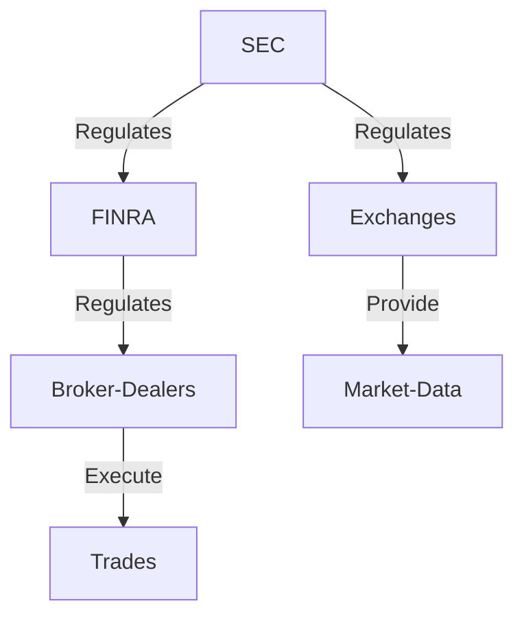

## 18.2.1 Secondary Market Regulation

The secondary market is where securities are traded after being issued in the primary market. This market plays a crucial role in providing liquidity, price discovery, and an efficient allocation of capital. The Securities Exchange Act of 1934 (Exchange Act) established the framework for regulating the secondary market in the United States. This section will guide you through the key aspects of secondary market regulation, focusing on the oversight of trading markets and broker-dealers, registration requirements, and the obligations of registered entities.

### Overview of Secondary Market Regulation

The regulation of the secondary market is primarily aimed at ensuring fair and efficient markets, protecting investors, and maintaining the integrity of the financial system. The Exchange Act empowers the Securities and Exchange Commission (SEC) to oversee the securities markets and enforce securities laws. The Financial Industry Regulatory Authority (FINRA) also plays a significant role in regulating broker-dealers and ensuring compliance with industry standards.

#### Key Objectives of Secondary Market Regulation

1. **Market Integrity**: Ensuring that markets operate in a fair and transparent manner.
2. **Investor Protection**: Safeguarding investors from fraud and misconduct.
3. **Systemic Risk Reduction**: Preventing practices that could lead to financial instability.
4. **Efficient Market Operations**: Facilitating liquidity and accurate price discovery.

### Oversight of Trading Markets and Broker-Dealers

The SEC oversees trading markets and broker-dealers to ensure compliance with the Exchange Act. This oversight is crucial for maintaining market integrity and protecting investors.

#### Role of the SEC

The SEC is responsible for:

- **Monitoring Market Activity**: The SEC monitors trading activity to detect and prevent fraudulent and manipulative practices.
- **Enforcing Compliance**: The SEC enforces compliance with securities laws and regulations through investigations and disciplinary actions.
- **Rulemaking**: The SEC establishes rules and regulations to govern market activities and ensure fair practices.

#### Role of FINRA

FINRA, a self-regulatory organization (SRO), is delegated by the SEC to regulate broker-dealers. Its responsibilities include:

- **Conducting Examinations**: Regularly examining broker-dealers to ensure compliance with industry rules.
- **Arbitration and Mediation**: Providing dispute resolution services for investors and broker-dealers.
- **Education and Training**: Offering resources and training to help broker-dealers comply with regulations.

### Registration Requirements for Exchanges and Broker-Dealers

Registration is a critical component of secondary market regulation. It ensures that entities operating in the market meet certain standards and are subject to regulatory oversight.

#### Registration of Exchanges

Exchanges must register with the SEC as national securities exchanges. This registration requires exchanges to:

- **Adopt Fair Rules**: Implement rules that promote fair and orderly markets.
- **Ensure Transparency**: Provide transparent and accurate information to market participants.
- **Facilitate Surveillance**: Implement surveillance mechanisms to detect and prevent market manipulation.

#### Registration of Broker-Dealers

Broker-dealers must register with both the SEC and FINRA. The registration process involves:

- **Application Submission**: Completing Form BD and submitting it to the SEC and FINRA.
- **Background Checks**: Undergoing background checks to assess the fitness of the firm and its principals.
- **Compliance with Net Capital Requirements**: Demonstrating financial stability by meeting net capital requirements.

### Obligations of Registered Entities

Registered exchanges and broker-dealers have specific obligations under the Exchange Act. These obligations are designed to ensure market integrity and protect investors.

#### Obligations of Exchanges

Exchanges are required to:

- **Maintain Fair Trading Practices**: Ensure that trading practices are fair and non-discriminatory.
- **Provide Accurate Information**: Ensure the accuracy and reliability of market data.
- **Implement Effective Surveillance**: Monitor trading activity to detect and prevent misconduct.

#### Obligations of Broker-Dealers

Broker-dealers must adhere to several obligations, including:

- **Best Execution**: Ensuring that customer orders are executed at the best available price.
- **Suitability**: Recommending securities that are suitable for the customer’s investment profile.
- **Recordkeeping**: Maintaining accurate records of transactions and customer information.
- **Anti-Money Laundering (AML) Compliance**: Implementing AML programs to detect and report suspicious activities.

### Practical Examples and Case Studies

#### Case Study: Market Manipulation

Consider a scenario where a broker-dealer engages in "pump and dump" schemes, artificially inflating the price of a security before selling it at a profit. The SEC and FINRA would investigate and impose penalties to deter such practices and protect investors.

#### Example: Broker-Dealer Registration

A new brokerage firm must register with the SEC and FINRA before commencing operations. This involves submitting Form BD, undergoing background checks, and demonstrating compliance with net capital requirements. The firm must also establish AML programs and ensure that its representatives are properly licensed.

### Real-World Applications and Regulatory Scenarios

#### Scenario: Insider Trading

Insider trading involves trading based on non-public, material information. The SEC actively monitors trading activity to detect insider trading and imposes severe penalties on violators. Broker-dealers must have policies in place to prevent insider trading and report suspicious activities.

#### Application: Compliance with FINRA Rules

Broker-dealers must comply with FINRA rules, such as Rule 2111 on suitability, which requires firms to ensure that investment recommendations are suitable for the client’s financial situation and investment objectives.

### Step-by-Step Guidance for Compliance

1. **Understand Regulatory Requirements**: Familiarize yourself with the Exchange Act and FINRA rules.
2. **Implement Compliance Programs**: Develop robust compliance programs to ensure adherence to regulations.
3. **Conduct Regular Training**: Provide ongoing training for employees on regulatory requirements and ethical practices.
4. **Monitor and Audit**: Regularly monitor trading activities and conduct audits to ensure compliance with regulations.
5. **Report Violations**: Promptly report any violations or suspicious activities to the appropriate authorities.

### Diagrams and Charts

Below is a simplified diagram illustrating the relationship between the SEC, FINRA, exchanges, and broker-dealers.

### Best Practices, Common Pitfalls, and Strategies

#### Best Practices

- **Maintain Transparency**: Ensure all market activities are transparent and well-documented.
- **Prioritize Investor Protection**: Implement policies that prioritize the interests of investors.
- **Stay Informed**: Keep abreast of regulatory changes and industry developments.

#### Common Pitfalls

- **Inadequate Recordkeeping**: Failing to maintain accurate records can lead to compliance issues.
- **Non-Compliance with Suitability Rules**: Recommending unsuitable investments can result in regulatory action.
- **Poor AML Practices**: Ineffective AML programs can expose firms to legal and financial risks.

#### Strategies to Overcome Challenges

- **Leverage Technology**: Use technology to enhance compliance monitoring and reporting.
- **Engage in Continuous Training**: Regular training helps ensure that employees understand and comply with regulations.
- **Establish a Strong Compliance Culture**: Foster a culture of compliance within the organization to prevent misconduct.

### References and Additional Resources

- **Securities Exchange Act of 1934**: [SEC.gov](https://www.sec.gov)
- **FINRA Rules**: [FINRA.org](https://www.finra.org)
- **SEC Investor Education**: [Investor.gov](https://www.investor.gov)

### Summary

Secondary market regulation under the Exchange Act is essential for maintaining fair and efficient markets. The SEC and FINRA play pivotal roles in overseeing exchanges and broker-dealers, ensuring compliance with regulatory requirements. By understanding these regulations and implementing robust compliance programs, market participants can contribute to the integrity and stability of the financial system.

---

## Series 7 Exam Practice Questions: Secondary Market Regulation



### What is the primary purpose of the Securities Exchange Act of 1934?

- [x] To regulate the secondary securities markets and protect investors.
- [ ] To oversee the issuance of new securities in the primary market.
- [ ] To establish the Federal Reserve System.
- [ ] To regulate the insurance industry.

> **Explanation:** The Securities Exchange Act of 1934 focuses on regulating the secondary securities markets and protecting investors, ensuring market integrity and transparency.

### Which organization is primarily responsible for regulating broker-dealers?

- [ ] The Federal Reserve
- [x] FINRA
- [ ] The Department of Justice
- [ ] The Federal Trade Commission

> **Explanation:** FINRA (Financial Industry Regulatory Authority) is the primary self-regulatory organization responsible for overseeing broker-dealers in the securities industry.

### What is required for a broker-dealer to operate legally in the U.S.?

- [x] Registration with the SEC and FINRA
- [ ] Approval from the Federal Reserve
- [ ] Certification by the Department of Commerce
- [ ] Licensing by the state insurance department

> **Explanation:** Broker-dealers must register with both the SEC and FINRA to legally operate in the U.S. securities markets.

### What is a key obligation of exchanges under the Exchange Act?

- [ ] To provide loans to investors
- [x] To maintain fair and orderly markets
- [ ] To set interest rates
- [ ] To issue new securities

> **Explanation:** Exchanges are obligated to maintain fair and orderly markets, ensuring transparency and fairness in trading activities.

### Which of the following is a common pitfall for broker-dealers?

- [ ] Over-compliance with regulations
- [ ] Excessive transparency
- [x] Inadequate recordkeeping
- [ ] Providing too much investor protection

> **Explanation:** Inadequate recordkeeping is a common pitfall for broker-dealers, leading to compliance issues and potential regulatory action.

### What is the role of the SEC in the secondary market?

- [ ] To set prices for securities
- [x] To oversee and enforce securities laws
- [ ] To provide investment advice
- [ ] To manage investor portfolios

> **Explanation:** The SEC oversees and enforces securities laws, ensuring compliance and protecting investors in the secondary market.

### What is a "pump and dump" scheme?

- [ ] A legitimate investment strategy
- [x] A fraudulent practice of inflating a stock's price before selling
- [ ] A method for calculating stock dividends
- [ ] A type of mutual fund

> **Explanation:** A "pump and dump" scheme is a fraudulent practice where the price of a stock is artificially inflated before being sold at a profit, often leaving investors with losses.

### How does FINRA contribute to market regulation?

- [ ] By setting fiscal policy
- [x] By regulating broker-dealers and enforcing industry rules
- [ ] By issuing government bonds
- [ ] By managing the national budget

> **Explanation:** FINRA regulates broker-dealers and enforces industry rules, contributing to the integrity and stability of the securities markets.

### What is an essential component of a broker-dealer's AML program?

- [ ] Setting interest rates
- [x] Detecting and reporting suspicious activities
- [ ] Offering investment advice
- [ ] Managing client portfolios

> **Explanation:** An essential component of a broker-dealer's AML program is detecting and reporting suspicious activities to prevent money laundering and financial crimes.

### Why is transparency important in the secondary market?

- [ ] It increases the cost of trading
- [ ] It limits investor access
- [x] It ensures fair trading and protects investors
- [ ] It reduces market efficiency

> **Explanation:** Transparency ensures fair trading and protects investors by providing accurate and timely information about market activities.



---
