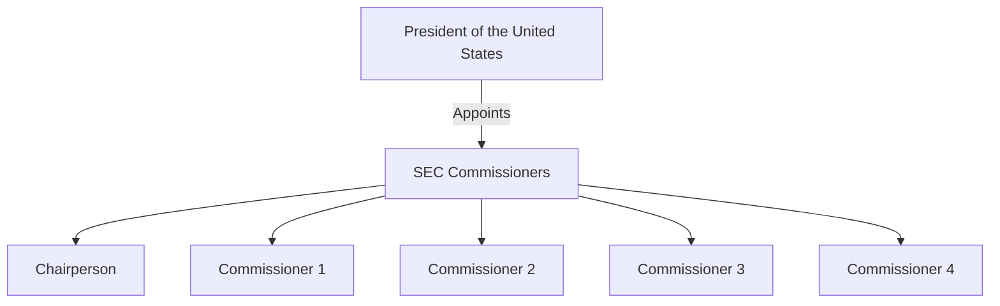

## 18.2 The Securities Exchange Act of 1934

The Securities Exchange Act of 1934 is a cornerstone of U.S. financial regulation, often referred to as the "People Act" due to its focus on protecting investors in the secondary market. This act established the Securities and Exchange Commission (SEC), a pivotal regulatory body tasked with enforcing securities laws and ensuring market integrity. Understanding the provisions and implications of the Securities Exchange Act of 1934 is crucial for anyone preparing for the Series 7 Exam, as it lays the foundation for numerous regulations and compliance requirements that govern the securities industry today.

### Introduction to the Securities Exchange Act of 1934

The Securities Exchange Act of 1934 was enacted in response to the stock market crash of 1929 and the subsequent Great Depression. Its primary purpose is to regulate the secondary trading of securities—stocks, bonds, and debentures—ensuring transparency, fairness, and efficiency in the financial markets. Unlike the Securities Act of 1933, which focuses on the initial issuance of securities, the 1934 Act addresses the trading of securities after they have been issued.

#### Key Objectives of the Act

- **Protect Investors**: By mandating accurate and timely disclosure of financial information, the act aims to protect investors from fraud and manipulation.
- **Ensure Fair Markets**: The act seeks to promote fair and orderly markets, preventing practices that could distort market prices or harm investors.
- **Maintain Market Integrity**: By regulating securities exchanges, brokers, and dealers, the act helps maintain the integrity of the financial markets.

### Creation of the Securities and Exchange Commission (SEC)

One of the most significant outcomes of the Securities Exchange Act of 1934 was the creation of the Securities and Exchange Commission (SEC). The SEC is an independent federal agency responsible for enforcing federal securities laws and regulating the securities industry, the nation's stock and options exchanges, and other related activities and organizations.

#### Role and Responsibilities of the SEC

- **Enforcement of Securities Laws**: The SEC has the authority to enforce securities laws and take action against violators.
- **Regulation of Securities Markets**: It oversees the registration and regulation of securities exchanges, brokers, and dealers.
- **Review of Corporate Filings**: The SEC reviews corporate filings to ensure compliance with disclosure requirements.
- **Investor Education**: The SEC provides resources and information to help investors make informed decisions.

#### Structure of the SEC

The SEC is composed of five commissioners appointed by the President of the United States, with no more than three commissioners belonging to the same political party. This structure is designed to ensure a balanced and impartial approach to regulation.

### Key Provisions of the Securities Exchange Act of 1934

The Securities Exchange Act of 1934 contains several important provisions that are critical for maintaining fair and efficient markets. These provisions cover a wide range of topics, from registration requirements to anti-fraud measures.

#### Registration and Regulation of Securities Exchanges

The act requires all securities exchanges to register with the SEC. This registration process ensures that exchanges comply with regulations designed to protect investors and maintain market integrity.

- **Exchange Registration**: Exchanges must provide detailed information about their operations, governance, and financial condition.
- **Self-Regulatory Organizations (SROs)**: Exchanges are considered SROs, meaning they have the authority to create and enforce their own rules, subject to SEC approval.

#### Regulation of Brokers and Dealers

Brokers and dealers play a crucial role in the securities markets, facilitating the buying and selling of securities. The 1934 Act imposes several requirements on these entities to ensure they operate fairly and transparently.

- **Registration with the SEC**: All brokers and dealers must register with the SEC and comply with its regulations.
- **Net Capital Requirements**: Brokers and dealers are subject to minimum net capital requirements to ensure they can meet their financial obligations.
- **Anti-Fraud Provisions**: The act prohibits fraudulent practices in the securities industry, including insider trading and market manipulation.

#### Continuous Disclosure Requirements

To promote transparency and protect investors, the Securities Exchange Act of 1934 mandates continuous disclosure of financial information by publicly traded companies.

- **Periodic Reporting**: Companies must file periodic reports with the SEC, including annual reports (Form 10-K) and quarterly reports (Form 10-Q).
- **Material Event Disclosure**: Companies must promptly disclose material events that could affect their financial condition or stock price.

#### Proxy Solicitation Rules

The act regulates the solicitation of proxies, ensuring that shareholders have access to important information when voting on corporate matters.

- **Proxy Statements**: Companies must provide shareholders with a proxy statement containing information about the issues to be voted on.
- **Shareholder Proposals**: Shareholders have the right to submit proposals for inclusion in the company's proxy materials.

#### Insider Trading Regulations

Insider trading involves buying or selling securities based on material, nonpublic information. The Securities Exchange Act of 1934 includes provisions to prevent and penalize insider trading.

- **Section 10(b) and Rule 10b-5**: These provisions prohibit fraudulent activities in connection with the purchase or sale of securities, including insider trading.
- **Reporting Requirements**: Insiders, such as corporate officers and directors, must report their trades to the SEC.

### Impact on the Securities Industry

The Securities Exchange Act of 1934 has had a profound impact on the securities industry, shaping the regulatory landscape and influencing how markets operate.

#### Enhanced Market Transparency

By requiring continuous disclosure of financial information, the act has increased transparency in the markets, enabling investors to make more informed decisions.

#### Improved Investor Confidence

The act's anti-fraud provisions and the establishment of the SEC have helped restore investor confidence in the financial markets, which was severely shaken by the Great Depression.

#### Greater Market Efficiency

The regulation of securities exchanges, brokers, and dealers has contributed to more efficient and orderly markets, reducing the potential for manipulation and fraud.

### Practical Examples and Case Studies

Understanding the practical implications of the Securities Exchange Act of 1934 can help you grasp its significance and prepare for the Series 7 Exam. Here are some real-world examples and scenarios that illustrate key aspects of the act.

#### Example 1: Insider Trading Case

In 2003, Martha Stewart was convicted of insider trading for selling shares of ImClone Systems based on nonpublic information. This case highlights the importance of the act's insider trading provisions and the SEC's role in enforcing them.

#### Example 2: Corporate Disclosure Violation

In 2005, AIG was fined $1.6 billion for accounting fraud and misleading investors. This case underscores the significance of the act's continuous disclosure requirements and the SEC's enforcement actions.

#### Example 3: Proxy Solicitation Dispute

In 2018, Procter & Gamble faced a proxy fight with activist investor Nelson Peltz. The dispute centered around shareholder proposals and proxy solicitation rules, demonstrating the act's role in regulating corporate governance.

### Compliance Considerations for Series 7 Candidates

As a Series 7 candidate, understanding the compliance requirements of the Securities Exchange Act of 1934 is essential. Here are some key considerations to keep in mind:

- **Stay Informed**: Keep up-to-date with SEC regulations and guidance to ensure compliance with the act.
- **Understand Reporting Obligations**: Familiarize yourself with the reporting requirements for brokers, dealers, and publicly traded companies.
- **Recognize Insider Trading Risks**: Be aware of the risks and penalties associated with insider trading and ensure you adhere to ethical standards.

### Exam Strategies and Tips

To excel in the Series 7 Exam, focus on mastering the key provisions and implications of the Securities Exchange Act of 1934. Here are some strategies to help you succeed:

- **Use Mnemonics**: Create mnemonic devices to remember the key sections and rules of the act.
- **Practice with Scenarios**: Work through practice problems and scenarios to apply your knowledge of the act in real-world contexts.
- **Review SEC Filings**: Familiarize yourself with SEC filings, such as Form 10-K and Form 10-Q, to understand their content and significance.

### Summary

The Securities Exchange Act of 1934 is a foundational regulation that governs the secondary trading of securities in the United States. By establishing the SEC and implementing key provisions, the act has enhanced market transparency, improved investor confidence, and contributed to more efficient markets. As you prepare for the Series 7 Exam, focus on understanding the act's objectives, key provisions, and practical implications to ensure success.

## Series 7 Exam Practice Questions: The Securities Exchange Act of 1934



### What is the primary purpose of the Securities Exchange Act of 1934?

- [x] To regulate the secondary trading of securities
- [ ] To oversee the initial issuance of securities
- [ ] To establish the Federal Reserve System
- [ ] To regulate banking activities

> **Explanation:** The Securities Exchange Act of 1934 primarily regulates the secondary trading of securities, ensuring transparency and fairness in the markets.

### Which federal agency was created by the Securities Exchange Act of 1934?

- [x] Securities and Exchange Commission (SEC)
- [ ] Federal Reserve Board (FRB)
- [ ] Financial Industry Regulatory Authority (FINRA)
- [ ] Office of the Comptroller of the Currency (OCC)

> **Explanation:** The SEC was established by the Securities Exchange Act of 1934 to enforce securities laws and regulate the securities industry.

### What is the role of the SEC under the Securities Exchange Act of 1934?

- [ ] To set monetary policy
- [x] To enforce securities laws and regulate the securities industry
- [ ] To manage the federal budget
- [ ] To regulate insurance companies

> **Explanation:** The SEC enforces securities laws and regulates the securities industry, including exchanges, brokers, and dealers.

### What is required of all securities exchanges under the Securities Exchange Act of 1934?

- [ ] They must be privately owned
- [x] They must register with the SEC
- [ ] They must be publicly traded
- [ ] They must operate internationally

> **Explanation:** All securities exchanges must register with the SEC to ensure compliance with regulations designed to protect investors.

### What is a key requirement for brokers and dealers under the Securities Exchange Act of 1934?

- [ ] They must only trade government securities
- [x] They must register with the SEC
- [ ] They must be members of the Federal Reserve
- [ ] They must operate as non-profit organizations

> **Explanation:** Brokers and dealers must register with the SEC and comply with its regulations to operate in the securities markets.

### What is a major provision of the Securities Exchange Act of 1934 regarding corporate disclosure?

- [ ] Companies must disclose only annual earnings
- [x] Companies must file periodic reports with the SEC
- [ ] Companies must disclose only mergers and acquisitions
- [ ] Companies must disclose only executive salaries

> **Explanation:** The act mandates that companies file periodic reports with the SEC, including annual and quarterly reports, to ensure transparency.

### What does Section 10(b) and Rule 10b-5 of the Securities Exchange Act of 1934 address?

- [ ] Market efficiency
- [ ] Exchange registration
- [x] Insider trading and fraudulent activities
- [ ] Corporate governance

> **Explanation:** Section 10(b) and Rule 10b-5 prohibit fraudulent activities, including insider trading, in connection with the purchase or sale of securities.

### What must insiders report under the Securities Exchange Act of 1934?

- [ ] Their annual income
- [ ] Their political contributions
- [x] Their trades to the SEC
- [ ] Their charitable donations

> **Explanation:** Insiders, such as corporate officers and directors, must report their trades to the SEC to prevent insider trading.

### What is the purpose of proxy solicitation rules under the Securities Exchange Act of 1934?

- [ ] To limit shareholder voting rights
- [x] To ensure shareholders have access to important information when voting
- [ ] To prohibit shareholder meetings
- [ ] To regulate executive compensation

> **Explanation:** Proxy solicitation rules ensure shareholders have access to important information when voting on corporate matters.

### How does the Securities Exchange Act of 1934 impact investor confidence?

- [ ] By reducing market transparency
- [x] By implementing anti-fraud provisions and establishing the SEC
- [ ] By eliminating all market regulations
- [ ] By focusing solely on initial public offerings

> **Explanation:** The act's anti-fraud provisions and the establishment of the SEC have helped restore investor confidence in the financial markets.



---
