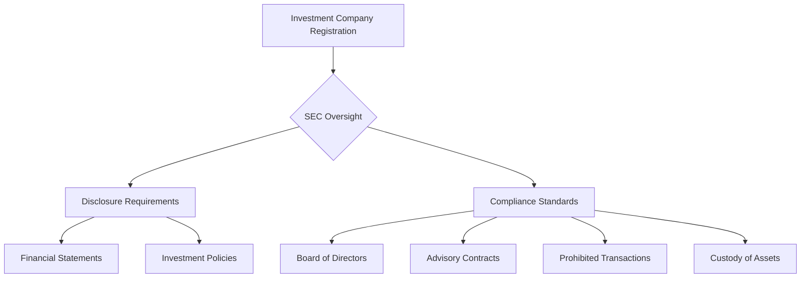

## 18.3.1 Investment Company Act of 1940

The Investment Company Act of 1940 is a cornerstone of U.S. securities regulation, primarily governing the structure and operations of investment companies, including mutual funds and closed-end funds. This Act aims to protect investors by ensuring transparency, reducing conflicts of interest, and promoting fair practices in the investment industry. As you prepare for the Series 7 Exam, it is crucial to understand the key provisions, compliance requirements, and implications of this Act.

### Overview of the Investment Company Act of 1940

The Investment Company Act of 1940 was enacted to regulate the activities of investment companies and safeguard investors from potential abuses. It establishes a framework for the registration, disclosure, and operational standards of investment companies. The Act is enforced by the Securities and Exchange Commission (SEC), which oversees compliance and ensures that investment companies adhere to the law.

#### Key Objectives of the Act

- **Investor Protection**: The Act aims to protect investors by requiring investment companies to disclose their financial condition and investment policies.
- **Transparency**: Investment companies must provide regular reports to the SEC and investors, detailing their financial performance and holdings.
- **Conflict of Interest Mitigation**: The Act includes provisions to minimize conflicts of interest between investment companies and their managers.
- **Regulation of Fund Operations**: It sets standards for the organization, management, and activities of investment companies.

### Types of Investment Companies

The Act primarily regulates two types of investment companies:

1. **Mutual Funds**: Open-end investment companies that continuously offer new shares and redeem existing shares at net asset value (NAV).
2. **Closed-End Funds**: Investment companies that issue a fixed number of shares, which are traded on stock exchanges like ordinary stocks.

### Registration Requirements

Investment companies must register with the SEC before offering their shares to the public. The registration process involves:

- **Filing Form N-1A**: For mutual funds, this form includes information about the fund's investment objectives, strategies, risks, and expenses.
- **Filing Form N-2**: For closed-end funds, this form provides details on the fund's structure, management, and financial condition.
- **Prospectus Delivery**: Investment companies must provide a prospectus to potential investors, outlining key information about the fund.

### Disclosure Obligations

Investment companies are required to disclose comprehensive information about their operations, including:

- **Financial Statements**: Regularly updated financial statements must be filed with the SEC and made available to investors.
- **Investment Policies**: Clear disclosure of the fund's investment objectives, strategies, and risks.
- **Performance Reports**: Periodic reports detailing the fund's performance, fees, and expenses.

### Compliance Considerations

Investment companies must adhere to strict compliance standards to ensure they operate within the legal framework established by the Act. Key compliance considerations include:

- **Board of Directors**: Investment companies must have a board of directors, with at least 40% of members being independent.
- **Advisory Contracts**: Contracts with investment advisers must be approved by the board and shareholders.
- **Prohibited Transactions**: The Act restricts certain transactions, such as loans to affiliated persons and joint transactions with affiliates.
- **Custody of Assets**: Investment companies must safeguard their assets, typically by using a qualified custodian.

### Practical Examples and Case Studies

To illustrate the application of the Investment Company Act of 1940, consider the following scenarios:

- **Case Study: Mutual Fund Disclosure**: A mutual fund must provide a detailed prospectus to investors, outlining its investment objectives, risks, and fees. Failure to disclose material information can result in SEC enforcement actions.
- **Example: Compliance Breach**: A closed-end fund engages in a prohibited transaction with an affiliate, violating the Act's provisions. The SEC investigates and imposes penalties on the fund's management.

### Real-World Applications

Understanding the Investment Company Act of 1940 is essential for professionals in the securities industry. Compliance with the Act not only ensures legal operation but also builds investor trust. Here are some real-world applications:

- **Fund Management**: Investment managers must design and operate funds in compliance with the Act, ensuring transparency and fairness.
- **Investor Relations**: Clear communication with investors about fund performance and risks is crucial for maintaining investor confidence.
- **Regulatory Compliance**: Regular audits and reviews ensure that investment companies adhere to the Act's provisions and avoid legal issues.

### Step-by-Step Guidance for Compliance

1. **Register with the SEC**: Complete the necessary registration forms (N-1A for mutual funds, N-2 for closed-end funds) and submit them to the SEC.
2. **Develop a Compliance Program**: Establish policies and procedures to ensure adherence to the Act's provisions, including regular training for staff.
3. **Conduct Regular Audits**: Perform internal audits to identify and address compliance gaps.
4. **Engage Independent Directors**: Ensure that the board of directors includes independent members to oversee fund operations.
5. **Maintain Accurate Records**: Keep detailed records of all transactions, communications, and disclosures to facilitate audits and regulatory reviews.

### Diagrams and Visuals

To enhance your understanding of the Investment Company Act of 1940, consider the following diagram illustrating the regulatory framework and compliance process:

### Best Practices and Common Pitfalls

- **Best Practices**:
  - Regularly update disclosure documents to reflect changes in investment policies or financial condition.
  - Engage independent auditors to review compliance with the Act.
  - Foster a culture of transparency and accountability within the organization.

- **Common Pitfalls**:
  - Failing to disclose material information in the prospectus.
  - Engaging in prohibited transactions with affiliates.
  - Neglecting to maintain adequate records of fund operations.

### Exam Strategies and Tips

As you prepare for the Series 7 Exam, focus on understanding the key provisions of the Investment Company Act of 1940. Here are some tips to help you succeed:

- **Memorize Key Terms**: Familiarize yourself with important terms such as "investment company," "prospectus," and "independent director."
- **Understand Compliance Procedures**: Be able to outline the steps required for SEC registration and ongoing compliance.
- **Practice with Real-World Scenarios**: Apply your knowledge to hypothetical situations to reinforce your understanding of the Act's provisions.

### Summary

The Investment Company Act of 1940 is a vital piece of legislation that regulates the operations of investment companies in the U.S. By understanding its requirements and compliance considerations, you can ensure that investment companies operate legally and transparently, protecting investors and promoting market integrity. As you prepare for the Series 7 Exam, focus on the Act's key provisions, compliance standards, and real-world applications to enhance your understanding and confidence.

## Series 7 Exam Practice Questions: Investment Company Act of 1940



### What is the primary purpose of the Investment Company Act of 1940?

- [x] To regulate the organization and activities of investment companies
- [ ] To establish the Securities and Exchange Commission
- [ ] To provide tax benefits for mutual funds
- [ ] To regulate insider trading

> **Explanation:** The Investment Company Act of 1940 primarily regulates the organization and activities of investment companies to protect investors and ensure transparency.

### Which type of investment company continuously offers new shares and redeems existing shares at NAV?

- [ ] Closed-end fund
- [x] Mutual fund
- [ ] Hedge fund
- [ ] Real estate investment trust (REIT)

> **Explanation:** Mutual funds are open-end investment companies that continuously offer new shares and redeem existing shares at net asset value (NAV).

### What is required for an investment company to begin offering shares to the public?

- [ ] Approval from the Federal Reserve
- [x] Registration with the SEC
- [ ] A credit rating from a major agency
- [ ] A minimum of 100 investors

> **Explanation:** Investment companies must register with the SEC before offering their shares to the public, ensuring compliance with regulatory standards.

### What percentage of an investment company's board of directors must be independent?

- [ ] 25%
- [ ] 50%
- [x] 40%
- [ ] 60%

> **Explanation:** At least 40% of an investment company's board of directors must be independent to minimize conflicts of interest and ensure unbiased oversight.

### Which form is used by mutual funds to register with the SEC?

- [ ] Form N-2
- [x] Form N-1A
- [ ] Form 10-K
- [ ] Form 8-K

> **Explanation:** Mutual funds use Form N-1A to register with the SEC, providing details about the fund's investment objectives, strategies, and risks.

### What is a prohibited transaction under the Investment Company Act of 1940?

- [ ] Investing in foreign securities
- [ ] Offering shares to institutional investors
- [x] Loans to affiliated persons
- [ ] Purchasing government bonds

> **Explanation:** The Act prohibits certain transactions, such as loans to affiliated persons, to prevent conflicts of interest and protect investors.

### What must investment companies provide to potential investors?

- [ ] A summary of recent trades
- [x] A prospectus
- [ ] A list of shareholders
- [ ] A tax return

> **Explanation:** Investment companies must provide a prospectus to potential investors, outlining key information about the fund, including its objectives, strategies, and risks.

### Which entity enforces the Investment Company Act of 1940?

- [ ] Federal Reserve
- [ ] Department of the Treasury
- [x] Securities and Exchange Commission (SEC)
- [ ] Financial Industry Regulatory Authority (FINRA)

> **Explanation:** The Securities and Exchange Commission (SEC) enforces the Investment Company Act of 1940, overseeing compliance and ensuring investor protection.

### How often must investment companies update their financial statements?

- [ ] Annually
- [ ] Semi-annually
- [x] Regularly
- [ ] Quarterly

> **Explanation:** Investment companies must regularly update their financial statements and provide them to the SEC and investors to ensure transparency and accountability.

### What is a common pitfall for investment companies under the Act?

- [ ] Over-disclosure of financial information
- [ ] Engaging in high-risk investments
- [x] Failing to disclose material information
- [ ] Offering too many shares

> **Explanation:** A common pitfall is failing to disclose material information in the prospectus, which can lead to SEC enforcement actions and loss of investor trust.


