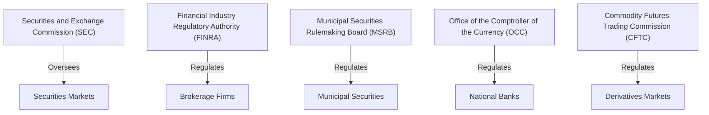

## 18.5 Compliance and Enforcement

In the world of securities, compliance and enforcement are the cornerstones of maintaining market integrity and protecting investors. As a prospective General Securities Representative, understanding these concepts is crucial not only for passing the Series 7 Exam but also for your future role in the industry. This section will guide you through the intricacies of compliance and enforcement, emphasizing the importance of adhering to regulations and exploring the consequences of non-compliance.

### Understanding Compliance in the Securities Industry

Compliance refers to the adherence to laws, regulations, guidelines, and specifications relevant to the securities industry. It is a critical function that ensures financial markets operate fairly and transparently. Compliance involves the establishment of policies and procedures within firms to prevent violations of laws and regulations, and to ensure ethical conduct.

#### Key Components of Compliance

1. **Regulatory Framework**: Compliance is governed by a complex framework of laws and regulations, including the Securities Act of 1933, the Securities Exchange Act of 1934, and rules set forth by regulatory bodies like the Financial Industry Regulatory Authority (FINRA) and the Securities and Exchange Commission (SEC).

2. **Internal Controls**: Firms must establish robust internal controls to ensure compliance with regulatory requirements. This includes implementing policies and procedures, conducting regular audits, and ensuring proper documentation and record-keeping.

3. **Training and Education**: Continuous training and education of employees are essential to maintain compliance. Firms must ensure that their staff are aware of the latest regulations and understand their responsibilities.

4. **Monitoring and Surveillance**: Ongoing monitoring and surveillance of trading activities and transactions help detect and prevent potential violations. This involves using technology and data analytics to identify suspicious activities.

5. **Reporting and Disclosure**: Accurate and timely reporting and disclosure of financial information are fundamental to compliance. Firms must ensure that all disclosures are truthful and complete to maintain investor trust.

### The Role of Compliance Officers

Compliance officers play a vital role in ensuring that firms adhere to regulatory requirements. They are responsible for developing and implementing compliance programs, conducting risk assessments, and advising on regulatory matters. Compliance officers also serve as a liaison between the firm and regulatory bodies, ensuring that any issues are promptly addressed.

### Consequences of Non-Compliance

Non-compliance with securities regulations can have severe consequences for both individuals and firms. These consequences can include:

1. **Fines and Penalties**: Regulatory bodies like the SEC and FINRA have the authority to impose significant fines and penalties for violations. These financial repercussions can be substantial and impact a firm's profitability.

2. **Legal Action**: Non-compliance can lead to legal action, including lawsuits and enforcement actions by regulatory bodies. This can result in costly legal fees and damage to a firm's reputation.

3. **Suspension or Revocation of Licenses**: Individuals and firms found to be in violation of regulations may face suspension or revocation of their licenses, effectively barring them from participating in the securities industry.

4. **Reputational Damage**: Non-compliance can severely damage a firm's reputation, leading to loss of client trust and business opportunities. In today's digital age, reputational damage can spread quickly and have long-lasting effects.

5. **Criminal Charges**: In cases of severe misconduct, individuals may face criminal charges, leading to imprisonment and personal financial ruin.

### Case Studies and Examples

To illustrate the importance of compliance and the consequences of non-compliance, let's explore a few real-world examples:

#### Case Study 1: Insider Trading Scandal

In a notable insider trading case, a senior executive at a major financial firm used non-public information to trade securities for personal gain. The SEC launched an investigation, resulting in significant fines for the firm and criminal charges against the executive. This case highlights the importance of compliance programs in detecting and preventing insider trading.

#### Case Study 2: Misleading Financial Disclosures

A well-known corporation was found to have provided misleading financial disclosures to investors, overstating its earnings to boost its stock price. The SEC imposed hefty fines, and the company's executives faced legal action. This example underscores the need for accurate reporting and the severe consequences of misleading disclosures.

#### Case Study 3: Failure to Implement Anti-Money Laundering Controls

A brokerage firm failed to implement adequate anti-money laundering (AML) controls, allowing illicit funds to be funneled through its accounts. As a result, the firm faced significant fines and was required to overhaul its compliance program. This case emphasizes the importance of robust AML controls and the risks of non-compliance.

### Best Practices for Ensuring Compliance

To avoid the pitfalls of non-compliance, firms should adopt the following best practices:

1. **Develop a Comprehensive Compliance Program**: Establish a comprehensive compliance program that includes policies, procedures, and controls tailored to the firm's specific risks and regulatory requirements.

2. **Foster a Culture of Compliance**: Encourage a culture of compliance within the organization by promoting ethical behavior and accountability at all levels.

3. **Conduct Regular Training**: Provide regular training sessions for employees to keep them informed of the latest regulatory developments and compliance requirements.

4. **Utilize Technology**: Leverage technology and data analytics to enhance monitoring and surveillance capabilities, enabling the early detection of potential compliance issues.

5. **Perform Regular Audits and Reviews**: Conduct regular audits and reviews of compliance programs to identify areas for improvement and ensure ongoing adherence to regulations.

6. **Engage with Regulatory Bodies**: Maintain open communication with regulatory bodies and seek guidance when necessary to ensure compliance with evolving regulations.

### Regulatory Bodies and Their Roles

Understanding the roles of key regulatory bodies is essential for compliance. Here are some of the primary organizations involved in securities regulation:

#### Securities and Exchange Commission (SEC)

The SEC is the primary regulatory body overseeing the securities industry in the United States. It is responsible for enforcing federal securities laws, regulating securities markets, and protecting investors.

#### Financial Industry Regulatory Authority (FINRA)

FINRA is a self-regulatory organization that oversees brokerage firms and their registered representatives. It establishes rules and regulations, conducts examinations, and enforces compliance with industry standards.

#### Municipal Securities Rulemaking Board (MSRB)

The MSRB regulates the municipal securities market, establishing rules for municipal securities dealers and advisors to ensure fair and transparent trading.

#### Office of the Comptroller of the Currency (OCC)

The OCC regulates national banks and federal savings associations, ensuring they operate safely and soundly while complying with applicable laws and regulations.

#### Commodity Futures Trading Commission (CFTC)

The CFTC regulates the derivatives markets, including futures and options, to protect market participants and ensure the integrity of the markets.

### Enforcement Mechanisms and Processes

Enforcement mechanisms are crucial for maintaining compliance and deterring violations. Regulatory bodies employ various processes to enforce compliance:

1. **Investigations**: Regulatory bodies conduct investigations to gather evidence of potential violations. This may involve reviewing documents, interviewing witnesses, and analyzing trading activities.

2. **Examinations and Audits**: Regular examinations and audits of firms help identify compliance deficiencies and ensure adherence to regulations.

3. **Enforcement Actions**: When violations are identified, regulatory bodies may initiate enforcement actions, which can include fines, penalties, and other sanctions.

4. **Arbitration and Mediation**: Dispute resolution mechanisms, such as arbitration and mediation, provide a platform for resolving conflicts between firms and clients or between firms and regulatory bodies.

5. **Public Disclosures**: Regulatory bodies may require firms to publicly disclose violations and enforcement actions, serving as a deterrent to future misconduct.

### Practical Examples and Scenarios

To further illustrate compliance and enforcement processes, consider the following scenarios:

#### Scenario 1: A Brokerage Firm's Compliance Audit

A brokerage firm undergoes a routine compliance audit by FINRA. During the audit, FINRA identifies deficiencies in the firm's anti-money laundering controls. The firm is required to address these deficiencies and implement corrective measures to avoid enforcement actions.

#### Scenario 2: Insider Trading Investigation

An employee at a financial services firm is suspected of insider trading. The SEC launches an investigation, reviewing the employee's trading activities and communications. The investigation reveals that the employee traded on non-public information, leading to enforcement actions and penalties.

#### Scenario 3: Dispute Resolution through Arbitration

A client files a complaint against a brokerage firm, alleging unauthorized trading in their account. The dispute is resolved through FINRA arbitration, where both parties present their case, and an arbitrator issues a binding decision.

### Diagrams and Visuals

To enhance your understanding of compliance and enforcement, let's explore a diagram illustrating the relationship between key regulatory bodies and their roles in the securities industry:

### Summary and Key Takeaways

Compliance and enforcement are integral to the securities industry, ensuring market integrity and investor protection. Adherence to regulations is essential for maintaining trust and avoiding the severe consequences of non-compliance. As you prepare for the Series 7 Exam, focus on understanding the regulatory framework, the roles of key regulatory bodies, and the importance of robust compliance programs.

### Additional Resources

For further exploration of compliance and enforcement in the securities industry, consider the following resources:

- **Securities and Exchange Commission (SEC) Website**: [www.sec.gov](https://www.sec.gov)
- **Financial Industry Regulatory Authority (FINRA) Website**: [www.finra.org](https://www.finra.org)
- **Municipal Securities Rulemaking Board (MSRB) Website**: [www.msrb.org](https://www.msrb.org)

These resources provide valuable information on regulations, compliance guidelines, and enforcement actions.

## Series 7 Exam Practice Questions: Compliance and Enforcement



### What is the primary role of compliance officers in a securities firm?

- [ ] To execute trades on behalf of clients
- [x] To ensure adherence to regulatory requirements
- [ ] To manage the firm's investment portfolio
- [ ] To provide financial advice to clients

> **Explanation:** Compliance officers are responsible for ensuring that the firm adheres to regulatory requirements and maintains ethical standards. They develop and implement compliance programs and serve as a liaison with regulatory bodies.

### Which regulatory body is primarily responsible for overseeing the securities industry in the United States?

- [ ] Commodity Futures Trading Commission (CFTC)
- [x] Securities and Exchange Commission (SEC)
- [ ] Office of the Comptroller of the Currency (OCC)
- [ ] Municipal Securities Rulemaking Board (MSRB)

> **Explanation:** The Securities and Exchange Commission (SEC) is the primary regulatory body overseeing the securities industry in the United States, enforcing federal securities laws and protecting investors.

### What consequence might a firm face for failing to implement adequate anti-money laundering controls?

- [ ] Increased trading volume
- [ ] Higher stock prices
- [x] Significant fines and penalties
- [ ] Enhanced reputation

> **Explanation:** Firms that fail to implement adequate anti-money laundering controls may face significant fines and penalties from regulatory bodies, as well as reputational damage.

### Which of the following is a key component of a compliance program?

- [ ] Increasing sales targets
- [ ] Reducing employee benefits
- [x] Establishing internal controls
- [ ] Offering higher commissions

> **Explanation:** Establishing internal controls is a key component of a compliance program, helping to prevent violations of laws and regulations and ensuring ethical conduct.

### What is the purpose of regular training in a compliance program?

- [ ] To increase employee salaries
- [ ] To improve marketing strategies
- [x] To keep employees informed of regulatory developments
- [ ] To enhance customer service skills

> **Explanation:** Regular training in a compliance program is essential to keep employees informed of the latest regulatory developments and compliance requirements, ensuring they understand their responsibilities.

### What is a potential consequence of non-compliance with securities regulations?

- [ ] Increased market share
- [ ] Lower operating costs
- [ ] Enhanced client trust
- [x] Suspension or revocation of licenses

> **Explanation:** Non-compliance with securities regulations can lead to suspension or revocation of licenses, effectively barring individuals and firms from participating in the securities industry.

### What role does technology play in compliance programs?

- [ ] It reduces the need for compliance officers
- [ ] It increases the complexity of compliance
- [x] It enhances monitoring and surveillance capabilities
- [ ] It eliminates regulatory requirements

> **Explanation:** Technology plays a crucial role in compliance programs by enhancing monitoring and surveillance capabilities, enabling the early detection of potential compliance issues.

### How can a firm foster a culture of compliance?

- [ ] By reducing compliance budgets
- [ ] By ignoring minor violations
- [x] By promoting ethical behavior and accountability
- [ ] By focusing solely on profit maximization

> **Explanation:** A firm can foster a culture of compliance by promoting ethical behavior and accountability at all levels, encouraging employees to adhere to regulations and ethical standards.

### What is the purpose of arbitration in the securities industry?

- [ ] To increase trading volume
- [ ] To provide investment advice
- [ ] To execute trades
- [x] To resolve disputes between parties

> **Explanation:** Arbitration in the securities industry provides a platform for resolving disputes between parties, such as clients and brokerage firms, through a binding decision by an arbitrator.

### Which regulatory body regulates the derivatives markets?

- [ ] Securities and Exchange Commission (SEC)
- [ ] Financial Industry Regulatory Authority (FINRA)
- [x] Commodity Futures Trading Commission (CFTC)
- [ ] Municipal Securities Rulemaking Board (MSRB)

> **Explanation:** The Commodity Futures Trading Commission (CFTC) regulates the derivatives markets, including futures and options, to protect market participants and ensure market integrity.



By mastering the content in this section and practicing with the provided questions, you will be well-prepared to tackle compliance and enforcement topics on the Series 7 Exam. Remember, understanding the importance of regulatory adherence and the consequences of non-compliance is key to your success in the securities industry.
