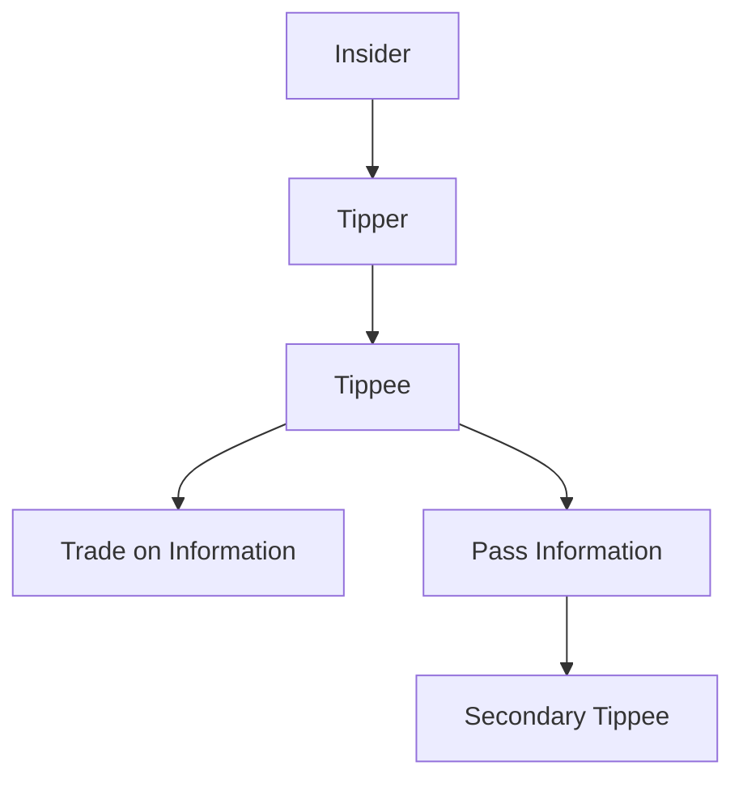

## 19.4.1 Insider Trading Regulations and Definitions

Insider trading is a critical topic for anyone preparing for the Series 7 Exam, as it encompasses the legal and ethical boundaries of trading securities based on material nonpublic information. Understanding the definitions, regulations, and compliance measures associated with insider trading is essential for aspiring General Securities Representatives. This section provides a comprehensive overview of insider trading, the regulatory framework established by the Securities and Exchange Commission (SEC), and the importance of Regulation FD (Fair Disclosure).

### Key Definitions in Insider Trading

Before delving into the regulations, it is crucial to define key terms associated with insider trading:

- **Insider Trading**: The buying or selling of a publicly-traded company's stock by someone who has non-public, material information about that stock. Insider trading can be legal or illegal depending on when the insider makes the trade: it is legal when corporate insiders—officers, directors, and employees—buy and sell stock in their own companies, but illegal when the material information is still non-public.

- **Material Information**: Information is considered material if its disclosure could influence an investor's decision to buy or sell the security. Examples include earnings reports, mergers and acquisitions, significant management changes, and other major corporate events.

- **Nonpublic Information**: Information that has not been released to the public and is not available to the average investor. For example, knowledge of a pending merger or acquisition that has not been announced.

- **Tipper**: An insider who provides material nonpublic information to another person.

- **Tippee**: A person who receives material nonpublic information from an insider or another tippee. Tippees can be held liable if they trade on the information or pass it on to others who trade.

### SEC Rules and Regulations Prohibiting Insider Trading

The SEC has established a robust framework to prevent and penalize illegal insider trading. The primary regulations and rules include:

#### The Securities Exchange Act of 1934

The Securities Exchange Act of 1934 is the cornerstone of insider trading laws. Section 10(b) of the Act, along with Rule 10b-5, prohibits any act or omission resulting in fraud or deceit in connection with the purchase or sale of any security. Rule 10b-5 is the SEC's primary tool for prosecuting insider trading.

- **Rule 10b-5**: This rule makes it unlawful for any person to employ any device, scheme, or artifice to defraud, make any untrue statement of a material fact, or engage in any act, practice, or course of business that operates as a fraud or deceit upon any person, in connection with the purchase or sale of any security.

#### Insider Trading Sanctions Act of 1984

This Act allows the SEC to seek civil penalties against individuals who engage in insider trading. The penalties can be up to three times the profit gained or loss avoided from the illegal trades.

#### Insider Trading and Securities Fraud Enforcement Act of 1988

This Act further strengthened the SEC's ability to enforce insider trading laws by increasing the penalties and extending liability to controlling persons who fail to take appropriate measures to prevent insider trading.

### Regulation FD (Fair Disclosure)

Regulation FD, adopted by the SEC in 2000, addresses the selective disclosure of information by publicly traded companies and other issuers. It aims to promote full and fair disclosure by requiring that material information be disclosed to all investors simultaneously, rather than selectively to certain analysts or institutional investors.

#### Key Provisions of Regulation FD

- **Simultaneous Disclosure**: If a company discloses material nonpublic information to certain individuals or entities (such as analysts or institutional investors), it must make the same information available to the public simultaneously.

- **Intentional vs. Non-Intentional Disclosure**: If the disclosure of material nonpublic information is intentional, the company must make a public disclosure simultaneously. If the disclosure is non-intentional, the company must make the information public promptly.

- **Methods of Disclosure**: Companies can use press releases, SEC filings, or other methods reasonably designed to provide broad, non-exclusionary distribution of the information to the public.

### Compliance Measures to Prevent Insider Trading Violations

To prevent insider trading violations, firms must implement robust compliance programs. These programs should include the following elements:

#### Establishing Insider Trading Policies

- **Written Policies**: Firms should have clear, written policies that define insider trading and outline the consequences of violations. These policies should be communicated to all employees.

- **Training Programs**: Regular training sessions should be conducted to educate employees about insider trading laws, regulations, and the firm's policies.

#### Monitoring and Surveillance

- **Trade Monitoring**: Firms should implement systems to monitor and review trades made by employees, particularly those with access to material nonpublic information.

- **Watch Lists and Restricted Lists**: Establish watch lists and restricted lists to prevent trading in securities of companies for which the firm has material nonpublic information.

#### Reporting and Escalation Procedures

- **Whistleblower Policies**: Encourage employees to report suspicious activities or potential violations through anonymous reporting mechanisms.

- **Escalation Procedures**: Establish clear procedures for escalating potential insider trading violations to compliance officers or legal counsel for further investigation.

### Practical Examples and Case Studies

To illustrate the concepts discussed, consider the following scenarios:

#### Case Study: The Martha Stewart Insider Trading Case

One of the most well-known insider trading cases involved Martha Stewart, who sold shares of ImClone Systems based on nonpublic information received from her broker. Stewart was convicted of obstruction of justice and making false statements, highlighting the severe consequences of insider trading violations.

#### Example: Company Earnings Announcement

Suppose a company's CFO learns about an upcoming earnings announcement that will significantly impact the stock price. The CFO must refrain from trading the company's stock or sharing the information with others until the earnings are publicly announced.

### Real-World Applications and Compliance Scenarios

Understanding insider trading regulations is not only crucial for passing the Series 7 Exam but also for maintaining ethical standards in the securities industry. Compliance with these regulations ensures a fair and transparent market, fostering investor confidence.

#### Scenario: Implementing a Compliance Program

A brokerage firm implements a comprehensive compliance program that includes regular training sessions, trade monitoring systems, and a whistleblower hotline. By doing so, the firm reduces the risk of insider trading violations and demonstrates its commitment to ethical practices.

### Diagrams and Visual Aids

To enhance understanding, consider the following diagram illustrating the relationship between insiders, tippers, and tippees:

### Best Practices and Common Pitfalls

- **Best Practices**: Regularly update insider trading policies, conduct frequent training sessions, and maintain robust monitoring systems.

- **Common Pitfalls**: Failing to update policies, inadequate training, and insufficient monitoring can lead to violations and reputational damage.

### Summary

Understanding insider trading and the associated regulations is essential for anyone pursuing a career in the securities industry. By familiarizing yourself with the definitions, SEC rules, and compliance measures, you will be well-prepared to navigate the complexities of insider trading and uphold ethical standards in your professional practice.

### Additional Resources

- **SEC Website**: Visit the SEC's official website for more information on insider trading regulations and enforcement actions.
- **FINRA**: Explore FINRA's resources on compliance and ethical practices in the securities industry.
- **Books and Online Courses**: Consider reading books or enrolling in online courses focused on securities regulations and compliance.

## Series 7 Exam Practice Questions: Definitions and Regulations



### What is considered insider trading?

- [x] Trading based on material nonpublic information
- [ ] Trading based on public information
- [ ] Trading based on historical price data
- [ ] Trading based on analyst recommendations

> **Explanation:** Insider trading involves trading securities based on material nonpublic information, which is illegal and unethical.

### Which SEC rule is primarily used to prosecute insider trading?

- [x] Rule 10b-5
- [ ] Rule 144
- [ ] Rule 506
- [ ] Rule 147

> **Explanation:** Rule 10b-5 is the primary SEC rule used to prosecute insider trading, prohibiting fraud in connection with the purchase or sale of securities.

### What does Regulation FD require?

- [x] Simultaneous disclosure of material information to all investors
- [ ] Disclosure of insider trades within two days
- [ ] Disclosure of all trades to the SEC
- [ ] Disclosure of financial statements quarterly

> **Explanation:** Regulation FD requires companies to disclose material information to all investors simultaneously to prevent selective disclosure.

### What is material information?

- [x] Information that could influence an investor's decision
- [ ] Information that is publicly available
- [ ] Information that is historical in nature
- [ ] Information that is speculative

> **Explanation:** Material information is any information that could influence an investor's decision to buy or sell a security.

### Who is a tippee in insider trading?

- [x] A person who receives material nonpublic information
- [ ] A person who provides material nonpublic information
- [ ] A person who trades based on public information
- [ ] A person who analyzes stock performance

> **Explanation:** A tippee is someone who receives material nonpublic information from an insider or another tippee.

### What is the penalty for insider trading under the Insider Trading Sanctions Act of 1984?

- [x] Up to three times the profit gained or loss avoided
- [ ] A fixed fine of $10,000
- [ ] A warning letter from the SEC
- [ ] A suspension from trading for one year

> **Explanation:** The Insider Trading Sanctions Act allows the SEC to seek civil penalties of up to three times the profit gained or loss avoided from illegal trades.

### What is a common compliance measure to prevent insider trading?

- [x] Implementing trade monitoring systems
- [ ] Allowing unrestricted trading by insiders
- [ ] Encouraging selective disclosure
- [ ] Limiting training to senior executives

> **Explanation:** Implementing trade monitoring systems is a common compliance measure to prevent insider trading by detecting and reviewing trades made by employees.

### What is an example of nonpublic information?

- [x] Knowledge of a pending merger
- [ ] A published earnings report
- [ ] Historical stock prices
- [ ] Analyst recommendations

> **Explanation:** Nonpublic information includes knowledge of events like a pending merger that has not been disclosed to the public.

### How does Regulation FD impact analysts?

- [x] It prevents selective disclosure to analysts
- [ ] It requires analysts to disclose their trades
- [ ] It mandates analysts to report to the SEC
- [ ] It allows analysts to receive information before the public

> **Explanation:** Regulation FD prevents companies from selectively disclosing material information to analysts or institutional investors, ensuring all investors receive information simultaneously.

### What is the role of a compliance officer in preventing insider trading?

- [x] Monitoring trades and enforcing policies
- [ ] Executing trades on behalf of insiders
- [ ] Providing financial advice to clients
- [ ] Analyzing market trends for investment opportunities

> **Explanation:** A compliance officer monitors trades, enforces insider trading policies, and ensures adherence to regulations to prevent violations.


