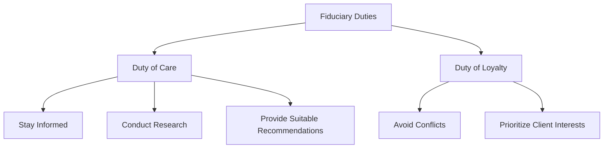

## 19.5 Professional Duties and Responsibilities

In the realm of securities, professional duties and responsibilities are paramount to maintaining trust and integrity within the financial markets. As a registered representative, you are entrusted with the fiduciary duty to act in the best interests of your clients. This section will delve into the fiduciary duties, the duty of care and loyalty, and the importance of ongoing education and adherence to ethical standards. By understanding and applying these principles, you will not only excel in your role but also contribute to the overall health and stability of the financial system.

### Understanding Fiduciary Duty

**Fiduciary Duty** is a legal obligation that requires you to act in the best interests of your clients. This duty is the cornerstone of ethical practices in the securities industry and encompasses several key responsibilities:

1. **Acting in Good Faith**: You must always prioritize your client's interests over your own. This includes making decisions that benefit the client, even if it means less profit for you or your firm.

2. **Full Disclosure**: Transparency is crucial. You are required to disclose all relevant information that could affect your client's investment decisions. This includes potential conflicts of interest, fees, and risks associated with investment products.

3. **Prudent Management**: You must exercise care and diligence when managing your client's assets. This involves conducting thorough research and analysis before making investment recommendations.

4. **Confidentiality**: Protecting your client's information is a vital aspect of fiduciary duty. You must ensure that all personal and financial information is kept confidential and secure.

#### Practical Example: Fiduciary Duty in Action

Imagine a client approaches you with a significant sum to invest for retirement. They are considering a high-risk investment that promises substantial returns. As a fiduciary, your duty is to assess the client's risk tolerance, financial goals, and time horizon before making a recommendation. If the high-risk investment does not align with their profile, you must advise against it, even if it means losing out on a lucrative commission.

### Duty of Care and Loyalty

The **Duty of Care** and **Duty of Loyalty** are integral components of your professional responsibilities. These duties ensure that you provide the highest standard of service to your clients.

#### Duty of Care

The duty of care involves exercising the necessary skill and diligence when advising clients. It requires you to:

- **Stay Informed**: Continuously update your knowledge of financial products, market trends, and regulatory changes. This ongoing education enables you to provide accurate and relevant advice.

- **Conduct Thorough Research**: Before recommending any investment, perform comprehensive research to ensure it aligns with the client's objectives and risk tolerance.

- **Provide Suitable Recommendations**: Tailor your advice to the individual needs of each client. Consider their financial situation, investment goals, and risk appetite when making recommendations.

#### Duty of Loyalty

The duty of loyalty demands that you act in the best interests of your clients, avoiding conflicts of interest. Key aspects include:

- **Avoiding Conflicts**: Identify and mitigate any potential conflicts between your interests and those of your clients. If a conflict arises, disclose it promptly and take steps to resolve it.

- **Prioritizing Client Interests**: Ensure that your actions and recommendations benefit the client, even if it means sacrificing personal gain.

#### Case Study: Balancing Care and Loyalty

Consider a scenario where a client is interested in investing in a new mutual fund offered by your firm. While the fund has potential, it carries higher fees than similar products from other providers. Your duty of care requires you to evaluate the fund's performance and suitability for the client. Meanwhile, your duty of loyalty necessitates disclosing the fee structure and exploring alternative options that may better serve the client's interests.

### Importance of Ongoing Education and Ethical Standards

In the ever-evolving financial landscape, staying informed and adhering to ethical standards are critical for maintaining professionalism and trust.

#### Ongoing Education

- **Continuous Learning**: Engage in regular training and certification programs to keep abreast of industry developments, new regulations, and emerging financial products.

- **Professional Development**: Attend seminars, workshops, and conferences to enhance your skills and knowledge. This commitment to learning demonstrates your dedication to providing the best possible service to your clients.

#### Adherence to Ethical Standards

- **Ethical Conduct**: Uphold the highest ethical standards in all interactions with clients, colleagues, and the public. This includes honesty, integrity, and transparency in all dealings.

- **Compliance with Regulations**: Familiarize yourself with relevant laws and regulations, such as the Securities Act of 1933 and the Securities Exchange Act of 1934. Ensure that your practices comply with these legal requirements to avoid penalties and maintain your professional reputation.

#### Best Practices for Fulfilling Professional Responsibilities

1. **Develop a Client-Centric Approach**: Focus on understanding your clients' needs, goals, and preferences. Build strong relationships based on trust and open communication.

2. **Implement a Robust Compliance Program**: Establish clear policies and procedures to ensure compliance with regulatory requirements. Regularly review and update these protocols to reflect changes in the legal landscape.

3. **Foster a Culture of Integrity**: Encourage ethical behavior within your organization. Lead by example and promote a culture where honesty and accountability are valued.

4. **Utilize Technology for Efficiency**: Leverage technology to streamline processes, enhance communication, and improve service delivery. This can include using customer relationship management (CRM) systems, data analytics tools, and secure communication platforms.

5. **Engage in Reflective Practice**: Regularly assess your performance and seek feedback from clients and peers. Use this information to identify areas for improvement and develop strategies for personal and professional growth.

#### Diagram: Fiduciary Duties and Responsibilities

### Common Pitfalls and Strategies to Overcome Them

1. **Conflict of Interest**: Failing to disclose conflicts can damage client trust. Always be transparent about potential conflicts and take steps to mitigate them.

2. **Inadequate Research**: Relying on outdated or incomplete information can lead to poor investment decisions. Commit to thorough research and stay updated on market trends.

3. **Neglecting Client Needs**: Focusing solely on sales targets can result in recommendations that do not align with client goals. Prioritize understanding and meeting client needs.

4. **Non-Compliance with Regulations**: Ignorance of legal requirements can lead to severe penalties. Stay informed about regulatory changes and ensure your practices comply with the law.

5. **Lack of Communication**: Poor communication can lead to misunderstandings and dissatisfaction. Maintain open lines of communication with clients and provide regular updates on their investments.

### Conclusion

As a registered representative, your professional duties and responsibilities are critical to fostering trust and integrity in the securities industry. By understanding and adhering to your fiduciary duties, exercising care and loyalty, and committing to ongoing education and ethical standards, you will not only excel in your role but also contribute to the overall stability and health of the financial markets. Remember, your actions have a significant impact on your clients' financial well-being and the reputation of the industry as a whole.

## Series 7 Exam Practice Questions: Professional Duties and Responsibilities



### What is the primary obligation of a fiduciary in the securities industry?

- [x] To act in the best interests of the client
- [ ] To maximize profits for the firm
- [ ] To minimize risks for the firm
- [ ] To comply with all regulatory requirements

> **Explanation:** The primary obligation of a fiduciary is to act in the best interests of the client, ensuring their needs and goals are prioritized above all else.

### Which duty requires registered representatives to exercise skill and diligence when advising clients?

- [ ] Duty of Loyalty
- [x] Duty of Care
- [ ] Duty of Compliance
- [ ] Duty of Confidentiality

> **Explanation:** The Duty of Care requires registered representatives to exercise skill and diligence in their advisory roles, ensuring they provide suitable and informed recommendations.

### What is a key component of the Duty of Loyalty?

- [ ] Conducting thorough research
- [ ] Staying informed about market trends
- [x] Avoiding conflicts of interest
- [ ] Providing suitable recommendations

> **Explanation:** A key component of the Duty of Loyalty is avoiding conflicts of interest to ensure that the client's interests are always prioritized.

### Why is ongoing education important for registered representatives?

- [ ] To increase sales targets
- [x] To stay informed about industry developments
- [ ] To reduce client interactions
- [ ] To comply with tax regulations

> **Explanation:** Ongoing education is crucial for staying informed about industry developments, new regulations, and financial products, enabling representatives to provide accurate and relevant advice.

### What should a registered representative do if a conflict of interest arises?

- [ ] Ignore it and proceed with the transaction
- [x] Disclose it to the client and take steps to resolve it
- [ ] Prioritize the firm's interests
- [ ] Minimize communication with the client

> **Explanation:** If a conflict of interest arises, it should be disclosed to the client, and steps should be taken to resolve it, ensuring transparency and trust.

### Which of the following is a best practice for fulfilling professional responsibilities?

- [ ] Focusing solely on sales targets
- [x] Developing a client-centric approach
- [ ] Relying on outdated information
- [ ] Minimizing client communications

> **Explanation:** Developing a client-centric approach is a best practice that involves understanding and prioritizing the client's needs and goals, fostering trust and satisfaction.

### What is the role of technology in fulfilling professional responsibilities?

- [ ] To replace client interactions
- [x] To streamline processes and enhance service delivery
- [ ] To increase sales pressure
- [ ] To reduce compliance efforts

> **Explanation:** Technology plays a crucial role in streamlining processes, enhancing communication, and improving service delivery, ultimately benefiting both the client and the representative.

### How can registered representatives foster a culture of integrity?

- [ ] By prioritizing personal gain
- [ ] By focusing on sales targets
- [x] By promoting ethical behavior and accountability
- [ ] By minimizing compliance efforts

> **Explanation:** Fostering a culture of integrity involves promoting ethical behavior and accountability within the organization, setting a positive example for colleagues and clients.

### What is a common pitfall for registered representatives?

- [ ] Conducting thorough research
- [ ] Staying informed about regulations
- [ ] Prioritizing client needs
- [x] Failing to disclose conflicts of interest

> **Explanation:** Failing to disclose conflicts of interest is a common pitfall that can damage client trust and violate fiduciary duties.

### Why is it important to maintain open communication with clients?

- [ ] To reduce workload
- [ ] To increase sales pressure
- [x] To prevent misunderstandings and ensure satisfaction
- [ ] To comply with tax regulations

> **Explanation:** Maintaining open communication with clients is crucial for preventing misunderstandings, ensuring satisfaction, and building strong, trust-based relationships.



By mastering the concepts outlined in this section, you will be well-prepared to uphold your professional duties and responsibilities, ensuring success in your career as a registered representative.
