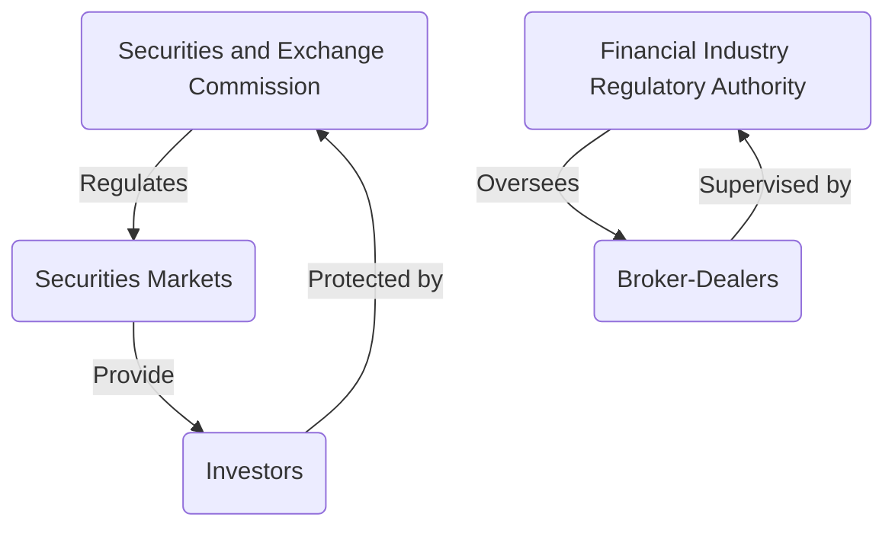

## 2.1.3 Regulation of Securities Markets

The regulation of securities markets is a cornerstone of maintaining trust and stability in the financial system. It ensures that markets operate efficiently, transparently, and fairly, providing protection to investors and maintaining the integrity of the markets. This section delves into the purpose of securities regulation, the roles of key regulatory bodies, and the critical legislation that governs market activities.

### Purpose of Securities Regulation

Securities regulation serves several essential purposes:

1. **Investor Protection**: The primary goal of securities regulation is to protect investors from fraud, manipulation, and other malpractices. By ensuring that investors have access to accurate and timely information, regulations help them make informed decisions.

2. **Market Integrity**: Regulations aim to maintain the integrity of the securities markets, ensuring that they function smoothly and efficiently. This involves setting rules for fair trading practices, preventing market manipulation, and enforcing compliance with established standards.

3. **Facilitation of Capital Formation**: By creating a trustworthy environment, securities regulation encourages investment and capital formation, which are vital for economic growth and development.

4. **Reduction of Systemic Risk**: Effective regulation helps to identify and mitigate systemic risks that could lead to financial instability or crises.

### Key Regulatory Bodies

Two primary regulatory bodies oversee the securities markets in the United States: the Securities and Exchange Commission (SEC) and the Financial Industry Regulatory Authority (FINRA).

#### Securities and Exchange Commission (SEC)

The SEC is the federal agency responsible for enforcing the federal securities laws and regulating the securities industry, the nation’s stock and options exchanges, and other related activities and organizations. Established by the Securities Exchange Act of 1934, the SEC's mission is to protect investors, maintain fair, orderly, and efficient markets, and facilitate capital formation.

- **Enforcement**: The SEC enforces securities laws by investigating and prosecuting violations. It has the authority to bring civil enforcement actions against individuals and companies for fraud, insider trading, and other violations.

- **Rulemaking**: The SEC creates rules and regulations to interpret and implement the securities laws. These rules are designed to ensure transparency, fairness, and integrity in the markets.

- **Registration and Disclosure**: The SEC requires public companies to register their securities and provide regular financial disclosures, ensuring that investors have access to essential information.

#### Financial Industry Regulatory Authority (FINRA)

FINRA is a self-regulatory organization that oversees brokerage firms and their registered representatives. It operates under the supervision of the SEC and is responsible for enforcing rules governing the ethical activities of all registered broker-dealer firms and registered brokers in the U.S.

- **Licensing and Registration**: FINRA administers qualification exams for securities professionals, such as the Series 7 exam, to ensure that individuals meet the required standards of competence and ethics.

- **Market Surveillance**: FINRA monitors trading activities to detect and prevent fraudulent and manipulative practices.

- **Dispute Resolution**: FINRA provides arbitration and mediation services to resolve disputes between investors and securities firms.

### Key Regulations Governing Market Activities

Several critical pieces of legislation and regulations form the backbone of securities market regulation in the U.S.

#### Securities Act of 1933

The Securities Act of 1933, often referred to as the "truth in securities" law, was enacted to ensure that investors receive significant information regarding securities being offered for public sale and to prohibit deceit, misrepresentations, and other fraud in the sale of securities.

- **Registration of Securities**: The Act requires that securities offered to the public be registered with the SEC, providing detailed information about the company’s financial condition, the securities being offered, and the risks involved.

- **Prospectus Requirement**: Companies must provide a prospectus to investors, which includes essential information about the security and the issuer.

#### Securities Exchange Act of 1934

The Securities Exchange Act of 1934 established the SEC and gave it broad authority over all aspects of the securities industry. This includes the power to register, regulate, and oversee brokerage firms, transfer agents, and clearing agencies, as well as the nation’s securities self-regulatory organizations.

- **Continuous Disclosure**: Public companies must file periodic reports with the SEC, ensuring ongoing transparency for investors.

- **Market Regulation**: The Act regulates the trading of securities in the secondary market, aiming to prevent fraud and manipulation.

#### Other Key Legislation

- **Investment Company Act of 1940**: Regulates the organization of companies, including mutual funds, that engage primarily in investing, reinvesting, and trading in securities.

- **Investment Advisers Act of 1940**: Requires investment advisers to register with the SEC and adhere to regulations designed to protect investors.

- **Sarbanes-Oxley Act of 2002**: Enacted in response to major corporate and accounting scandals, it established new or enhanced standards for all U.S. public company boards, management, and public accounting firms.

- **Dodd-Frank Wall Street Reform and Consumer Protection Act of 2010**: Aimed to reduce risks in the financial system, it introduced comprehensive changes to financial regulation, including increased oversight of financial institutions.

### Practical Examples and Case Studies

To illustrate the importance of securities regulation, consider the following scenarios:

1. **Insider Trading Case**: A corporate executive uses nonpublic information to trade company stock, violating SEC rules. The SEC investigates and imposes penalties, highlighting the role of regulation in maintaining market fairness.

2. **Fraudulent IPO**: A company misrepresents its financial health in its IPO prospectus. The SEC intervenes, enforcing the Securities Act of 1933 to protect investors and ensure accurate disclosures.

3. **Broker Misconduct**: FINRA investigates a broker accused of churning customer accounts to generate commissions. The investigation leads to disciplinary actions, underscoring the importance of self-regulation in protecting investors.

### Real-World Applications and Compliance Considerations

Understanding and complying with securities regulations is crucial for professionals in the securities industry. Here are some actionable insights:

- **Stay Informed**: Regularly review updates from the SEC and FINRA to stay informed about regulatory changes and compliance requirements.

- **Implement Compliance Programs**: Develop and maintain robust compliance programs to ensure adherence to regulations and mitigate risks of non-compliance.

- **Conduct Regular Training**: Provide ongoing training for employees to ensure they understand their regulatory obligations and the importance of ethical conduct.

- **Monitor and Audit**: Implement monitoring and auditing systems to detect and address potential compliance issues proactively.

### Diagrams and Visual Aids

To enhance understanding, consider the following diagram illustrating the relationship between key regulatory bodies and market participants.

### Best Practices, Common Pitfalls, and Exam Strategies

- **Best Practices**: Ensure transparency and accuracy in all disclosures, maintain ethical standards, and foster a culture of compliance within your organization.

- **Common Pitfalls**: Avoid conflicts of interest, insider trading, and misrepresentation. These actions can lead to severe penalties and damage to reputation.

- **Exam Strategies**: Focus on understanding the roles and responsibilities of the SEC and FINRA, key provisions of the Securities Act of 1933 and the Securities Exchange Act of 1934, and the implications of major regulatory changes.

### Summary and Key Points

- Securities regulation is essential for protecting investors, ensuring market integrity, facilitating capital formation, and reducing systemic risk.
- The SEC and FINRA play critical roles in enforcing securities laws and overseeing market activities.
- Key legislation, such as the Securities Act of 1933 and the Securities Exchange Act of 1934, provides the framework for securities regulation.
- Compliance with regulations is crucial for maintaining trust and stability in the financial markets.

### Additional Resources

- **SEC Website**: [www.sec.gov](https://www.sec.gov)
- **FINRA Website**: [www.finra.org](https://www.finra.org)
- **Securities Act of 1933**: [Full Text](https://www.sec.gov/about/laws/sa33.pdf)
- **Securities Exchange Act of 1934**: [Full Text](https://www.sec.gov/about/laws/sea34.pdf)

## Series 7 Exam Practice Questions: Regulation of Securities Markets



### What is the primary purpose of the Securities Act of 1933?

- [x] To ensure that investors receive significant information about securities being offered for public sale.
- [ ] To regulate the trading of securities in the secondary market.
- [ ] To oversee the activities of brokerage firms.
- [ ] To establish the SEC.

> **Explanation:** The Securities Act of 1933 aims to ensure transparency in the financial statements of securities offered for public sale, thus protecting investors from fraud.

### Which regulatory body is responsible for overseeing brokerage firms and their registered representatives?

- [ ] SEC
- [x] FINRA
- [ ] Federal Reserve
- [ ] MSRB

> **Explanation:** FINRA is a self-regulatory organization that oversees brokerage firms and their registered representatives.

### What is one of the main roles of the SEC?

- [ ] To create investment products.
- [x] To enforce federal securities laws.
- [ ] To set interest rates.
- [ ] To manage the national budget.

> **Explanation:** The SEC is responsible for enforcing federal securities laws and regulating the securities industry.

### What does the Securities Exchange Act of 1934 primarily regulate?

- [ ] The initial sale of securities to the public.
- [x] The trading of securities in the secondary market.
- [ ] The issuance of municipal bonds.
- [ ] The activities of investment advisers.

> **Explanation:** The Securities Exchange Act of 1934 regulates the trading of securities in the secondary market.

### Which act established the SEC?

- [ ] Investment Company Act of 1940
- [ ] Sarbanes-Oxley Act
- [x] Securities Exchange Act of 1934
- [ ] Dodd-Frank Act

> **Explanation:** The Securities Exchange Act of 1934 established the SEC.

### What is a key function of FINRA?

- [ ] To regulate mutual funds.
- [x] To administer qualification exams for securities professionals.
- [ ] To set fiscal policy.
- [ ] To control monetary supply.

> **Explanation:** FINRA administers qualification exams, such as the Series 7, for securities professionals.

### What is the purpose of the prospectus required by the Securities Act of 1933?

- [ ] To provide a summary of the SEC's findings.
- [x] To provide detailed information about the security and the issuer.
- [ ] To outline the brokerage firm's policies.
- [ ] To disclose insider trading activities.

> **Explanation:** The prospectus provides detailed information about the security and the issuer to help investors make informed decisions.

### Which legislation was enacted in response to corporate and accounting scandals?

- [ ] Dodd-Frank Act
- [ ] Securities Act of 1933
- [x] Sarbanes-Oxley Act
- [ ] Investment Advisers Act of 1940

> **Explanation:** The Sarbanes-Oxley Act was enacted to enhance corporate responsibility and financial disclosures in response to scandals.

### What does the term "market integrity" refer to in securities regulation?

- [ ] The profitability of investment firms.
- [x] The fairness and efficiency of the securities markets.
- [ ] The diversity of investment products.
- [ ] The stability of interest rates.

> **Explanation:** Market integrity refers to the fairness, transparency, and efficiency of the securities markets.

### What is a common pitfall to avoid in securities regulation?

- [ ] Implementing compliance programs.
- [ ] Conducting regular training.
- [x] Engaging in insider trading.
- [ ] Monitoring market activities.

> **Explanation:** Insider trading is illegal and a common pitfall that can lead to severe penalties.



By understanding the regulation of securities markets, you are better equipped to navigate the complexities of the financial industry and ensure compliance with essential laws and standards. This knowledge not only prepares you for the Series 7 Exam but also enhances your professional capabilities in the securities industry.
