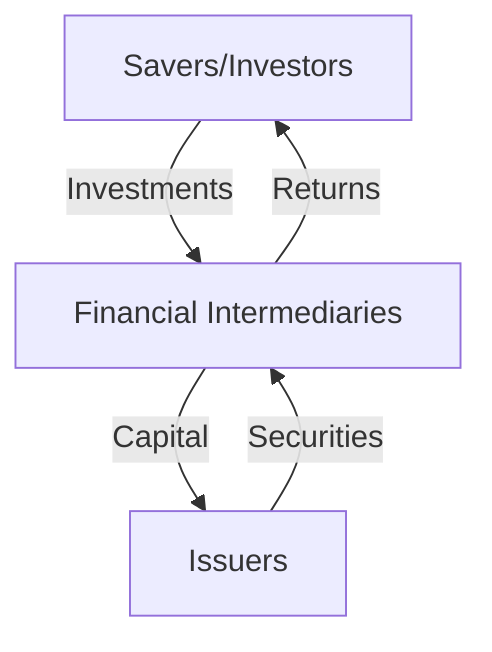

## 2.1 Overview of Securities Markets

Securities markets are vital components of the global financial system, serving as platforms where securities are issued and traded. These markets play a crucial role in the economy by facilitating capital formation and allocation, ensuring liquidity, and promoting efficient trading. Understanding the functioning of securities markets is essential for aspiring General Securities Representatives, as it forms the foundation of the Series 7 Exam.

### Definition and Role of Securities Markets

Securities markets are venues where individuals and institutions can buy and sell securities, such as stocks, bonds, options, and other financial instruments. These markets are essential for the efficient allocation of resources in an economy, enabling businesses to raise capital for expansion and allowing investors to earn returns on their investments.

#### Capital Formation and Allocation

One of the primary functions of securities markets is to facilitate capital formation. This process involves the accumulation of capital resources through savings and investments, which are then allocated to productive uses. By issuing securities, companies can raise funds from investors, which can be used for various purposes, such as expanding operations, developing new products, or entering new markets.

**Example:** A technology company looking to develop a new product might issue shares through an Initial Public Offering (IPO) to raise the necessary capital. Investors who purchase these shares provide the company with funds, while gaining ownership stakes and the potential for future returns.

#### Liquidity and Trading Efficiency

Liquidity refers to the ease with which securities can be bought or sold in the market without affecting their price. High liquidity is crucial for the smooth functioning of securities markets, as it allows investors to enter and exit positions with minimal transaction costs. Efficient markets are characterized by quick price adjustments to new information, ensuring that securities are fairly valued at all times.

**Example:** In a highly liquid market, an investor can sell a large block of shares without significantly impacting the stock price, thanks to the presence of numerous buyers and sellers.

### Key Participants in Securities Markets

Securities markets involve a diverse range of participants, each playing a specific role in the trading ecosystem. Understanding these participants is crucial for navigating the complexities of the financial markets.

#### Issuers

Issuers are entities that create and sell securities to raise capital. These can include corporations, governments, and municipalities. Issuers are responsible for providing accurate and timely information about their financial condition and the securities they offer.

**Example:** A corporation issuing bonds to finance a new factory is an issuer in the bond market.

#### Investors

Investors are individuals or institutions that purchase securities with the expectation of earning a return. They can be categorized into retail investors, who are individual buyers, and institutional investors, such as mutual funds, pension funds, and insurance companies.

**Example:** A mutual fund investing in a diversified portfolio of stocks is an institutional investor.

#### Intermediaries

Intermediaries facilitate transactions between buyers and sellers in the securities markets. They include brokers, dealers, and investment banks. Brokers act as agents for investors, executing buy and sell orders, while dealers trade securities for their own accounts.

**Example:** A brokerage firm executing a client's order to purchase shares of a company acts as an intermediary.

#### Regulators

Regulators oversee the securities markets to ensure fairness, transparency, and investor protection. In the United States, key regulatory bodies include the Securities and Exchange Commission (SEC) and the Financial Industry Regulatory Authority (FINRA).

**Example:** The SEC enforcing rules against insider trading is a regulatory function.

### Flow of Funds in Securities Markets

The flow of funds in securities markets is a dynamic process involving the movement of capital from savers to borrowers. This process is facilitated by the issuance and trading of securities, which serve as financial instruments connecting investors with issuers.

In this diagram, savers or investors provide capital to financial intermediaries, who then allocate these funds to issuers. In return, issuers provide securities to intermediaries, which are then distributed to investors. Investors receive returns on their investments, completing the cycle.

### Importance of Securities Markets in the Economy

Securities markets are integral to the functioning of modern economies, providing several key benefits:

- **Capital Access:** By enabling companies to raise funds, securities markets support business growth and innovation.
- **Investment Opportunities:** These markets offer investors a wide range of investment options, catering to different risk appetites and return expectations.
- **Price Discovery:** Securities markets facilitate the discovery of asset prices through the interaction of supply and demand, ensuring that resources are allocated efficiently.
- **Risk Management:** Investors can use various financial instruments, such as options and futures, to hedge against risks.

### Challenges and Considerations

While securities markets offer numerous benefits, they also present challenges that participants must navigate:

- **Volatility:** Market prices can fluctuate significantly due to economic events, geopolitical developments, or changes in investor sentiment.
- **Regulatory Compliance:** Participants must adhere to a complex web of regulations designed to protect investors and maintain market integrity.
- **Technological Advancements:** The rise of electronic trading and algorithmic strategies has transformed the landscape, requiring participants to adapt to new technologies.

### Conclusion

Understanding the structure and function of securities markets is essential for anyone preparing for the Series 7 Exam. These markets play a pivotal role in the economy by facilitating capital formation, providing liquidity, and ensuring efficient trading. By grasping the roles of key participants and the flow of funds, you will be better equipped to navigate the complexities of the financial markets and succeed in your career as a General Securities Representative.

---

## Series 7 Exam Practice Questions: Overview of Securities Markets



### What is the primary role of securities markets in the economy?

- [x] Facilitating capital formation and allocation
- [ ] Regulating financial institutions
- [ ] Providing insurance services
- [ ] Setting interest rates

> **Explanation:** Securities markets primarily facilitate capital formation and allocation by enabling companies to raise funds and investors to earn returns.

### Which of the following participants is responsible for issuing securities to raise capital?

- [ ] Investors
- [x] Issuers
- [ ] Brokers
- [ ] Regulators

> **Explanation:** Issuers are entities that create and sell securities to raise capital, such as corporations and governments.

### What does liquidity in securities markets refer to?

- [ ] The ability to predict market trends
- [x] The ease of buying or selling securities without affecting their price
- [ ] The level of market regulation
- [ ] The amount of capital raised by issuers

> **Explanation:** Liquidity refers to the ease with which securities can be bought or sold in the market without significantly affecting their price.

### Who are considered institutional investors?

- [x] Mutual funds, pension funds, and insurance companies
- [ ] Individual retail investors
- [ ] Issuers of securities
- [ ] Regulatory bodies

> **Explanation:** Institutional investors include entities like mutual funds, pension funds, and insurance companies that invest large sums of money.

### What is the role of financial intermediaries in securities markets?

- [ ] To issue regulations
- [ ] To provide insurance
- [x] To facilitate transactions between buyers and sellers
- [ ] To set interest rates

> **Explanation:** Financial intermediaries, such as brokers and dealers, facilitate transactions between buyers and sellers in the securities markets.

### What is the function of regulators in securities markets?

- [ ] To trade securities for their own accounts
- [ ] To provide investment advice
- [x] To oversee markets and ensure fairness and transparency
- [ ] To create securities

> **Explanation:** Regulators, such as the SEC and FINRA, oversee securities markets to ensure fairness, transparency, and investor protection.

### How does price discovery occur in securities markets?

- [ ] Through government intervention
- [x] Through the interaction of supply and demand
- [ ] By setting fixed prices for securities
- [ ] Through insider trading

> **Explanation:** Price discovery in securities markets occurs through the interaction of supply and demand, ensuring that securities are fairly valued.

### What is a potential challenge faced by participants in securities markets?

- [x] Market volatility
- [ ] Guaranteed returns
- [ ] Lack of regulations
- [ ] Fixed interest rates

> **Explanation:** Market volatility is a potential challenge as prices can fluctuate significantly due to various factors, affecting investment decisions.

### Which diagram best represents the flow of funds in securities markets?

- [ ] A cycle of government regulations
- [x] A cycle of capital from savers to issuers and returns to investors
- [ ] A cycle of interest rate adjustments
- [ ] A cycle of insurance claims

> **Explanation:** The flow of funds in securities markets involves capital moving from savers to issuers and returns flowing back to investors.

### What is a key benefit of securities markets to investors?

- [ ] Guaranteed profits
- [ ] Fixed interest rates
- [x] A wide range of investment options
- [ ] Exemption from taxes

> **Explanation:** Securities markets offer investors a wide range of investment options, catering to different risk appetites and return expectations.



---
