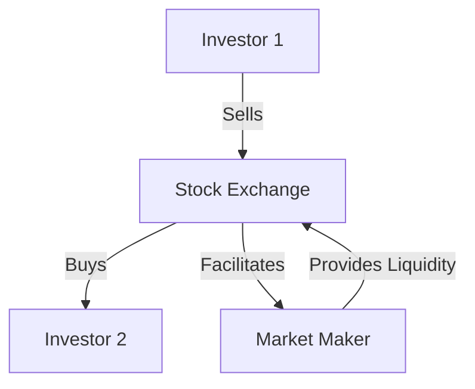

## 2.2.2 Secondary Market

The secondary market is a critical component of the financial ecosystem, where securities are traded after their initial issuance. This market facilitates the buying and selling of existing securities, providing liquidity and price discovery for investors. Understanding the secondary market is essential for aspiring securities representatives, as it plays a pivotal role in the functioning of capital markets.

### How Securities Are Traded After Issuance

Once securities are issued in the primary market, they become available for trading in the secondary market. This market allows investors to buy and sell securities such as stocks, bonds, and other financial instruments. Unlike the primary market, where securities are sold directly by the issuer to investors, the secondary market involves transactions between investors.

#### Key Features of the Secondary Market

- **Liquidity:** The secondary market provides liquidity, enabling investors to convert securities into cash quickly and with minimal impact on the price. This liquidity is crucial for maintaining investor confidence and market stability.
- **Price Discovery:** The secondary market facilitates price discovery, where the prices of securities are determined based on supply and demand dynamics. This process helps reflect the true value of a security at any given time.
- **Market Efficiency:** By allowing continuous trading, the secondary market contributes to market efficiency, ensuring that securities are fairly priced and information is rapidly incorporated into prices.

### Functions of Stock Exchanges

Stock exchanges are organized venues where securities are traded in the secondary market. They provide a regulated environment for trading, ensuring transparency and fairness. Two of the most prominent stock exchanges in the United States are the New York Stock Exchange (NYSE) and NASDAQ.

#### New York Stock Exchange (NYSE)

The NYSE is one of the oldest and largest stock exchanges in the world. It operates as an auction market, where buyers and sellers submit orders through a centralized system. The NYSE is known for its stringent listing requirements, providing investors with a sense of security and trust in the companies listed on the exchange.

- **Auction Market:** The NYSE uses a hybrid auction market model, where human specialists and electronic systems facilitate trading. This model helps ensure that trades are executed at the best possible prices.
- **Listing Requirements:** Companies must meet rigorous financial and governance criteria to be listed on the NYSE, enhancing the credibility of listed securities.

#### NASDAQ

NASDAQ is a global electronic marketplace known for its high-tech and innovative companies. Unlike the NYSE, NASDAQ operates as a dealer market, where market makers facilitate trading by providing liquidity and setting bid and ask prices.

- **Dealer Market:** NASDAQ relies on a network of market makers who compete to provide the best prices for securities. This competition helps maintain liquidity and narrow bid-ask spreads.
- **Technology Focus:** NASDAQ is home to many technology and growth-oriented companies, making it a popular choice for investors seeking exposure to innovative sectors.

### Importance of Liquidity in the Secondary Market

Liquidity is a fundamental aspect of the secondary market, influencing the ease and cost of trading securities. High liquidity means that securities can be bought or sold quickly without causing significant price changes, while low liquidity can lead to wider bid-ask spreads and increased trading costs.

#### Factors Affecting Liquidity

- **Trading Volume:** Higher trading volumes generally indicate greater liquidity, as more participants are actively buying and selling securities.
- **Market Depth:** The availability of buy and sell orders at various price levels contributes to market depth and liquidity.
- **Bid-Ask Spread:** A narrow bid-ask spread is a sign of high liquidity, as it indicates that buyers and sellers are willing to transact at prices close to each other.

### Trading Volumes and Market Liquidity

Trading volumes and liquidity are closely monitored indicators of market health. High trading volumes suggest active participation and confidence in the market, while low volumes may indicate uncertainty or lack of interest.

#### Data on Trading Volumes

- **NYSE Trading Volume:** The NYSE regularly reports trading volumes, providing insights into market activity and investor sentiment.
- **NASDAQ Trading Volume:** NASDAQ's trading volume data highlights the level of interest in technology and growth stocks.

### Practical Examples and Case Studies

To illustrate the functioning of the secondary market, consider the following scenarios:

#### Example 1: High Liquidity Scenario

A large-cap stock listed on the NYSE, such as Apple Inc., typically experiences high liquidity due to its popularity among investors. The stock's high trading volume and narrow bid-ask spread allow investors to execute trades quickly and efficiently.

#### Example 2: Low Liquidity Scenario

A small-cap stock listed on a lesser-known exchange may experience low liquidity. In this case, the stock may have wider bid-ask spreads and lower trading volumes, making it more challenging for investors to buy or sell without impacting the price.

### Real-World Applications and Regulatory Scenarios

Understanding the secondary market is crucial for compliance with regulatory requirements and effective trading strategies. Securities representatives must be familiar with regulations governing trading practices, such as those enforced by the Securities and Exchange Commission (SEC) and the Financial Industry Regulatory Authority (FINRA).

#### Regulatory Considerations

- **SEC Regulations:** The SEC oversees securities trading to protect investors and maintain fair, orderly, and efficient markets.
- **FINRA Rules:** FINRA regulates broker-dealers and their interactions with investors, ensuring compliance with trading standards and ethical practices.

### Step-by-Step Guidance for Trading in the Secondary Market

To navigate the secondary market effectively, follow these steps:

1. **Research Securities:** Conduct thorough research on the securities you wish to trade, considering factors such as liquidity, trading volume, and market conditions.
2. **Select a Trading Platform:** Choose a reputable trading platform or broker that offers access to the desired markets and securities.
3. **Place Orders:** Use limit orders to specify the price at which you are willing to buy or sell, helping manage risk and control costs.
4. **Monitor Market Conditions:** Stay informed about market trends and news that may impact the securities you are trading.
5. **Review Trades:** Regularly review your trades and adjust your strategy as needed to align with your investment goals.

### Diagrams and Visuals

Below is a diagram illustrating the flow of securities in the secondary market:

### Best Practices, Common Pitfalls, and Strategies

To succeed in the secondary market, consider the following best practices and strategies:

- **Diversify Your Portfolio:** Diversification can help manage risk and improve returns by spreading investments across different asset classes and sectors.
- **Stay Informed:** Keep up with market news and trends to make informed trading decisions.
- **Be Aware of Market Volatility:** Understand that market conditions can change rapidly, impacting liquidity and trading costs.
- **Avoid Emotional Trading:** Base your trading decisions on research and analysis rather than emotions or market hype.

### References and Additional Resources

For further exploration of the secondary market, consider the following resources:

- **Securities Exchange Act of 1934:** This act governs the trading of securities in the secondary market and establishes the SEC's authority.
- **FINRA's Investor Education:** FINRA provides educational resources and tools to help investors understand the securities markets.
- **NYSE and NASDAQ Websites:** These websites offer valuable information on trading volumes, market data, and listed companies.

### Summary

The secondary market is a vital component of the financial system, enabling the trading of securities after their initial issuance. Stock exchanges like the NYSE and NASDAQ facilitate this trading, providing liquidity and price discovery. Understanding the secondary market is essential for securities representatives, as it impacts investment strategies, regulatory compliance, and market dynamics.

---

## Series 7 Exam Practice Questions: Secondary Market



### What is the primary function of the secondary market?

- [ ] To issue new securities to the public
- [x] To facilitate the trading of existing securities
- [ ] To determine the initial price of a security
- [ ] To provide a platform for private placements

> **Explanation:** The secondary market is where existing securities are traded between investors, providing liquidity and price discovery.

### Which of the following is a characteristic of the NYSE?

- [x] It operates as an auction market
- [ ] It is primarily a dealer market
- [ ] It exclusively lists technology companies
- [ ] It has no listing requirements

> **Explanation:** The NYSE operates as an auction market, where buyers and sellers submit orders through a centralized system.

### How does NASDAQ differ from the NYSE?

- [ ] NASDAQ is an auction market
- [ ] NASDAQ has no market makers
- [x] NASDAQ operates as a dealer market
- [ ] NASDAQ only lists small-cap stocks

> **Explanation:** NASDAQ operates as a dealer market, where market makers facilitate trading by providing liquidity.

### What is liquidity in the context of the secondary market?

- [ ] The ability to issue new securities
- [x] The ease with which an asset can be bought or sold without affecting its price
- [ ] The process of determining a security's initial price
- [ ] The requirement for companies to disclose financial information

> **Explanation:** Liquidity refers to the ease with which an asset can be bought or sold without significantly affecting its price.

### Why is high trading volume important in the secondary market?

- [ ] It indicates low liquidity
- [x] It suggests active participation and confidence in the market
- [ ] It leads to wider bid-ask spreads
- [ ] It results in higher trading costs

> **Explanation:** High trading volume suggests active participation and confidence in the market, contributing to liquidity and efficient price discovery.

### What role do market makers play in NASDAQ?

- [ ] They act as auctioneers
- [x] They provide liquidity and set bid and ask prices
- [ ] They list new securities
- [ ] They enforce trading regulations

> **Explanation:** Market makers in NASDAQ provide liquidity and set bid and ask prices, facilitating trading in the dealer market.

### Which of the following is a benefit of liquidity in the secondary market?

- [x] Reduced trading costs
- [ ] Increased market volatility
- [ ] Wider bid-ask spreads
- [ ] Limited access to securities

> **Explanation:** Liquidity reduces trading costs by allowing securities to be bought and sold quickly with minimal price impact.

### What is the purpose of the Securities Exchange Act of 1934?

- [ ] To regulate the primary issuance of securities
- [x] To govern the trading of securities in the secondary market
- [ ] To establish the SEC's authority over mutual funds
- [ ] To set guidelines for private placements

> **Explanation:** The Securities Exchange Act of 1934 governs the trading of securities in the secondary market and establishes the SEC's authority.

### Which of the following is an example of a low liquidity scenario?

- [ ] A large-cap stock on the NYSE with high trading volume
- [x] A small-cap stock with wide bid-ask spreads
- [ ] A technology stock on NASDAQ with active market makers
- [ ] A bond with a narrow bid-ask spread

> **Explanation:** A small-cap stock with wide bid-ask spreads is an example of low liquidity, as it may be more challenging to trade without impacting the price.

### How can investors manage risk in the secondary market?

- [ ] By concentrating investments in a single sector
- [ ] By ignoring market news and trends
- [x] By diversifying their portfolio across different asset classes
- [ ] By making decisions based on emotions

> **Explanation:** Diversifying a portfolio across different asset classes helps manage risk by spreading investments and reducing exposure to any single security or sector.



---
