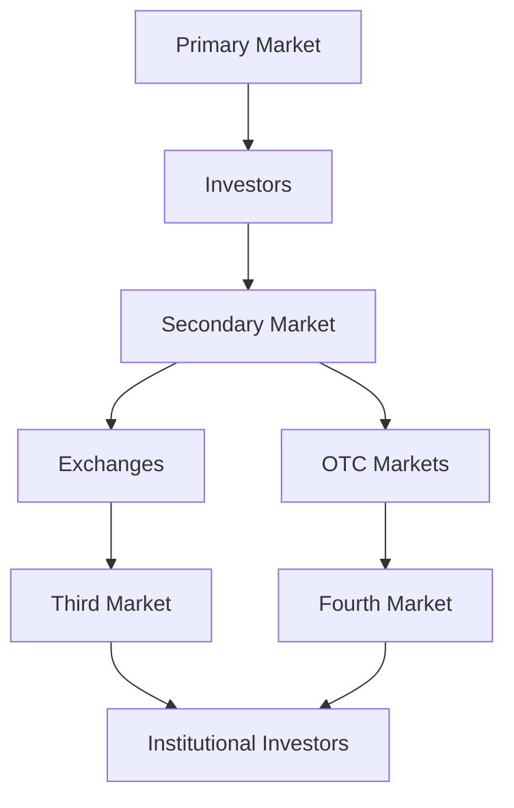

## 2.2 Types of Securities Markets

Understanding the different types of securities markets is crucial for anyone preparing for the Series 7 Exam. These markets are the backbone of the financial system, facilitating the issuance and trading of securities, which in turn supports economic growth and capital formation. This section will delve into the primary and secondary markets, as well as the third and fourth markets, providing you with a comprehensive understanding of their functions and operations.

### Primary Market

The primary market is where securities are created. It's the market for new issues of securities, where companies, governments, and other entities sell new stocks and bonds to investors for the first time. The primary market plays a critical role in capital formation, allowing issuers to raise funds for expansion, operations, or other purposes.

#### Functions of the Primary Market

- **Capital Raising:** The primary market enables issuers to raise capital by selling securities directly to investors. This process often involves underwriting, where investment banks buy the securities from the issuer and sell them to the public.
- **Price Setting:** Initial public offerings (IPOs) and other new issues help establish the initial market price for securities, based on investor demand and market conditions.
- **Direct Issuance:** In the primary market, securities are sold directly by the issuer to investors, without the involvement of intermediaries in the trading process.

#### Key Participants

- **Issuers:** These are the entities that create and sell securities, such as corporations, governments, and municipalities.
- **Underwriters:** Typically investment banks, underwriters facilitate the sale of securities by purchasing them from the issuer and reselling them to the public.
- **Investors:** Individuals and institutional investors who purchase new securities in the primary market.

#### Example: Initial Public Offering (IPO)

An IPO is a classic example of a primary market transaction. A company looking to raise capital by going public will issue new shares to investors. The process involves setting a price for the shares, often with the help of underwriters, and selling them to institutional and retail investors.

### Secondary Market

The secondary market is where existing securities are bought and sold among investors. Unlike the primary market, where securities are issued for the first time, the secondary market involves trading securities that have already been issued. This market provides liquidity, allowing investors to buy and sell securities easily.

#### Functions of the Secondary Market

- **Liquidity Provision:** The secondary market provides a platform for investors to buy and sell securities, ensuring liquidity and enabling price discovery.
- **Price Discovery:** Through the continuous buying and selling of securities, the secondary market helps determine the market price based on supply and demand dynamics.
- **Risk Transfer:** Investors can transfer risk by selling securities to other investors, allowing them to manage their portfolios effectively.

#### Types of Secondary Markets

- **Exchanges:** These are organized markets where securities are traded, such as the New York Stock Exchange (NYSE) and NASDAQ. Exchanges provide a centralized platform for trading, with standardized rules and regulations.
- **Over-the-Counter (OTC) Markets:** Unlike exchanges, OTC markets are decentralized and involve direct trading between parties. Securities traded OTC are typically not listed on formal exchanges and include bonds, derivatives, and foreign exchange.

#### Example: Stock Exchange Trading

When you buy shares of a company on the NYSE, you're participating in the secondary market. The shares you're purchasing have already been issued and are being sold by another investor, not the issuing company.

### Third and Fourth Markets

Beyond the primary and secondary markets, there are also third and fourth markets, which cater to specific types of trading.

#### Third Market

The third market involves the trading of exchange-listed securities in the OTC market. This market allows institutional investors to trade large blocks of securities directly with each other, bypassing the traditional exchanges to potentially reduce transaction costs.

- **Participants:** Institutional investors, such as mutual funds, pension funds, and insurance companies.
- **Advantages:** Lower transaction costs and the ability to trade large volumes without affecting the market price significantly.

#### Fourth Market

The fourth market consists of direct trading between institutional investors without the use of brokers or exchanges. This market is facilitated by electronic communication networks (ECNs) and is typically used for large-volume trades.

- **Participants:** Large institutional investors engaging in direct trades.
- **Advantages:** Cost savings from eliminating intermediaries and increased privacy for large transactions.

### Exchanges vs. Over-the-Counter (OTC) Markets

Understanding the differences between exchanges and OTC markets is essential for navigating the securities markets effectively.

#### Exchanges

- **Structure:** Organized and regulated markets with a physical location or electronic platform.
- **Examples:** NYSE, NASDAQ.
- **Regulation:** Subject to strict regulatory oversight by entities like the Securities and Exchange Commission (SEC).
- **Trading:** Involves standardized contracts and transparent pricing.

#### Over-the-Counter (OTC) Markets

- **Structure:** Decentralized markets where trading occurs directly between parties.
- **Examples:** Pink Sheets, OTC Bulletin Board.
- **Regulation:** Less regulated than exchanges, with fewer disclosure requirements.
- **Trading:** More flexible, with customized contracts and negotiated pricing.

### Market Structures Diagram

To better understand the relationships and functions of these markets, refer to the following diagram:

### Conclusion

The various types of securities markets each serve distinct functions in the financial ecosystem, facilitating capital formation, liquidity, and risk management. Understanding these markets is crucial for anyone involved in trading or investing in securities, as well as for those preparing for the Series 7 Exam. By mastering the concepts of primary, secondary, third, and fourth markets, you'll be well-equipped to navigate the complex world of securities trading and investment.

### Summary

- **Primary Market:** Where new securities are issued and sold for the first time. Key participants include issuers, underwriters, and investors.
- **Secondary Market:** Where existing securities are traded among investors. Includes exchanges and OTC markets.
- **Third Market:** Trading of exchange-listed securities in the OTC market, primarily by institutional investors.
- **Fourth Market:** Direct trading between institutional investors without brokers or exchanges.

### References

- Securities Act of 1933
- Securities Exchange Act of 1934
- FINRA Rules and Regulations
- SEC Guidelines on Market Structures

## Series 7 Exam Practice Questions: Types of Securities Markets



### What is the primary function of the primary market?

- [x] To facilitate the issuance of new securities
- [ ] To provide liquidity for existing securities
- [ ] To enable direct trading between institutional investors
- [ ] To allow trading of exchange-listed securities in the OTC market

> **Explanation:** The primary market is where new securities are issued and sold for the first time, raising capital for issuers.

### Which market is known for providing liquidity to investors?

- [ ] Primary Market
- [x] Secondary Market
- [ ] Third Market
- [ ] Fourth Market

> **Explanation:** The secondary market provides liquidity by allowing investors to buy and sell existing securities.

### What distinguishes the third market from the fourth market?

- [ ] The third market involves direct trading between institutional investors.
- [x] The third market involves trading exchange-listed securities OTC.
- [ ] The fourth market involves trading exchange-listed securities OTC.
- [ ] The fourth market involves trading through exchanges.

> **Explanation:** The third market involves the trading of exchange-listed securities in the OTC market, while the fourth market involves direct trading between institutional investors.

### Which type of market is the NYSE an example of?

- [x] Exchange
- [ ] OTC Market
- [ ] Third Market
- [ ] Fourth Market

> **Explanation:** The NYSE is an example of an exchange, where securities are traded in an organized and regulated environment.

### What is a key advantage of trading in the OTC market?

- [ ] Higher regulatory oversight
- [x] More flexible trading terms
- [ ] Standardized contracts
- [ ] Centralized trading location

> **Explanation:** The OTC market offers more flexible trading terms, as it involves direct negotiations between parties.

### Which market is primarily used by institutional investors for large-volume trades?

- [ ] Primary Market
- [ ] Secondary Market
- [ ] Third Market
- [x] Fourth Market

> **Explanation:** The fourth market is used by institutional investors for large-volume trades, often facilitated by electronic communication networks.

### What is the role of underwriters in the primary market?

- [ ] To provide liquidity for existing securities
- [x] To facilitate the sale of new securities to the public
- [ ] To enable direct trading between institutional investors
- [ ] To trade exchange-listed securities in the OTC market

> **Explanation:** Underwriters facilitate the sale of new securities to the public by purchasing them from the issuer and reselling them.

### Which market involves trading securities that have already been issued?

- [ ] Primary Market
- [x] Secondary Market
- [ ] Third Market
- [ ] Fourth Market

> **Explanation:** The secondary market involves trading securities that have already been issued and are being bought and sold among investors.

### What is a characteristic of the fourth market?

- [ ] Trading through exchanges
- [ ] High regulatory oversight
- [x] Direct trading between institutional investors
- [ ] Issuance of new securities

> **Explanation:** The fourth market is characterized by direct trading between institutional investors, often without the use of brokers or exchanges.

### Which market structure is depicted by trading exchange-listed securities OTC?

- [ ] Primary Market
- [ ] Secondary Market
- [x] Third Market
- [ ] Fourth Market

> **Explanation:** The third market involves trading exchange-listed securities in the OTC market, typically by institutional investors.



---
